由 TimescaleDB 主办的年度 PostgreSQL 社区现状调研报告最近发布了结果。

此次问卷调查收集到了 **688** 份样本，相比于 [**StackOverflow 全球开发者调研**](/pg/pg-is-no1-again/)****的近十万份样本来说实在有些少。但因其受众为 PostgreSQL 社区成员，相当一部分结论依然有一定的参考价值。以下是报告中的亮点。

---

## 概括

在一个软件生命周期短暂的世界里，作为全球领先的开源数据库之一，PostgreSQL 的坚韥实在是非凡。PostgreSQL 经过 30 多年的活跃开发，经受住了时间的考验，建立了一个丰富的连接器和工具生态系统，提炼了无与伦比的开发者体验，并维护着众所周知的卓越可靠性。

这些特点以及其他特性为这个开源数据库赢得了一大批忠实的爱好者和贡献者，Timescale 自豪地成为其中的一员。目前，我们正在进行第五届 PostgreSQL 状态调查，这是我们回馈一直支持我们的社区的方式。通过分享用户对 PostgreSQL 的使用体验以及它的发展情况，我们希望使它更加包容、创新和成功。

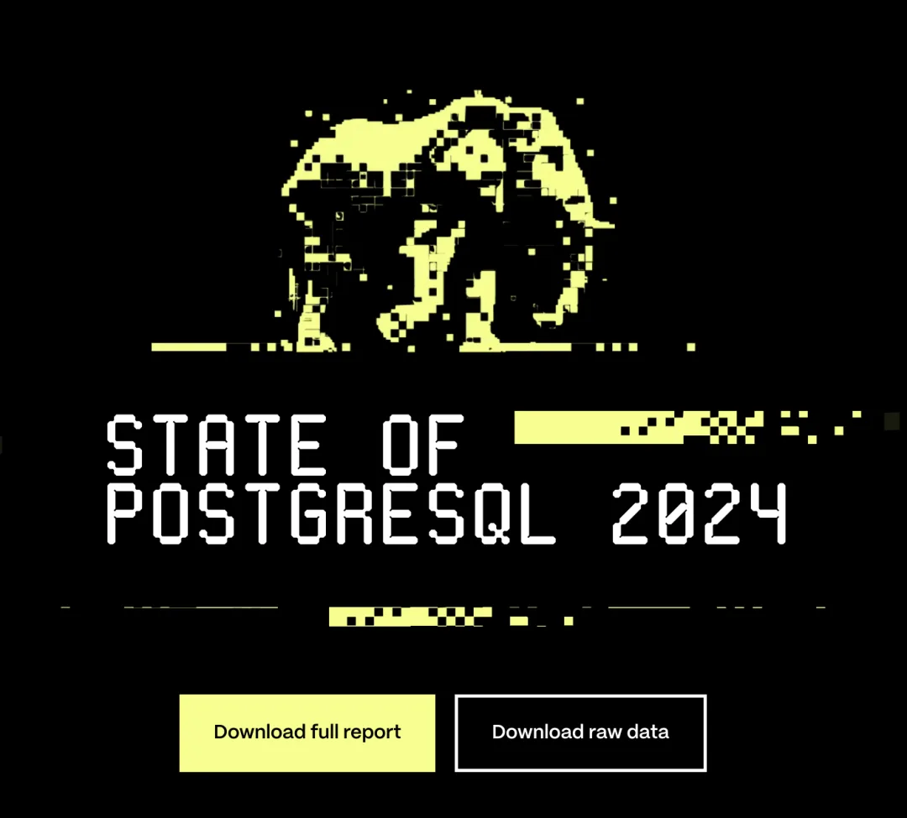

今年我们总共有 **688** 位回应者参与了调查，以下是一些主要发现：

新用户采纳率开始下降，拥有不到一年经验的回应者从 8.1% 下降到 4.1%，而那些拥有 1-2 年经验的从 15.7% 降至 8.4%。

在 PostgreSQL 开发者中，使用 AI 工具的比例急剧上升，从 2023 年的 36.9% 增至 55.3%。同时，非 AI 用户从 63% 降至 44.7%，标志着向将 AI 集成为开发工作流的标准部分的重大转变。

今年，60% 的回应者报告说他们将 PostgreSQL 用于个人和专业项目 —— 比去年增加了 20%，突显了它在不同用例中的多功能性。我们希望这些洞察激发您对完整报告的兴趣。

---

## 经验与画像

这份报告的样本数偏少，且主要集中在欧洲区域。使用 PostgreSQL 1 - 10 年的样本数量下降，拥有 10 ～ 15 年经验的用户数量基本持平，15+ 年以上的用户数量增加。

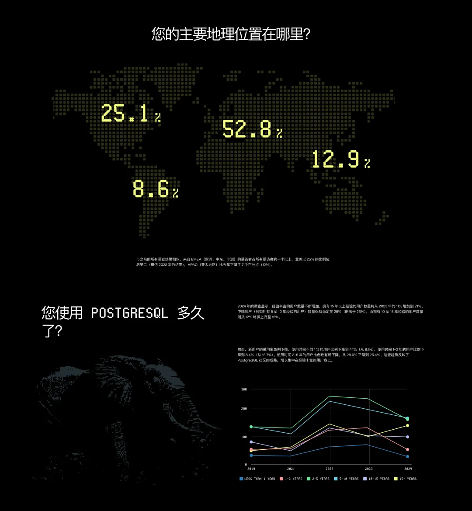

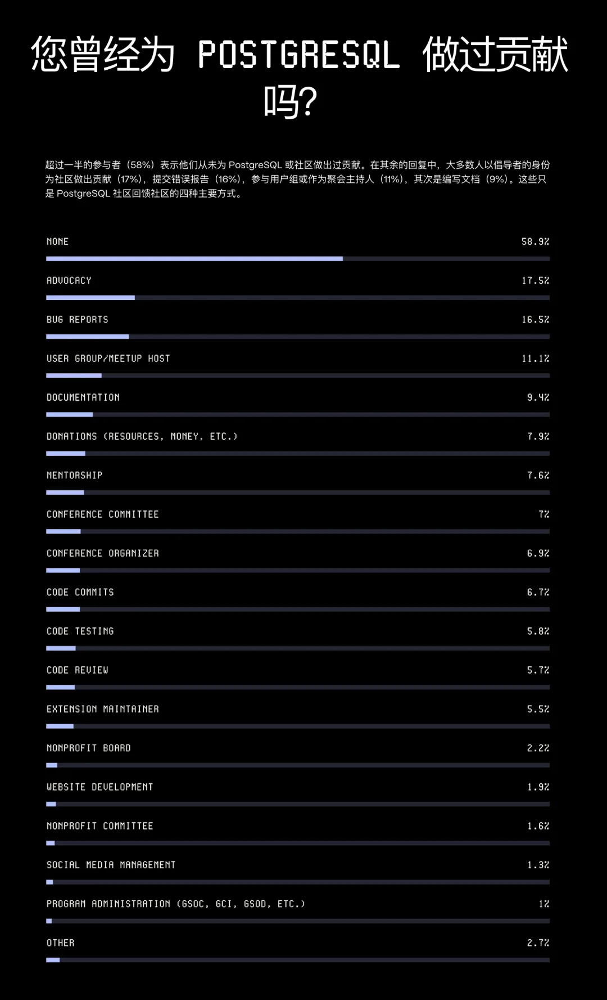

---

## 选择 PG 的原因

来自 TimescaleDB 的 PostgreSQL 社区年度调研反映出，用户选择 PostgreSQL 的首要因素便是 **开源** 与 **稳定**。

**开源** —— 意味着软件本身可以免费使用，可以二次开发，没有供应商锁定，不存在“卡脖子问题”。 **可靠** —— 意味它能正确稳定工作，行为表现能够符合预期，而且有着长时间大规模生产环境的优异战绩。越是资深的开发者，便越是看重这两个属性。

宽泛地讲，扩展，生态，社区，协议可以归并入 “**开源**”。而稳定可靠，ACID，SQL，扩展，可用性，可以总结为 “**先进**”。这便正好与 PostgreSQL 的 Slogan 相呼应 —— [**世界上最先进的开源数据库**](/pg/pg-is-no1/)。

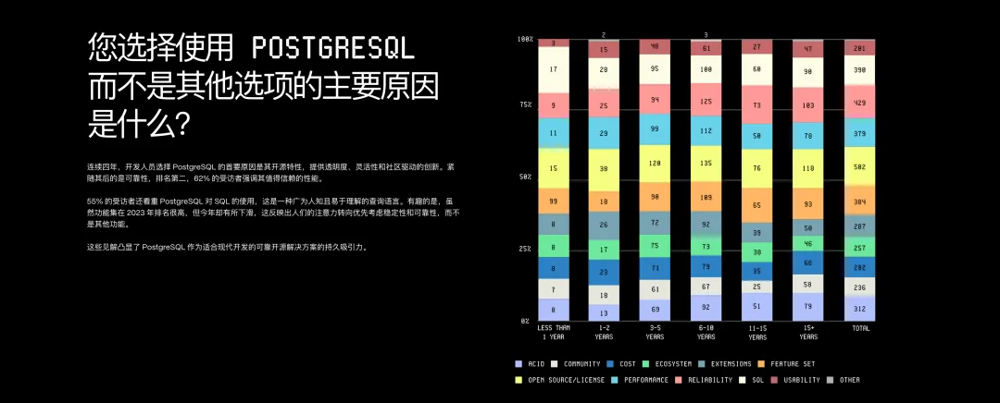

开源与先进让 PostgreSQL 赢得用户的采纳，而真正让 PostgreSQL 赢得用户的喜爱的特性，是可扩展性 （Extensinsibility）。

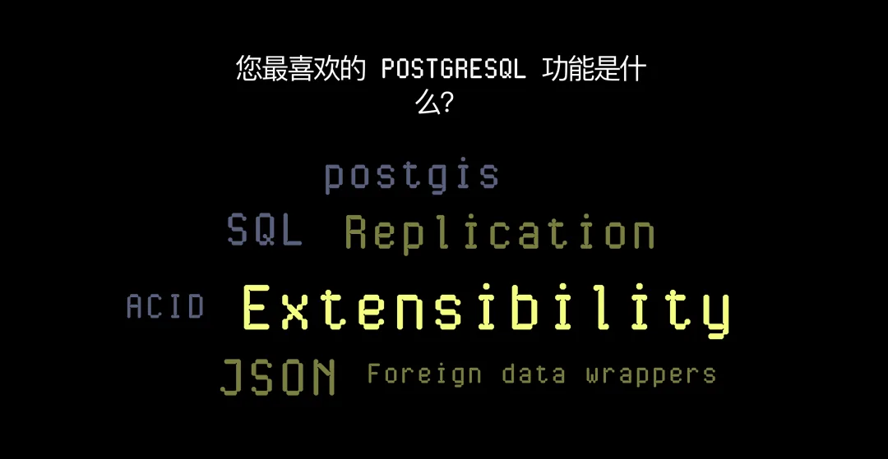

正如 [**PostgreSQL 正在吞噬数据库世界**](/pg/pg-eat-db-world/) 中所说，PostgreSQL 并不是一个简单的关系型数据库，而是一个数据管理的抽象框架，具有囊括一切，吞噬整个数据库世界的力量。

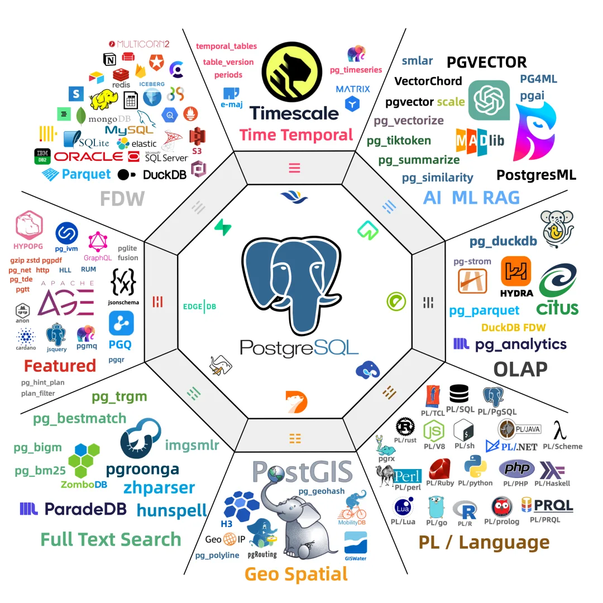

诚然 PostgreSQL 先进，但 Oracle 也先进；PostgreSQL 开源，但 MySQL 也开源。PostgreSQL**先进且开源**，这是它与 Oracle / MySQL 竞争的底气，但要说其独一无二的特点，那还得是它的**极致可扩展性，与繁荣的扩展生态**！

---

## 工作

今年，60% 的受访者表示他们将 PostgreSQL 用于专业用途和个人用途。

46% 的专业用户表示，他们使用 PostgreSQL 的频率比一年前更高或更高。而对于个人项目用户，35% 的用户表示，他们使用 PostgreSQL 的频率比一年前更高或更高。

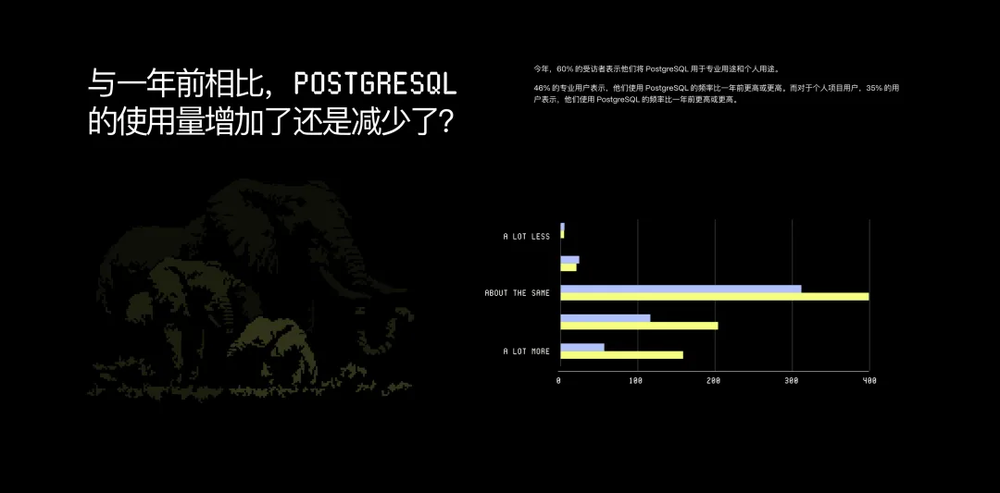

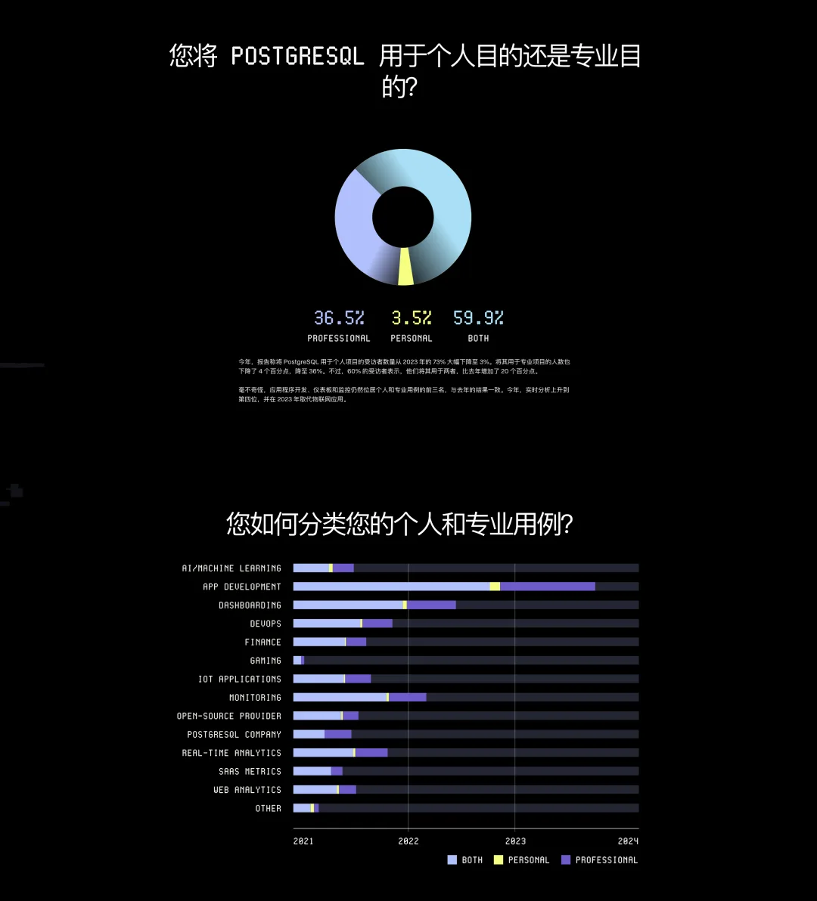

用例部分可能是这份报告最有价值的部分之一。与去年 2023 相比，今年 PostgreSQL 的用例场景不再是 应用开发（App Development） 一枝独秀，而是在细分领域全面铺开。

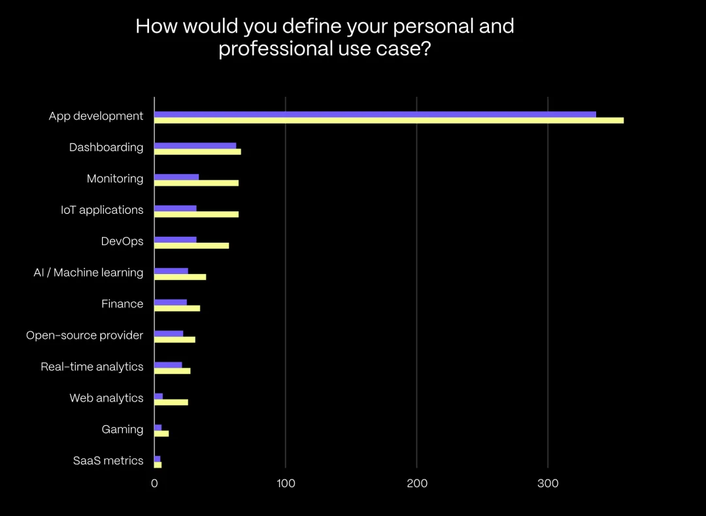

前三大用例依然是 应用程序开发，仪表盘，监控。而今年的一个变化是 **实时分析**上升到了第四位，取代了原本物联网 IOT 场景的位次。

我判断，在今年 PG 生态正在如火如荼的展开的 [DuckDB 缝合大赛](/pg/pg-duckdb/)，很有可能出现一个 OLAP 领域的 PGVECTOR，抢占原本 “大数据” / 实时数仓的生态位。

---

## 社区

与去年的数据相比，受访者发现与社区建立联系比前几年稍微容易一些，其中“中等”（43%）和“极其容易”（18%）的回答比 2023 年增加了两个百分点。

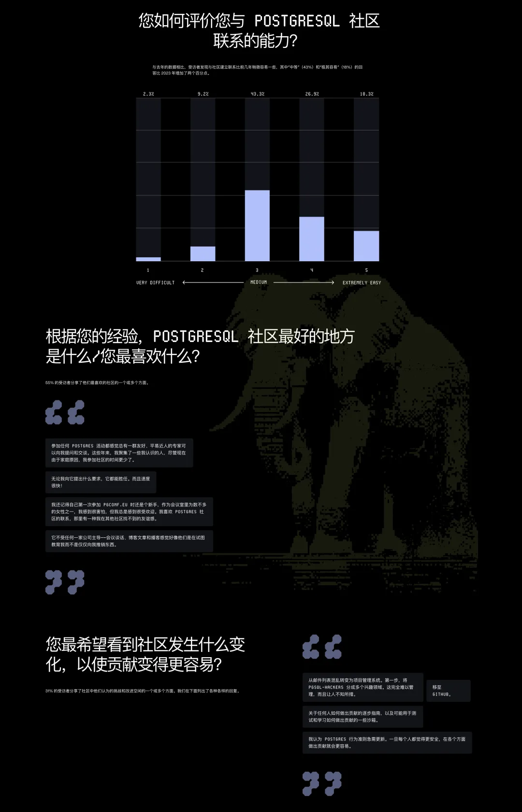

---

## 生态系统与工具

大多数调查参与者表示，SQL（57%）是他们首选的语言，其次是 Python（47%）、Shell 脚本（23%）、JavaScript 或 Typescript（22%）和 Go（20%）。与前两年的回复一致，SQL、Python、Java 和 JavaScript/TypeScript 被认为是访问 PostgreSQL 最常用的语言。Shell 脚本是新进入前五名的语言。

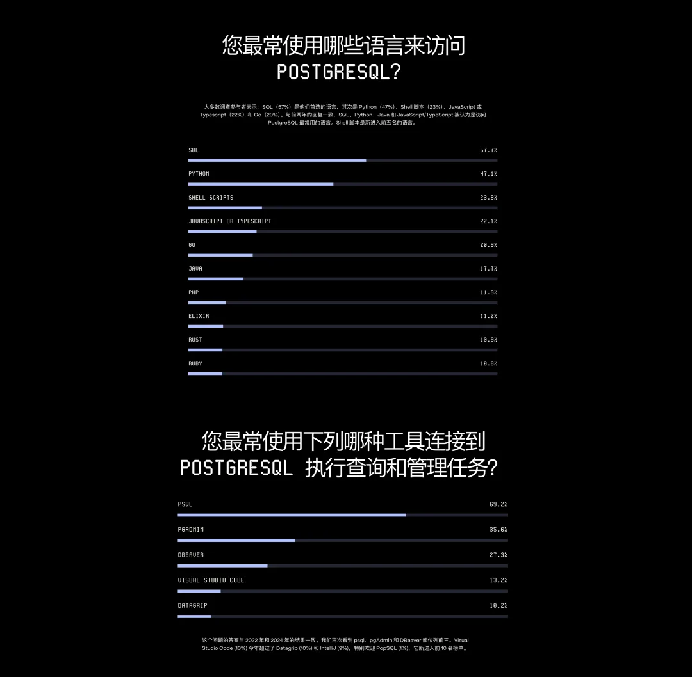

这个问题的答案与 2022 年和 2024 年的结果一致。我们再次看到 psql、pgAdmin 和 DBeaver 都位列前三。Visual Studio Code (13%) 今年超过了 Datagrip (10%) 和 IntelliJ (9%)，特别欢迎 PopSQL (1%)，它新进入前 10 名榜单。

---

## PostgreSQL 与 AI

这个问题的答案丝毫不令人意外。72% 的受访者提到使用 ChatGPT，其次是 Github Copilot 和 Claude.ai，我恰好也在同时用这三款产品，在生产力的提升效果上有目共睹。

比较可惜的是这份问卷没有多问问有多少用户是因为向量扩展（PGVECTOR，VECTORSCALE，PG_VECTORIZE，VCHORD）而使用 PG 的。

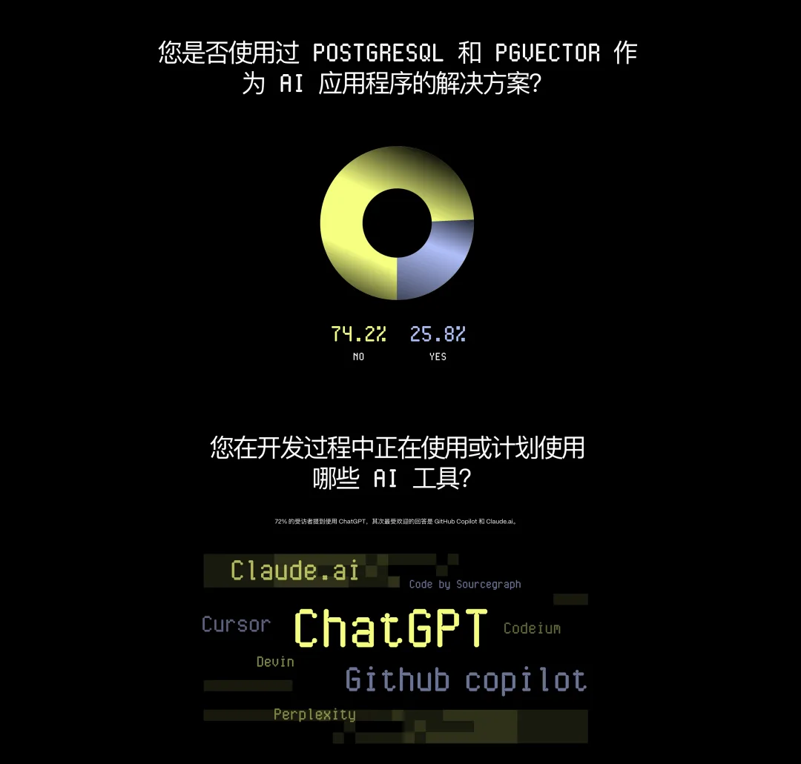

---

发布版本：[微信公众号](https://mp.weixin.qq.com/s/K7tVsOUCq32kHgogR4kBrA)
