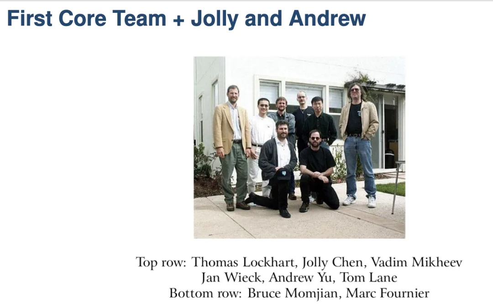
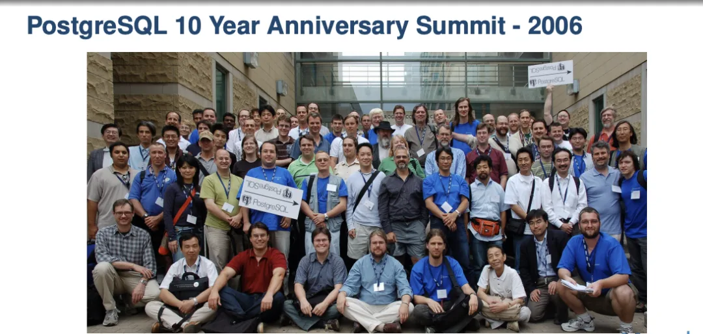
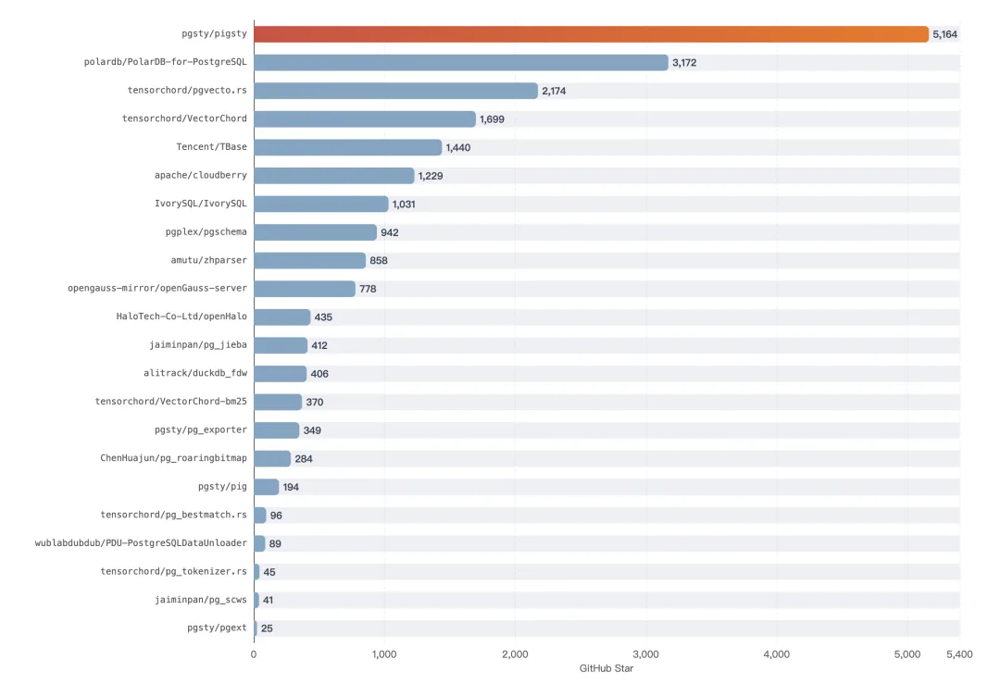
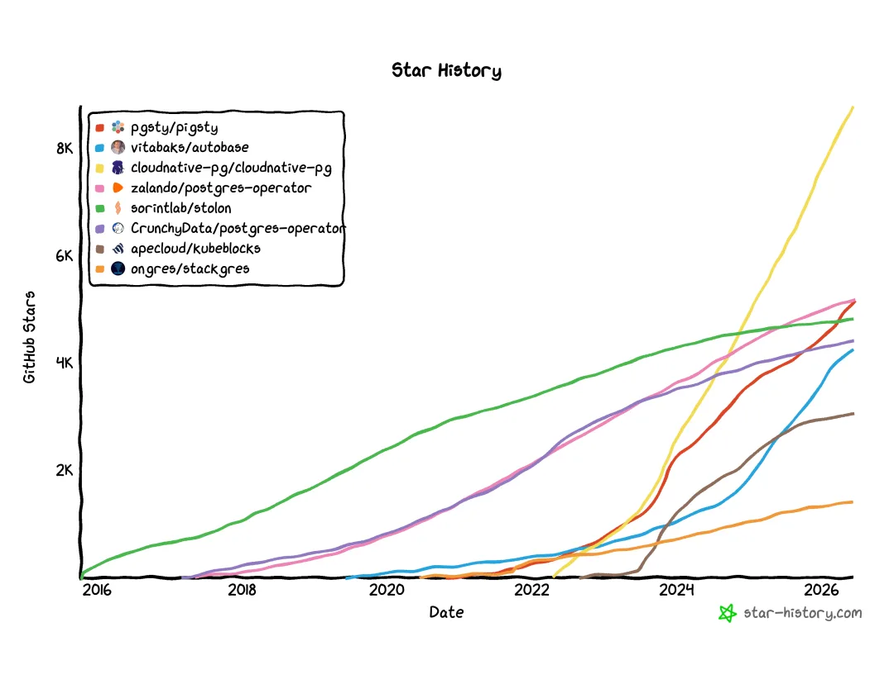
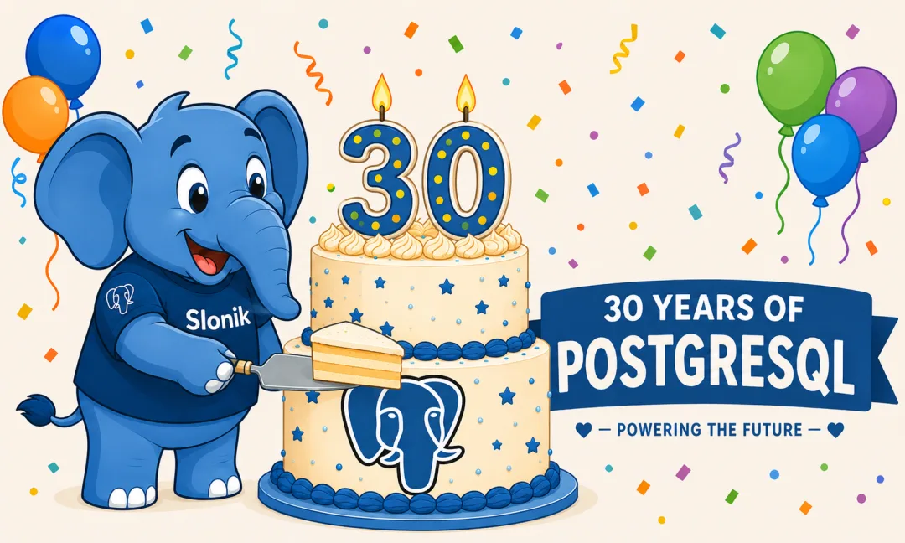

> 今天有个直播，是关于 PostgreSQL 三十周年的。我知道绝大多数人都没这个功夫去看一个九十分钟的直播，所以就把老冯的一些观点转成了文章，发在这里。

## 一、三十岁，是怎么算出来的

先回答一个考据问题：PostgreSQL 的三十岁，到底是怎么算的？

要按最早的算法，得从 1986 年算起。那一年，数据库祖师爷，图灵奖得主，伯克利的 Michael Stonebraker —— 老冯译作 “石破天”—— 启动了 Ingres 的续作，Post-Ingres，简称 Postgres。照这个算法，它今年都四十了。至于它的前身 INGRES，那都能追溯到 1974 年了。

但 PostgreSQL 社区约定俗称的生日，是 1996 年 7 月 8 日。这一天是 PostgreSQL 项目历史上第一封邮件、CVS 服务器上线的日期，它是社区接管后版本控制历史的真正起点。

这个日子是怎么来的？简单说：Stonebraker 的学院项目在 1994 年走到尽头，论文发完，经费花完，照惯例代码该进硬盘深处吃灰了。两个研究生——Andrew Yu 和 Jolly Chen——不忍心，动手把它的自家方言 POSTQUEL 换成了 SQL，以 Postgres95 之名放上互联网。

第二年两人毕业各奔前程，眼看香火又要断，一群素未谋面的互联网志愿者接过代码，改名 PostgreSQL。1996 年 7 月 8 日，就是交接的那一天。从此整整三十年，这个项目没有母公司，没有 CEO，没有融资——只有邮件列表。

所以严格来说，它现在还是二十九岁零十一个月，要到下个月才正式而立。只不过大家实在等不及，五月就在温哥华把生日会开了——提前庆生，不算失礼，毕竟三十年来，给它过生日的人从没这么多过。

## 二、活着的传奇

那场提前的生日会，就是温哥华的 PGConf.Dev 2026。259 人参会，创下历史纪录。我也在场，还见到了 Jolly Chen 本人——上一段里那个名字，教科书里的人物，坐在离你几米远的地方唠嗑。

和 Jolly Chen 合影

但说实话，比见到 ”PG 接生人“ 更让我感慨的，是这个项目本身就是一个活着的传奇。三十年里，它完成了两次惊人的转身。

第一次转身：从一间教室里的科研项目，变成一个无主的社区项目。这一步看似寻常，其实九死一生——学院项目千千万，绝大多数的归宿就是毕业答辩之后的沉寂。它活下来了，而且活成了一个谁也不属于的东西。

第二次转身：从社区项目，长成全世界数据的基础设施。开发者调查里连年最受欢迎的数据库，新数据库创业的默认底座，大半国产数据库的根。**它成了数据库世界里的 Linux**——那种你不一定直接看见、但默认就在那里的东西。一个没有销售、没有市场部、没有融过一分钱的项目，干翻了一众百亿美金的对手。

所以"三十而立"这四个字，它当得起，而且立得很稳。

## 三、蛮荒年代

今天直播里，德哥（周正中）回忆起他入坑的年代：十几年前他开始用 PG 的时候，国内根本没几个人知道 PostgreSQL 是个什么东西。他在 DTCC 上讲 PG，台下听众全都一脸懵逼。

我自己和 PG 结缘是在 2015 年。那时候我刚毕业进了阿里——MySQL 的大本营。某次独立搞项目做技术选型，用到 MySQL 的 JSON 功能时，我无意间发现了 PostgreSQL，被它强悍的 JSON 支持狠狠震撼了一把：顿觉手里的 MySQL，像上个时代的垃圾。但在当时，选 PG 依然是个非常艰难的决定——它还是个"极其小众"的异类选择，你得顶着周围所有人的压力。可我那时已经认定：它一定是数据世界的未来。

之后那几年，我几乎把市面上的各种数据库摸了个遍：在阿里用 ODPS 处理每天几十 TB 的 PV 日志，Cassandra、HBase、Hive、Mongo、Redis 都上手折腾过，还把《DDIA》（数据密集型应用系统设计）翻译成了中文。在数据库世界摸爬滚打，见得越多，越觉得 PG 对、PG 好。之后每一次换工作，我都只有一条硬性要求：必须和 PostgreSQL 有关。一个人一辈子能遇到几件 “认定了” 的事？职业是谋生，这个不一样——**这是志业。**

这一弄就是十年。

## 四、三十年，三级跳

这十年，我亲眼见证了 PostgreSQL 从一个 “有潜力的数据库玩家” 成为数据库世界的王者。回看整整三十年，你会发现 PostgreSQL 踩中了三次风口，完成了一个标准的三级跳。

**第一次风口，GIS。** 2001 年 PostGIS 问世，PG 靠地理空间能力在传统软件业站稳了脚跟——政府、测绘、电信，谁手里地图数据多，谁就绕不开它。这是传统软件行业的浪潮。

**第二次风口，JSON。** 互联网大爆发，NoSQL 喊着要革关系数据库的命。PG 的回应不是写文章辩论，是直接把 JSON 装进了内核：9.2 进 json，9.4 上 jsonb。你要的文档数据库？PG 顺手就把 MongoDB 整个吞了。

**第三次风口，AI。** 向量检索打头阵，pgvector 成了这波浪潮里最忙的扩展，全文检索、图查询紧随其后排队进场，又被它稳稳踩中。

三波浪潮，波波不落，听起来像运气好到离谱。但细想一下又毫不稀奇——这恰恰就是 PG 自称"最先进"的真正含义。先进不是某个特性领先三年，那种领先半代人就被抹平了。**与时俱进的能力，才是最强的先进性。**

### [PostgreSQL 正在吞噬数据库世界](/pg/pg-eat-db-world/)

## 五、托拉与塔木德

那么问题来了：一个三十岁的老项目，凭什么能与时俱进？

这让我想起了犹太教。犹太人的《托拉》是稳定的，正典一个字都不能动；但围绕它生长出来的《[塔木德](https://mp.weixin.qq.com/s?__biz=MzU5ODAyNTM5Ng==&mid=2247492215&idx=1&sn=9590547590ce7e891e1dd8d41734c83b&scene=21#wechat_redirect)》——历代拉比的辩论、注释、引申——却一直在回应每个时代的新问题。正是靠着这个不断生长的"注释层"，一个几千年前的内核，活到了今天。

PostgreSQL 是同一个结构。**内核是它的托拉**：小、稳、保守，轻易不动，三十年如一日地打磨可靠性。**扩展生态是它的塔木德**：几百个扩展在边界上蓬勃生长，替内核回答每个时代的新问题。GIS 的问题，PostGIS 答；NoSQL 的问题，JSONB 答；AI 的问题，pgvector 答。内核越稳，注释越敢长；注释越繁荣，内核越不用折腾自己。

所以三级跳的谜底就在这里：踩中浪潮的从来不是内核本身，是它 “允许扩展生态替它踩” 的机制。可扩展性不是 PG 的一个特性，它是 PG 的核心灵魂。

但光有以可扩展性为代表的先进架构还不够，比技术更要紧的是社区治理——PostgreSQL 是极少数的真·开源项目，大型数据库里唯一的"无主公共品"。没有任何一家商业公司能掌控 PostgreSQL。一个不属于任何人的数据库，反而真正属于所有人：人人都有动机为它添砖加瓦，因为没人担心自己的砖瓦，最后砌进了别人家的院墙。

先进之才，开源之德，才德兼备，方有今日。

## 六、负分与旗手

直播里聊到中国时，主持人给德哥抛了个问题：如果欧美 PG 社区的平均水平算 10 分，中国能打几分？我心里盘算着，德哥怎么也得给个四五分，给国内数据库厂商留点面子。结果他张口就是：负分。

我当场笑出了声。但笑完细想，这负分还真不全是抬杠：套壳、换皮、魔改 PG 的"负优化"产品层出不穷，这些拿不上台面的东西，对 PG 世界的贡献老实说是负的——没有它们，PG 兴许发展得更好。正贡献寥寥，负贡献成堆，负负相加，可不就负分了么。

其中最讽刺的莫过于：中国 PG 生态里最有全球影响力的项目，居然是老冯的 Pigsty——我一个人做的发行版，标准的 OPC（一人公司），Star 数压过了阿里、腾讯、华为等一众大厂搞的 PG 分支。个体户成了门面，这事谈不上荣耀，更像是行业现状的一条注脚。

[打造一个立足中国，面向世界的 PG 数据库发行版](/pg/forge-a-pg-distro/)

但牢骚归牢骚，活总得有人干。旗子没人举，那我先举着——这几年，我把 PG 发行版和扩展生态这两块做了下来：几百个扩展，十几个 Linux 发行版，打包、测试、分发，开箱即用；Pigsty 也站到了全球开源 PG 发行版的第一梯队。一个人不一定能把整个平均分拉正，但至少可以让中国 “正贡献” 那一栏，不再是空的。

PGConf.Dev 改组后一共三届大会，我全都去了。第一届投稿被拒，我照样飞了过去——说白了就是去混个脸熟，把邮件列表里那些只闻其名的 ID，一个个变成饭桌上的真人。面对面，是建立信任最快的方式。没有演讲资格，我就在 Unconference 上讲了个可观测性。第二届，在 pgext Day 的闪电演讲里抢到五分钟，让大家知道我在干什么。第三届，把社区最关心的事——扩展生态——研究透了，端上桌去，于是站上了主会场的讲台。

[让 PG 停摆一周的大会：PGCon.Dev 参会记](/pg/pgcondev-2024/)

[PGCon.Dev 扩展生态峰会小记 @ 温哥华](/pg/pgcondev-2024/)

[蒙特利尔 PGConf.Dev 2025 参会随笔小记](/trip/20250514-montreal-notes/)

[PGCon.dev 闪电演讲，硬控 PG 大佬 5 分钟](/pg/pgcondev-lightning/)

[中国厂商首次站上 PGConf.dev 主题演讲台](/pg/pgconfdev-china-keynote/)

[扩展，为所有人而构建：PGConf.Dev 2026 演讲](/pg/extensions-for-everyone/)

从台下，到台边，再到台上，三年三级台阶。信任都是一点一点攒出来的。开源世界没有资本运作那一套，**信任的充值方式就是：实打实地参与，踏踏实实地做对社区有用的事。**

## 结语

写到这儿我忽然意识到：这条路，我其实并不陌生——它就是 PostgreSQL 自己走了三十年的那条路。

它没打过一分钱广告，没雇过一个销售，没讲过一次资本故事。它就是一个版本一个版本地可靠，一个时代一个时代地有用，接住了每个时代的机会与风口。三十年下来，全世界把最宝贵的数据托付给了它。一个人积累信任的方式，和一个项目积累信任的方式，其实是同一种——把有用的事做实，然后一直在场。

所以我的故事，不过是它的故事的一个小小映射。而这样的映射正在变多：中国和 PostgreSQL 的这三十年，也是从听说，到使用，再到刚刚起步的贡献。我相信这两条弧线的重合会越来越密——密到某一天，德哥或者所有人再被问起那道打分题时，可以理直气壮地报出一个正数。

散场那天，我又想起 Jolly Chen。三十年前，两个学生不忍心看一个项目死掉，把它加上 SQL，放上了互联网；三十年后，它成长为了一颗参天巨树。

PostgreSQL 三十而立，立住了。前三十年它没错过任何一波关键浪潮，我没有理由相信它会错过下一波—— 它正值盛年。

下个月，7 月 8 日，它才正式满三十周岁。提前说一句：

生日快乐，PostgreSQL。

愿你的下一个三十年，依然常青，依然在场。

---

发布版本：[微信公众号](https://mp.weixin.qq.com/s/8pyFVnS7xbYuSXdif1Crgw)
