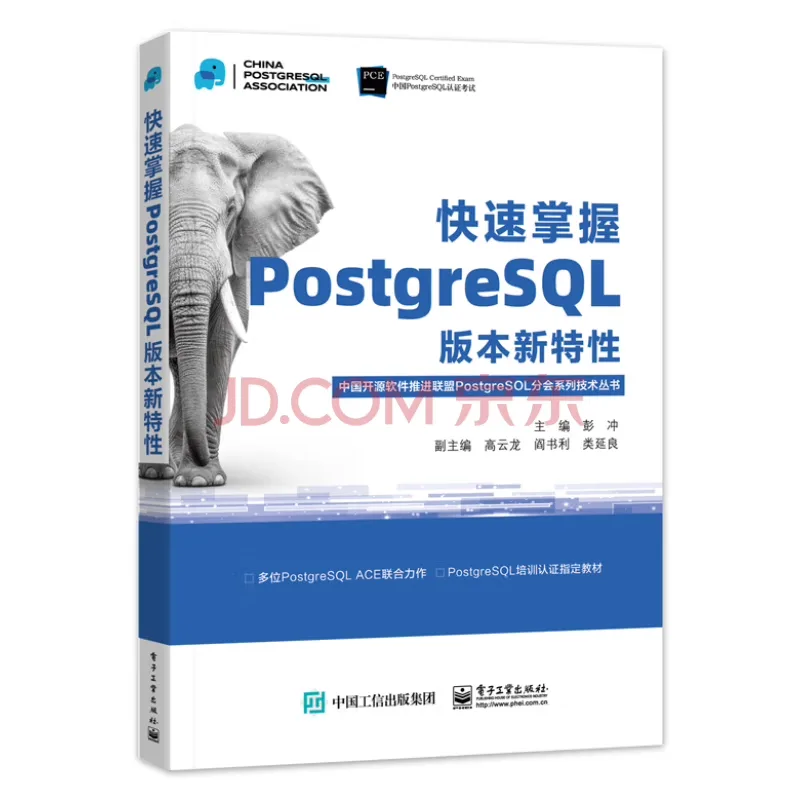
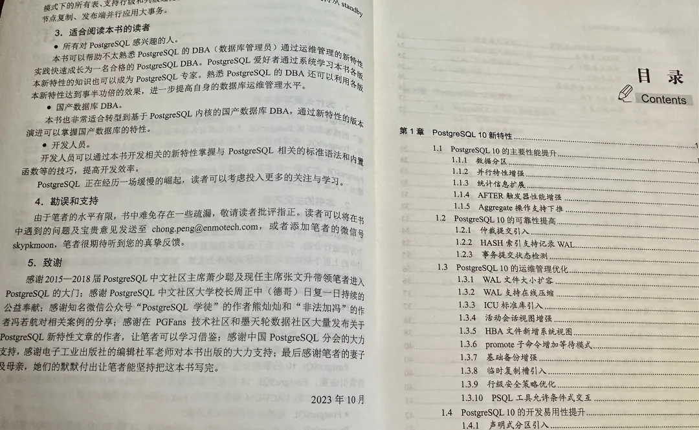
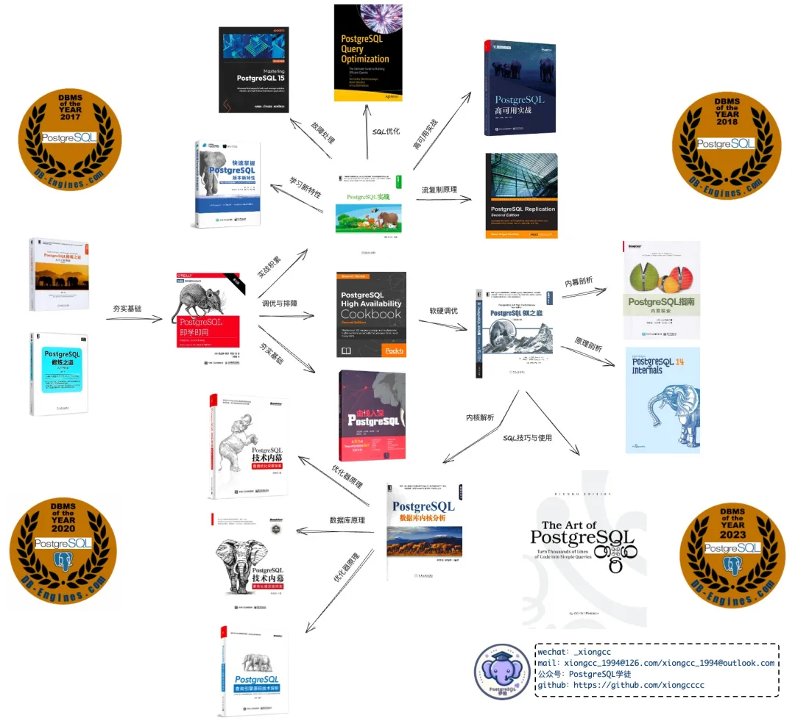
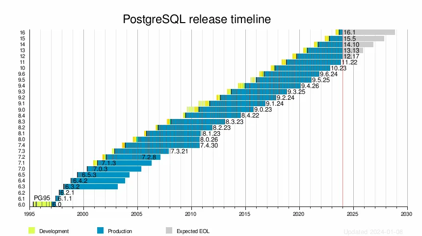
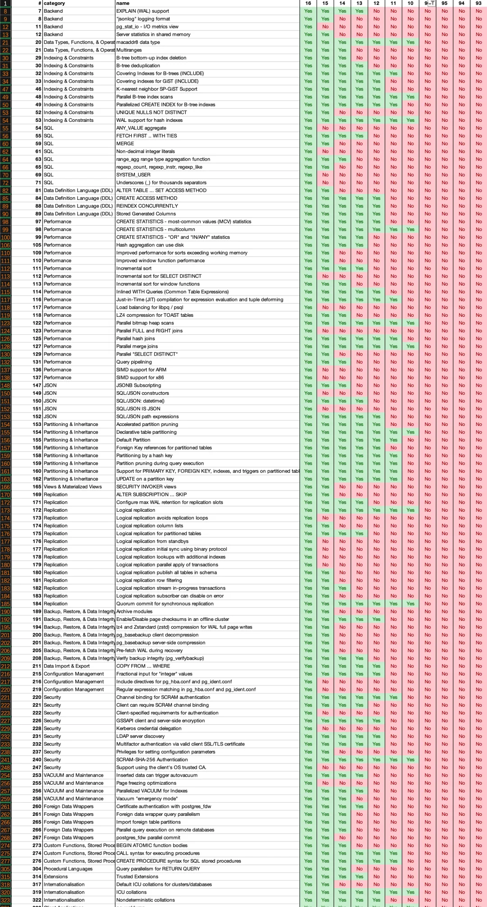

最近朋友新出了一本书，书名朴实无华简单直接：《**快速掌握 PostgreSQL 版本新特性**》。内容是详细介绍了 PostgreSQL 最近 7 个大版本的新特性。我收到了一本样书，浏览了一遍之后，感觉写的确实不错，所以推荐给大家。

这本书的组织结构很简单，就是每个大版本对应一章，从 PG10 开始，到 2023 年刚发布的 PG 16 结束。每一章按照性能、可靠性、运维管理、开发易用性、系统架构五个大方向对特性进行逐一介绍与梳理，一目了然。\

PostgreSQL 文档与 ReleaseNote 里面对于新特性的说明往往言简意赅，较为晦涩。深入的介绍通常散落在各种大会技术分享，大佬博客文章中。想要摸通吃透，往往也需要自己动手去测试验证，才能获得第一手的实践经验。而这本书的优点就在于 —— 它还给出了每个特性的实践用例，对于掌握 PG 新特性提供了许多的便利。

哈哈，没想到我还进了致谢名单里🙏

很欣慰能看到 PostgreSQL 生态中又有了一本中文书籍，弥补了相关领域的空白。特别值得一提的是，公众号《PostgreSQL 学徒》主理人熊灿灿整理过一篇 [PostgreSQL 领域好书推荐](http://mp.weixin.qq.com/s?__biz=MzUyOTAyMzMyNg==&mid=2247491122&idx=1&sn=79de5dccdb2e3470778a82055e3cb10d&chksm=fa663603cd11bf15ebe1b9bcd445cd3d15b85d982bf12188865a0e1971f1d9f2f87a58494310&scene=21#wechat_redirect)。有兴趣学习的朋友可以作为参考。

PostgreSQL 内核主干每年发布一个新的大版本，每个大版本都会引入一些新功能特性。PostgreSQL 10 是一个分水岭版本 —— 之前的大版本号都是 9.x，在 10 之后才变为每年调大 Major 版本号。

最近，PG 11 刚刚 EOL，脱离了支持生命周期。这也正好是抛弃历史包袱，出这样一本特性介绍编年史的好时机。这本书收录了从 10 到 16 这 7 个大版本的新特性，范围还是很合理的，基本涵盖了 PG 黄金十年的主要特性介绍。

过去的十年，是 PostgreSQL 发展的黄金十年，无数强大的新特性，新扩展让 PostgreSQL 从一个相对小众的选择，逐步成为了今天**[世界上最成功的数据库](/pg/pg-is-no1/)**。StackOverflow 历年全球开发者调研结果，DB Engine 流行度排名结果，以及搜索引擎热度的变化趋势都佐证了这一点。

如果我们查阅 PostgreSQL 官网的特性矩阵，目前总共列出了 377 个功能特性。其中，新出现在 PostgreSQL 10 及以后版本的特性共有 107 个，占了总数的**三成**。如果从 10 年前的 9.4 开始算起，有四成的特性是在最近十年间新引入的。

要跟进并掌握所有这些新特性并不是一件容易的事——能有这样一本书，按照编年史的方式介绍 PostgreSQL 的功能特性，对于学习 PG 来说无疑是很有帮助的。即使是 PostgreSQL 老司机，也很难完全记住一些特性到底是在哪个版本引入的，本书就可以当作一本不错的案前参考手册备用。

尽管新特性很有用，但也要实操才能真正掌握。在这一点上，有兴趣学习 PostgreSQL 的人，不妨**[弄台虚拟机](/cloud/cheap-ecs/)**搭建一套 [**Pigsty**](/pigsty/better-rds-alternative/)  —— 一键拉起 1:1 复刻生产环境的本地 PostgreSQL 集群，150+ [**生态扩展**](/pigsty/db-allrounder/)开箱即用，并带有最强监控系统可供观察系统状态；如果您主要对开发者特性感兴趣，也可以试试德哥制作的《[最强 PostgreSQL 学习 Docker 镜像](http://mp.weixin.qq.com/s?__biz=MzA5MTM4MzY1Mw==&mid=2247484237&idx=1&sn=9ea4b4f91d5ce1962ffa53daf5c2c33a&chksm=907c7147a70bf8514254f261cf94ed2ce9db4a76e870fb5a34affa3716bca6d3974f214d6507&scene=21#wechat_redirect)》。纸上得来终觉浅，绝知此事要躬行。

---

发布版本：[微信公众号](https://mp.weixin.qq.com/s/NH8UgObijvxKekmP6sXN1Q)
