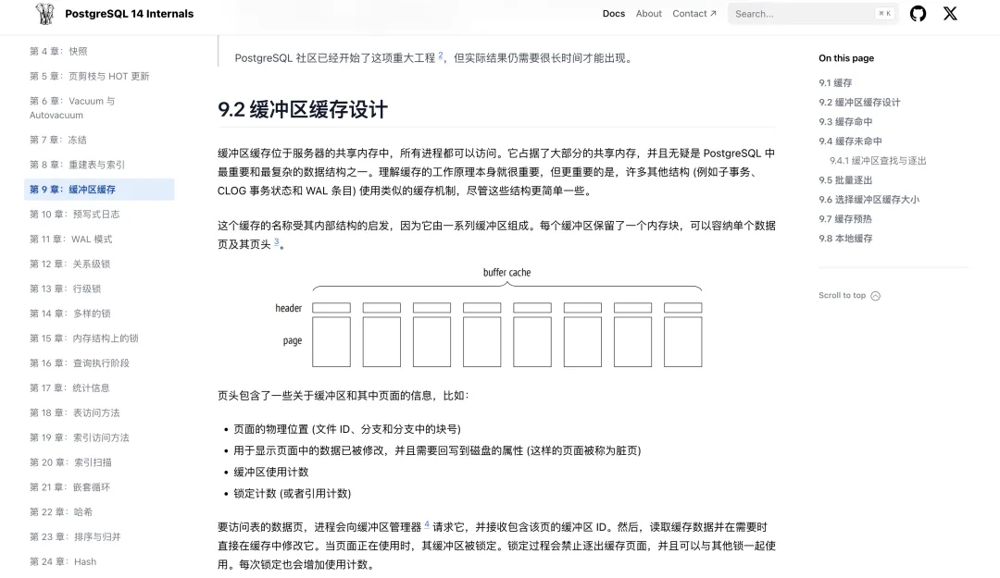
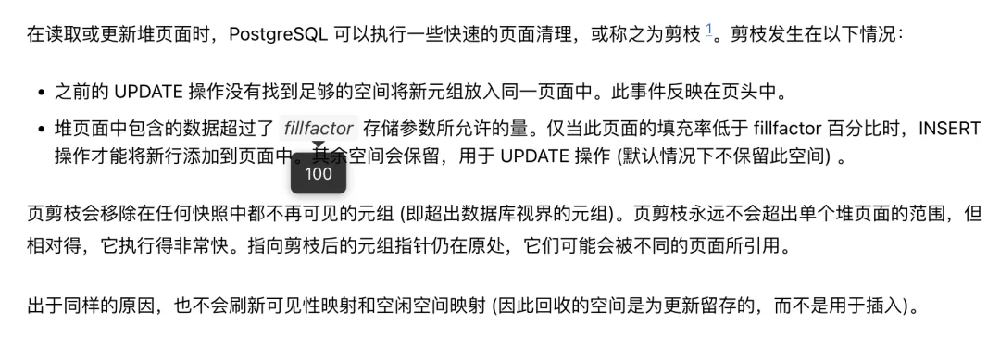
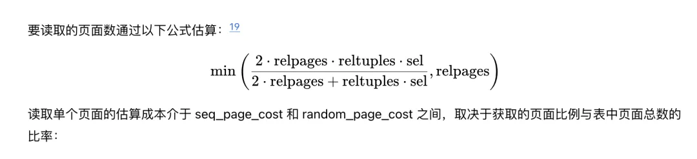

> 原作者：熊灿灿

## 前言

各位 PGer 大家好，在此很高兴地告诉各位 ——《PostgreSQL 内参：深入解析运行原理》正式发布了。从最开始萌生翻译成册的想法，再到现今电子版书籍的正式发布，期间磕绊无数，但好在结果是喜人的，三年磨一剑，《PostgreSQL 14 Internals》中文版终于如期而至，各位可以通过 [postgres-internals.cn](https://postgres-internals.cn/)[1] 进行访问。原计划在元旦发布，思考良久，最终还是决定提前与各位见面。对于中文版的发布，原作者 Egor Rogov 对此也表示十分支持。

> As the author, I’m very excited that this book got translated to Chinese, for which I’m very grateful to Mr. Cancan. This translation will surely contribute to growing popularity of PostgreSQL in China.

由于工作繁忙，个人事情也杂且多，只能忙里偷闲，再加之本就临近年底，席不暇暖 (期间也有读者私下里问我最近是不是遇到什么事了，导致群里的活跃程度以及发文的频率都不同于往日🙃)。为了确保电子版书籍能够保质保量地如期发布，笔者也只能在本就为数不多的闲暇时间里，继续挤压出时间来为爱发电。将一本外文书籍翻译为中文本身就是一项颇具挑战的事情，翻译过程中难免会有纰漏之处，敬请谅解。如果各位读者发现有任何错误的地方，请随时联系笔者进行更正，读者的反馈至关重要，也欢迎大家提出改进建议。

- GitHub[2]
- 微信公众号：PostgreSQL 学徒
- 微信：`_xiongcc`
- 邮箱：<xiongcc_1994@126.com> / <xiongcc_1994@outlook.com>

## 笃行致远，臻于完善

网站为静态的，整体风格偏素雅，采用 Hugo + Github Pages 的技术栈搭建。这些前端知识都是笔者在网站搭建期间现学现卖的，加之 DBA 出身，因此并不能做不到很专业化，如果有专业的前端朋友愿意指点一二的话，在此也十分感谢，当前版本使用 PC 端 + Chrome / Safari 浏览器阅读体验最佳，手机端图片显式略小。

主题默认为 Light 模式，也推荐使用该模式，在该模式下的阅读效果最佳，Dark 模式则适合夜里阅读，但是与图片的颜色可能有点不搭。

为了最大化还原原书，笔者花费了不少气力，比如旁注，这也是原作者所建议的，最开始的版本并没有旁注。现在，当🖱悬停至带有淡棕色背景色的字体上面，会自动"弹出"旁注，包含相应的注解信息，比如：

- 是哪个版本引入的此特性
- 此参数的默认值等等

方便我们更好地进行掌握。其次像书中的脚注、引用等，都原汁原味地进行了保留。另外一项稍麻烦点的可能就是 Latex 的语法了，有些地方由于 Hugo 不好实现，就保留了图片，但是大多数可以直接用公式表示的还是可以原样表现出来 👇🏻

另外为了美观，图片也做了不同程度的缩放，并且主要适配的是 PC 端，因此如果在手机端浏览的话图片可能会略小，但是不影响整体阅读，这些可能会在后续版本中进行优化。所以，当前版本推荐使用谷歌浏览器 + PC 端进行浏览，效果最佳。

由于是原理性的书籍，书中免不了有大量的专业术语，比如

1.tranche，在代码中，此术语用于描述一组"锁集"，比如我们熟知的 Buffermapping

<!-- -->

    /* * There are three sorts of LWLock "tranches": * * 1. The individually-named locks defined in lwlocknames.h each have their * own tranche.  We absorb the names of these tranches from there into * BuiltinTrancheNames here. * * 2. There are some predefined tranches for built-in groups of locks. * These are listed in enum BuiltinTrancheIds in lwlock.h, and their names * appear in BuiltinTrancheNames[] below. * * 3. Extensions can create new tranches, via either RequestNamedLWLockTranche * or LWLockRegisterTranche.  The names of these that are known in the current * process appear in LWLockTrancheNames[]. * * All these names are user-visible as wait event names, so choose with care * ... and do not forget to update the documentation's list of wait events. */

2.distance：直译过来就是距离，实际上其描述的是检查点之间的 WAL 日志量，内核用来预估后面的 WAL 日志的预分配，这一点我们在日志中也可以看到 (打开了 log_checkpoints 参数)3....

抛开专业术语自身，再加上语言间的巨大差异，翻译过程中也会失真，比如

> So if a replica does not receive WAL entries while the required pages are still in the OS buffers of the primary server, the data has to be read from disk. But the access will still be sequential rather than random.

直译过来的话就会丢失其准确性，不够严谨，其实其准确含义是："walsender 进程直接从文件中读取 WAL 条目，如果备库没有接收到需要的 WAL 条目，那么 walsender 进程将从文件中读取，只是读取过程是顺序的，而不是随机的 (也有可能在主库的操作系统缓存中找到相应的 WAL 条目)"，这些种种，为了确保质量，我都和原作者 Egor Rogov 进行了请教与沟通。

以上都只是冰山一角，更多内容请各位读者自行发掘。

## 纸质版的发售

另外各位读者可能关心的便是纸质版了，纸质版相较于电子版就要麻烦一些，这也是为什么我会选择电子版 + 纸质版相结合的方式，纸质版涉及到更多汉化，比如图片；其次还有一些 ZZ 要求，比如包含“地图”的图片，都需要一一调整，更不用说各种各样的格式要求了，电子版就要相对灵活一些。

但是，笔者相信，好事不怕晚，电子版的出现，能使得纸质版更加完善，雕琢精微，字斟句酌，纸质版各位可以再耐心等一等。

## 知之深则行愈达

翻译这本书并将其出版，其中艰辛只有笔者最为清楚，但是“痛并快乐着”，翻译的过程本身就是在学习 — PostgreSQL 内核原理、前端知识、LaTex 语法以及从零到一搭建网站等等，对于自己来说，无疑都是巨大的财富。须自为，积跬步，躬身入局。

就说这么多吧，Enjoy it \~~

### References

- `[1]` : <https://postgres-internals.cn>
- `[2]` GitHub: <https://github.com/xiongcccc>

---

发布版本：[微信公众号转载页](https://mp.weixin.qq.com/s/6cySHDZCWumZOl7c8Kq_pg)
