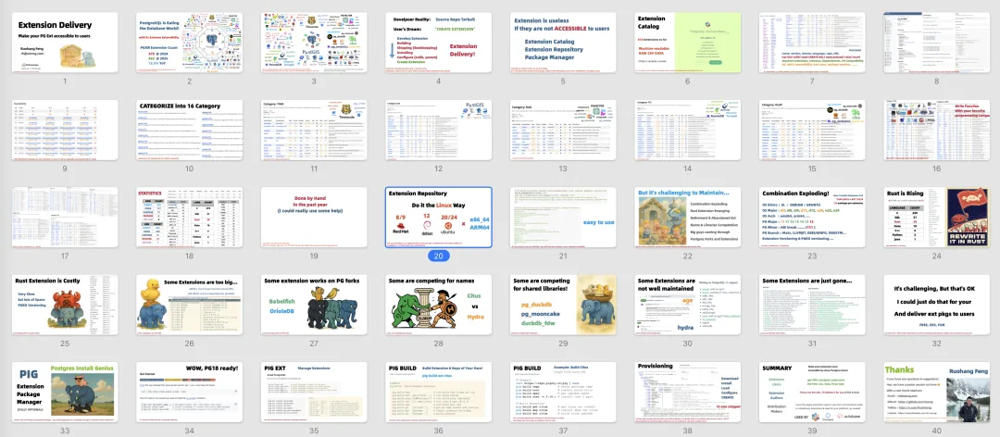

PGConf.Dev 2025 全球开发者大会主会场两天的议程刚刚已经结束了。老冯今天的运气真不错，竟然抽中了一个 “闪电演讲” 的名额。所谓 “闪电演讲” 是 PGConf.Dev 的经典环节 —— 将抽取 12 位提交议题者上台进行 5 分钟的主题演讲，超时就会直接轰下来，所以大家都保持着精简干练的风格。

闪电演讲的含金量非常高，因为整个大会只有开场的院士专场演讲和收尾的闪电演讲，能把整个会场所有的人给摇到一块儿聚在一起听讲。其他的时候人都是分布在几个子会场和大厅社交区域唠嗑。全球 PostgreSQL 顶尖专家，各路大师们全员到齐，听老冯俺上台叭叭五分钟，还是一件很让俺高兴的事情。

老冯的闪电演讲主题内容是《Extension Delivery：Make your PGEXT Accessible》，早上花了两个小时现场赶出来的，基于三天前的 PGEXT DAY 演讲稿进行修改。别人都是三四页 PPT，只有俺堆了整整 48 页 PPT 上去。

主办者问，你这怎么这么多页，有办法挤挤不。我说这个叫 “蒙太奇快闪”，一句话一页纸，减不了啦。最后时间把控的非常精准，五分钟，只剩下最后一秒。

闪电演讲的内容，朋友帮我录了下来，至于官方版本发布，大概要到两个月后啦。第二次用英文公开演讲，远没有中文流畅，但听众反馈确是相当的好。我感觉主要是两个因素：

用《[Postgres is eating the database world](/pg/pg-eat-db-world/)》打开注意力通道 —— 这是我写的一篇文章，PG 社区成员基本都读过，一下就进入了注意力集中的状态，其次是内容设计上就是讲对扩展用户，扩展作者，发行版厂商真正有帮助的东西。

去年的 PGConf.Dev，老冯在 Unconference 自组织会议上讲了讲 pg_exporter 与可观测性展望，今年更进一步，都搞到闪电演讲了。我的好朋友，PGEXT DAY 活动的组织者 Yurii，应该还是蛮羡慕的哈哈。PG 核心组的 Jonathan Katz 跟我说，办会真应该把俺摇来，太需要俺这样提神醒脑的演讲者了。

明天一天时间，还有 PGCon.Dev 的招牌活动 —— UnConference，由参会者投票选择的即兴主题演讲。老冯这两天是太累了困的不行，所以就等明天 Unconference 结束，再发总体的大会回顾与纪要吧。

---

发布版本：[微信公众号](https://mp.weixin.qq.com/s/rZ4lcsdld1_Fxck77KRIvw)
