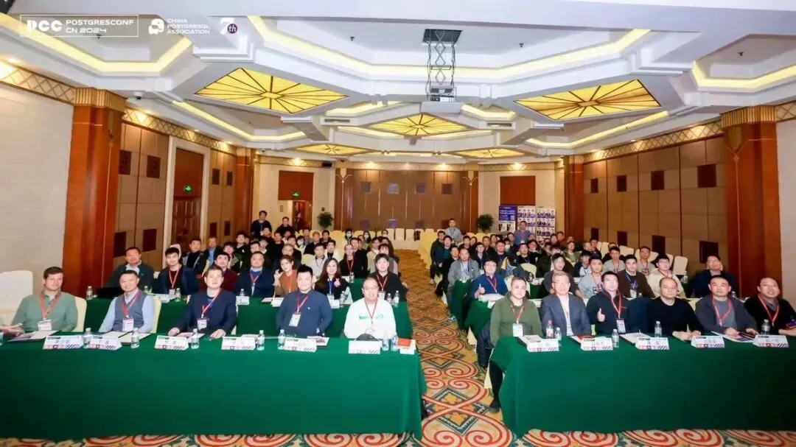
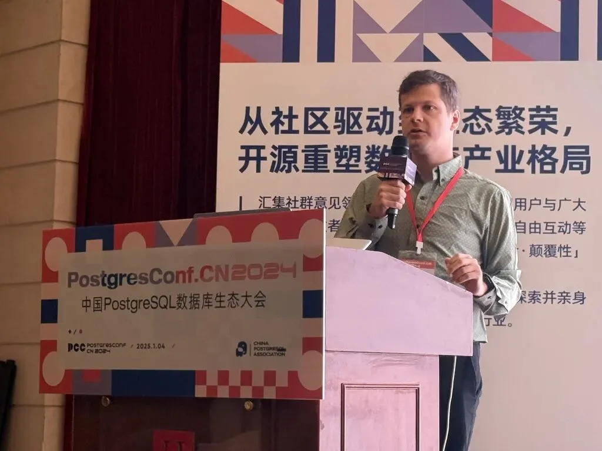
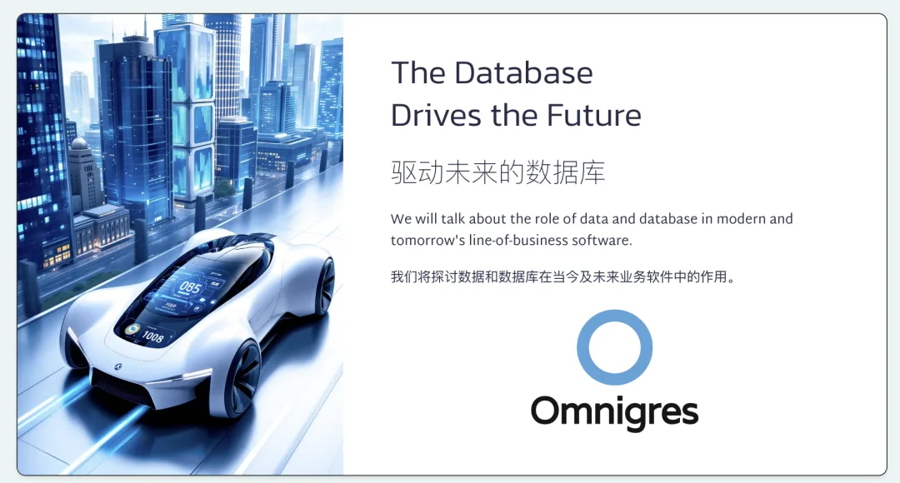
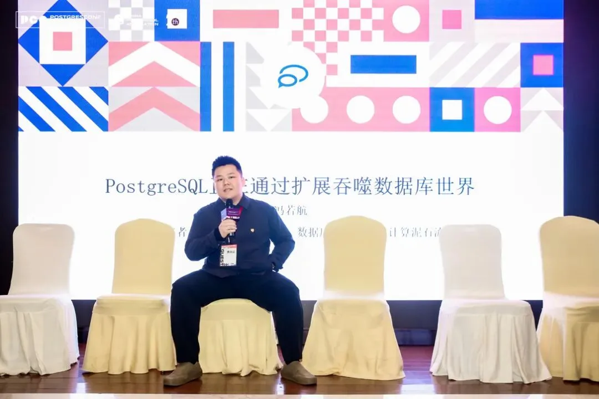
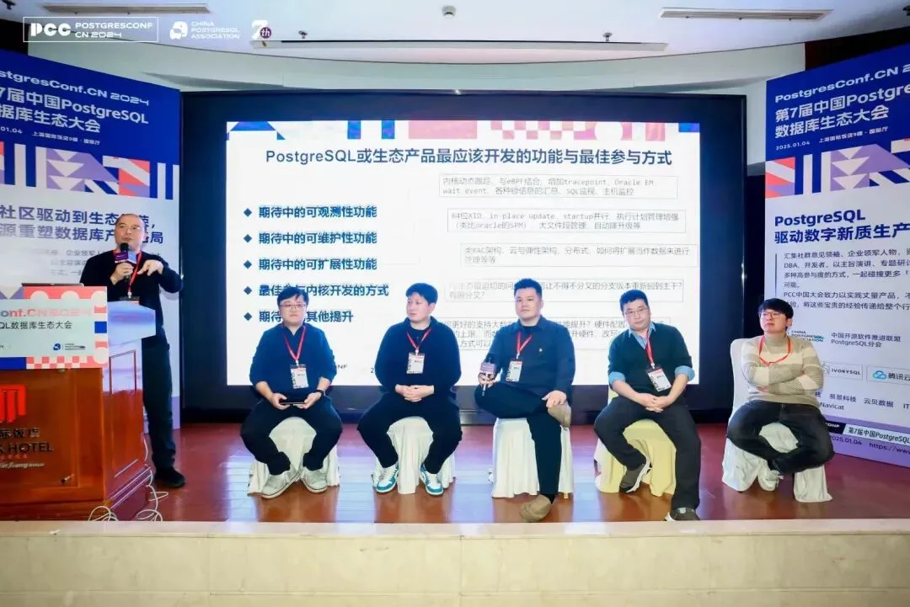

1 月 4 号，PostgreSQL 生态大会在上海国际饭店成功举办。参会的观众与嘉宾填满了整个会场，这其实是挺不容易的一件事，已经有相当一阵子没有看到这么热闹的大会了，组织得也的相当不错。当然，我是懒得写那种流水账说谁谁谁讲了啥啥啥的簿记文章，我就说说我参会的一些心得体会与感想吧。

---

## 如何请外国人参会

虽然这是一场 “中国 PostgreSQL” 会议，但我确实认为中国的厂商与开发者应该看看海外/全球的同行先行者们正在做什么。这也是我邀请加拿大 PG 公司 Omnigres 的创始人 Yurii 来参加这次大会的首要原因。

在去年的 PGConf.Dev 2024 上，我认识了 Yurii，并被他关于 PG 扩展的演讲所打动 —— 他是一位很优秀，页很有激情的公开演讲者，也在 PG Extension 上有着非常深入的研究 —— 非常深入不是客套：他正在设计 PG 生态下一代的扩展构建与分发标准。我们关于如何分发 PG 扩展，构建下一代事实标准有过多次交流，因此当我得知他正在泰国休假，很方便来中国时，我很高兴地邀请了他参加本次会议。

得益于最近放开的外国人过境免签政策，尤里只需要会议主办方发一封邀请函就可以入境中国。这里微妙的点在于必须是 “过境” 而非来访，所以他必须通过往返都中转香港的办法来适用这一政策。当然，除了签证，还会有一系列的挑战，比如注册微信与支付宝，绑定银行卡与付款方式，手机卡与 VPN，翻译，以及各种 “本土 APP”。不过这些都是可以解决的问题，我会专门写一篇文章分享在这方面收获的经验。

尤里的分享主题是《驱动未来的数据库》（[PPT](https://gamma.app/docs/The-Database-Drives-the-Future-41vma58e3502p70?mode=doc)），核心思想是把所有业务逻辑都放入 PostgreSQL 中（例如用存储过程实现）。为此，他以 PG 扩展的方式提供了一套“标准库”：http、vfs、os、python 等几十个模块。

我在过去十年里深度使用过这种模式 —— 所以深知其优劣 —— 其实最大的难点在于这种范式对开发者和 DBA 的要求太高了。这种实践绝对算不上主流，但在 AI 时代，我认为这种范式有不小的潜力：因为 GPT 显然已经达到了能够熟练编写存储过程的中高级开发者的水准了。

三天时间，我拉着尤里去洗了两天大澡，他显然是沉迷其中了。我们聊了很多，技术上的交流，创业，生活，家庭，时政，历史。我们在经历，认知，习惯喜好上有非常多共同之处，总之，建立起了深厚友谊。尤里邀请我参加他发起的八月挪威的欧美技术圈 CXO 徒步活动，我估计也能很快在佛罗里达与蒙特利尔的 PG 大会上再见到他。

---

## 扩展很重要，但很多人没意识到

在这次会议中，我参加了五场研讨会中的三个。我的议题基本都围绕着 PostgreSQL 的可扩展性：其实核心观点我已经在本号的几篇文章中深入介绍过了。但很明显，并没有引起国内厂商的注意。

[小猪骑大象：PG 内核与扩展包管理神器](/pg/pig/)\

[PostgreSQL 神功大成！最全扩展仓库](/pg/pg-ext-repo/)\

[谁整合好 DuckDB，谁赢得 OLAP 数据库世界](/pg/pg-duckdb/)

在 [Andy Pavlo：2024 年度数据库回顾](/db/pavlo-2024-review/) 这篇年度数据库总结中，用了整整一章的篇幅介绍 PG 扩展正在发生的 DuckDB 缝合大赛。国际顶尖的厂商在这一点上有着非常敏锐的嗅觉与反应 —— OLAP 领域的 DuckDB 缝合大赛，以及全文检索领域的 tantivy 缝合大赛，很可能是紧接着 PGVECTOR 向量数据库赛马之后的重磅事件。

不过，大部分，特别是国内数据库厂商，显然还没有意识到这一点。还在卷一些 “锦上添花” 的特性。半年过去了 —— 国内能拿得出手的唯一参赛作品依然是个人开发者李红艳的 [duckdb_fdw](/pg/duckdb-fdw-1-0/)。

这次尤里过来的另一件主要事务就是和我商讨扩展生态标准的问题。我们决定一起搞一个下一代 PG 扩展构建分发的事实标准，并邀请 Tembo，PGDG 仓库维护者，以及其他各家国际厂商参与进来。当然，如果有国内厂商感兴趣，当然也热烈欢迎。

---

## 数据库应该更加关注开发者

半年前，瑞典马工有一篇点炮文《[DBA 不是数据库的用户，开发者才是！](/cloud/developers-are-db-users/)》提出了这个观点，本次会议中，萧少聪（前 PG 中文社区主席）也提出来：现在（特别是国内）的数据库厂商，是不是过于关注 DBA / 运维，而忽视了数据库真正用户 —— 开发者的需求？

那么开发者最需要的是什么？我认为是功能与易用性，说到底就是用最少的劲儿出最多的活 —— 典型案例就是一行 PostGIS 查询顶上千行 C++ / Java 代码。那么具体到 PostgreSQL 上，就是更多的扩展插件与更好的开发者体验。可靠性和安全性重要不重要，当然重要，但那是 DBA 关心的事，开发者 —— 说白了大多数并不是很在乎。而这也是为什么像 Neon 和 Supabase 这样的新兴云数据库服务可以崛起的原因。

我其实在去年意识到了这一点 —— Pigsty 太偏向 Ops 轨道了，因此有意识地开始在开发者关心的特性上发力，例如收录了 340 个扩展插件，让 PostgreSQL 成为了真正意义上的 “数据库全能王”，单一组件完成几乎所有数据需求。此外还做了 Supabase 自托管，也吸引到了不少前后端开发者来使用。

如果想要争抢存量，那么面向 DBA 可能是一个好策略；但如果想要面向未来，争取增量，那么数据库应该更多去关注开发者的需求。

---

## 如何办好一场会？

在这次会议中，有一种相对新的形式是专题研讨，总共设置了五个研讨会。我本以为是几位嘉宾聚在一起互相交流，没想到是挨个输出每人讲个十分钟。这确实有点可惜，因为一个人干讲确实远不如几个人碰撞有意思。

第二个呢就是有时候有的嘉宾说话比较啰嗦，我觉得可以考虑参考 PGCon Dev 上的 “闪电演讲”，3-5 分钟，把你想抛出来的观点说完就赶紧下去，不然台上台下都听着无聊。

这场会我觉得也许是 “歪打正着”，是一场纯粹的线下会议，没有线上直播，也没有录像回放，所以大家没有心理压力，说话都很直接，该喷喷该骂骂，省了很多客套的彩虹屁 —— 但我觉得这是有效的交流。此外可能也是因为没有回放，所以线下参与度很高，现场坐的满满当当，看着应该有一两百号人。所以这种方式确实值得参考借鉴。

总的来说，我觉得分会主办的这场会议，还是相当成功的。这种事情还是能者居之，大家也都会看在眼里。PG 分会也算是基本上替代了相当一部分 PG 中文社区空出来的生态位，祝他们以后越办越好。

---

## 顺便聊了一单生意

如果单纯让我为了参会从背景跑一趟上海，我可能会觉得有点亏。不过如果能顺便谈一单生意，那就非常划算了。这次来谈成了上海本地神秘单位的一单。在新年开始的这周内，已经连签了三单，客单价 20/30/40，也就勉强挣回个工资，但毕竟今年才刚开始，要是今年发展顺利，我也可以考虑稍微扩张一点招两个人帮忙了。

---

发布版本：[微信公众号](https://mp.weixin.qq.com/s/Hybx7nIPAGfuyul-wDHU-A)
