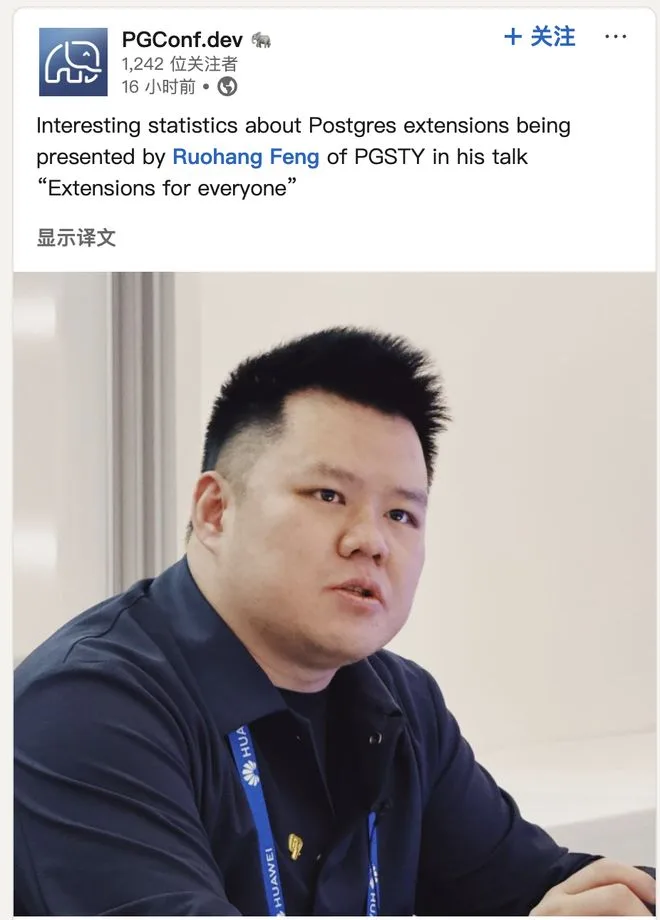
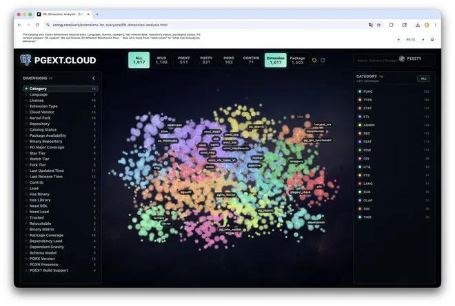
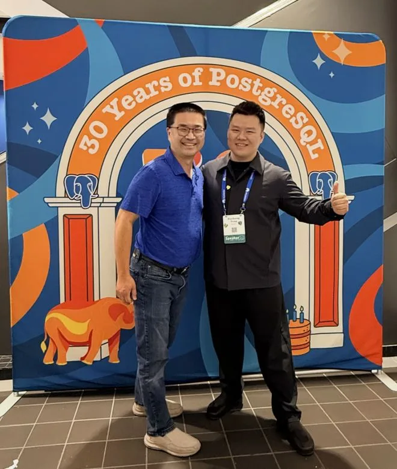
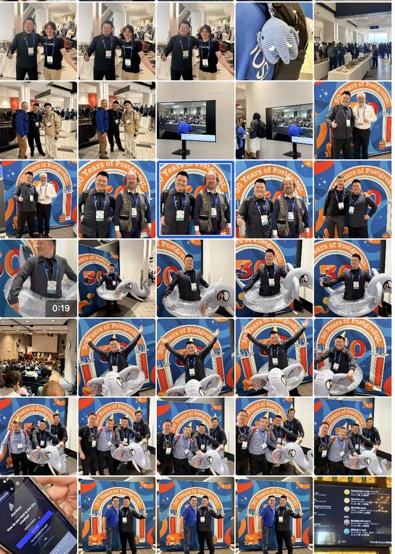
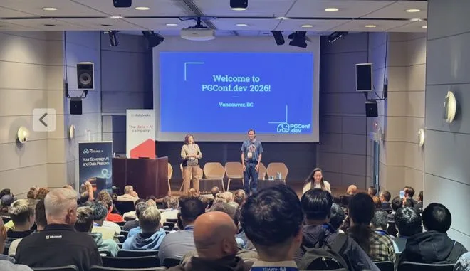
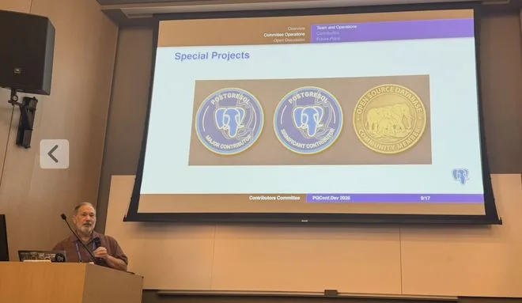
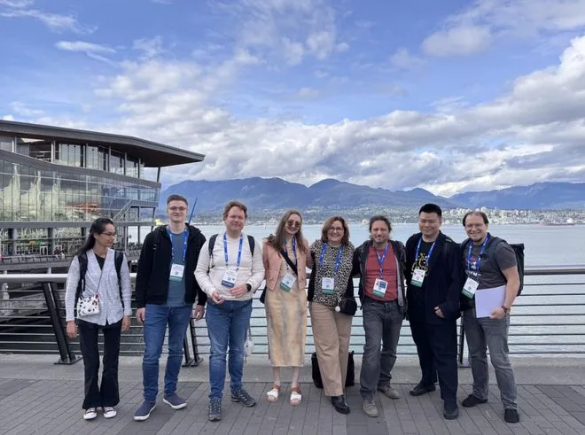
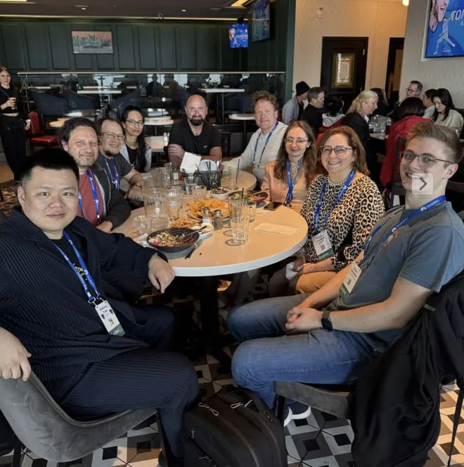
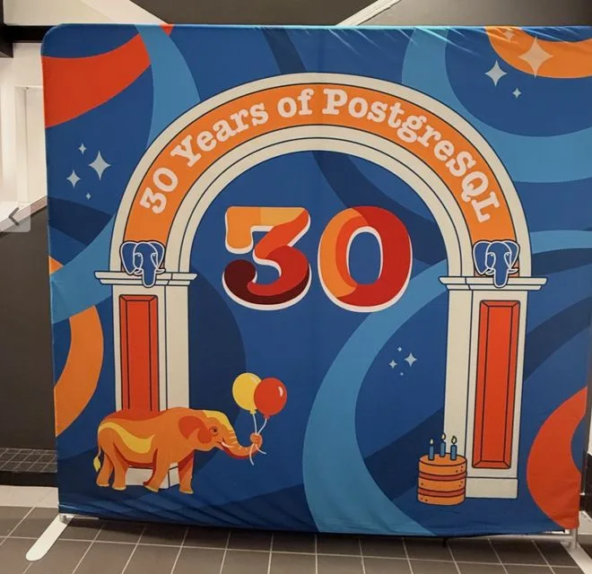

> 微信原页已失效；正文从明确署名的公开镜像恢复：[https://www.163.com/dy/article/KTG7NBBQ0556CSY5.html](https://www.163.com/dy/article/KTG7NBBQ0556CSY5.html)。

今天是 PGConf.Dev 2026 开幕的第一天，老冯在大会上有一场 25 分钟的主题演讲，Extensions for Everyone，介绍了我最近两年在扩展 Packaging 与分发上的工作，以及这些工作如何能够帮助到所有人 —— 用户，DBA，扩展作者，PG 供应商，以及内核黑客。

演讲的演示文稿与录像后面会放出，不过如果你对这个主题感兴趣，我也在个人网站上公开了这个 Slide </work/extensions-for-everyone>

这次老冯没写 PPT，而是让 Codex 根据演讲稿生成 HTML 形式的动态演讲页面，所以效果还挺不错的。

今年的这场会议还比较特殊，因为是 PostgreSQL 30 周年纪念，所以票卖爆了，超出承载能力，来了很多人，非常热闹，这次很特殊的是还请来了 “PostgreSQL” 之父 —— 不是 Stonebraker，是 Stonebraker 的学生 Jolly Chen。

简单说，Stonebraker 拿了图灵奖，但把 POSTGRES 从一个被官方放弃的学术原型变成今天我们认识的 PostgreSQL 的第一推动力，是 Stonebraker 的两个研究生 —— Jolly Chen 和 Andrew Yu 在 1994–1995 年做的两件事：**换上 SQL、放到互联网上**。从这个意义上说，Jolly Chen 是 PostgreSQL 真正的 “接生者”，后面才交棒到 Bruce Momjian、Tom Lane 这一代核心开发团队手中。

很荣幸认识 PostgreSQL 的先驱者 Jolly。当然还有很多老朋友也在现场，大家一起寒暄叙旧，聊了很多。因为我一直在做扩展分发，所以很多扩展作者都认识我，也都非常热情，大家一起也拍了不少合影。我也很高兴看到 Pigsty 的影响力已经开始走出中国，走向全球，开始帮助到越来越多的人。

这次参会的华裔面孔其实相当不少，而且应该是第一次有中国公司在 PG 开发者大会上演讲 —— 除了老冯，还有另外一家来自中国的厂商参加，来自瀚高北美的 Grant Zhou 周老师这次也带来了一个议题，讨论的是《缺失的链接：如何将上万中国用户与 PostgreSQL 核心相连接》。可惜正好和我的演讲在同一个 Slot，所以我没法参加。本来瀚高的厉超老师也要来做一个分享，不过签证没来得及下来没有赶上，甚是可惜。

这次来大会除了社交建联之外，还有很多事情要办。举个例子：前两年国内龙芯的团队就曾经找到过我。问有没有可能让 PGDG 官方仓库支持龙芯的 CPU。当时还是比较困难的，不过现在 Debian 13 发布并提供了对龙芯的支持，所以我又问了问 Christoph 的意见。他说这个事其实可以干，只要他们有人愿意赞助一台网速不错的龙芯服务器作为 Build Farm，就可以新增龙芯的构建支持，我觉得确实是一个大好事。

另一个老冯准备搞的事情呢，是申请一个显著贡献者（Significant Contributor），老冯虽然不给 PG 内核提代码，但也在 PG 生态耕耘了多年。而 Postgres 社区这两年准备将相关开源项目以及扩展生态的贡献，也纳入到 PG 贡献者的范围内。我跟贡献委员会的成员聊了一聊，他们都鼓励我去提交一个。

另外一个还没有正式公开上线，但 PG 社区正在做的是一个 PG 官网上的徽章功能。简单来说，如果满足特定条件，用户可以在自己的 PostgreSQL 网站主页上拥有一个相应的徽章：目前的徽章主要包括：内核贡献者徽章，大会演讲者徽章，主要相关开源项目和扩展插件的贡献者徽章，类似于一个荣誉墙性质的东西，鼓励大家积极参与。至于具体的执行办法和细则，这次会议上还在讨论。我觉得这是一个很好的事情，值得关注。

晚上有大家喜闻乐见的 social 环节，由 PostGIS 的作者 Paul Ramsey 主持。

然后大家分为了十几个小组，去不同的餐厅恰饭。比如说来自智利的贡献者 Álvaro Herrera 就讲了很多移居德国的轶事。而且我还从他口中得知，他说当时我第一次提交 PG 社区新闻，新项目名字叫 Pigsty 的时候，他觉得这会不会是一个什么恶作剧，然后等了很久。最后确认了还真的就叫这个名字，才给通过了。

还有一场群体 Social 活动，依然和前年一样，是在温哥华太平洋火车站的 Rogue Kitchen 进行。食物和酒水饮料非常不好。但不幸的是，老冯这两天因为时差，赶 PPT 睡眠不好，再加上拉肚子，实在是没有食欲了，而且一到下午就开始昏昏欲睡，全靠咖啡吊着。据说夜场还有 PG 卡拉 OK 活动，但这个就实在是撑不住了，还是算了。

今天最开心的事儿，莫过于把这个演讲给讲完了，让我如释重负，后面的会就可以轻松无压力地参加了。有这个想法的不止我一个人，还有 psycopg 的作者 Daniele，跟我说演讲完一身轻松。我估计周老师也是一个想法。

好吧，大体上就是这些。具体技术层面的介绍与分析，老冯后面会专门写文章来介绍，今天就是随便聊聊参会的体验。顺便发点照片。

## 本文 AI 含量 0%

数据库老司机

---

发布版本：[微信公众号](https://mp.weixin.qq.com/s/CFCumCJtuxM8sV-rGirD_A)
