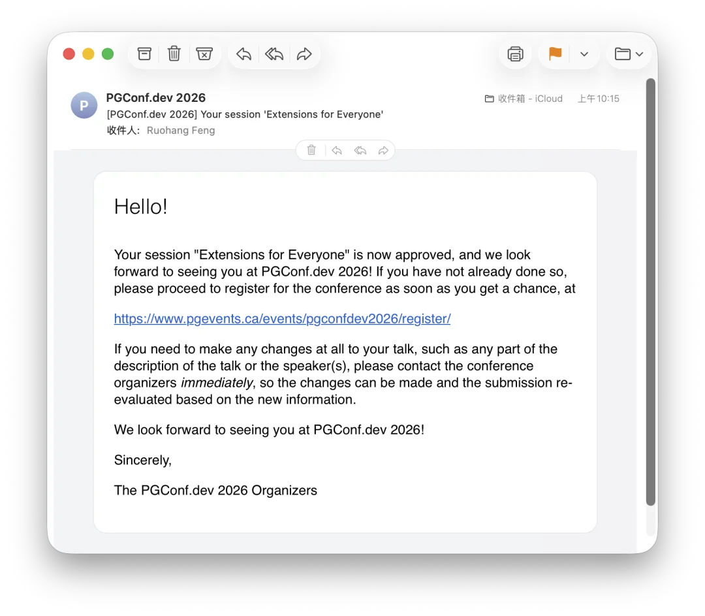

上午收到邮件，我提交的主题演讲 **"Extensions for Everyone"** 被 PGConf.dev 2026 正式接收了。

对老冯而言，这意义重大——这不仅是我在 PostgreSQL 生态的工作被核心社区认可，更重要的是：**这应该是第一次有来自中国本土的 “厂商” 在 PostgreSQL 最核心的开发者大会上做主题演讲。**

—— 或者更准确地说：**数据库个体户**😊

---

## 为什么这很重要？

PGConf.dev 是 PostgreSQL 开发者大会，前身是连续举办了 17 年的 PGCon，2024 年重置更名。这不是普通的用户大会——它是 PostgreSQL 核心开发者每年一度的聚会，讨论的是 PostgreSQL 的未来方向。能在这里做主题演讲，意味着你的工作被核心社区认可。

说实话，这个结果来之不易。

2024 年第一届，投稿被拒。2025 年第二届，主会场还是被拒，但抽中了一个 5 分钟的闪电演讲名额，另外在前一天的社区活动 PGEXT.DAY 上做了一个分享。2026 年第三次投稿，终于进了主会场。

老冯没戴着大厂光环与 Committer 头衔，甚至不是任何公司的正式员工。我只是一个独立开发者，做着自己认为有价值的事情。但也许正是这种 ”野生“ 状态，让我能专注于解决社区真正面临的实际问题。

Pigsty 从零做到 4.6K GitHub Stars，[PGEXT.CLOUD](/pg/pgext-cloud/) 从一个想法变成每月百万下载的社区基础设施。这些不是 PPT，是能用的代码和服务。Committee 选择接受这个演讲，说明他们认可这种"用代码说话"的方式。

## 中国开发者的身影

中国的 PostgreSQL 生态很奇怪：我们有最多的 “国产数据库” （很多都是 PG 的子孙后代），有最大的 DBA 群体之一，有活跃的中文社区。但在国际舞台上，我们几乎是隐形的。

2024 年我去温哥华参加第一届 PGConf.dev，全场只有大约 5 个中国人，没有任何演讲者。在 Robert Haas 主持的 "Making PostgreSQL Hacking More Inclusive" 讨论中，提到希望看到更多来自印度和日本的开发者进入核心圈层——**[中国甚至没被提及](/pg/pgcondev-2024/)**。

2025 年第二届的情况好了一些，来自 [OpenAI 的 Bohan Zhang](/db/openai-pg/) 与 CMU 的 William Zhang，以及来自富士通的 Zhijie Hou 都有主题演讲，来自 EDB 的 Richard Guo 参与了 Commiter 闭门会议。出现了中国人的身影，但依然没有来自中国的公司与供应商。2025 年在主会场外，老冯和瀚高的 Grant Zhou 中了两个[闪电演讲](/pg/pgcondev-lightning/)，我自己还在 2025 年社区活动 —— [PGEXT.DAY 上有一个演讲](/pg/pgext-day/)。总归在这一届，实现了一些从零到一的突破。

这一届，老冯投中了一个主题演讲。2026 年的完整议程还没有出炉，所以我也不知道是不是有别的中国厂商中选。不过老冯能保证的是，至少这一届出现了一个 Breakthrough。我不知道这次演讲能改变什么。但至少，当有人再问 “[中国对 PostgreSQL 社区有什么贡献](/pg/china-pg-contribution/)” 时，我们可以多一个答案。

---

## 我的演讲主题是什么？

老冯这次演讲主题是 “**Extensions for Everyone**”

 —— 让每个人都能享受扩展的乐趣。

这不是空洞的愿景，而是我过去两年实际在做的事情：**[PGEXT.CLOUD](/pg/pgext-cloud/)** 项目。

一些数字：

- **444 个扩展**：打包成原生 RPM/DEB 包
- **14 个 Linux 发行版**：从 EL8 到 Ubuntu 24.04，从 Debian 12 到 Anolis
- **6 个 PostgreSQL 大版本**：13-18 全覆盖
- **~100 万次/月下载**：已有多家 PostgreSQL 厂商在使用
- **~50 个修复**：在打包过程中发现并修复了大量扩展的构建问题

PGDG（PostgreSQL 官方仓库）只提供约 150 个扩展包，但野生扩展超过 1000 个。这个 gap 限制了 PostgreSQL 的潜力，PGEXT.CLOUD 试图填补这个空白。

这个基础设施，对 PG 生态的所有人都能有帮助。对于用户来说，开箱即用免去了自己编译安装打包的烦恼，对于扩展作者来说，让自己的作品多了一个触达更多用户的渠道，也省掉了维护基础设施的劳累；对于数据库厂商来说，更是可以轻松整合 PG 生态的各种超能力到自己的 PG 产品中，不需要什么成本。

更重要的是，这套基础设施对核心开发者也有价值。随着扩展越来越重要，内核 Patch 要考虑的不仅是内核兼容性，还有扩展兼容性。想测试一个补丁对 400+ 扩展的影响？以前很难，现在一键搞定。实际上，扩展兼容性正是 PostgreSQL 进程改线程议程中的核心 Blocker。我很高兴自己的工作能在这方面帮上忙。

这就是 Extension for Everyone 的含义，一个扩展分发基础设施，让所有人都能从所有人的工作中受益。

## 下一步

PGConf.dev 2026 将于 **2026 年 5 月 19 日**在加拿大温哥华西蒙弗雷泽大学举行。届时我会分享：

- 扩展生态的真实数据：什么流行，什么过气，什么增长。
- 跨平台打包的实战经验，以及 AI 在这里的帮助
- Agent Native 的 PG 命令行工具 —— pig

如果你也对 PostgreSQL 扩展感兴趣，欢迎关注后续更新。

### References

- `[1]` : <https://pgext.cloud>
- `[2]` : <https://pigsty.cc/pig>
- `[3]` : <https://pigsty.cc>
- `[4]` : <https://github.com/pgsty/pigsty>

---

发布版本：[微信公众号](https://mp.weixin.qq.com/s/rThnqXp2JXVV9UQncNV3kg)
