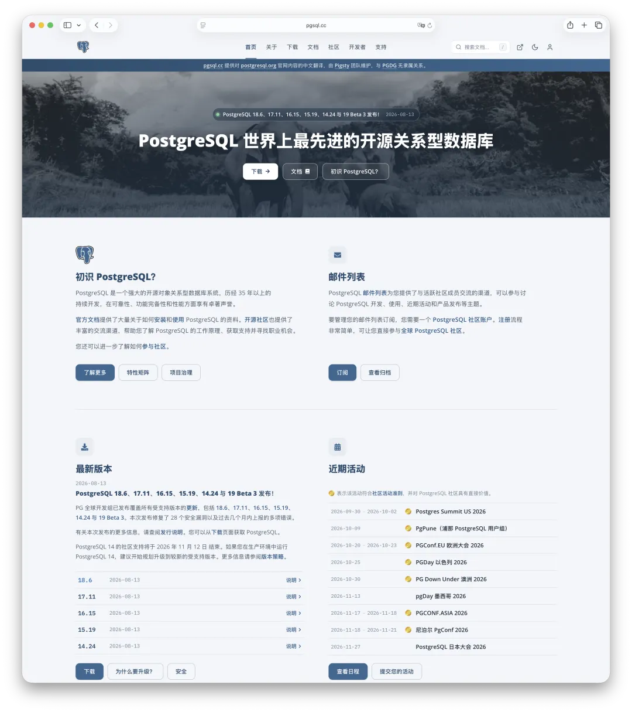
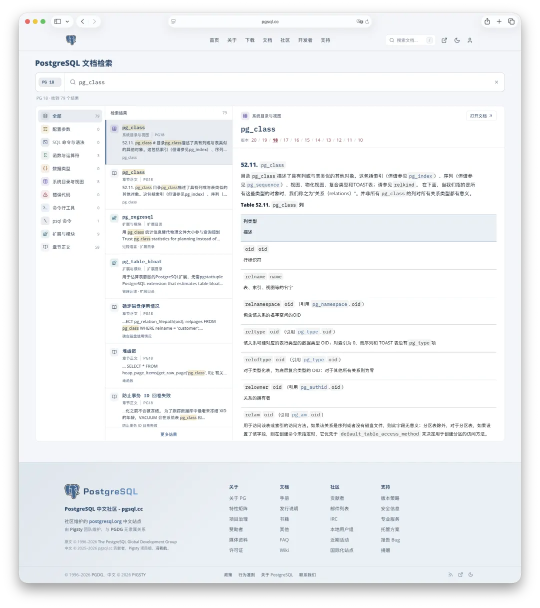
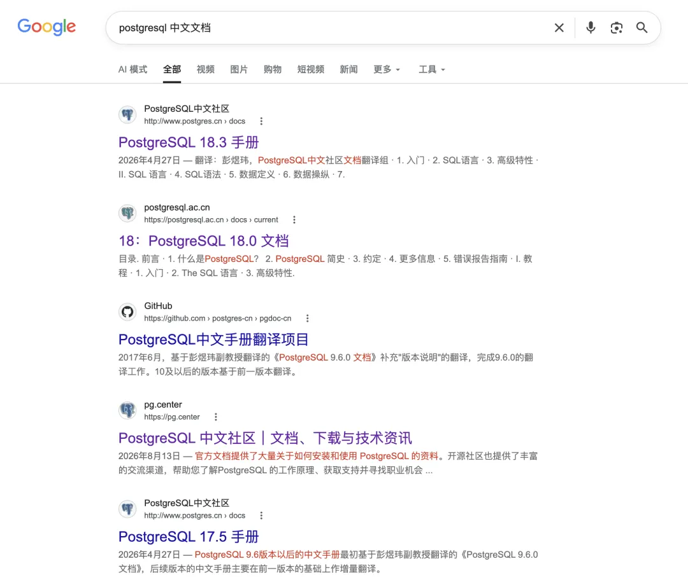
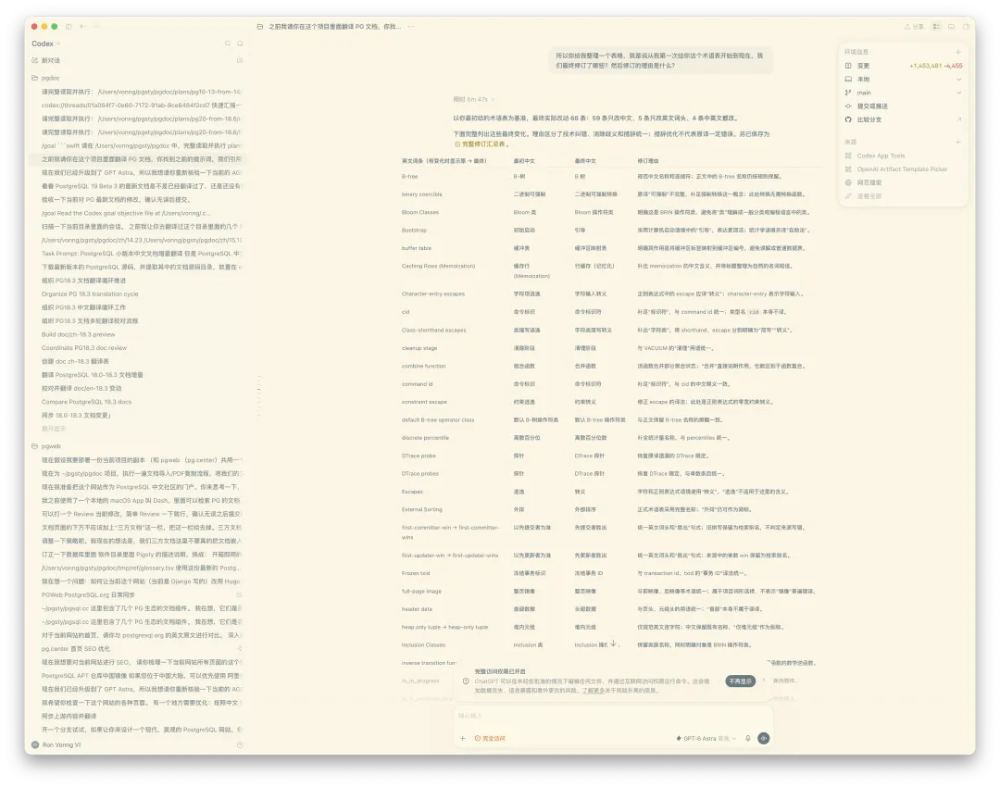
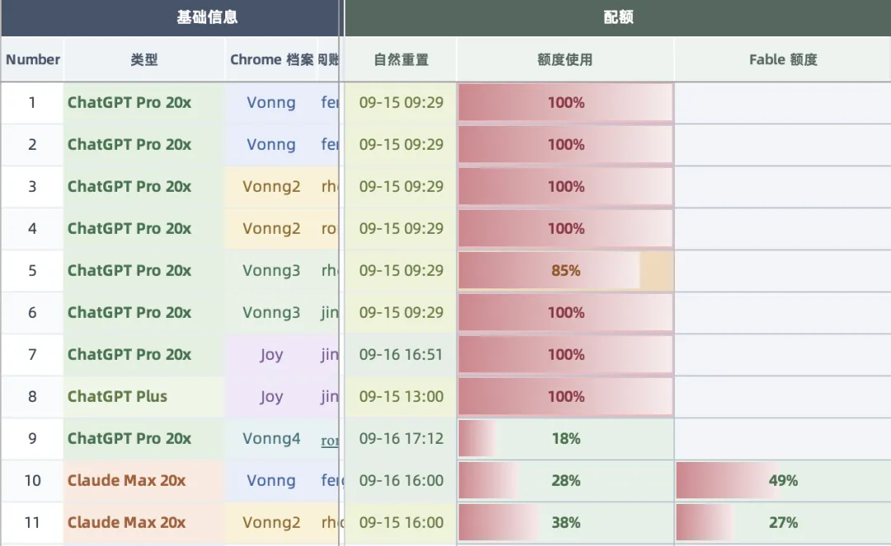
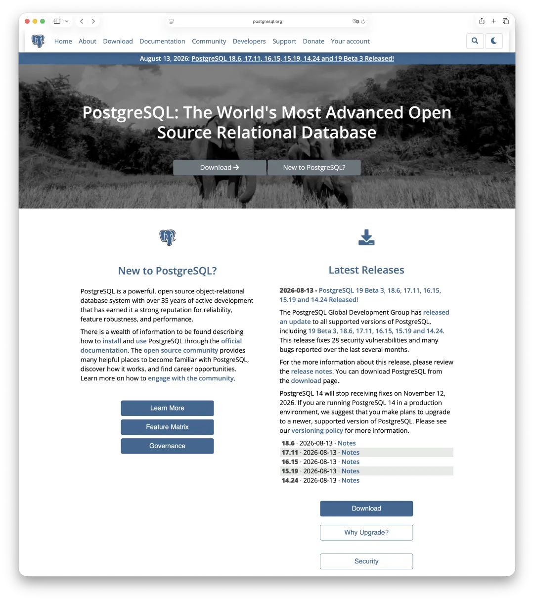
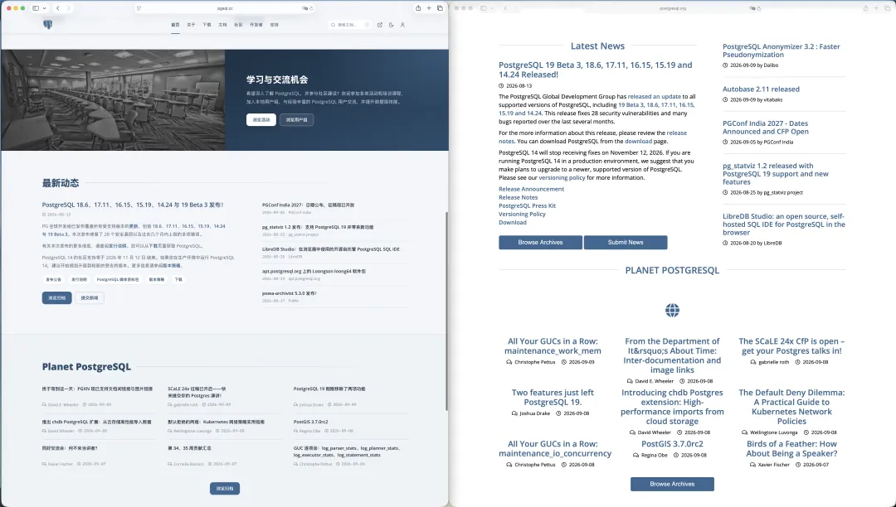
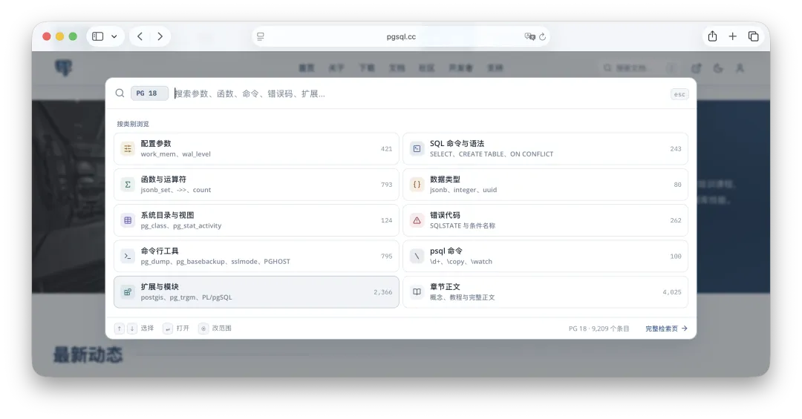
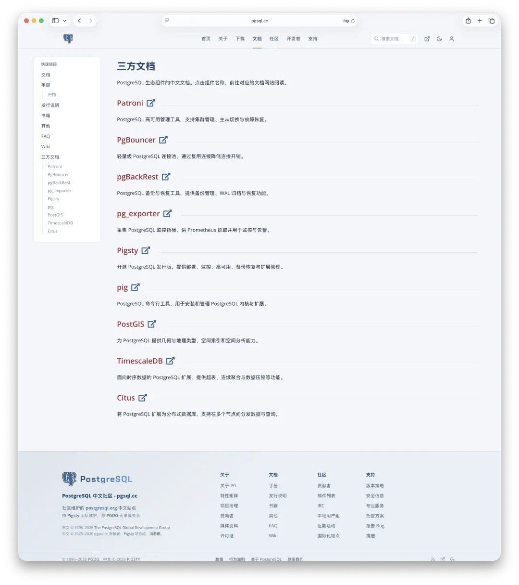
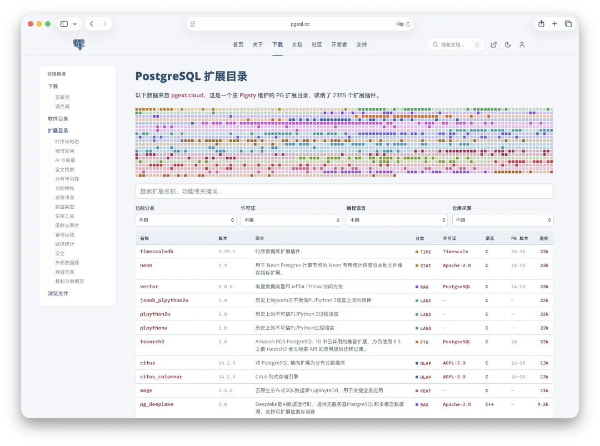

**[pgsql.cc](https://pgsql.cc/)** launches today, with Chinese documentation for 11 PostgreSQL major versions, a redesigned mirror of the official website, and better full-text search. It finally fills the documentation gap in the Chinese PostgreSQL ecosystem.

It goes beyond the manuals. The whole postgresql.org website—Home, About, News, Events, Download, Community, Developers, and Support—is now available in Chinese. While I was at it, I redid the site's styling and replaced its much-criticized search interface.

---

## First, the Documentation

The online Chinese manuals cover 11 major versions: PG 10 through PG 19 Beta, plus a PG 20 devel snapshot.

I hadn't planned to take on this much. When I [**launched pg.center in March**](../../../pg/pg-center/), I started with the PG 18 manual. Then I [**added versions 14 through 17, covering all five supported releases**](../../../pg/pgdoc-cn/). (Both earlier announcements are in Chinese.) I thought that would do. But just as I finished, 19 reached Beta 3 and the devel branch moved on to 20. Suddenly there were two more major versions to cover. At that point, I figured I might as well go all the way and translate the end-of-life releases back to 10, too.

Why translate versions that no longer receive maintenance? Because people still use them. Plenty of systems in China still run PG 11 or PG 12, and upgrades scheduled for next year are hardly unusual. If the documentation covers only supported versions, those users are still left struggling through English.

---

## Why the Gap Persisted

It wasn't for lack of effort. The Chinese PostgreSQL community organized a long-running translation relay, starting with laser's translation of 8.2.3, then passing through 9.3, 9.4, 9.5, 9.6, and eventually reaching 15. That was serious work. A major version's manual runs to more than a thousand pages. With volunteers translating carefully and checking each other's work in their spare time, taking a year or two per release was normal. Everyone who contributed deserves respect.

But the relay stalled at 15. The branches for 16 and 17 are still sitting in the repository marked “under review,” without an official release. Meanwhile, upstream 18 has been out for almost a year, and 19 is already at Beta 3. I don't blame anyone. Manual translation simply couldn't keep pace with a new major release every year. Volunteers work for the love of it, and even that has its limits.

A Chinese translation of 18.3 appeared later, but it looked machine-translated to me, and nobody seemed to maintain it afterward. It has sat at 18.3 for nearly half a year now. On August 13, upstream released five minor versions—18.6, 17.11, 16.15, 15.19, and 14.24—fixing 28 security vulnerabilities along the way. PostgreSQL 19 Beta 3 came out too. That translation hasn't moved.

Some sites make matters worse with large pop-up ads. You're trying to look up how to configure `pg_hba.conf`, and up pops “Try Database X Free for a Limited Time.” It's painful.

---

## How I Translated It This Time

Translation and review burn through tokens. This round consumed the full allowances of four 20x Pro subscriptions.

But tokens alone aren't enough. Translation needs a process, and the most important part is the **glossary**: an authoritative PostgreSQL terminology reference used consistently throughout the manuals, with explicit exceptions for different contexts. Which terms always get the same translation? Which need a different rendering in a particular chapter? There is no shortcut here. Each entry needs careful review.

There is also a generational difference between models. The previous edition used something roughly on the level of Codex 5.3, and the results were decent. This time I switched to Astra and found very little to fault. I'd put its translations well above those of the average expert; terminology accuracy was the one area that still needed human attention. So I used Codex, Fable 5.1, and Astra 6 to cross-check the terminology, followed by my own review. That gave me a complete PostgreSQL glossary and a list of approved exceptions. I then used those to revise the entire set of manuals for PG 14 through 18.

The real headache is consistency across versions. Most of the content is shared across all 11 major versions, so in theory you only need to translate what changed. But there's a catch: if the exact same English sentence appears in 11 versions, its Chinese translation must also be identical. You can't translate it ten times and get ten different phrasings. If you read one formulation in the PG 14 manual, then switch to PG 18 and find it worded differently, the documentation has failed you. The workflow therefore has to keep every translation aligned across all major versions.

Two days of burning tokens later, it was done. I went through it myself and was reasonably happy with the result. Of course, at this scale there will be awkward translations and outright mistakes. If you find any, tell me—by email or a GitHub issue. Fixes are quick.

That is the biggest difference from a machine-translation site that publishes once and walks away. This documentation will keep moving with upstream. When 18.7 comes out, I'll update it. When 19 gets its final release, I'll update its docs too. We'll track every minor release as soon as it arrives.

---

## While I Was at It, I Fixed Up the Website

The PostgreSQL website got a facelift a few years ago, but it still looks like a relic from over a decade ago. PostgreSQL is, of course, a 30-year-old project; there's no reason to pretend otherwise. Still, with Astra and Fable everywhere and just about anyone able to build a good frontend, it's getting hard to excuse a website that looks like this, isn't it?

So I gave it a refresh. I also reworked the Chinese typography: the original fonts, line spacing, and code blocks were designed for English and aren't comfortable to read in Chinese. I can propose the changes upstream. Whether the community accepts them is another question.

The other perennial complaint is full-text search. Amusingly, the PostgreSQL website uses PostgreSQL's own full-text search. The functionality works; the presentation is awful. I improved that too. You can now search PostgreSQL documentation and extensions directly from the search bar, and press `/` anywhere on the site to open it. That solves a major annoyance in my own daily use.

A few other things came along with the work:

**Matching URLs.** Replace `www.postgresql.org` with `pgsql.cc` in the address bar to get the corresponding Chinese page. If a search engine sends you to an English manual page, change the domain and read it in Chinese.

**One click back to the original.** A button at the top right of every page takes you to its English counterpart on postgresql.org. If a translation seems questionable, the original is always there to check.

**Chinese documentation for ecosystem components.** Chinese docs for commonly used projects such as Patroni, PgBouncer, pgBackRest, PostGIS, TimescaleDB, and Citus are also ready, with links on the documentation page. No need to hunt them down.

**A PostgreSQL extension catalog.** I've also brought in the extension catalog, in Chinese as well.

The site largely follows the official website's structure and content. If you know your way around postgresql.org, there's almost nothing to learn. You get Chinese content, better styling, better search, and complete manuals for 11 major versions.

---

## About the Domain

The March launch used pg.center. The move to pgsql.cc has a practical reason: `.center` isn't eligible for ICP filing in China, the registration required to host a website in mainland China. It simply isn't on the Ministry of Industry and Information Technology's list of approved domain suffixes. A memorable domain is of little use if it can't go through the required process.

`pgsql.cc` is a domain I registered years ago. It is eligible for ICP filing, and the name is straightforward: PGSQL + CC, for China / Chinese Community. The old domain will stay online. Going forward, **pg.center** will develop into a global, multilingual PostgreSQL knowledge graph and information site. **pgsql.cc** will focus on Chinese documentation, the official website mirror, and community information.

---

## A Few Ground Rules

**No affiliation with PGDG.** The site states plainly that it is maintained by the Pigsty team. Copyright in the original material belongs to the PostgreSQL Global Development Group, and the Chinese translation uses the same open license. This is their work; I'm bringing it to Chinese readers. I want the attribution to be unambiguous. I won't pretend this is a PGDG community website, which is why I've put that distinction in a prominent banner.

**No ads.** At most, there will be a text link in a corner saying “Maintained by the Pigsty team.” That's it.

**Contributions welcome.** Suggest a better term, point out a mistranslation, or flag a missing page. All are welcome.

---

## Finally

Documentation is the foundation of a technical ecosystem. When that foundation is weak, everything built on it is unstable.

For years, the best references available to Chinese PostgreSQL users were translations several years out of date, secondhand blog posts found through search, or whatever a language model could improvise. AI amplifies the problem: those same uneven blog posts supply the models' Chinese training data. It's a feedback loop, and a vicious one.

Now, at least, we have a clean, complete set of Chinese PostgreSQL documentation with someone—and some AI—to keep it maintained. That makes me feel these tokens were well spent.

**Bookmark [pgsql.cc](https://pgsql.cc/)** and share it with friends who use PostgreSQL.

> **[pgsql.cc](https://pgsql.cc/)** — The official PostgreSQL documentation, translated into Chinese. Versions 10 through 20, all 11 major versions. Ready to read, continuously updated, no ads.
