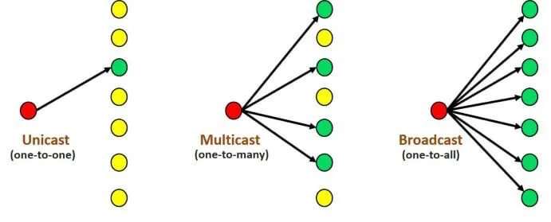
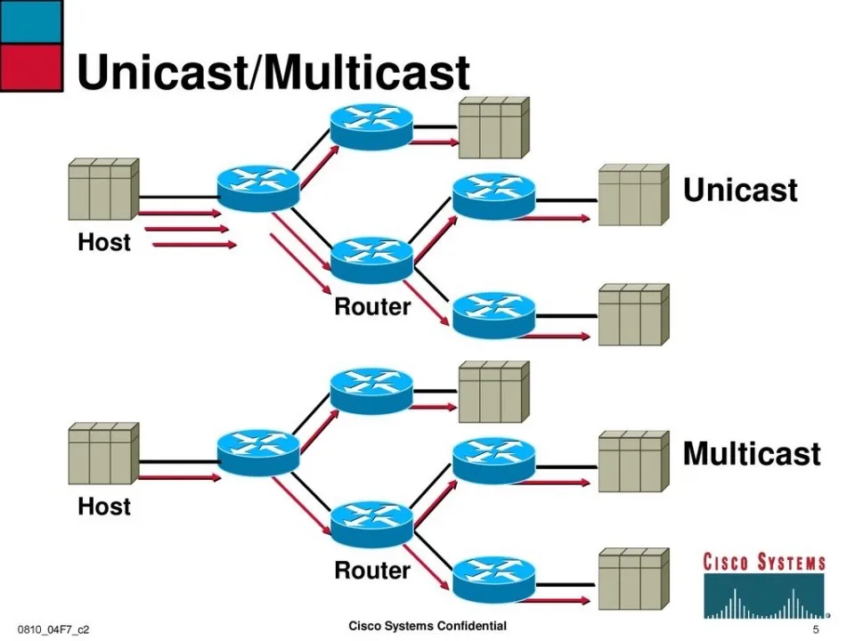
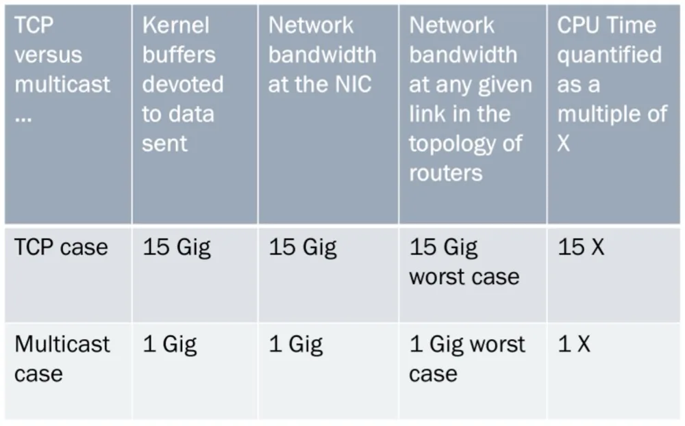

> 原作者：熊灿灿

## 前言

今天看到冯董发了一篇 [OpenAI：将 PostgreSQL 伸缩至新阶段](/db/openai-pg/)，其中提到了 OpenAI 大量使用了 PostgreSQL，并且是一个 40+ 从库的巨无霸架构！

> 在聊天提问的时候，老冯了解到 OpenAI 使用的是 Azure 上的托管 PostgreSQL，使用最高可用规格的服务器硬件，从库数量达到 40+，包括一些异地副本，这套巨无霸集群总的读写 QPS 为 100 万左右。

看到这段话的时候，颇有感触，一下子又让我回想起了前阵子在群里分享的组播了，来自于 **IITM Pravartak** 的 Balaji Venkat 分享了一篇 Experimental approach towards Replication performance optimization in Postgres 的议题，介绍了传统 PostgreSQL TCP 流复制的缺陷，以及为何需要在 PostgreSQL 中引入组播？组播又能带来怎样的优势？这么好为何社区没有去实现这个组播？让我们随着作者的思路一探究竟。

## 何为组播

像我们平时熟悉一点的，TCP 的点对点传输，UDP 则⽀持⼀对多，多对多等⽅式，也就是说，UDP 提供了单播，组播，⼴播的功能。见下图：

- 单播：在同一网络内，两个设备点对点的通信就是单播通信。
- 组播：在同一网络可达范围内，一个网络设备与关心其数据的部分设备进行通信就是组播。
- 广播：在同一网络可达范围内，一个网络设备向本网络内所有设备进行通信就是广播。

回到 PostgreSQL 本身，对于流复制，我们知道是可以一个主库拖多个从库的，每个从库又可以级联拖其他的从库，理论上可以拖无穷多个，当然还取决于具体参数，比如 max_wal_senders，以及代码里的一些限制等。前面也说了，这是理论上，实际上我们是不可能拖太多的从库的，每一个复制连接都是一个 TCP 连接，通信数量的增多，带来的是网络带宽资源消耗更大，整体网络环境的复杂度更高等等，其次如果都是直接连到主库进行复制，本身也可能将主库给"拖垮"，因此从 9.2 开始便支持了级联复制，减少主库的资源开销。比如 AWS 和 Azure 的官网上都有明确限制

> AWS：You can replicate from the primary server to up to five replicas.
>
> Azure：You can create up to 15 read replicas from one source DB instance within the same Region.

也正是前面提到种种问题，才会有了 PostgreSQL 组播复制的需求 —— Incorporate multicast to optimize Replication in PostgreSQL，

以此图为例，上半图：**主机端**：针对每一个接收者都要开启一条单播流

- 黑色箭头：第一跳发向路由器 A
- 红色箭头：分别再发向 B、C，两条流是**独立**的**路由器之间**：A→B、A→C、C→D、C→E 都是单播复制**特点**：

- 源头要发 N 条流，网络里每一次分支都是复制
- 上游链路、路由器 CPU/转发都要处理 N 份数据

下半图：**主机端**：只发一条组播流到路由器 A**路由器 A/C**：根据下游有没有组播成员，才在分叉点做复制**D、E**：只要在同一个组播组里，就能各自收到这条流**特点**：

- 源头只发 1 份，网络中只在必要的分叉点复制
- 极大节约了上游带宽和路由器处理开销

基于此，在 PostgreSQL 主备复制场景中，**IITM Pravartak** 正在致力于引入网络层的双向组播 (PIM-Bidirectional Multicast)，这样的话，便不用为每个备库都走一条独立的 TCP 单播流，而是在 IP 层通过组播协议，只在必要的分叉点复制数据，这样的好处不言而喻：

1.将主库的变更一次性推送到所有备库，极大降低了 TCP 连接和转发的开销 2.减少了网络带宽的消耗 3.降低了端到端的复制延迟

通过 PIM-Bidirectional 在网络层多点分发，从而实现更高效、更低延迟的多副本同步。假设现在将 1GB 的数据分发至 15 个备库，现在让我们把单播和组播在各项资源消耗上的差别量化出来：

- **TCP 单播**：主库要为每个备库都开一条独立的 TCP 流，总计发送 15 GiB，CPU 也要处理 15 倍数据，延迟和带宽消耗都被放大。
- **IP 组播**：主库只发 1 GiB 的组播包，网络只在路由分叉点复制一次，整个过程无论下游有多少接收者，都只走这 1 GiB，CPU、带宽、缓冲都只消耗 1 倍。

这个数字化对比直观地说明了组播在多点复制场景下，能把原本的「15×资源开销」压缩回「1×」，大幅降低带宽占用、CPU 负载和复制延迟。

当然这是理想化的情况，要达到此目的，需要做很多事情，主库需要增加一个组播发送模块，备库也需要增加相应的接收支持，其次还要实现可靠的错误恢复机制，再者，PIM-BIDIR 这种双向组播需要在路由器/交换机层面开启并配置组播路由协议，另外就是各种各样的异常处理，比如

1.在丢包或乱序时，让备库能够发“重传请求”，因为组播本身是 UDP-like，不保证可靠交付，**一致性和丢包恢复**比 TCP 单播更难做 2.在链路拥塞或组播树拓扑变更时，能快速重建流复制状态 3.保证在主备切换、故障恢复时，组播状态能正确清除并重置 4.如果两个备库因为网络分区或多次丢包而最终状态不一致，需要外部机制来**拉取缺失的 WAL**、**做全量对齐**5....

因此我联想到了 Greenplum 实现的 udpifc，在 UDP 的基础之上加入了 ACK、重传等机制来实现了一种可靠有序的数据传输，真是一项庞大的优秀工程。那这么优秀的工程，为何 PostgreSQL 没有去实现呢？首先，PostgreSQL 是保守的学院派，引入一个全新的复制架构没有五六个大版本是下不来的，并且如此庞大的改造工程，伤筋动骨，我相信社区是不太愿意去改的，并且这本身就是个双刃剑，那么多需要的考虑的点，其次考虑到 PostgreSQL 的发展历史悠久，早期的体量和架构和现今也不可同日而语，另外，德哥也在群里发表了其观点，我觉得十分有道理，传统数据库存储成本随节点数线性增加，加节点按小时计 (数据量大的话)

> 是个技术创新，可能并不是好的产品创新。产品角度多播不如共享存储一劳永逸，如果网络能成为复制瓶颈的话说明有很多只读节点，存储副本代价更高，而且网络瓶颈还可以通过级联解决。

## 小结

前阵子 Databricks 官宣收购开源数据库引擎初创公司 Neon[1] 的消息沸沸扬扬，Neon 专注于给 AI Agent 背后“自动创建、管理数据库”的能力：秒级启动实例、弹性伸缩、即时分支／回滚，这和 Databricks 助力企业构建“自主智能体” 的战略需求不谋而合，而且 Snowflake、AWS 都在强化自己的数据库+分析组合，Databricks 必须补齐“事务库”这块短板，才能维持在下一代 AI 数据平台的竞争力，那回到这个 IP 组播，我们前面讨论的 PIM-BIDIR 组播，确实能把 N×TCP 复制流压缩成 1× 网络流，用更少带宽和 CPU，就把 WAL 同步到海量备库里；它在专有网或自建机房里，对带宽/延迟敏感的大规模分发场景非常有意义，但是公有云环境中，IP 组播能开放吗？我觉得不太可能，网络虚拟化层也不一定把组播包自动复制到所有实例，而 Serverless Postgres（比如 Neon）选择**存储总线“逻辑组播”**，也就是写一次 WAL 到共享对象存储，所有 compute 节点按需拉取——效果上跟网络组播一样，只发一次、读多次，这种方式，就比直接在云上铺 PIM-BIDIR 要更容易落地，也能达到同样的“带宽／CPU ×1”效果，更加适合云环境。最后，还是预祝这个大工程能够顺利落地，使得 PostgreSQL 的复制能力在复杂的网络环境和架构中能够更上一层楼。

以上内容为笔者一家之辞，各位看官老爷权当一乐。

## 参考

[谈谈 Databricks 10 亿美金收购 Neon](https://mp.weixin.qq.com/s?__biz=MjM5NzM0MjcyMQ==&mid=2650227784&idx=1&sn=963ba38f8106f9bea5f8f159a5b0e968&scene=21#wechat_redirect)

<https://www.pgconf.in/conferences/pgconfin2025/program/proposals/972>

### References

- `[1]` Databricks 官宣收购开源数据库引擎初创公司 Neon： <https://www.oschina.net/news/350031/databricks-acquires-neon>

---

发布版本：[微信公众号转载页](https://mp.weixin.qq.com/s/wNpqGlHIzTaKqhH-Ag5Fbg)
