这篇《[MySQL：这个星球最成功的数据库](/pg/mysql-most-successful-db/)》是对我《[PostgreSQL：世界上最成功的数据库](/pg/pg-is-no1/)》一文的回应。可惜文中充斥着大量事实性错误，谎言与诡辩，扣大帽子和人身攻讦。既然有人不要体面，那今天我就用数据与事实来帮他体面。[扫码预约今晚的直播](http://mp.weixin.qq.com/s?__biz=MzU5ODAyNTM5Ng==&mid=2247485873&idx=1&sn=731322e649c212eefc3e382efb31ae99&chksm=fe4b3c6ac93cb57c712471ed8cd54c3603937d0793bfd2518221749861a40140b64edb17550d&scene=21#wechat_redirect)，观看几分钟后开始的 MySQL 与 PostgreSQL 对决开源中国直播。

## 问卷能否代表全球？

2023 年 StackOverflow 调研结果已经新鲜出炉，来自 185 个国家与地区的 9 万名开发者给出了高质量的反馈。在今年的调研中，PostgreSQL 在数据库全部三项调研指标（流行度，喜爱度，需求度）上获得无可争议的全能冠军，成为真正意义上“最成功”的数据库 —— "***PostgreSQL is the Linux of Database!***"

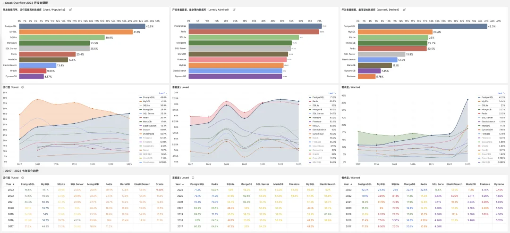

开门见山，一顶大帽子先上来。作者认为这个调查问卷没有涉及中国市场，所以不足以称 “全球”。

诚然，中国用户由于众所周知的原因在国际社区参与度偏低。例如，StackOverflow 2023 调研的用户画像中，中国开发者仅占总数的 0.75%，排名第 28，显然与一个“开发者大国”的身份不相符。

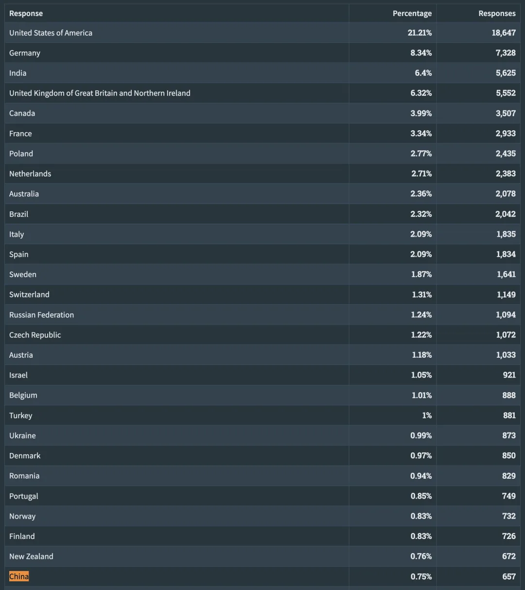

不过，全球 PostgreSQL 升，MySQL 降的结论并不会因为中国参与度偏低而有任何改变；只要这个趋势是确定的，两者的流行度就必然会遇到一个交叉点。

根据 StackOverflow 的现有数据，这个流行度的交叉已经在全球范围发生了。但是我们可以深入探索一下这个问题：如果中国开发者按照应有的比例参与了这一次全球问卷调查，结果又会有什么不一样呢？

要用中国开发者校正全球调研数据，我们要确定两件事：未参与调研的中国开发者应当占多大的权重比例，以及这些未参与调研的中国开发者中，MySQL 与 PostgreSQL 的使用率各自是多少。

所以，即使将中国开发者纳入考量，也不会影响原文中的结论有效性。

## 中国加权校正后的估算流行度

根据 Github 用户统计，中国开发者约全球开发者总数 10% (1 千万 of 1 亿)，根据 新华网 报道，2022 年中国数据库市场占全球 7.2%。考虑到 StackOverflow 2023 调研已包括 0.75% 的中国开发者，综合以上三方面考虑，可先将**未纳入统计**的中国开发者比例定为 **8%**。

因为没有其他权威数据可供参考，我们合理假设中国市场开发者中，使用 MySQL or PG 任一数据库的开发者比例与全球相同 ( (41.1 + 45.6) / 2 = 43.35)，而两者的比例分布与 百度热搜 给出的半年指数（pgsql:mysql = 1260:5283）成正比，则根据假设可估算得：

中国 PostgreSQL 使用率约为：2 \* 43.35 \* 1260 / (1260 + 5283) = **16.7%**，中国 MySQL 使用率约为：2 \* 43.35 \* 5283 / (1260 + 5283) = **70%**

按照加权算法，今年中国修正后的全球数据库流行度，仍然是 PostgreSQL 高于 MySQL：

PostgreSQL: 16.7 \* 0.074 + 45.6 \* 0.926 = **43.46%**

MySQL: 70 \* 0.074 + 41.1 \* 0.926 = **43.24%**

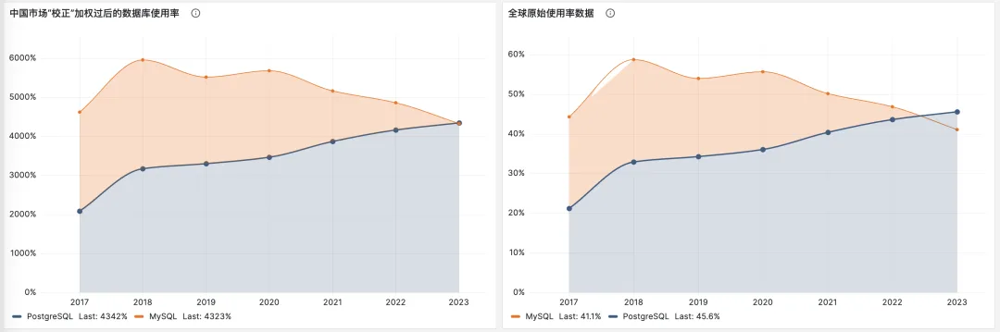

可以看出，即使经过“未参与的中国开发者”的估算校正，全球开发者中 PostgreSQL 与 MySQL 的流行度关系依然没有发生质变。即使我们退一万步说，所有参数都使用最利于 MySQL 的估算来看，也最多能延迟这个转折点几个月的时间。

## 菜鸟都在哪儿呢？

作者又提出，StackOverflow 答问卷的大概率都是菜鸟。我相信他一定没有完整阅读 StackOverflow 2023 开发者调研的完整报告，否则不会出现这种基础的**事实性错误**。

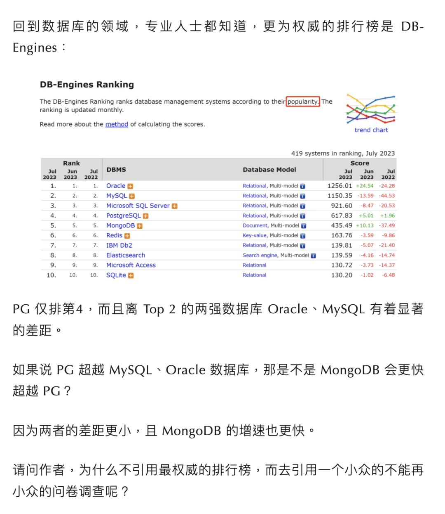

StackOverflow 在 Developer Profile 中完整给出了参与调查人口的画像。其中概率最大的用户群体是具有 5-9 年（专业）编程经验的开发者，国内大致属于 P7 层次，怎么也称不上是刚入门的初级码农与学生。事实上本次调研中无论是学生，还是初学码农的比例都是清楚给出的：学生的比例只有 **2.6%**，而初学者的比例为 **5.6%**，无论如何也称不上是 “大概率”。

Stacok Overflow 还给出了一项有趣的维度分析：专家与初学者。其中菜鸟占总体比例 5.6%。但是我们可以清楚看出 PostgreSQL 更受专家欢迎（**49.1** vs **40.6**），而 MySQL 才是新手密集地（**58.4%** vs **25.5%**）。

在 “Worked with 与 want to work” 一项中，我们还可以看出对于菜鸟来说，唯一的显著的数据库间流动正是：从 MySQL 到 PostgreSQL 的。

## 搜索引擎指数更权威？

在文章的第一部分，作者又对 StackOverflow 问卷调研的可信度提出质疑，理由是有一个 “更为权威” 的数据库排行榜：DB-Engine。

在统计分析中有许多种数据收集方法，不同的方法有不同的**可信度**与**说服力**。对于流行度，来说还有一丝可能性能够通过样本、案例、大数据分析搜集数据的微弱可能性；对于开发者的喜爱与需求，恐怕也就只有**问卷调研**这一条路子了。

StackOverflow 年度问卷调研已经连续进行了 7 年，覆盖 185 个国家与地区，2023 年参与者达到 9 万，是一个非常惊人的样本数量。（作为对比，Github 的 Octoverse 年度调研只有 1 万出头的参与者）堪称最为权威的全球开发者问卷调研。不管怎么样，Stack Overflow 作为一种问卷调研/样本调研的第一手数据收集方式，在可信度与说服力上是**显著强于**搜索引擎趋势分析的。

搜索引擎热搜数据具有很大**局限性**：首先：无法区分用户搜索的目的究竟是因为喜爱支持，还是遇到了糟心的问题需要解决，其次，MySQL 在 SEO 上天生相比 PostgreSQL 占据优势：PostgreSQL 至少具有 5 种名称变体：pg，psql，pgsql，postgres，postgresql。

所谓 “最权威” 的数据库排行榜 DB-Engine 也属于这一类，综合来自 Google，Bing，Google Trends，StackOverflow，DBA Stack Exchange，Indeed，Simply Hired，LinkdedIn，Twitter 上的二手间接数据，打造了一个热搜指数。在没有更强的数据时，这是一种不错的参考补充。**但想要推翻问卷调查的结论，必须使用具有更高可信度/说服力的数据，而不是一种可信度/说服力更低的数据**。

尽管如此，我们还是可以看一下，搜索引擎热度数据到底真的能**推翻，还是支持** StackOverflow 问卷调研的数据呢？

## 搜索引擎趋势上的洞察

首先，我们来看作者推崇的 DB-Engine 排行榜，从该排行榜上不难看出，MySQL 热度 位列第二，PostgreSQL 热度位列第四。但这个图恰恰印证了 StackOverflow 流行度数据的趋势： **MySQL 热度在下降，而 PostgreSQL 热度在上升**。

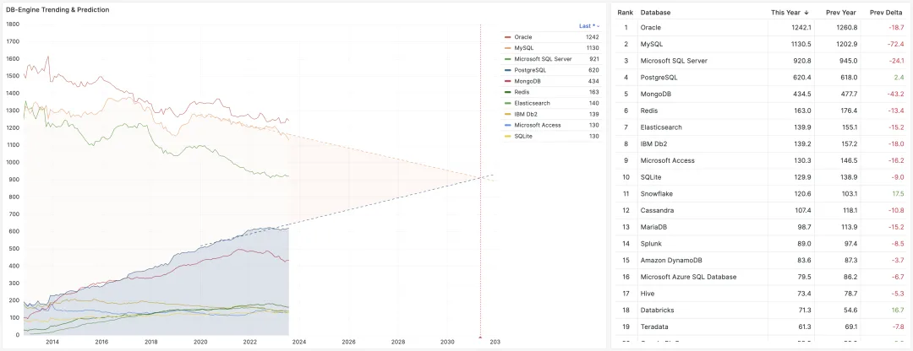

事实上，排行榜前十的数据库除了 PostgreSQL，热度全都在下降。而前二十的除了两个大数据分析的 Snowflake 与 Databricks 也都在下降。可以说，PostgreSQL 是数据库领域一枝独秀的存在！

作者接着根据“搜索引擎数据”提出：全球 MySQL 流行度是 PostgreSQL 的 3 倍，在中国 MySQL 流行度是 PG 的 6 ~ 7 倍。

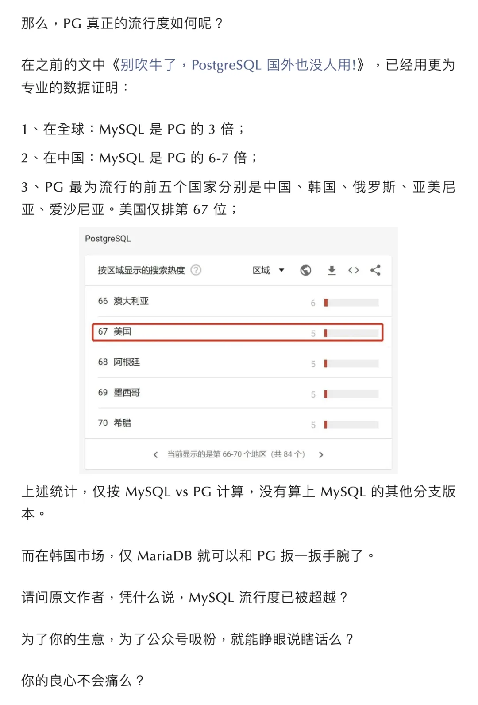

谁比谁更流行，那是**问卷调查**应该回答的问题，而不是**热度排行榜**能回答的了的。但**即使是引用热度排行榜数据，也不能支持这个结论**：

首先来看 Google Trends，拉取最近 30 天的热搜数据，按国家区分。有趣的是，我们观察到，**在大部分发达国家，PostgreSQL 的搜索引擎热度，已经超过了 MySQL**。

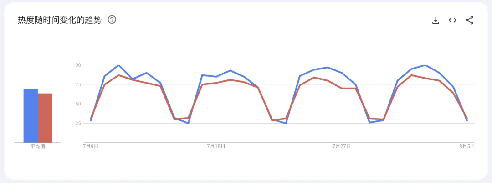

美国的搜索热度，PostgreSQL:MySQL 为 70:64，而受到制裁的俄罗斯则更为显著：PostgreSQL:MySQL 达到了 3:1。俄罗斯国民搜索引擎的数据，也基本反映了这一点，PostgreSQL:MySQL 热度为 3:2。

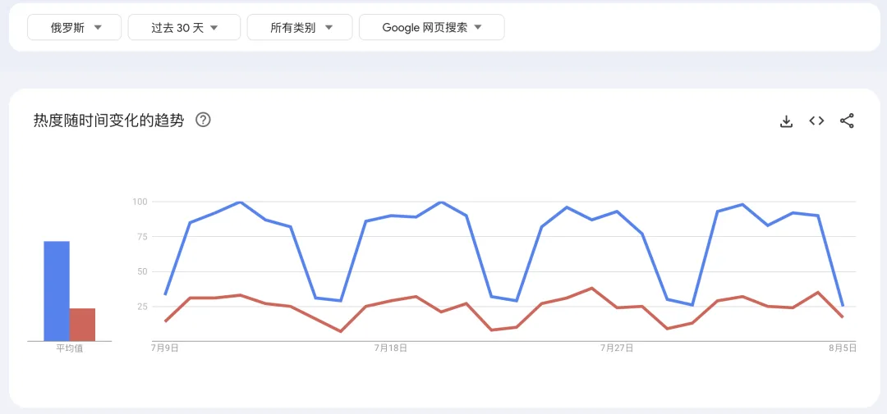

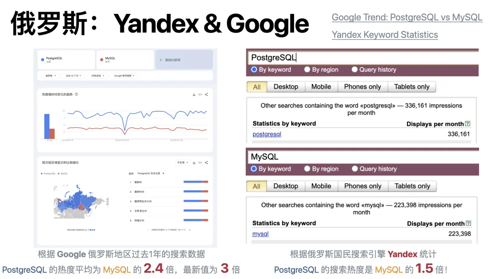

取最近 30 天的搜索热度，绘制在地图上，不难发现，**越是发达国家，PostgreSQL 相对 MySQL 的使用率越高**！

如果我们定量分析，PG - MySQL 热度差值与**发达国家**这个变量之间的相关性，会发现两者的相关系数高达 **r = 0.6**，踩在了强相关的门槛上。

这可倒真是应了 PostgreSQL Slogan 那句：世界上**最先进**的开源关系型数据库。

## 中国特色

在 Google Trends 上，中国则有些特殊：像是热度图向右偏移了 10 年左右的样子。MySQL 在中国的热度在 2014 - 2015 年达峰 （也许与阿里上市有关），随即进入衰退通道。与全球走势保持 10 年左右的滞后关系。

在百度指数上，也能观察到类似的起伏，此外，相比 Google 中国地区热搜趋势，还有额外 5 年的滞后性。

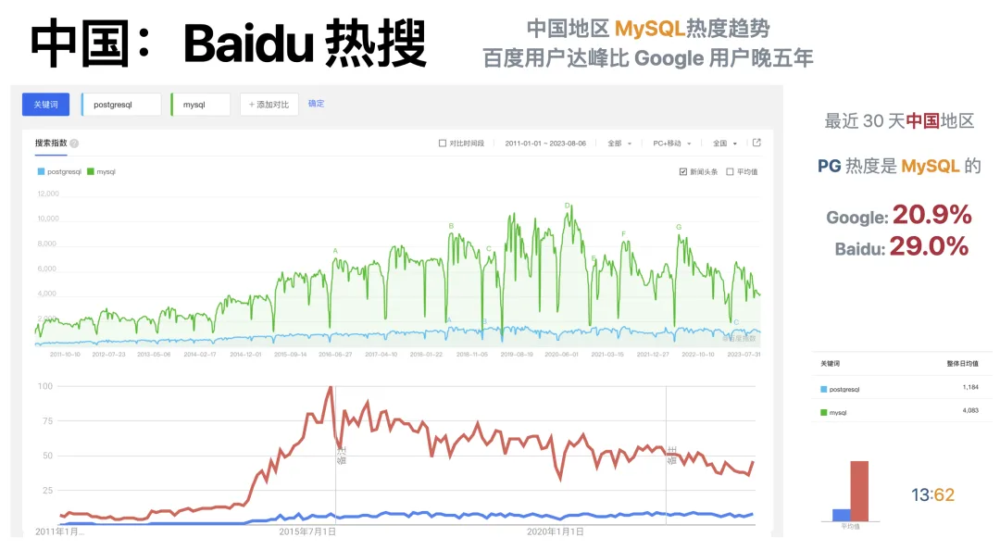

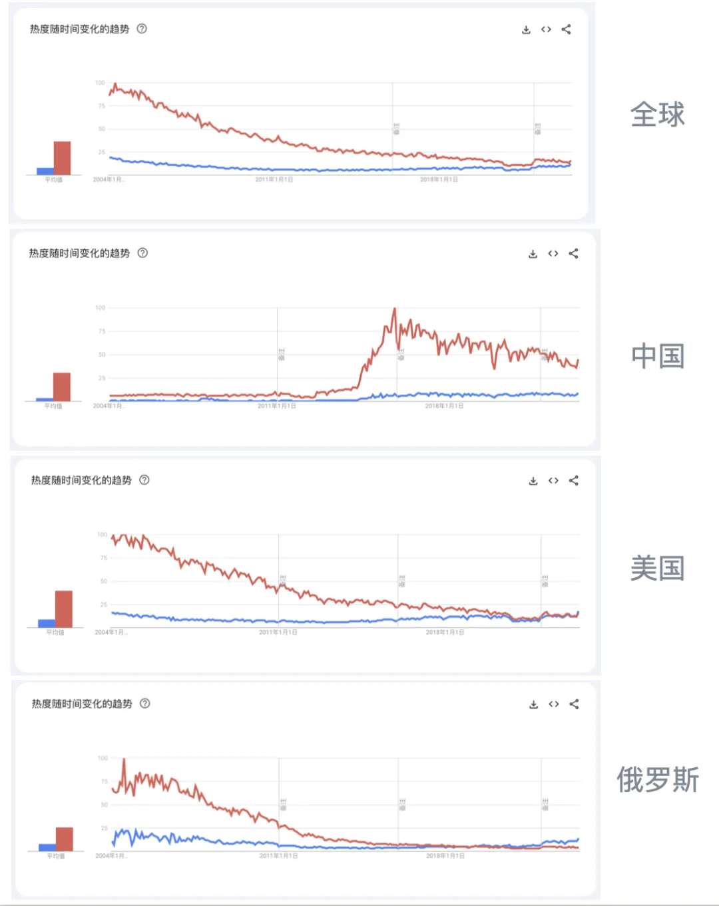

当年苏联点错了科技树，走了真空管计算机而不是晶体管集成电路的路线，错过了信息时代浪潮，当引以为戒。押宝过时的数据库技术虽然不至于像点错芯片科技树那样伤筋动骨，但也是巨大的人力物力财力智力浪费，不可不察也。

MySQL 的用户都流失到哪儿去了？

作者能够承认 MySQL 的流行度是在下降，这是不错的，但究竟是转去 PG，还是其他数据库了呢？

毕竟，MySQL 树大招风：前有狼后有虎，上有野爹下有逆子：在严谨的事务处理和数据分析上，MySQL 被同为开源关系型数据库的 PgSQL 甩开几条街；而在糙猛快的敏捷方法论上，MySQL 又不如新兴 NoSQL。同时，MySQL 上有养父 Oracle 的压制，中有 MariaDB 分家，下有诸如 TiDB，OB 之类的兼容性新数据库分羹。那么，到底是谁起了主要作用呢？

从**定性分析**的角度，PostgreSQL 是 MySQL 最大的竞争对手，在 DB-Engine 上排名前 20 的数据库中，唯有 PostgreSQL 保持正增长 （刨除两个大数据的），有能力吃下这块蛋糕。但具体 MySQL 用户流失到哪儿，还是要靠**定量分析**才有说服力：

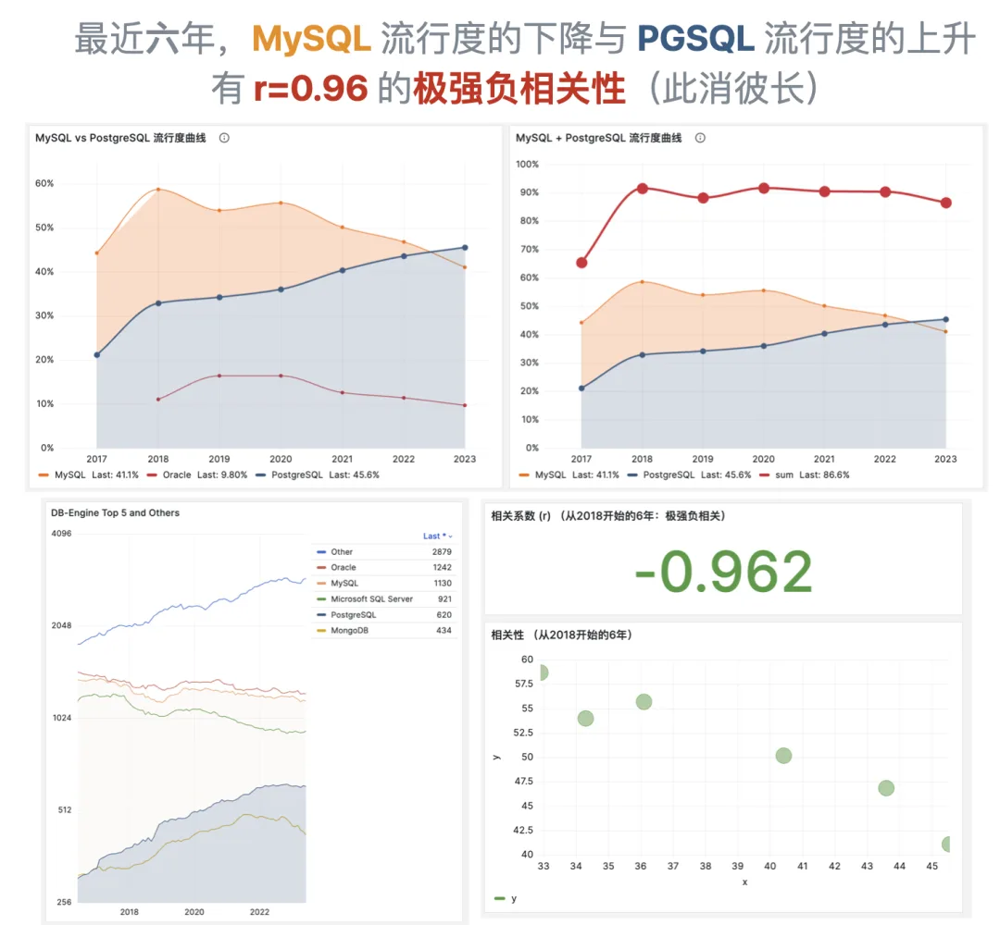

如果我们将 StackOverflow 过去 6 年间，MySQL 流行度的下降值与 PostgreSQL 流行度的上升值画到一张 XY 散点图上，会发现两者具有**极强的负相关性**，相关系数 **r = -0.96**。特别是，如果我们将 MySQL 和 PgSQL 的流行度相加，几乎可以看到一条**水平线**，我们可以合理推断，这是由于此消彼长，MySQL 用户大量转移至 PostgreSQL 导致的。

## MySQL 百花齐放？

作者认为 MySQL 流行度下降是因为**百花齐放**导致的。

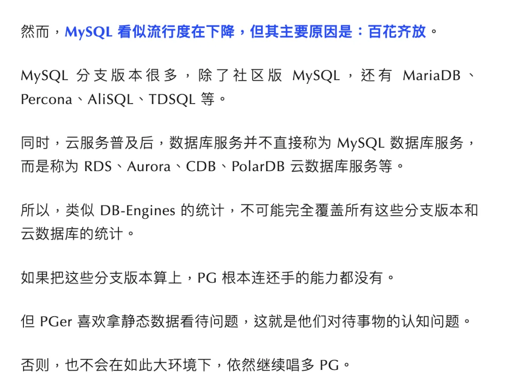

可惜的是，在百花齐放，生态繁荣这一项上，没有数据库可以比得过 PostgreSQL。在 Database of Database 排行榜中，PostgreSQL 有着最多的协议兼容数据库，最多的衍生数据库产品，甚至在“嵌入”使用中也能排名第四。

无论是全球的数据库谱系图，还是中国国产数据库谱系图，PostgreSQL 的生态都要比 MySQL 繁荣的太多太多。

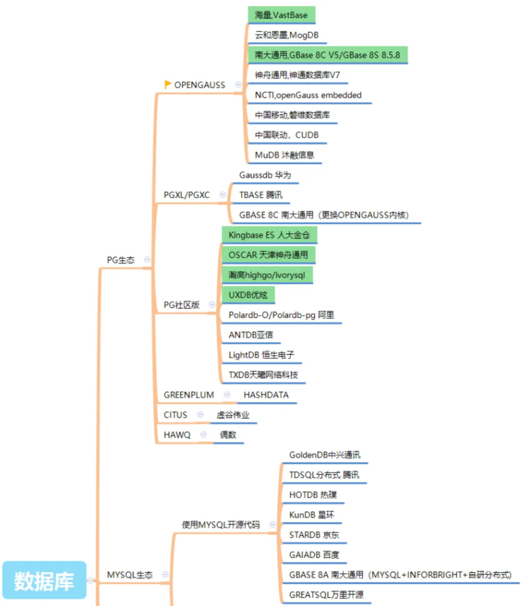

在中国市场，如果把基于 PostgreSQL 的 “国产数据库” 算上，恐怕 MySQL 更是要吃不了兜着走。

## PostgreSQL 营收是 MySQL 0.1%？

作者认为，在中国公有云数据库市场中 PG 的营收仅有 MySQL 的 0.1% ~ 0.3%。我很好奇作者的数据来源是什么。因为**根据 AWS RDS 团队给出的数据，他们 PostgreSQL 与 MySQL 的实例数量目前是 1:1**，考虑到 MySQL 小型实例偏多，PostgreSQL 在营收上还占点优势。

作为 MySQL 的大本营，中国阿里云的参考数据大概在 5:1，基本与 Google 中国地区指数与百度指数相吻合。出于对原作者在腾讯云数据库团队任职的职业经历，如果他给出一个 1:10 ~ 1:3 之的数，我可能会采信。但 1000:1 和 1000:3  的数字明显没有经过任何严肃的思考。当然我们并不排除这种可能性：某家云厂商实在是不懂 PostgreSQL，做的产品太烂根本卖不动。考虑到这家云的[过往历史](/cloud/cdn/)，并不是没有这种可能性。

关于公有云 RDS PostgreSQL vs MySQL 的份额并没有公开披露，内部数据，欢迎大家向相关团队验证，在评论区留言。\

关于大型互联网/科技公司核心业务，使用 PostgreSQL 或衍生发行版承载核心业务的互联网/科技公司并不少，例如我所任职的探探、苹果；还有去哪儿网，探探，平安银行，邮储银行，12306，Momenta，高德菜鸟，丰田，NEC 等等等等，航天/部队/水利/国土等与地理信息密切相关的组织更是 PostgreSQL 的基本盘。

## BSD 是流氓协议？？

作者最后对 BSD 协议开炮，认为 BSD 协议是**流氓协议**，而且本质上 PG **也**是由美国公司控制的开源数据库。

这里有一些基本的事实错误，例如 PostgreSQL 使用的并非是 BSD 协议，而是专门的 PostgreSQL 协议，只是类似于 BSD 协议，这是其一。第二，BSD 协议仍需要尊重代码作者的著作权，需要包含版权声明。作者恐怕是对开源协议有什么误解。

不同于 MySQL，Owned by Oracle，PostgreSQL  是社区驱动的开源项目，并没有一个商业公司控制，也并没有哪一个国家可以控制它；而且，它的全球总部在加拿大不在美国。即使是来自被制裁的俄罗斯 Postgres Pro，也依然活跃在 PG 社区中。“由美国公司控制的开源数据库” 属于无稽之谈 —— 例如国内，就有华为基于 PostgreSQL 9.2 与 PostgreSQL XL/XC 打造的 openGauss 与 GaussDB，用于满足一些自主可控特定需求。倒是作者的 这个 “**也**” 字，用的非常好，指出了 MySQL 其实是一家由美国公司所控制的开源数据库。\

## Fin

作者的这篇情绪文本不值一驳，充满着事实错误，诡辩话术，情绪输出与人身攻击，作为 MySQL 社区的头脸人物代表，可谓是体面尽失，与之对擂实属掉份。

但正如人们说的：“你不应该把世界让给那些你讨厌的人”。所以我还是选择撰此文回应，用实打实的事实与数据说话来正本清源，匡扶正义，为 PostgreSQL 正名。

至于孰对孰错，那就交由读者评说啦。

## 参考阅读

《[直播预告：MySQL vs PostgreSQL](http://mp.weixin.qq.com/s?__biz=MzU5ODAyNTM5Ng==&mid=2247485873&idx=1&sn=731322e649c212eefc3e382efb31ae99&chksm=fe4b3c6ac93cb57c712471ed8cd54c3603937d0793bfd2518221749861a40140b64edb17550d&scene=21#wechat_redirect)》\

《[向量是 PG 中新的 JSON](/pg/vector-json-pg/)》\

《[PostgreSQL：世界上最成功的数据库](/pg/pg-is-no1/)》\

《[PostgreSQL 到底有多强？](/pg/pg-performence/)》

《[为什么 PostgreSQL 是最成功的数据库？](/pg/pg-is-best/)》

《[StackOverflow 2022 数据库年度调查](/db/so2022-db/)》

《[Why PostgreSQL Rocks!](/pg/pg-is-great/)》

《[为什么说 PostgreSQL 前途无量？](/pg/pg-is-great/)》

《[PostgreSQL 好处都有啥？](/pg/pg-is-good/)》

《更好的开源 RDS 替代：Pigsty》

《StackOverflow 7 年调研数据跟踪》

<http://demo.pigsty.cc/ui/d/sf-survey/stackoverflow-survey>

《PostgreSQL 社区状态调查报告 2022》

<https://www.timescale.com/state-of-postgres/2022>

---

发布版本：[微信公众号](https://mp.weixin.qq.com/s/7UvQulQGt9SIhUQasxuEZw)
