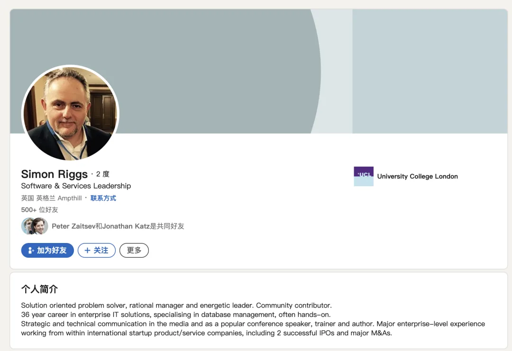
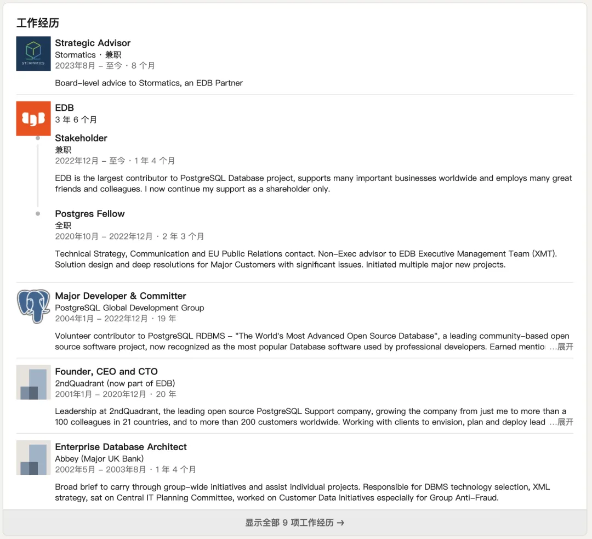
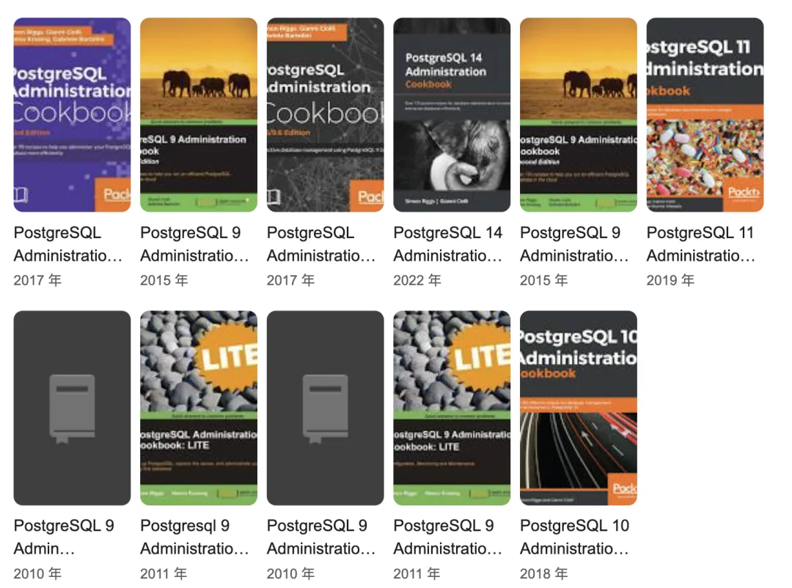

在开源世界中，我们都是站在巨人的肩膀上前行。但不幸的是在昨天，我们失去了其中最好的一位。我怀着沉重的心情分享**这个消息**[1]：在英国时间 2024 年 3 月 26 日下午 1:41 分，北京时间昨晚十点。PostgreSQL 的主要贡献者 **西蒙·里格斯**（**Simon Riggs**）驾驶私人通用航空 Cirrus SR22 飞机在杜克斯福德机场坠毁，**并在事故中丧生**[2]。

**西蒙·里格斯**[3] 是 PostgreSQL 内核的 47 位**主要贡献者**[4]之一，也是著名的 PostgreSQL 服务公司第二象限（2ndQuadrant）的创始人、CEO、CTO；**2ndQuadrant** 被 PostgreSQL 首要贡献公司 EDB [收购](https://mp.weixin.qq.com/s?__biz=MjM5MjMxMTMyOA==&mid=2649187598&idx=1&sn=edfc8c3762318ad1e4920edd9a132a78&scene=21#wechat_redirect) 后，西蒙担任 EDB 的研究员与 Postgres Fellow，并在 PostgreSQL 咨询公司 Stormatics 兼职担任战略顾问。

Simon 为 PostgreSQL 内核贡献了一系列 **极其关键**的特性，比如 PITR / 时间点恢复，分区表，热备 / 可读从库，同步流复制。**这些功能极大提高了 PostgreSQL 在企业级应用中的可用性和可靠性**。他也在其他企业级特性、安全、性能、可伸缩性、复制、HA 等领域都为 PostgreSQL 做出了杰出贡献。

Simon 还是一位非常活跃的社区参与者与公开演讲者，多年以来一直负责主办英国的 PostgreSQL Conf，并经常出现在 PostgreSQL 相关的会议和研讨会上，分享他的知识和经验，帮助推动 PostgreSQL 项目的发展。Simon 著有关于 PostgreSQL 管理的著名书籍 —— 《PostgreSQL Administration Cookbook》，并持续跟进了 PostgreSQL 的最新版本特性。

如果没有 Simon，[PostgreSQL](/pg/pg-is-no1/) 不会轻易 [取得今天的成就](/pg/pg-eat-db-world/)，PostgreSQL 社区会铭记 Simon 的贡献。作为 PostgreSQL 社区的一员，我对 Simon 的离去感到哀伤，谨致以最诚挚的哀悼，并愿他安息。

---

References\

- `[1]` Simon Riggs 去世： <https://www.postgresql.org/about/news/remembering-simon-riggs-2830/>
- `[2]` 一位男性在私人飞机坠机事故中丧生： <https://metro.co.uk/2024/03/27/plane-crashes-duxford-imperial-war-museum-20536836/>
- `[3]` 西蒙·里格斯 LinkedIn： <https://www.postgresql.org/community/contributors/>
- `[4]` PostgreSQL 主要贡献者： <https://www.postgresql.org/community/contributors/>

---

发布版本：[微信公众号](https://mp.weixin.qq.com/s/DizvD5EYT3atP3I2CdobFw)
