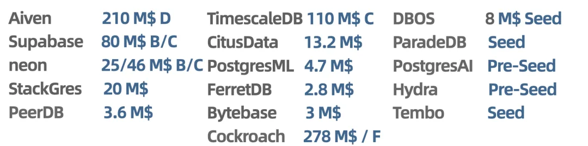
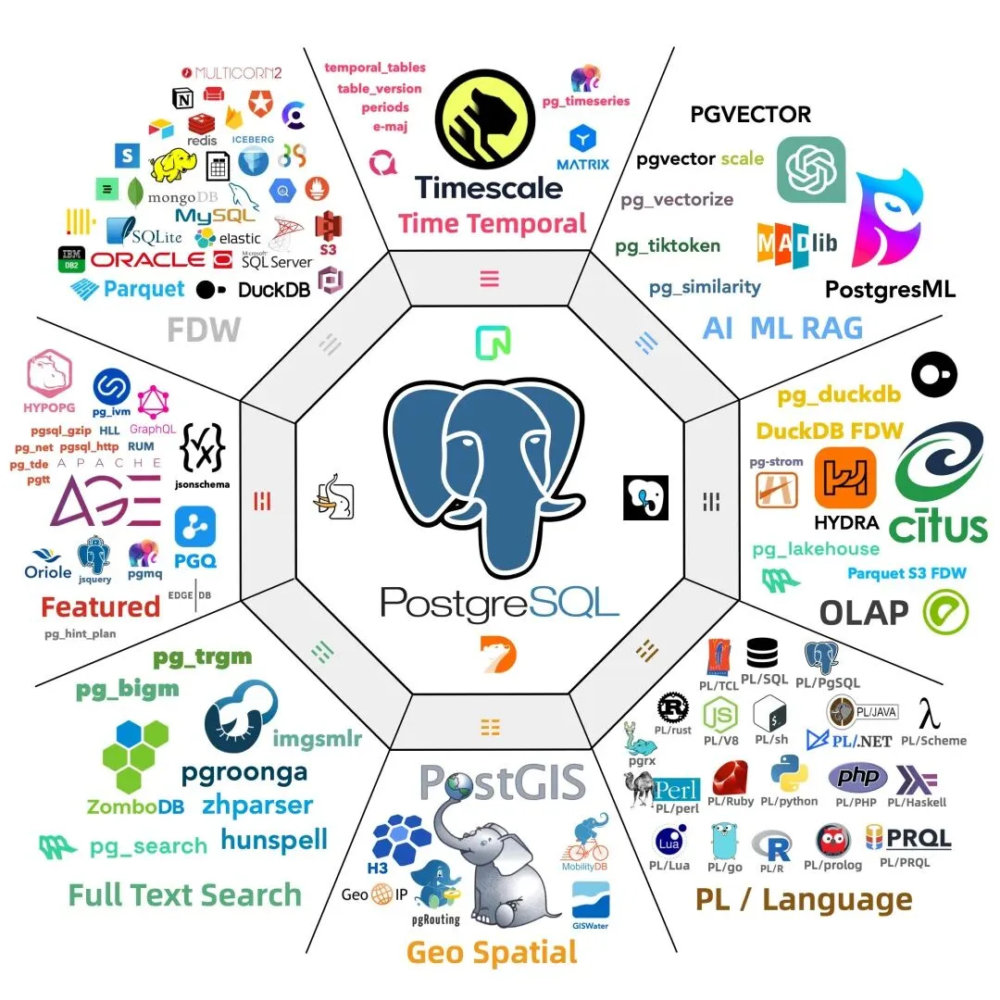
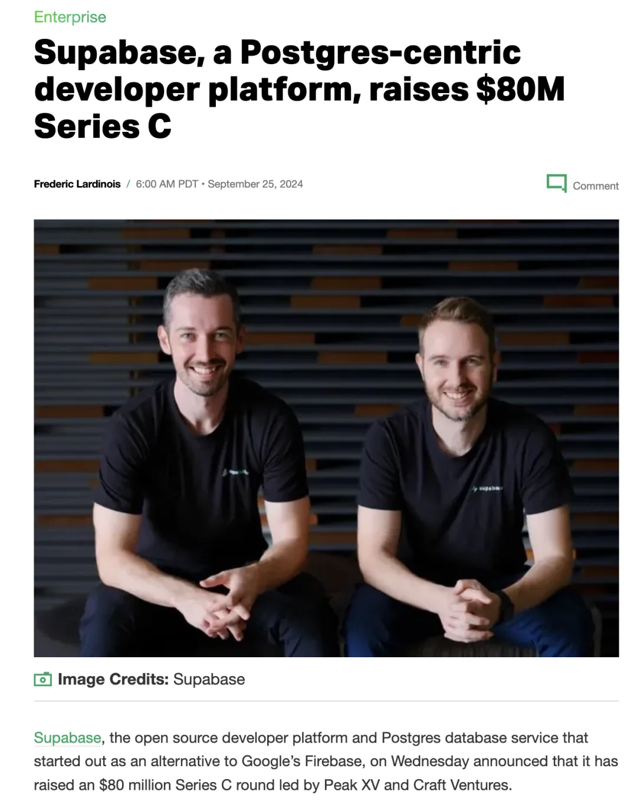
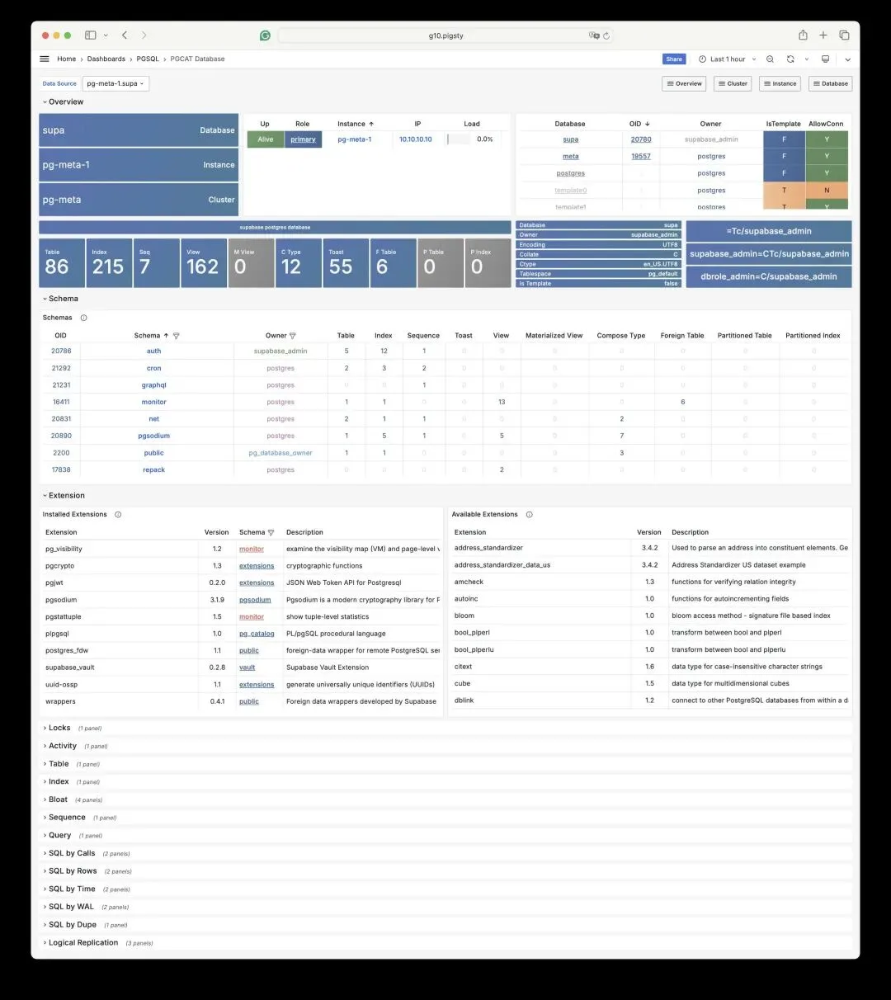

昨天，**Supabase** 官宣了八千万美金的 C 轮融资，这是继 2022 年八千万 B 轮融资后的新一轮融资，在当下资本市场与数据库行业环境中难能可贵。

老实说，我并不感到意外，在《[**PostgreSQL 正在吞噬数据库世界**](/pg/pg-eat-db-world/)》一文中，我就说过，PostgreSQL 将会成为数据库世界的 Linux，而聪明的资本已经开始涌入这个领域。

看看过去一年来数据库领域的融资纪录，不难发现几乎都是 PostgreSQL 生态的创业公司，以下是 PostgreSQL 生态或相关的公司最近的融资纪录。可以说，PG 生态几乎包揽了整个数据库世界的 New Money。

---

作为旨在整合 PostgreSQL 生态合力的创业项目，Pigsty 很早就关注到了 Supabase，并且深度整合了 Supabase 的扩展插件，允许用户在现有的高可用 PostgreSQL 集群上，运行自建/自托管的 Supabase 服务。

除了我自己在做的 Pigsty 之外，在 PostgreSQL 生态中，我最看好就是这三家创业公司： **Supabase**，**Neon**，以及 **TimescaleDB**；比较看好的第二梯队创业公司则包括 Hydra 与 ParadeDB。

顺便一提，这些插件都已经整合到 Pigsty 中，开箱即用了。

---

## Supabase  B 轮/C 轮融资 80M \$

Supabase 封装了 PostgreSQL 作为底层的数据库，并深度利用了 PostgreSQL 的扩展插件机制，提供了一个开源的 Firebase 替代 —— 一条龙式地解决了数据库，对象存储，认证等问题，实现了 Backend as a Service，提供了极佳的开发者体验。

---

### Neon  B 轮/C 轮融资 25M / 46M

Neon 将 PostgreSQL 改造为开箱即用的 Serverless 服务，将易用性体验做到了极致。去年八月，Neon 刚融到了四千六百万美金，今年八月，Neon 又融到了一笔 25M 的 Funding。

---

#### TimescaleDB  B 轮/C 轮融资 25M / 46M

TimescaleDB 基于 PostgreSQL，提供了一个时序数据库插件，强化了 PostgreSQL 的时序/分析能力。此外，它们还开发了诸如 pgai，pgvectorscale 这样的扩展。

---

#### ClickHouse 收购 PeerDB

PeerDB  是一家专注于高性价比 Postgres 复制和变更数据捕获的公司。仅仅是 3M 的种子轮，[就直接被 ClickHouse 收购拿下了](/pg/clickhouse-peerdb/)。

[ClickHouse 收购 PeerDB：这浓眉大眼的也要来搞 PG 了？](/pg/clickhouse-peerdb/)

---

**如何自建 Supabase？**

Supabase 实际上分为两个部分，有状态的部分使用外部的 PostgreSQL 实例，无状态的部分可以使用 Docker 一键拉起。

当然，并不是所有的 PG 实例都可以用于承载 Supabase：Supabase 使用到了几个自行开发的扩展插件，目前仅在 Pigsty 中针对几个主流操作系统发行版提供，例如 supautils，pg_graphql，pg_jsonschema，pgjwt，wrappers，vault，index_advisor 等。

完整自建教程，请参考：<https://pigsty.cc/docs/pgsql/kernel/supabase/>

---

## 数据库老司机

### （这个小助手很懒，请使劲拍打他）

---

#### 世界上最流行的数据库 PostgreSQL

[**PostgreSQL 正在吞噬数据库世界**](/pg/pg-eat-db-world/)

[憋大招，数据库全能王真的要来了。](http://mp.weixin.qq.com/s?__biz=MzU5ODAyNTM5Ng==&mid=2247488097&idx=1&sn=b94c9e2464cf416103d164e3b70b45fd&chksm=fe4b27bac93caeac6edfa75ffe409611efba7d54235ed8ae69058f6bfa5838743c37b52a69bb&scene=21#wechat_redirect)

[StackOverflow 2024 调研：PostgreSQL 已经超神了](/pg/pg-is-no1-again/)

[PostgreSQL 小版本更新，17beta3，12 将 EOL](/pg/pg-17beta3/)

[PostgreSQL 17 Beta1 发布！牙膏管挤爆了！](/pg/pg-17-beta1/)

[为什么 PostgreSQL 是未来数据的基石？](/pg/pg-for-everything/)

[令人惊叹的 PostgreSQL 可伸缩性](/pg/pg-scalability/)\

[PostgreSQL is eating the database world](/db/mongo-powered-by-pg/)

[技术极简主义：一切皆用 Postgres](/pg/just-use-pg/)\

[PostgreSQL：世界上最成功的数据库](/pg/pg-is-no1/)\

[PostgreSQL 到底有多强？](/pg/pg-performence/)\

[PostgreSQL 会修改开源许可证吗？](/pg/pg-license/)

[《黑历史：Mongo》：现由 PostgreSQL 驱动](/db/mongo-powered-by-pg/)\

[PostgreSQL 可以替换微软 SQL Server 吗？](/pg/pg-replace-mssql/)\

[ElasticSearch 又重新开源了？？？](/db/elasticsearch-reopen/)

[谁整合好 DuckDB，谁赢得 OLAP 数据库世界](/pg/pg-duckdb/)

[让 PG 停摆一周的大会：PGCon.Dev 参会记](/pg/pgcondev-2024/)

[PGCon.Dev 扩展生态峰会小记 @ 温哥华](/pg/pgcondev-2024/)\

#### 开箱即用的 PostgreSQL 数据库发行版 Pigsty

---

发布版本：[微信公众号](https://mp.weixin.qq.com/s/fi_p3tTZTnwP5XDJrkVbQw)
