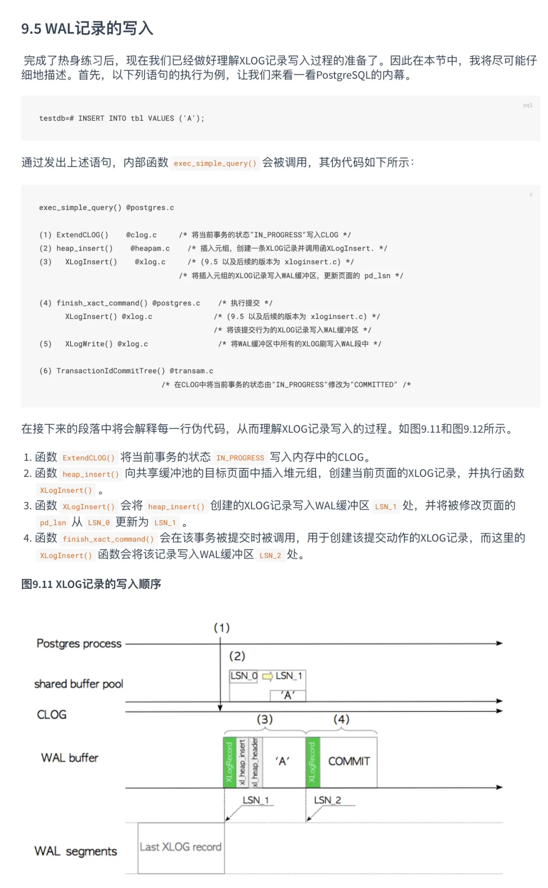
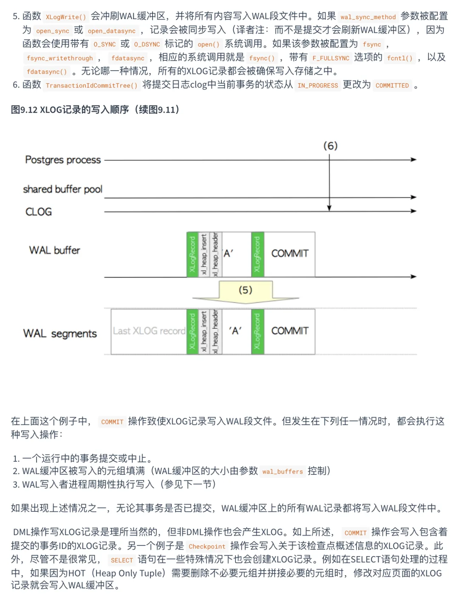
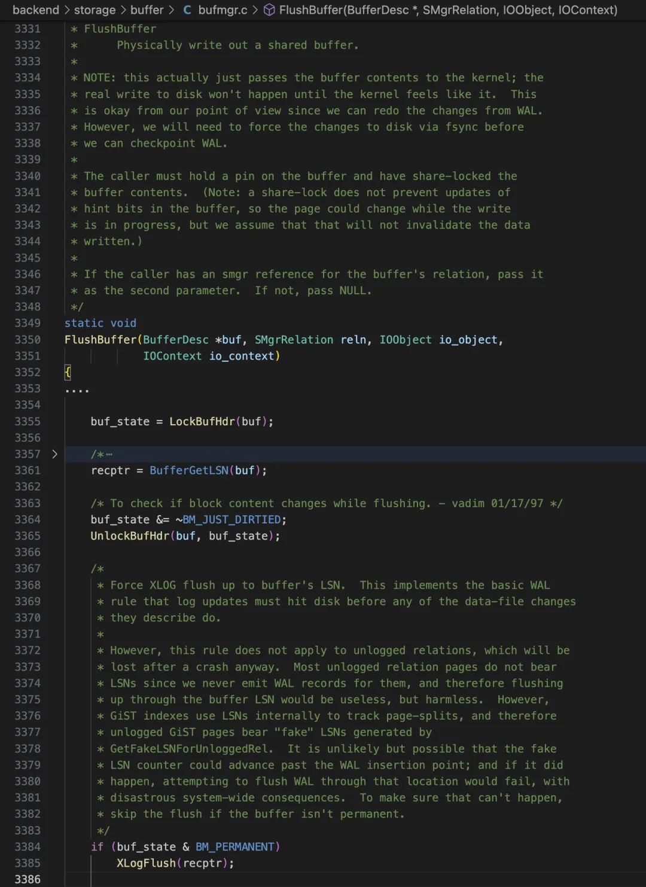
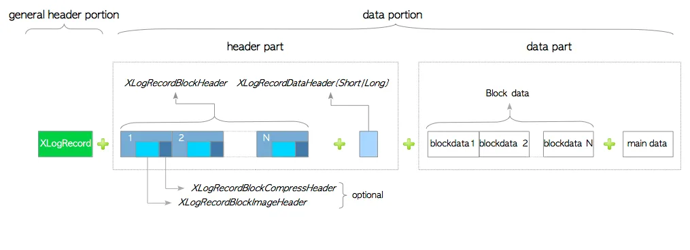
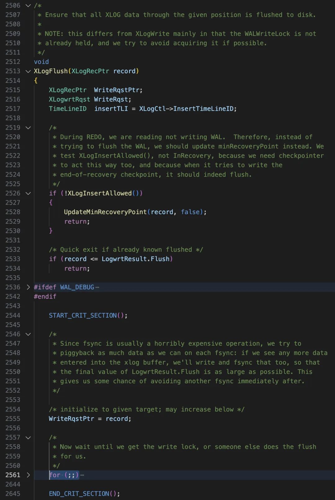
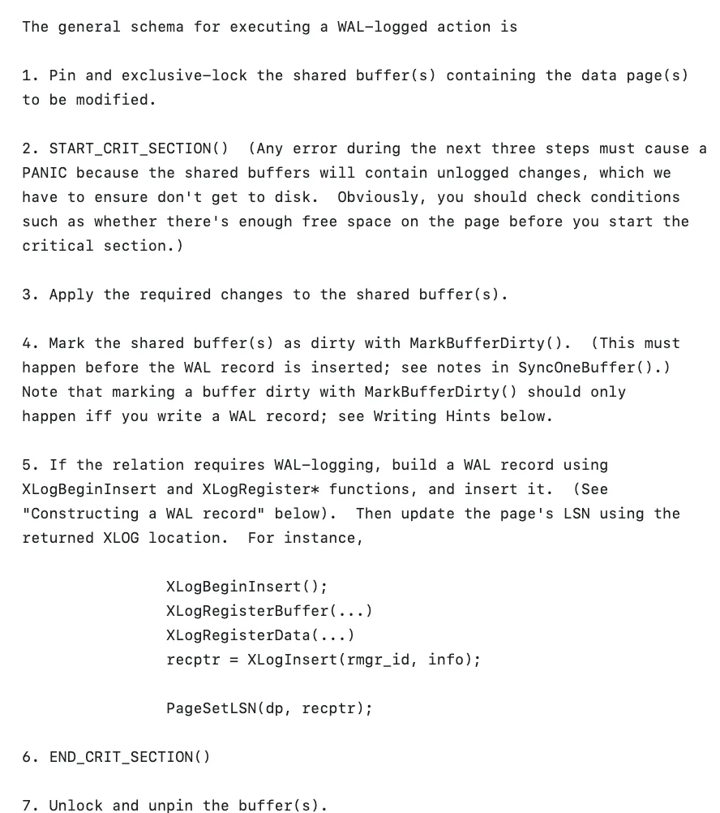

昨天在群里遇到一个有趣的关于 PostgreSQL 的问题：

> “写脏数据页和写入 WAL 缓冲区的先后顺序是什么？”

我们都知道，WAL 就是 **Write Ahead Log** / **预写式日志** 的缩写，那从逻辑上说，好像是先写 WAL 再写数据页才对。

但其实这个问题有趣在，写入其实是发生在两个地方的：**内存与磁盘**。而这对这两者的写入顺序是不一样的：**在内存中，先写脏数据页，再写 WAL 记录。在刷盘时，先刷 WAL 记录，再刷脏数据页。**

我们可以用一个简单的例子来说明，当你执行一条 `INSERT` 时到底发生了什么？以及，数据库是如何确保这条插入的数据被正确持久化的。

## INSERT 的内存修改

当你执行 INSERT 语句时（不包括前后隐含的 BEGIN / COMMIT），修改首先在内存中发生：

1.首先排它锁定并钉住目标数据页面，准备修改。2.进入临界区，不允许打断，出错就 PANIC。3.修改**内存**中的数据页面。4.将修改的内存数据页面标记为**脏页**。5.生成一条包含修改内容的 WAL 记录，写入内存中的 WAL 缓冲区。6.从临界区出来，以上 3 个操作都是内存中的高速操作 7.解锁解钉数据页面。

完成这些任务之后，内存中的缓冲池数据页包含了 INSERT 后的结果，WAL 缓冲区中则包含了 INSERT 的 XLogRecord 操作记录。这里我们可以看出，在内存中是先写数据页，再写 WAL 的。原因其实很简单，PostgreSQL 默认使用物理复制，记录的是页面内的二进制数据变化，所以只有先把数据写入页面里，才会知道具体的页面变化到底是什么。

内存中的操作非常快，而且这里 3 和 6 中间使用了临界区（Critical Zone），确保数据页/WAL 的修改整体是原子性的。不过，内存中的修改要落到磁盘上，才算真正持久化了。所以，还会涉及到 WAL 记录与 脏数据页刷盘的问题。

而这里，才是 Write-Ahead 真正约束的地方：脏数据页刷盘应当晚于 WAL 缓冲区刷盘。

**下面是一个具体的例子，一条由单一 INSERT 语句构成的事务：**\

参考阅读《PostgreSQL 指南：内幕探索》 9.5

## 如何强制 WAL 先于脏页刷盘？

那么，先刷 WAL，再刷磁盘这条规则具体是怎么确保的呢？

每一个内存中的数据页上都保存了一个状态：最后一次对本数据页进行修改的 WAL 记录 LSN：`pd_lsn`，因此如果要把内存中的脏页刷入磁盘中，首先需要确保最后一次对这个页面进行修改的 WAL 已经被刷入磁盘中了。

所以我们可以在在 `backend/storage/buffer/bufmgr.c#FlushBuffer` （L3350）中看到，刷脏页的过程中会调用 `XLogFlush` 函数来确保这一点，`XLogFlush` 函数会检查当前的 WAL 刷盘位置是不是已经大于页面的 LSN，如果不是，则会推动 WAL 刷盘。

<!-- -->

    recptr = BufferGetLSN(buf);XLogFlush(recptr);

谁会刷脏页呢？主要是 BGWriter 与 Checkpointer，但普通的后端进程也可以刷脏页。一个脏页具体是被哪个进程刷盘比较随机，大家都有机会出力，但通常来说刷脏页的主力是，后台刷盘进程 BGWriter。不管是哪个进程刷脏页，都会确保最后修改数据页的 WAL 已经落盘，从而满足 Write Ahead 的约束条件。

脏页会在什么时间被刷盘呢？首先，数据页不能被锁定，其次，数据页不能被钉住。也就是说在上面 INSERT 的例子中，只有完成步骤 7 解锁解钉数据页 后，数据页才有可能被刷盘。而这一行为是异步的，具体时间是不确定的：PostgreSQL 能提供的保证是：在下次 Checkpoint（存盘点/检查点）之前，这个脏页肯定会被刷盘。

## WAL 是如何刷盘的？

我们已经知道了，刷脏数据页这件事通常是异步进行的，且肯定晚于对应的 WAL 记录刷盘。那么新的问题就是，WAL 是由谁在什么时间点来刷盘的呢：从内存中的 WAL 缓冲区刷入磁盘中？

要回答这个问题，首先要理解 WAL 的模型。WAL 在逻辑上是一个长度无限的文件，任何一个**改变数据库系统状态的操作**，都会生成相应的 XLogRecord，即 WAL 记录。每一条 WAL 记录都会使用其起始位置的文件偏移量作为自己的唯一标识符，即 LSN（逻辑日志位点）。

各种各样修改系统状态的行为都会产生 WAL 记录：例如 BEGIN 有一条 WAL 记录，INSERT 有一条 WAL 记录，COMMIT 也有一条 WAL 记录，而 WAL 记录会首先被写入内存中的 WAL 缓冲区（最大 16MB）。

PostgreSQL 支持多个客户端并发修改，所以同一时刻会有各种进程往内存中的 WAL 缓冲区（最大 16MB）写东西。所以不同进程、不同事务产生的 XLogRecord 会在同一个逻辑文件中相互交织。每次写入都是原子性的，一条记录一条记录的写。

内存里的 WAL 缓冲区中的内容，会被各种进程写入/刷入持久化磁盘上的 WAL 文件里。当前写入内存 WAL 缓冲区的逻辑日志位置点称作 INSERT LSN。写入操作系统缓冲区的日志位点叫 WRITE LSN，已经使用 FSYNC 之类的 API 确保已经成功持久化的日志位点叫 FLUSH LSN。这里面的关系是 INSERT_LSN \>= WRITE_LSN \>= FLUSH_LSN。原理很简单：内存中的东西最新，写入可能稍微滞后些，刷盘则可能比写入更滞后一些。

刷盘的主力是 WAL Writer 进程，但其实各种进程都可以刷写。刷盘靠 `XLogFlush` 函数 （backend/access/transam/xlog.c#XLogFlush），这里的逻辑很简单，就是指定一个位置点，把这个位置点及之前的 WAL 从缓冲区全刷至磁盘。具体的实现逻辑是死循环抢自旋锁，如果目标 LSN 已经被别的进程刷盘了就退出循环，否则就亲自上阵把 WAL 日志刷盘到指定位点。

## 关于内核原理

关于 PostgreSQL 的内核原理，我认为有几个学习材料非常值得参考。

第一本是《PG Internal》，鈴木啓修写的，基于 PostgreSQL 9.6 与 11 的代码，讲解 PG 内核原理。我之前翻译了中文版《PostgreSQL 指南：内部探索》。第二本是 《PostgreSQL 14 Internal》，是俄罗斯 Postgres Pro 公司 Egor Rogov 写的，基于 PostgreSQL 14 进行架构讲解。

当然我认为最有学习价值的还是 PostgreSQL 源代码，特别是源代码中的 README，比如本文中的这个问题，就在事务管理器源码 README 中详细介绍了。PostgreSQL 的源代码是自我解释的，你只需要懂英文大致就能理解这里面的逻辑。

---

发布版本：[微信公众号](https://mp.weixin.qq.com/s/ynwCz24bRoluVC6ILs_a8g)
