引子：Why Pigsty

省却废话，直接抛出问题：**我们需要更好的数据库内核，还是用好数据库内核的能力**？哪项需求更为紧迫？哪一项才是更稀缺的能力？

现有内核，已经足够完美。

换皮魔改，大家多靠 PG；

再卷内核，没有边际效益。

来回折腾，多是无聊把戏。

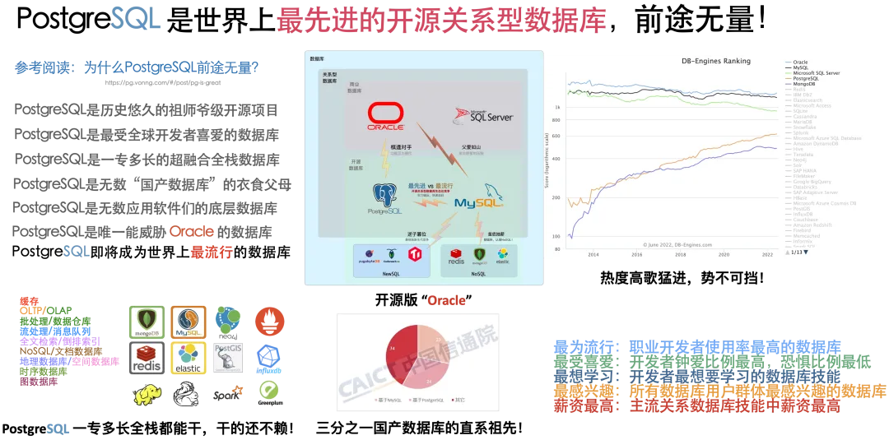

《[为什么 PostgreSQL 是最成功的数据库？](/pg/pg-is-best/)》

用户对于数据库的需求，和马斯洛的需求金字塔一样，有不同的**层次**。内核解决的是**生理需求**，**然而很多更高层次的需求，是难以通过数据库内核 本身来解决的**。

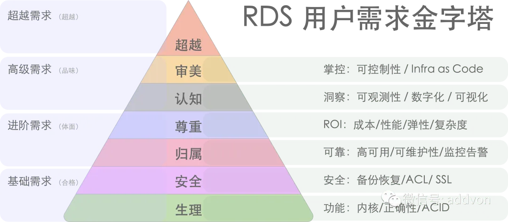

《[数据库用户需求金字塔](/db/demand-pyramid/)》

解决这些需求，有两条主流道路：**开源自建**，或使用**云数据库**。自建类似于买车自己开，上云好比滴滴打出租。**云数据库 太贵，好 DBA 难雇**。租车省事，弹性十足，奈何定价离谱杀猪盘；买车自驾，体验更好，但想找到老司机，可要花不少功夫。

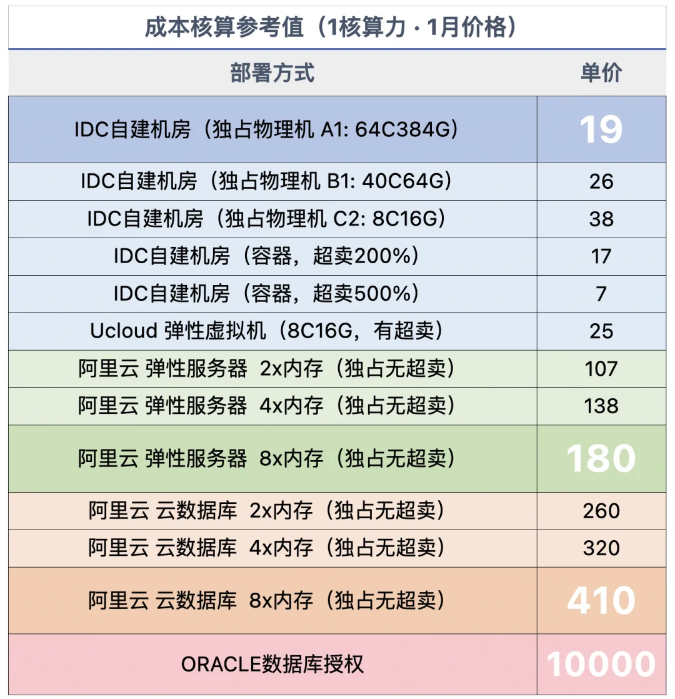

《[云数据库是不是杀猪盘](/cloud/rds/)》

有没有一种办法能扬长避短，结合两者的优点。**让用户在即使缺少数据库专家支持的情况下，也能达到顶尖 DBA 自建八成的水平？既保留云的便利与弹性，又能用几乎接近于纯硬件成本的价格运行生产级数据库服务，省掉 50% ～ 90% 的 RDS 溢价**？

女士们先生们，且看 **Pigsty 2.0**。

## Postgres in Great STYle

### —— 全盛状态的 PostgreSQL

《[Pigsty v2.0：更好的 RDS 开源替代](/pigsty/v2.0/)》

Pigsty 曾经是一个**开箱即用的 PG 数据库发行版**，但现在，它旨在提供一个**本地优先，功能完备，开源免费的 RDS 上位替代**，帮助用户用好世界上最先进的开源关系型数据库 PostgreSQL。

Pigsty 源于我们自己的需求 —— 用好管好 PostgreSQL。但是，当我们说“用好”时，到底指的是什么呢？下面我们将从**八个具体的维度**来展开聊一聊。Pigsty 如何帮助用户满足这些需求。

## 兑卦：可扩展性

坐落在需求金字塔最底层的是**生理需求**，对数据库来说生理需求就是**功能**。**可扩展性**是 PostgreSQL 最大的王牌：PG 的功能可以通过插件的方式动态扩充，与时俱进。

《[PostgreSQL 好处都有啥](/pg/pg-is-good/)》

PostgreSQL 是一个**足够完美**的数据库内核，但它需要更多工具与系统的配合，才能成为一个足够好的数据库服务，Pigsty 帮助 PG 完成这一步。

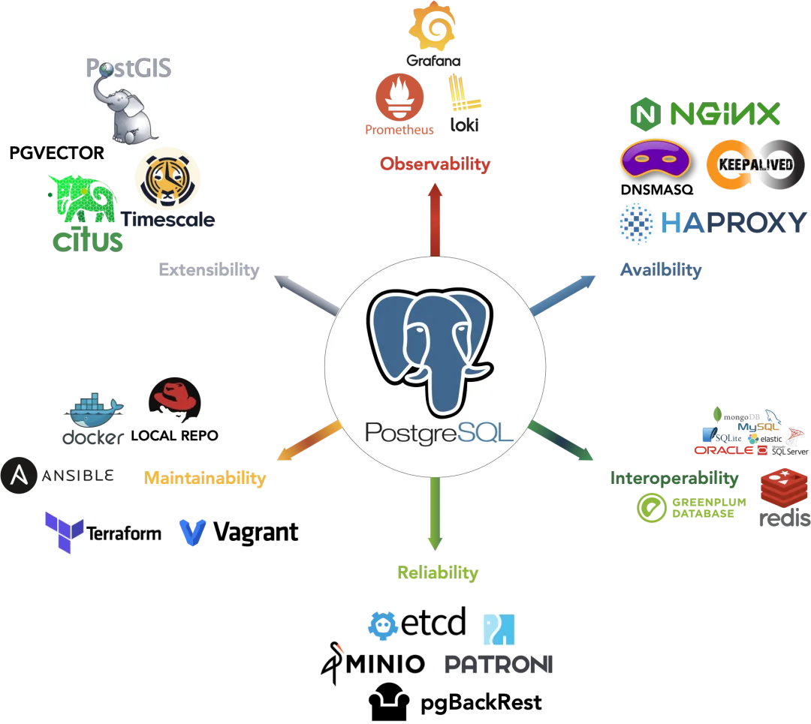

Pigsty 是一个强力的数据库发行版，整合了 PG 生态中的各种组件与扩展：与外部数据源交互的 FDW，做变更数据捕获的 CDC，按需取用，玲琅满目。

特别是 PG 生态中最为强大的几个扩展插件，每一个都称得上是“独当一面”，拿出去随便包装一下，就可以当成一个全新的数据库，Pigsty 确保这些插件可以**协同工作**，提供一个**开箱即用的分布式的时序地理空间向量数据库**。

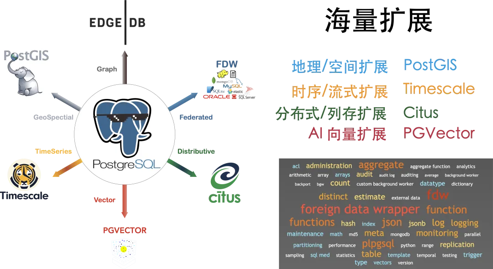

您可以使用 **PostGIS** 处理地理空间数据，一行 SQL 解决 KNN 最近邻查询问题。

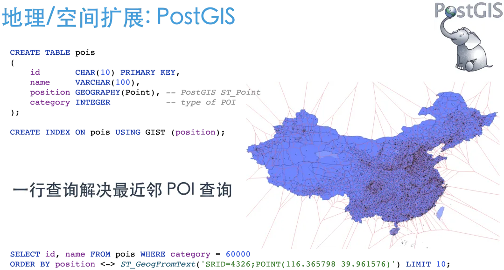

您也可以使用 **TimescaleDB** 处理时序数据，自动压缩/滚动保留，并使用持续聚集来处理流式事件。

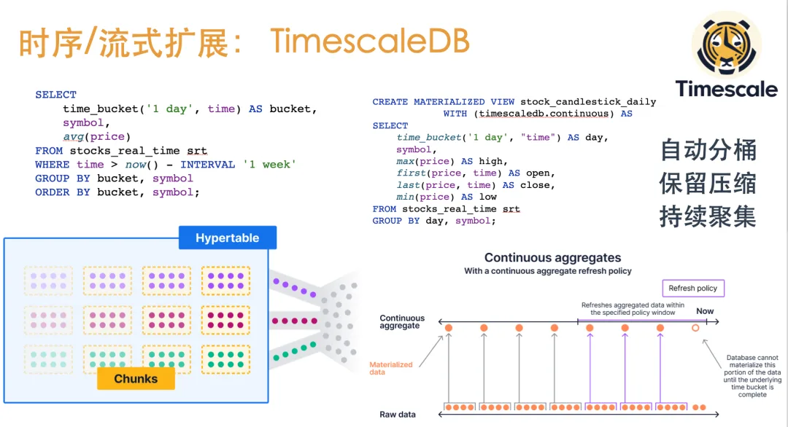

您也可以使用 **Citus** 将单机主从 PG 集群原地扩展为分布式数据库，在不阻塞业务的情况下对分片进行重新均衡。

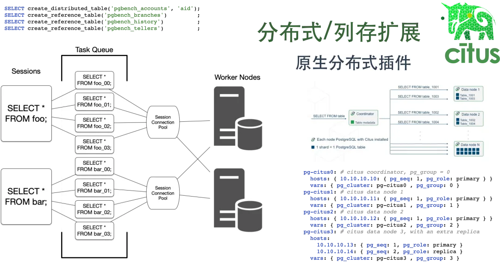

您也可以使用 **PGVector** 存储 AI 模型的 Embedding，高效执行向量最近邻搜索，为 AI 添加**持久记忆**的功能。

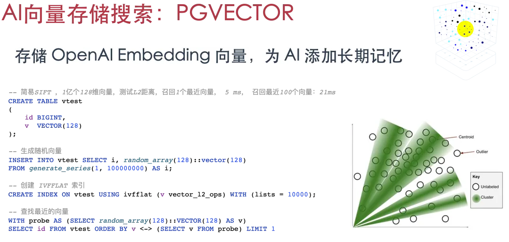

除了扩展，Pigsty 更是提供了运行企业级 RDS 服务的所需基础设施软件，所有组件均可在无需互联网访问的情况下，一键完成安装部署，生产可用。

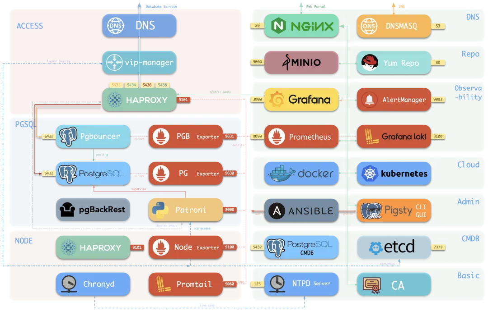

在 Pigsty 中功能组件被抽象 **模块**，可以自由组合以应对多变的需求场景。**INFRA** 模块带有完整的现代监控技术栈，而 **NODE** 模块则将节点调谐至指定状态并纳入监控。在多个节点上安装 **PGSQL** 模块会自动组建出一个基于主从复制的高可用数据库集群，而同样的 **ETCD** 模块则为数据库高可用提供共识与元数据存储。可选的 **MINIO** 模块可以用作图像视频等大文件存储并可选用为数据库备份仓库。与 PG 有着极佳相性的 **REDIS** 亦为 Pigsty 所支持。

你也可以开发自己的模块并自行扩展 Pigsty 的能力，更多的模块（如**GPSQL**, **MYSQL**, **KAFKA，MONGO**）将会在后续加入，

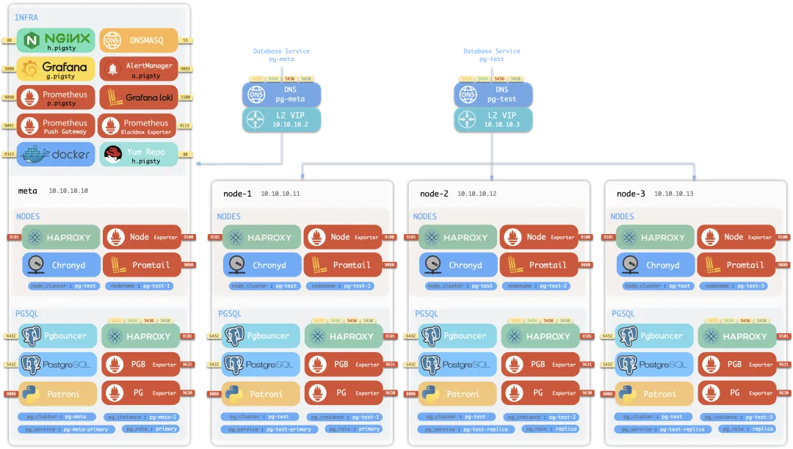

Pigsty 还提供了可选的 Docker 模块与大量开箱即用的 Compose 模板。您可以使用 Pigsty 管理的高可用 PG 作为后端存储，以无状态的模式一键拉起这些软件。**如果您的软件需要一个靠谱的 PG 数据库，Pigsty 也许是最简单的获取方案**。

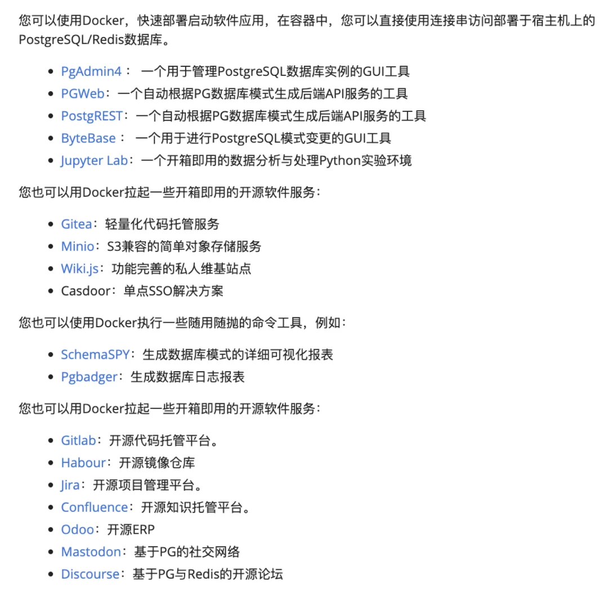

更奇妙的是，您完全可以基于 Pigsty 内置的 Grafana 与 PG，Echarts，以低代码的方式，快速搭建起交互式的数据应用 Demo，并创造具有表现力的交互可视化作品。

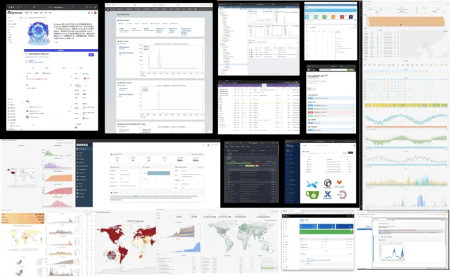

## 震卦：安全性

说完了功能**可扩展性**，让我们来聊一聊坐落在 RDS 需求金字塔第二层的需求 —— **安全**。**安全需求与生理需求同属基础需求**，一个用于生产环境的严肃数据库系统至少应当满足这两类需求，才足以称得上是**合格**。

很多**土法自建**的数据库都在这一需求层次里苦苦挣扎，而 Pigsty 可以帮您一步到位：加密备份一应俱全，**只要硬件与密钥安全，您无需操心数据库的安全**。

每套 Pigsty 部署都会创建一套自签名的 **CA** 用于签发证书，所有的网络通信都 可以使用 SSL 加密  防止抓包窃听，确保系统的**机密性**。

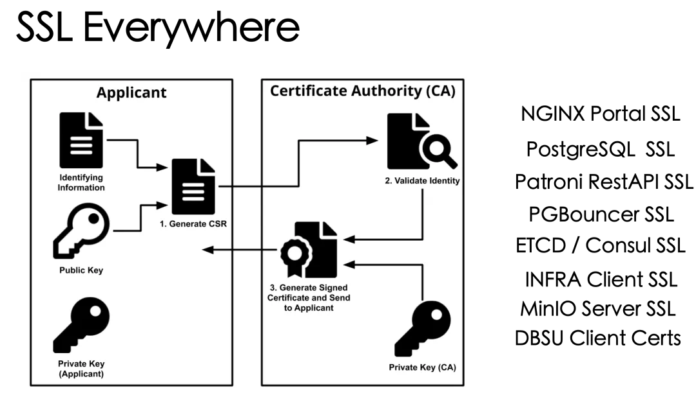

针对 PG，Pigsty 提供了一套开箱即用的的**访问控制体系**，足以应对绝大多数应用场景下的安全需求。包括基本的职能分离 读/写/管理/ETL，以及配套的访问控制，确保默认配置便已 secure enough。

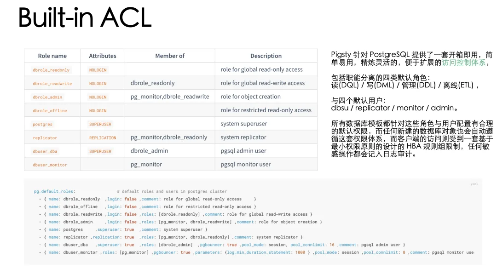

针对软件缺陷或人为误操作造成的删表删库，Pigsty 提供了开箱即用的 PITR 时间点恢复能力，无需额外配置即默认启用。为**完整性**与**可用性**兜底！

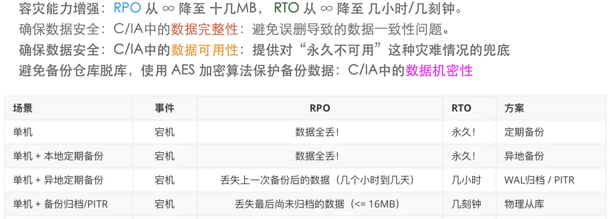

无论是备份还是时间点恢复，都简单到毫无门槛，一条命令搞定所有。如果您觉得本地目录/磁盘空间受限，亦可使用专用的 **MinIO** 集群或 S3 对象存储服务，保留任意长的回溯期限。

PITR，ACL，SSL，确保您的数据安然无忧。

## 艮卦：可靠性

RDS 需求金字塔的第三层是：**归属/社交需求**。这意味着数据库不再是单打独斗的一个光杆司令，主库拥有了自己的追随者分担工作，并有**高可用**系统在故障时能让备库接管工作。

Pigsty 让**高可用**与**故障自愈**成为 PG 的标配，基于 patroni，etcd，与 haproxy 打造的故障自愈架构，让您在面对硬件故障时游刃有余。在各行各业、大规模、长时间的生产运行，让这套架构的可靠性得到充分验证！

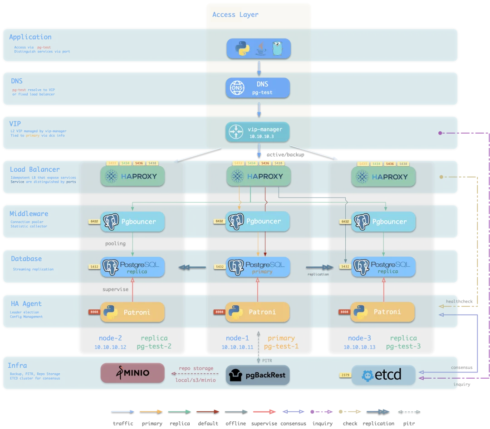

Pigsty 可以通过自动故障切换来应对硬件故障，主库 Failover **RTO** 约为**10 秒**；一致性优先模式下，数据零损失 **RPO = 0**。这两个目标参数也可以根据您的实际情况进行调整与取舍。例如您觉得自己的网络质量非常好不会抖动，那么也完全可以将 RTO 设置为 1 秒钟。

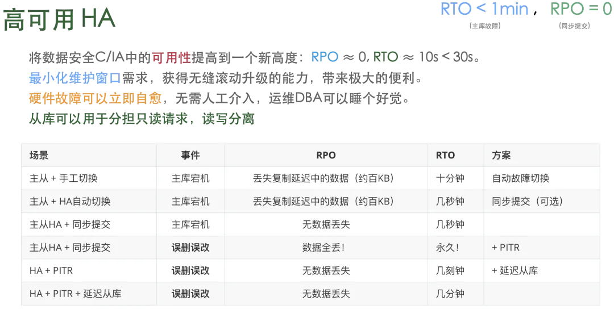

只要集群中有任意实例存活，PG 集群就可以对外提供完整的服务，而客户端只要连接至集群中的**任意**节点，即可访问完整的服务。经典主从数据库也能用出分布式数据库一样的体验。

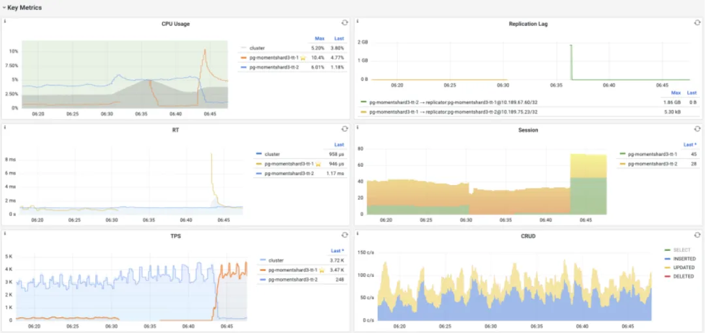

Pigsty 最大的部署案例是探探，有两万五千核的 PG 与 Redis 数据库，在三年间经历了数十次硬件故障与各类事故，但数据库依然可以长期保持 **5 个 9 以上的可用性**。此外，在军工航天、科研教学、金融电信、医疗互联网各行各业也有各种案例与应用

## 离卦：可维护性

高可用架构把 PG 集群的可用性拔高到了一个全新高度，**这也让数据库的维护不再痛苦。人生苦短，关爱运维**，可维护性的需求，当然也归类为 爱与归属。\

Pigsty 非常在意用户的使用体验，谁是用户？各行各业的企业是我们的用户，但**一线的 运维/研发/DBA**，这些开发者才是 Pigsty 真正的用户。我们在**可维护性**上做了很多努力，打动用户靠的是实打实的产品能力

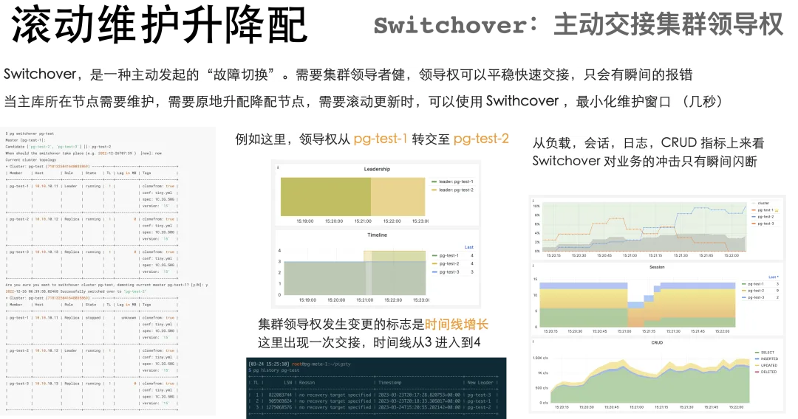

正如前一节高可用中所述，Pigsty 在硬件故障时可以自动 Failover，让运维 DBA 能在晚上安心睡个好觉，第二天醒来再处理问题。当然 Pigsty 也可以主动进行 Switchover，**主动切换 只有瞬间闪断**；这将原本以分钟小时计的维护窗口，压低到秒级甚至亚秒级，为维护带来的极大便利。

Pigsty 可以**监控**现有 PG 实例，不论是 RDS 还是本地 PG；虽然**纳管**现有实例难度不低，但我们也自带迁移方案  无需业务停机，基于逻辑复制进行半自动迁移，流量切换甚至无需业务知悉。

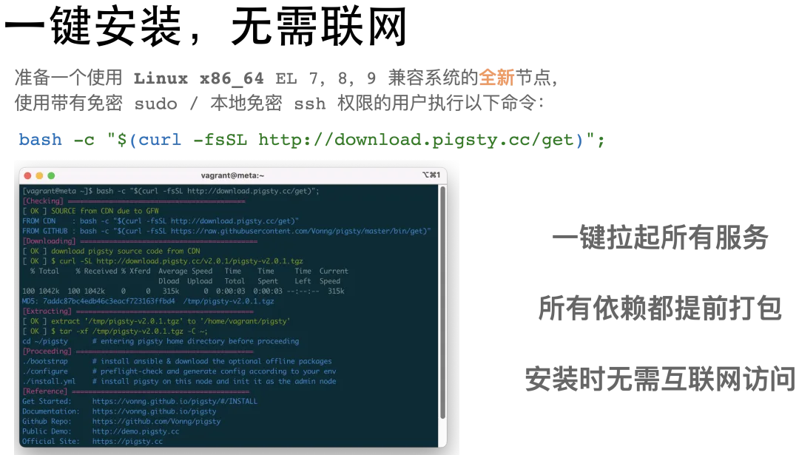

Pigsty 的安装更是极其简单，所有细节全靠一个配置清单。一条命令，就能在单机拉起，10 分钟不到即可生产 Ready。

此外 Pigsty  还有一个测试沙箱，用来开发演示或者研究学习。用 Vagrant + 虚拟机，一键在本地拉起。生产环境功能一模一样，配置最低只需要一 C 两 G。

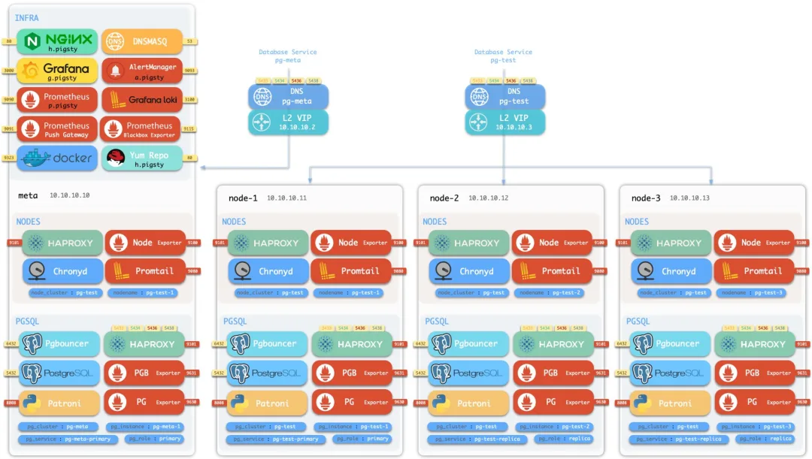

Pigsty 可以使用物理节点，也可以使用纯虚拟机。使用 Terraform，即可在云端一件拉起。使用样例配置文件，立刻就可以在阿里云/AWS 上一键拉起，部署所需的虚拟机，两分钟全部 Ready。

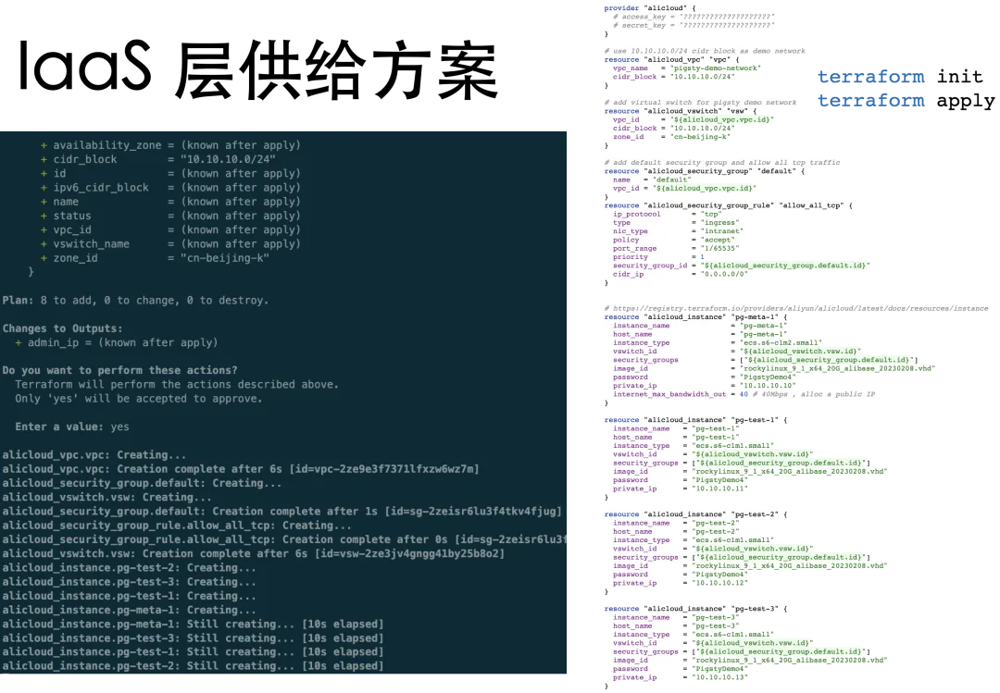

Pigsty 为用户考虑到方方面面的管理细节，即便是新手对着 SOP，也能达到大师的六七成功力。

## 坎卦：可伸缩性

可靠与可维护性满足了 RDS 需求金字塔第三层 —— **爱与归属**的需求。而金字塔的第四层则是**尊重**。对于数据库来说，**安全可靠是本分，性能卓越才能出彩。**

Pigsty 确保 PG 的性能可以充分发挥，在相近硬件水平的 SYSBENCH 中，PG 性能表现冠绝群雄。

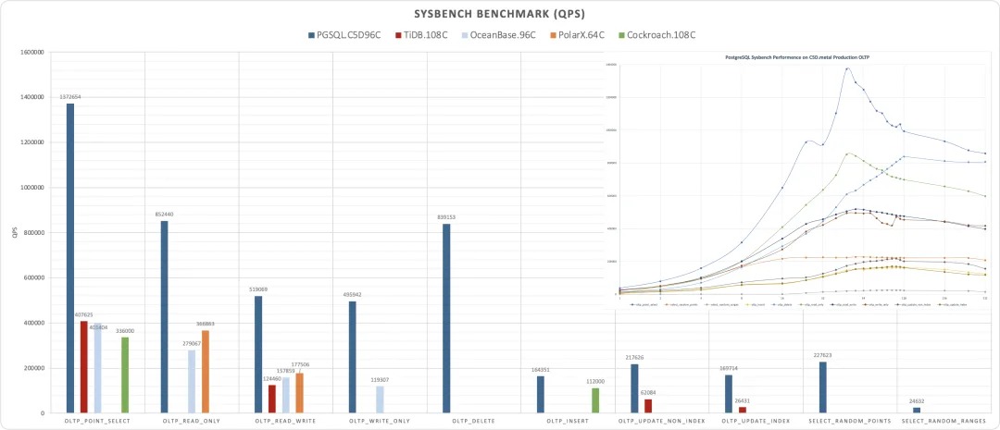

《[PostgreSQL 到底有多强？](/pg/pg-performence/)》

PGBENCH 单机点查 QPS 可达两百万，单机点写 QPS 可达七十万；**性能怪兽，一台足矣**。

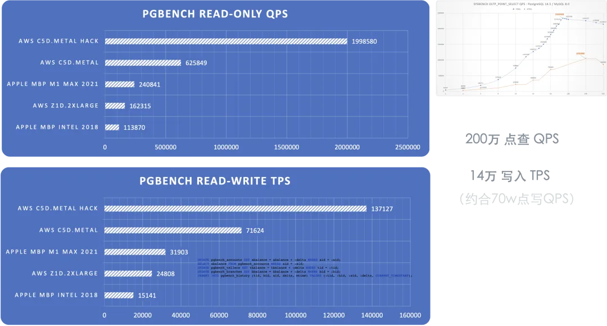

单机单卡轻松干到几十 TB。**在现代 NVMe SSD 加持下，很多“分布式”数据库，都失去了存在意义**。你可以通过无限拖从库的方式扩展**只读**能力，或使用内置 Citus 扩展，水平扩展主库的**写入**能力。

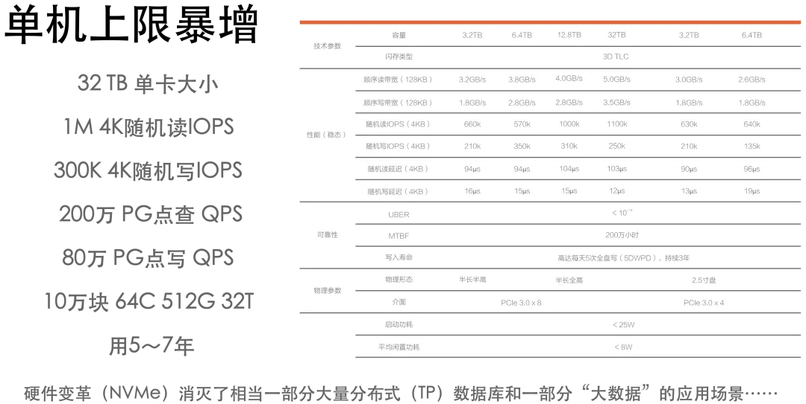

Pigsty 原生支持连接池，Pgbouncer 优化，轻松应对海量并发。

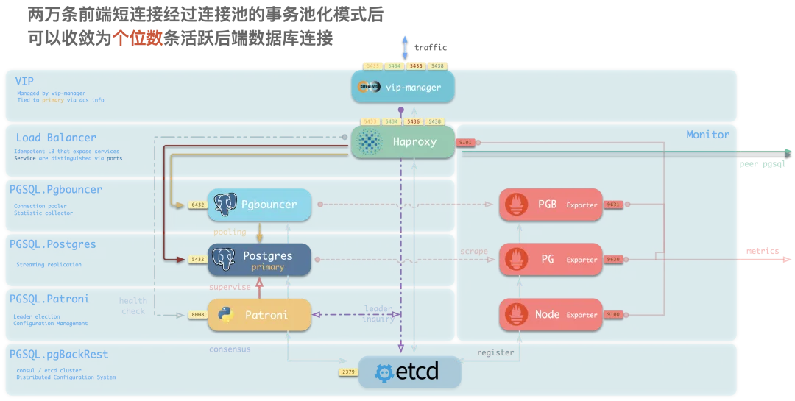

四种场景，提供预制参数模板；参数调优，自动根据机器规格进行；

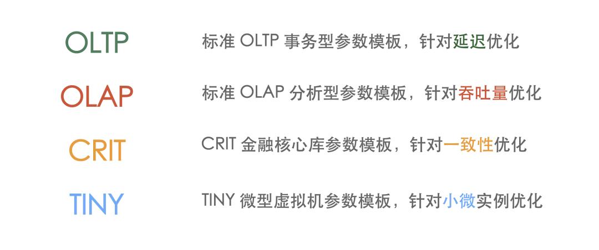

滚动升级，使用 Switchover 轻松实现硬件升降配，流量控制，使用 HAPROXY 对负载进行精细化管理。

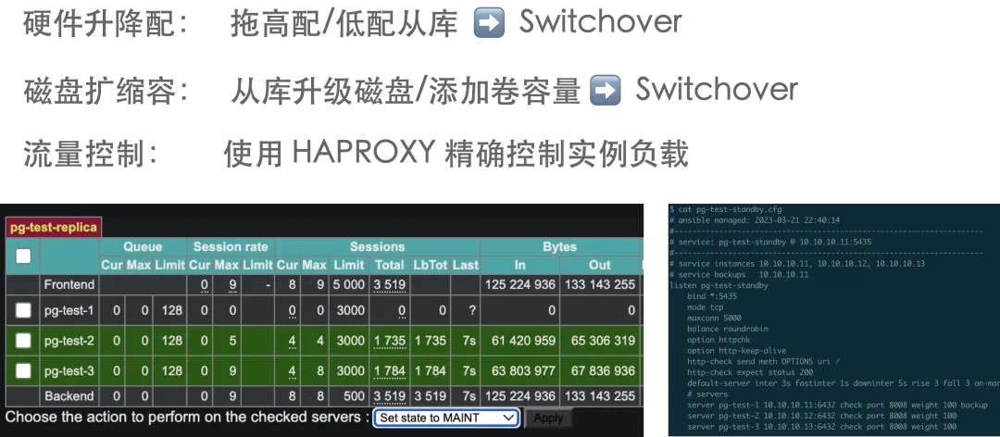

## 巽卦：ROI 性价比

**性能很重要，但性价比才是第一产品力**！**再好的产品如果定价糊涂，也会体面尽失，一败涂地！**

云数据库就是最生动的案例，产品其实是不错的东西。**尽管已经比 Oracle 这样的商业数据库便宜了一个数量级；但相比开源自建几倍到十几倍的离谱溢价，让上面的努力失去了大部分意义。**

云算力贵吗？挺贵，比自建溢价几倍，但总体还说的过去。

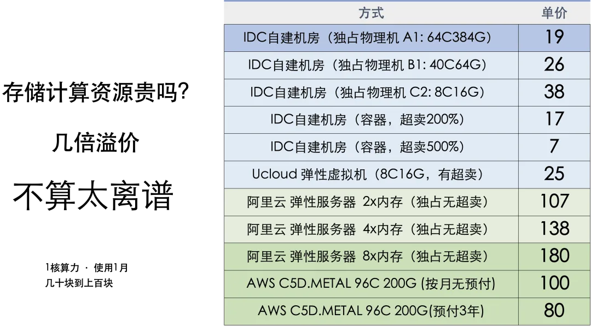

云存储贵吗？S3 对象存储不算太贵，但是，**用来跑数据库的块存储，可以说价格突破天际！**

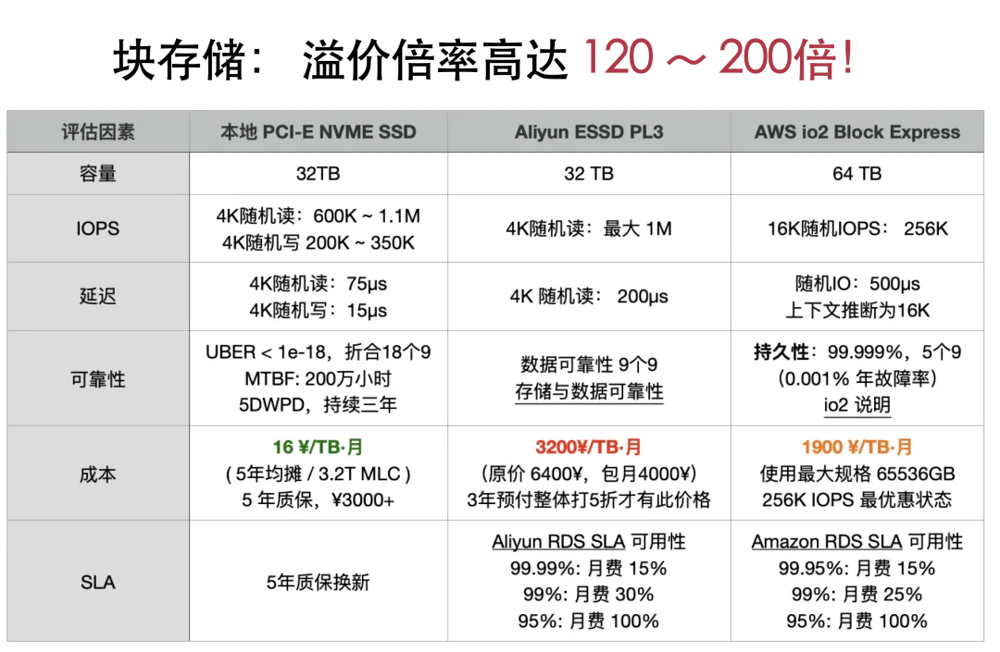

《[块存储是不是杀猪盘？](/cloud/ebs/)》

云数据库的定价模型工整的出奇，都是 EC2 价格乘以一个固定比例，当然云盘存储，通常单独计算处理。综上，**云数据库相比开源自建，有着几倍到十几倍的溢价比例。**

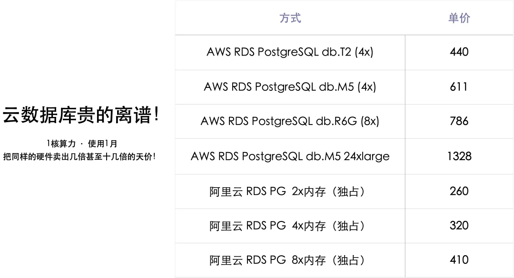

**以 64 核 512G 的机型为例，买一台用五年平均每年一万五，云上租一台每年几十万到一两百万，不到十几天的离谱租售比**。

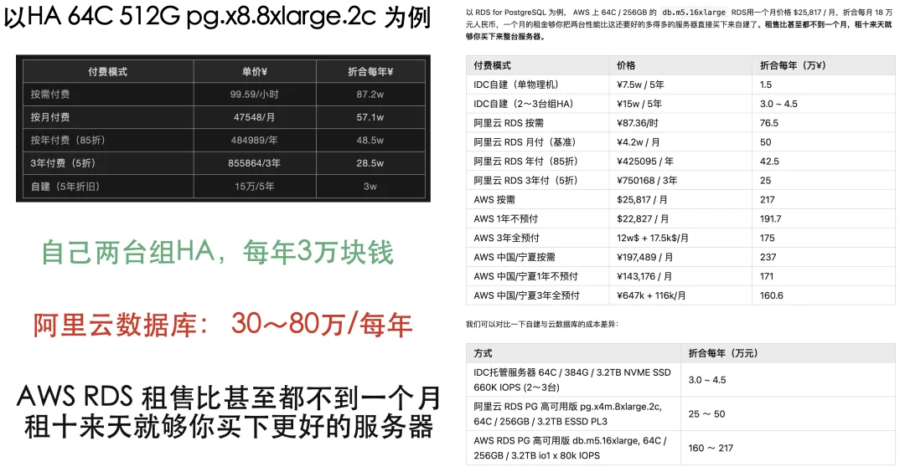

**任何理智的企业用户都看得明白这里面的道理**：**如果采购这种服务不是为了短期的，临时性的需求，那么绝对算得上是重大的财务失当行为。**

Pigsty 可以立竿见影地帮助用户省钱，**探探就是一个最直观的案例**，规模 1 万 3 千核的 PG 数据库。这样的数量级，即使折扣拉满，阿里云数据库便宜点也要六七千万，如果使用使用 AWS RDS 大概两三亿。使用 Serverless WCU 计费更为离谱，能直接干到和 Oracle 一样的十亿数量级。

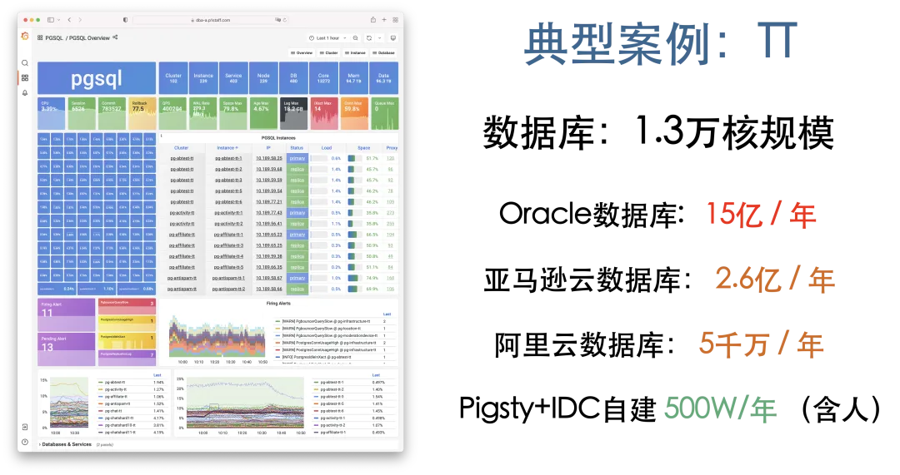

但是用 Pigsty 开源自建。四个 DBA 含工资，每年一千万不到的成本，就能维护好两万五千核的数据库。Pigsty 可以帮助探探做到这一点，自然也可以帮助更多企业完成这个过程。

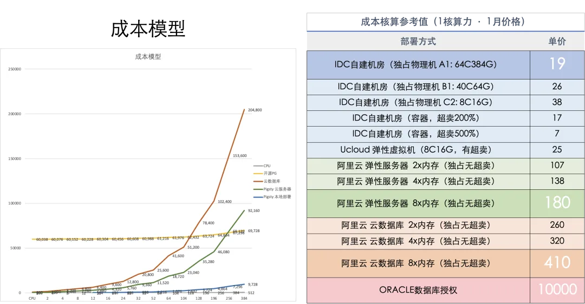

如果用云服务器而不是 IDC 代维自建，使用 Pigsty 也能节省 RDS 和 ECS 中的差价，立竿见影节省一半成本起步，还是在不损失云的弹性前提下。

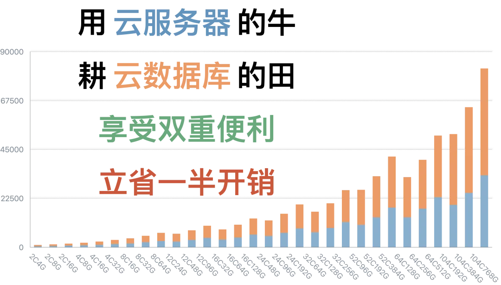

## 乾卦：可观测性

可靠、可维护、可伸缩、性价比高的 RDS 服务，可以称得上是**体面**的数据库服务，而想要做到有**品味**，还需要**可观测性**与**可控制性**的加持。RDS 需求金字塔的第五层是**认知需求**。**一个数据翔实的可观测系统能将数据库的治理水平拔高到一个全新高度**。

有些事情，是人有我优，人优我廉。但是对于可观测性来说，Pigsty 可以骄傲的说，这是**人无我有**。Pigsty 诞生的原因就是因为全世界都找不出一个能打的监控，所以我们才自己动手，正所谓**甲方会武术，谁也挡不住**。

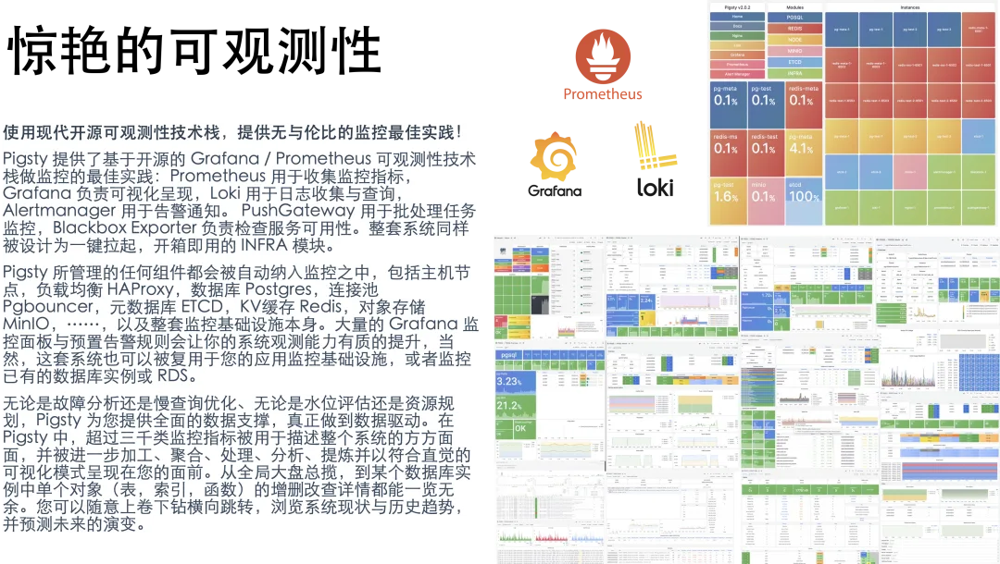

Pigsty 提供了基于开源的 Grafana / Prometheus 可观测性技术栈做监控的最佳实践：Prometheus 用于收集监控指标，Grafana 负责可视化呈现，Loki 用于日志收集与查询，Alertmanager 用于告警通知。PushGateway 用于批处理任务监控，Blackbox Exporter 负责检查服务可用性

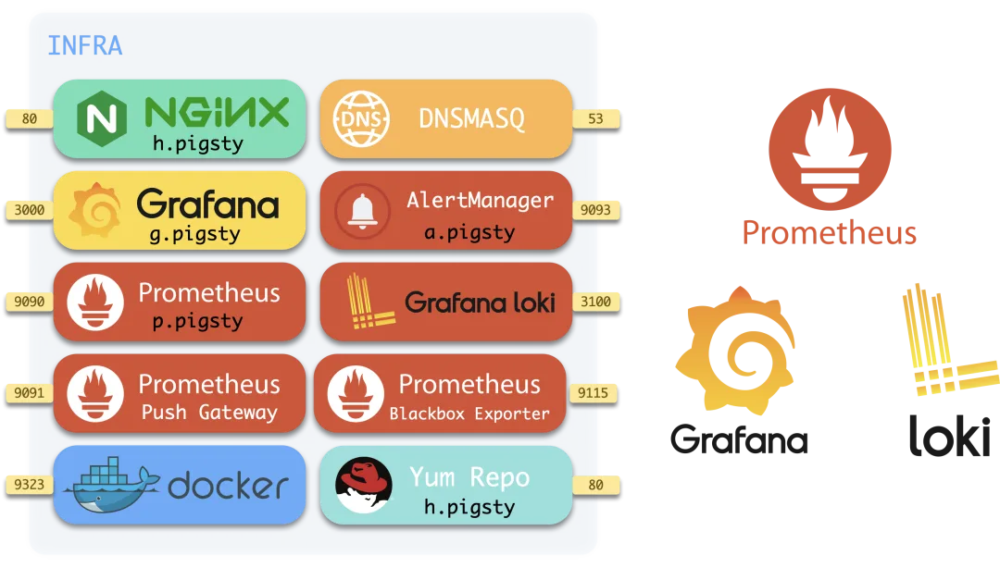

可以说，PostgreSQL 的可观测性数据全部被 Pigsty 收录囊中，总计 3000 多类的数据指标，将成为数字化，智能化的基础养料。更难得的是，这些指标数据会被加工、聚合、处理、分析、提炼、浓缩并以符合直觉的可视化模式呈现在您的面前。

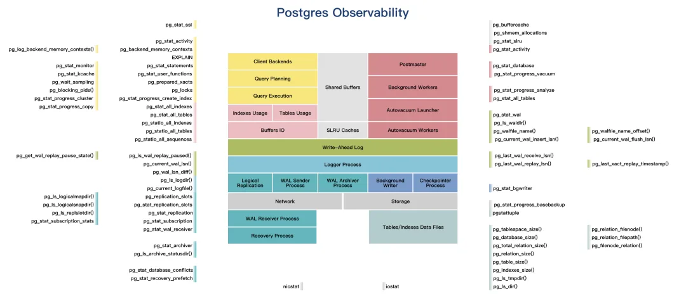

无论是**故障分析**还是**慢查询优化**、无论是**水位评估**还是**资源规划**，Pigsty 的监控系统为您提供全面的数据支撑，真正做到数据驱动。从全局大盘总揽，到某个数据库实例中单个对象（表，索引，函数）的增删改查详情都能一览无余。您可以随意上卷下钻横向跳转，浏览系统现状与历史趋势，并预测未来的演变。

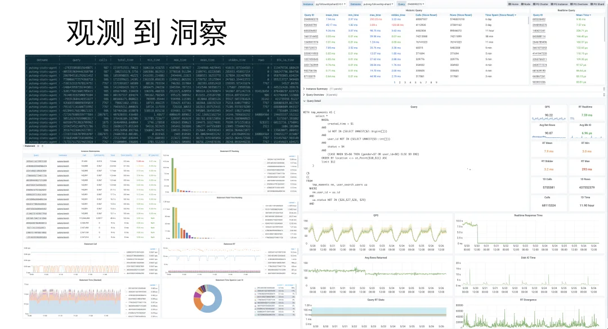

我们以 BI 的方式，从指标日志中提取洞察，构建上下文环境用于问题分析。我们提供了一个公开的  Demo 站点，展示此监控系统的能力， <http://demo.pigsty.cc>

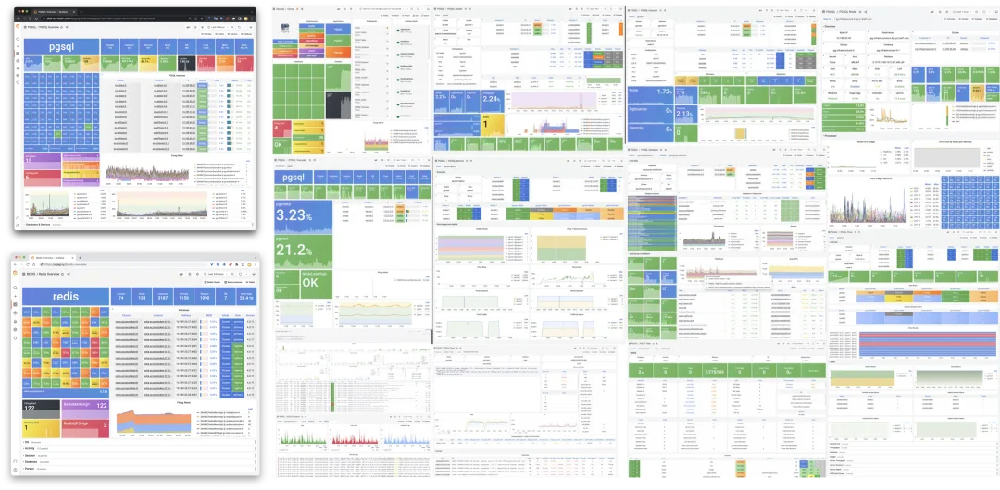

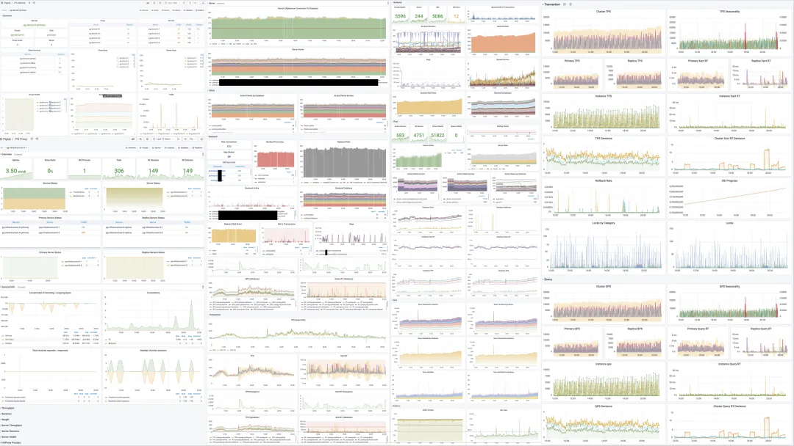

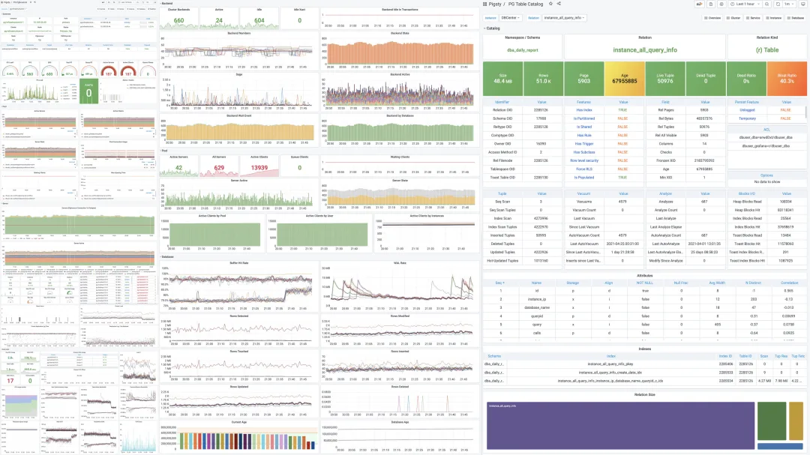

## 坤卦：可控制性

RDS 需求金字塔的第六层是**审美需求**。对于数据库来说，这意味着**可观测性**的对偶属性：**可控制性**。以一种优雅的方式进行控制与管理：Infrastrcuture as Code。

Pigsty 将 IaC 拔高到新的高度，即 **Database as Code**。不像 RDS 还需要使用 Terraform 这样的工具来曲线救国，您可以用声明式的配置来管理部署各种组件。传统的运维方式关注**过程**，要创建/销毁/扩缩容数据库集群，用户需要按照手册依次执行各种命令；而现代管理方式关注**状态**，用户声明式的表达自己想要什么，而系统自动调整至用户所描述的状态。

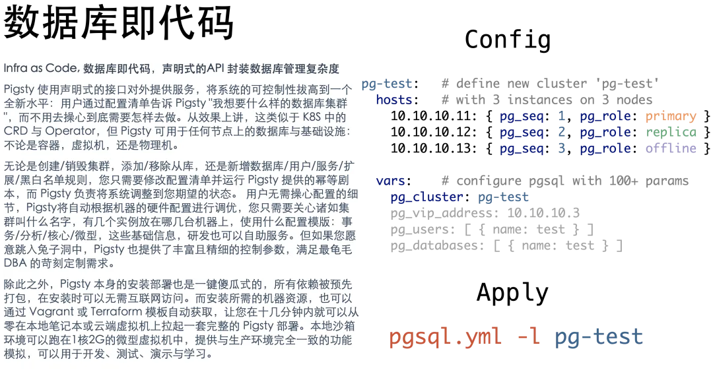

您可以使用 **Terraform**，声明式地管理基础 IaaS 资源；使用 **Pigsty**，声明式地管理 RDS 集群；可以使用内置的 **Bytebase**，声明式地去管理数据库内的对象。

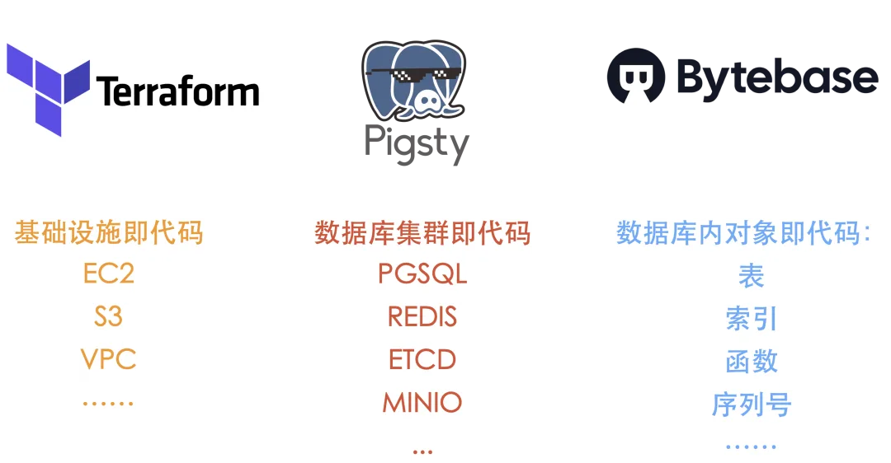

对真正**有品位、有追求**的工程师来说，在 GUI 鼠标点点是驴粪蛋表面光，如果您只有一两套数据库，也许 **ClickOps**并没有问题，但对于一个大规模生产环境的管理来说，**IaC 才是最佳实践硬道理**。像前文提到的高可用 3 节点数据库，只需要 10 行不到的描述。

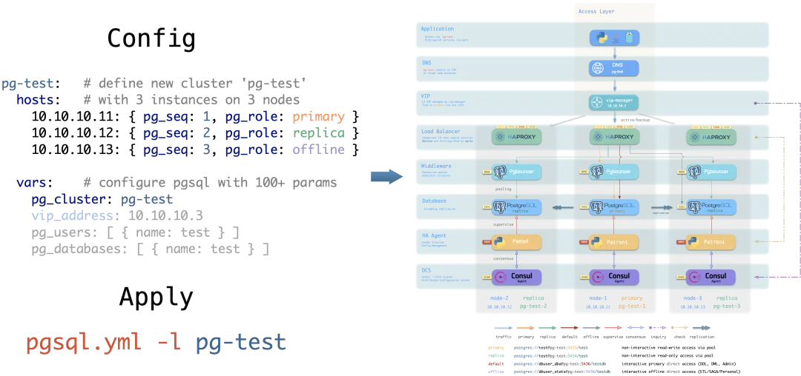

您可以用同样的方式完成 主从，集群，Sentinel 的 **Redis** 集群部署。

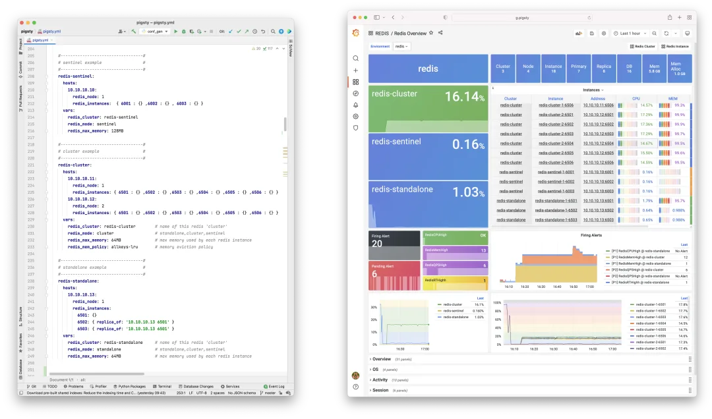

您可以一键创建多节点的 **ETCD** 集群，为 PG 集群提供高可用的 DCS 服务

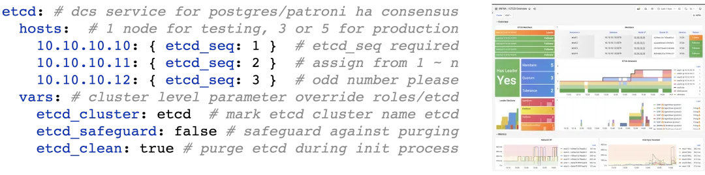

也可以轻松部署分布式 **MinIO** 集群，作为可选的集中式数据库备份仓库

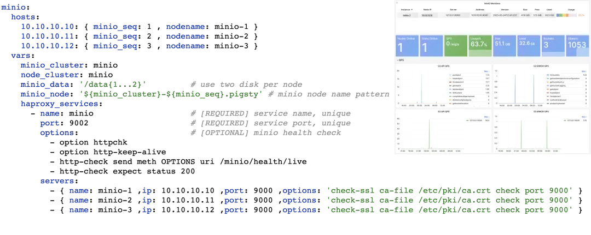

5 节点 HA Citus 分布式数据库集群，配置依然非常简单。

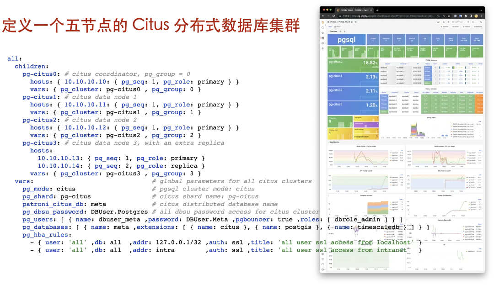

您也可以深度定制 DB 内容与业务用户，200+可深度定制的参数，足以满足最龟毛的 DBA 的定制服务。

尽管这里有这么多的配置参数，但你也无需感到恐慌打怵。部署一个单机数据库，只有 4 个必选身份参数。想要添加定时备份任务？一行 Crontab 定义，一条命令完成部署！

想要扩容一台只读从库，添加一行配置就能满足。

想要启用同步提交，没有复制延迟的从库，并对外暴露同步读取服务，也只需要一个参数。

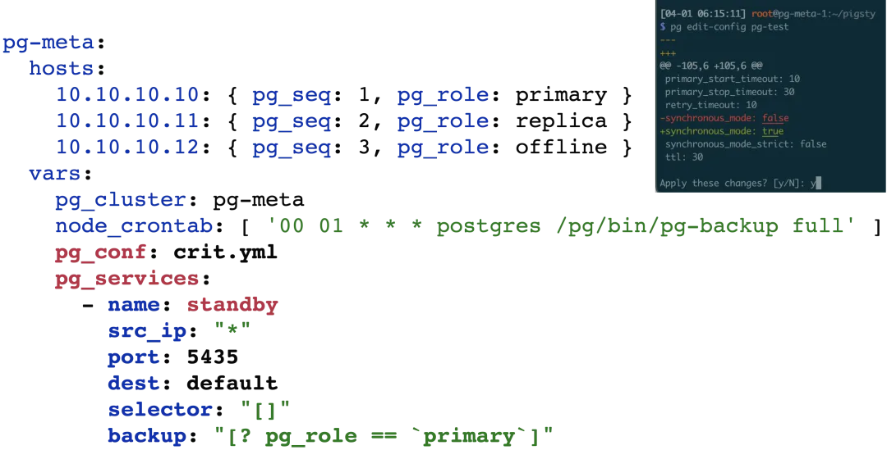

Pigsty 默认会使用 HAPROXY 分发流量，但你依然可以为集群绑定一个 VIP 避免 LB 单点。而这所需的也不过是 VIP 地址与网卡名参数。

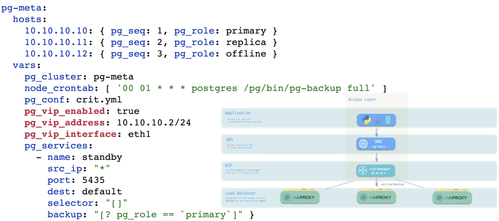

你还可以 Fork 现有集群，搭建异地灾备集群甚至延迟从库。一旦出现各种失误，你可以快速从延迟从库中恢复。如何创建延迟从库？三行配置，一个 UPstream 参数。

## 小结：更好的 RDS 替代

刚才我们逐层递进介绍了需求金字塔，概括起来也就不过就是四句话：**人无我有，人有我优，人优我易，人易我廉**。这里我们的参照对象是云 RDS。

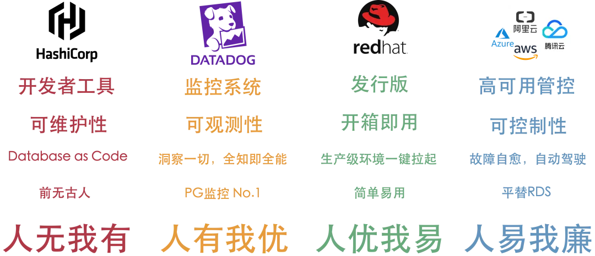

尽管阿里腾讯最近也有可用区也爆出来了大故障，**但在基本的功能安全可靠需求上，云数据库做的并不赖**。尽管用的是网络存储云盘，但性能也算说得过去；更是在弹性/Serverless 上更是卷出了全新高度，**只可惜因为十几倍的杀猪定价让 ROI 跌破谷底，显得不那么体面**。更重要的是，**在更高层面上的功能几乎是一片空白，用户需求无从满足**。

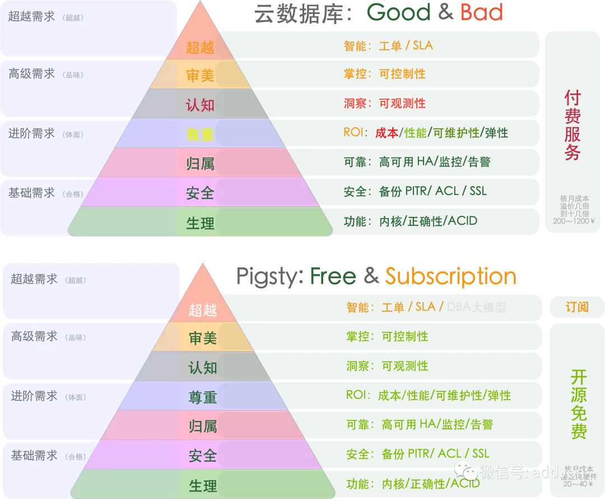

我们的目标不仅仅是做一个 RDS 的开源替代。云 RDS 有的我们都会有，更重要的是，**云 RDS 没有的，我们也会有**，**而且我们要做的更好，让开源免费的软件，在各方面吊打商业付费的 RDS 服务**。

**Pigsty —— 让天下没有难用的数据库！谢谢大家。**

### References

- `[1]` 心路历程｜一份开源创业公司的 Playbook： *<https://mp.weixin.qq.com/s/2s-t-BIjGcT9hOPz3rZNeg>*`[2]` 企业实践开源的动机： *<https://mp.weixin.qq.com/s/NYC_beiBvsxCjkocA1FUZA>*`[3]` 《中国开源创业观察 2022》: *<https://gitee.com/report/china-open-source-2022/startup-insight>*`[4]` Kubernetes：The Documentary [PART 1]: <https://www.youtube.com/watch?v=BE77h7dmoQU>

---

发布版本：[微信公众号](https://mp.weixin.qq.com/s/-E_-HZ7LvOze5lmzy3QbQA)
