**Pigsty v2.4.1**已于 9 月 24 日正式发布。核心关注点是：**如何**聚拢**PostgreSQL 生态里游离的超能力，发挥出 1 + 1 远大于 2 的协同增幅效果。**

 我们引入了 12 个由自己编译打包、整合维护的全新扩展，并加入了三个强力组件的原生支持： **Suapbase**，**PostgresML** 与 **FerretDB**。让 Pigsty 收录的扩展数量已经达到了破纪录的 150 个，全部开箱即用！

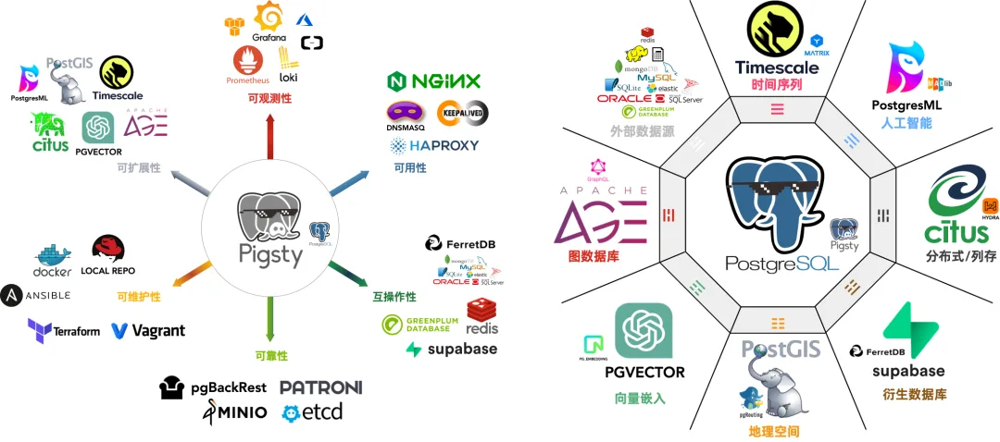

在这些新增/现有扩展的加持下，PostgreSQL —— 这个世界上最先进的开源关系型数据库，已经堪称是 **数据库全能王** 了。

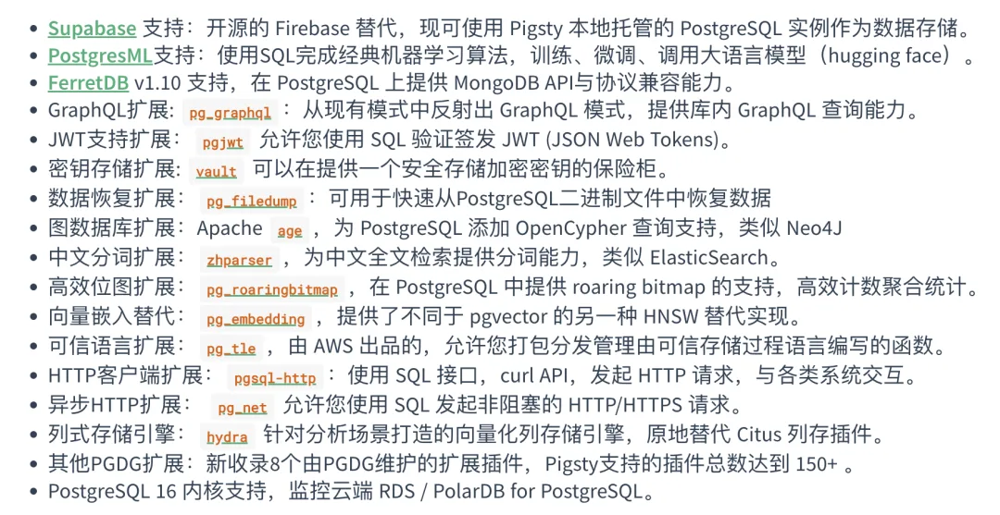

**Supabase** 是一个有着 57K Star 的明星项目，基于 PostgreSQL 提供 Firebase 的开源替代。而 **PostgresML** 则是在 Postgres 里搞大模型训练调用/经典机器学习算法的当红炸子鸡。**FerretDB** 则提供基于 PG 的 MongoDB 兼容性：Pigsty 与这些社区都建立了良好的合作关系。

## Supabase

我先前一直倡导一种基于 PostgreSQL 进行**低代码**开发的理念 —— 你只要设计好数据库模式，其实大部分后端代码编写是可以自动化生成的。

像 PostgREST 这样的工具可以自动从中反射生成定义良好，文档详实的 RESTful API。也有像 PostGraphile 这样的工具可以自动反射出 GraphQL API，最后，使用 Kong 这样的 API 网关套一层，解决好认证、日志、限流的问题。用户完全可以在一行后端代码都不写的情况下，完成一个完整业务应用的开发。

Pigsty 确实也整合并提供了这些趁手的工具，但而 supabase 不仅实现了上面这个愿景，更是将其实现到了一个全新的高度。

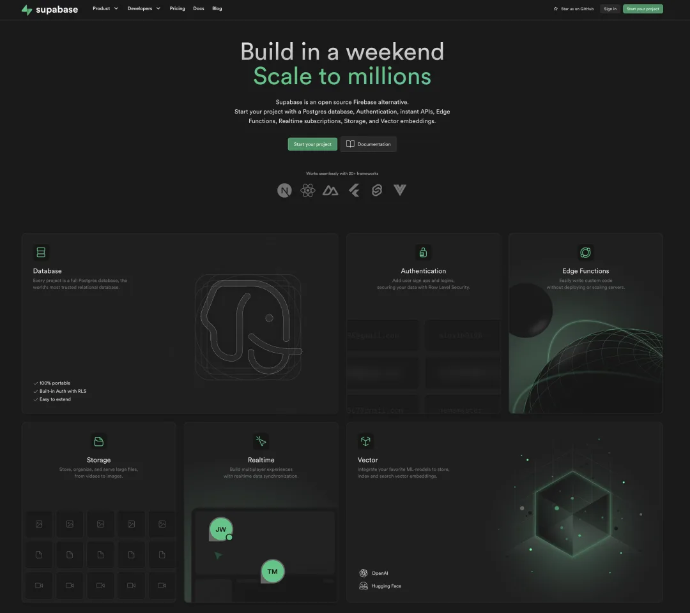

Supabase 帮全栈应用开发者补完了从数据库到前端之间的鸿沟：一键完成各种认证接入（邮件密码/手机号/魔法连接/社交网站登陆等等）；自动生成数据库 REST API 与 GraphQL API，通过 Websocket 发送数据库变更的实时通知，提供完整的文件上传下载/断点续传/图片变换/CDN 分发功能，以及在全球分发管理 CDN 边缘 TS 函数，还提供一个优雅的管理控制台 GUI 与命令行工具管理所有一切。

Suapbase 的所有的功能都围绕 PostgreSQL 这个核心，并通过 Kong API 网关对外暴露。有了 Supabase，用户不需要再操心经典“后端”的实现细节，只需要做好数据库模型设计，与前端 API 调用就够了。

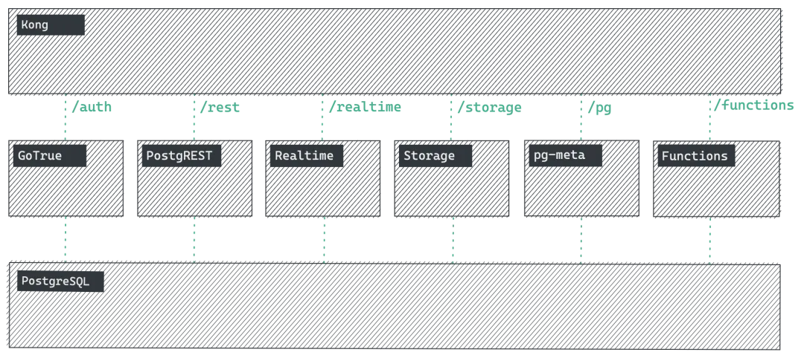

supabase 组件架构图

Supabase 封装了一部分 PostgreSQL 数据库管理的工作，包括一个单实例的 PostgreSQL 内核，加上自行维护的 `pg_graphql`, `pg_net`,`vault`,`pgjwt` 等扩展插件，充分利用了触发器，全文检索，密钥存储功能。提供了基础的 PITR 备份支持，还不错的安全管理最佳实践，与一个数据库管控 GUI 工具：Supabase Studio，可以说，对于一个起步阶段的应用来说是没问题的。

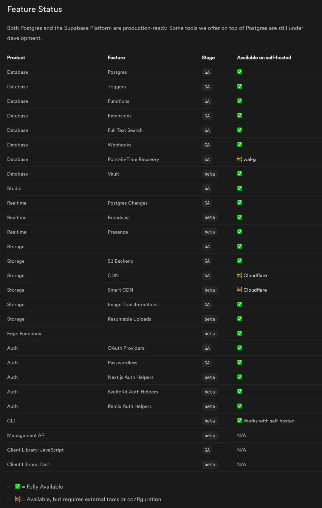

当然对于一个严肃的生产应用来说，数据库这部分还有许多问题有待解决：Supabase 的 Postgres 中仍然缺少 PostgreSQL 生态里的许多功能扩展，单实例+PITR 的设计也不足以克服硬件失效带来的可用性冲击。在可靠性，安全性，性能，可观测性上也都还有许多薄弱环节。

但是不用担心，Pigsty 会帮助 Supabase 解决这些问题 —— 您现在可以使用由 Pigsty 所创建托管都故障自愈的多节点高可用 PostgreSQL 集群来承载 Supabase 上层的无状态服务部分。开源生态的魅力就在这里 —— **每个人干好自己最擅长的事情，而所有人都可以从中受益！**

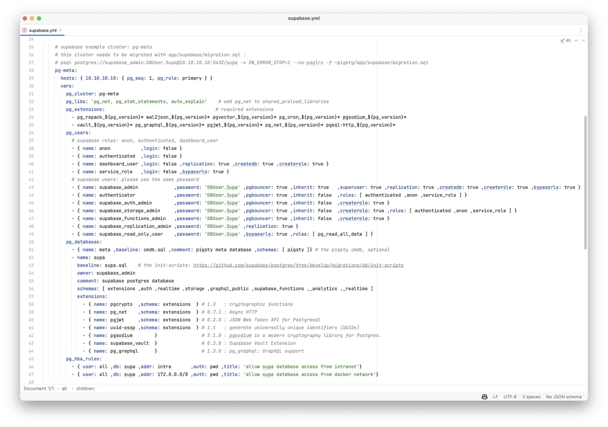

### 一键拉起 Supabase 所需的数据库

您只需要使用默认的 supabase 模板，即可一键部署 Supabase 所需要的数据库集群，您不需要操心用户、扩展、模式、HBA 这些细节。只需要在`.env`配置文件模板中填入数据库连接串，然后 `docker compose up`，你的 supabase 就立即进入可用状态了！

## PostgresML

另一个 2.4 带来的的重大更新是 **PostgresML**。AI 时代带火了向量数据库，这个方向上`pgvector` 已经交出了一份足够令人满意的答卷。但是存储嵌入只是 AI 生态对数据库需求的一部分，AI 的灵魂还是**模型**。PostgresML 则弥补了这一点缺憾：现在您可以在数据库中用 SQL 调用经典机器学习算法，以及直接调用 —— Hugging Face 上的模型，进行训练，微调，与预测。

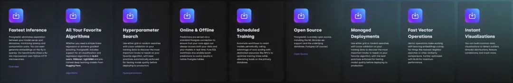

PostgresML 是用 RUST 编写的扩展，在一些运算密集型任务上使用 RUST linalg  / BLAS 线性代数库取得了相比 Python 8x - 40x 的性能表现。更重要的是：它为 Python3 机器学习/AI 工具链提供了 SQL Binding。以前您需要自行处理模型的选用，下载，部署与管理问题。而现在您不需要再了解这些繁琐的细节了！直接用拿着模型名字调函数就够了！

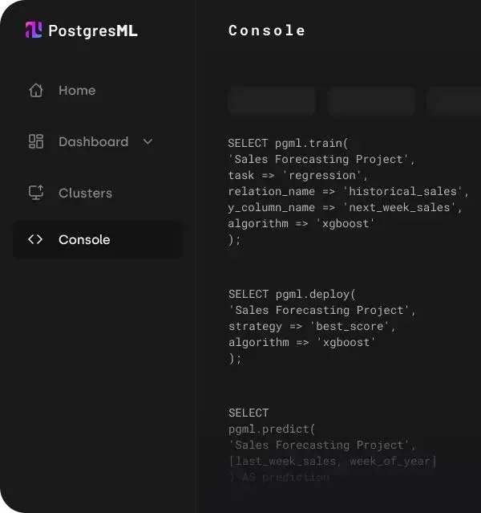

PostgresML 可以直接下载 Hugging Face 上的模型，对输入进行 Embedding，生成向量，并使用 `pgvector` 进行存储。让整个语义搜索的工作流在数据库内部完成**闭环**！原地完成数据准备、训练微调、预测输出、结果存储。

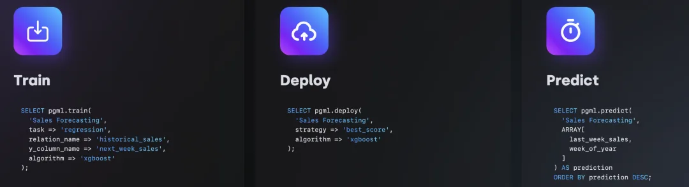

尽管 PostgresML 提供了官方 Docker 镜像，但它与各种 Postgrs 衍生镜像有着同样的问题 —— 难以利用好 PostgreSQL 生态系统的合力。您没有办法轻易为其加装想要的扩展并与其组合使用，以及，单机容器实例对于生产应用实在是过于简陋了。

Pigsty 可以帮您解决这个问题，您可以在拥有地理、时序、图、向量、全文检索、GraphQL，HA / PITR / IaC / Monitor 等能力的同时，一键加装 PostgresML 扩展。PGML 与其他扩展的唯一区别就是，需要一些额外的 python / pip / virtualenv 环境的简单配置。但我相信这两行命令肯定也难不倒你。\

## FerretDB

FerretDB 是另一个非常有趣的项目，之前的名字叫 “**MangoDB**”，因为有碰瓷 "MongoDB" 的嫌疑，所以在 1.0 版本改成了现在的名字。但这不影响它的效果 —— 在 PostgreSQL 上提供 MongoDB Wire Protocol 支持，让 PG 假扮成一个 MongoDB！上次做这种事的插件是 AWS 的 Babelfish，让 PostgreSQL 兼容 SQL Service 的线缆协议假扮成 MSSQL。

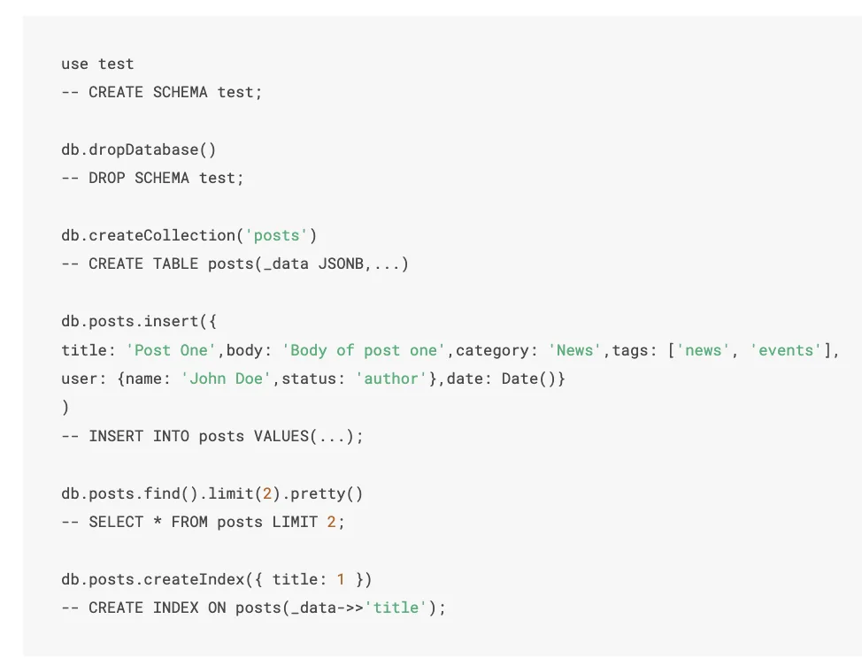

PostgreSQL 的 [**JSON**功能](/pg/vector-json-pg/) 已经非常完善了：二进制存储 JSONB，GIN 任意字段索引，各种 JSON 处理函数，JSON PATH 和 JSON Schema，它早已是一个功能完备，性能强大的文档数据库了。PostgreSQL 生态里还有 `mongo_fdw` 这样的组件，允许用户用 SQL 来访问现有的 MongoDB 数据。

但是提供替代的功能，和**直接仿真**还是不一样的。FerretDB 就可以为使用 MongoDB 驱动的应用程序提供一个丝滑迁移到 PostgreSQL 的过渡方案。MongoDB 中的主要特性：文档数据模型、运算符/函数，索引、增删改查，聚合等等都没啥问题。不过您要是用到了一些高级特性，那就不一定照顾的到了。

Pigsty 在 1.x 中就提供了基于 Docker 的 FerretDB 模板，在 v2.3 中更是提供了原生的部署支持。在 v2.4.1 中，FerretDB 更新到了 v1.10 版本。它作为一个选装项，是丰富 PostgreSQL 生态大有裨益。Pigsty 社区已经与 FerretDB 社区成为了合作伙伴，后续将进行深度的合作与适配支持。

## zhparser

PostgreSQL 的 JSON 特性可以对标 MongoDB，而在全文检索能力上也有对标 ElasticSearch 的东西 —— TSQuery 与 TSVector。不同于 MySQ L 凑数的 ngram “全文检索” 实现（PG 对应物叫 `pg_trgm`），PostgreSQL 自带了各种语言的分词算法，开箱即用。唯一让人遗憾的就是，许多西文都天然会使用空格进行分词，但中文分词的问题要麻烦的多，针对西文的自带分词算法并不好使。

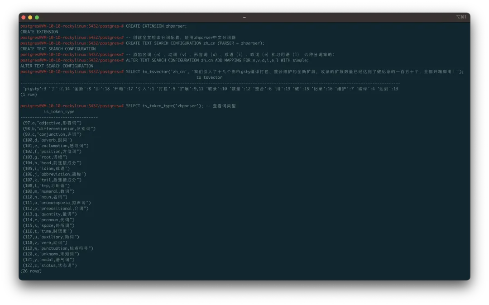

`zhparser` 的出现解决了这个问题。`zhparser` 使用 `scws` 项目进行中文分词，默认词库中标注了大量汉语词性，便于用户在创建分词配置时进行深度的定制。Pigsty 为 `scws` 与 `zhparser` 维护了 RPM 包，让用户可以开箱即用，体验完整的中文全文检索能力。

更有趣的是，向量数据库的语义搜索，也可以与这里的全文检索**组合使用**，向用户返回更具有**可解释性**的结果。

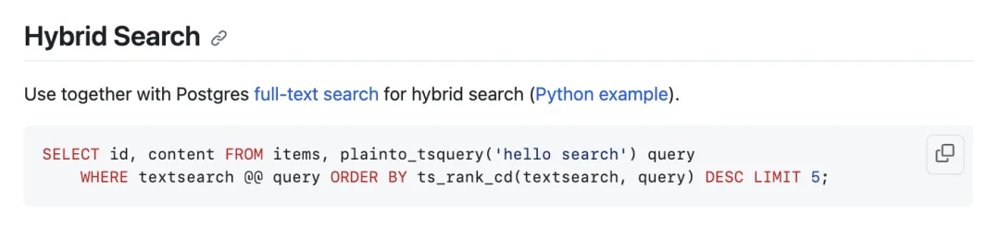

## Apache AGE

另一个在 v2.4 引入的 PostgreSQL 强力扩展插件是 **Apache AGE**，AGE 是 "A Graph Extension" 的缩写 —— “一个图数据库扩展”。AGE 最初是另一个 PostgreSQL 上的图数据库扩展 AgensGraph 的分叉，并在 2020 年进入 Apache 基金会，2022 毕业为顶级项目。

AGE 的功能就是为 PostgreSQL 添加图数据库的能力。尽管 PostgreSQL 本身已经提供了类似的机制 —— **递归查询**。但是 AGE 把原汁原味的 Cypher 图查询语言添加到了 PG 里，而且还能完全兼容现有的 PostgreSQL ACID 能力。并允许你您混合执行 Cypher 查询与 SQL 查询进行数据分析。

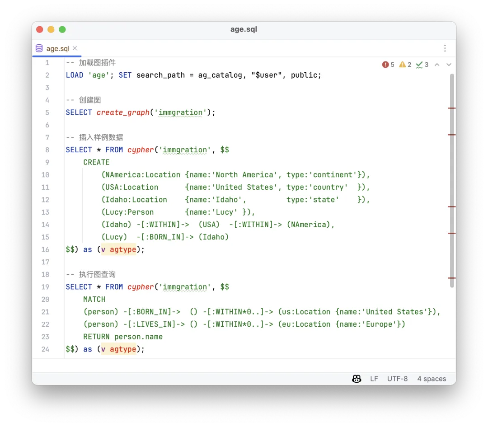

对于图数据库来说，Cypher 语言提供的 MATCH 非常有表达力。例如上面 4 行 Cypher 查询如果用 PostgreSQL 的标准建模方式与递归查询能力，其实也是可以实现的，但显然要啰嗦上许多。

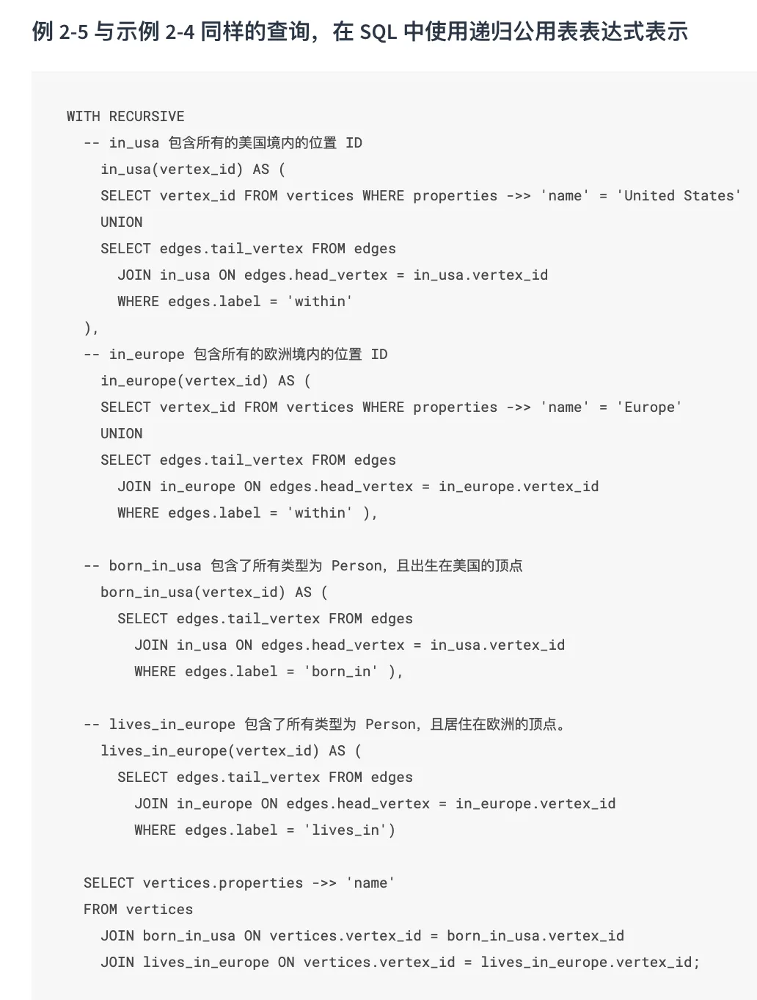

## PG GraphQL

说起图来，除了 Neo4J 这类“图数据库”，还有一个与数据库有点关系的东西 —— GraphQL：这是与 REST API 对应的一种 API 设计新范式。

GraphQL 为 API 提供了一种声明式的查询语言：用户声明自己想要什么东西，并获取可预期的结果；一次请求可以拿到多种所需的资源，避免重复调用手动拼接；自带的类型系统、IDE 工具让 API 的使用更加简便。

这也是 supabase 超能力的一个重要来源 —— `pg_graphql`。这是一个使用 RUST 开发的 PG 插件，由 suapbase 团队维护。想要在托管 PostgreSQL 实例上运行 Supabase，首先要解决的就是这些 Supabase 专有扩展的问题。Pigsty 已经帮用户把这部分做了：不过只支持 EL 8/9 上的 PG 14/15。

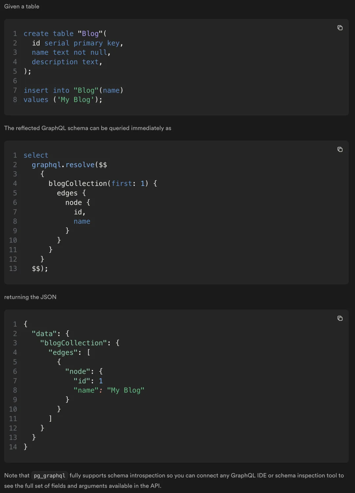

为 PostgreSQL 添加 GraphQL API 支持这件事，早在 七八年前就有人做过了，比如 postgraphql，就可以反射 PG 内部的模式，并自动生成查询数据库的 GraphQL API。

然而，还没有一个工具能像 `pg_graphql` 这样，直接在 PostgreSQL 数据库内部，通过内建函数的方式，提供了原生的 GraphQL 查询支持！这意味着你不需要维护任何额外的组件，就可以使用全新的语言来访问 PostgreSQL 的数据了。

## PG NET/HTTP

用 SQL 接口发送接收 HTTP 请求并不是一个新鲜事儿，Oracle 的 `UTL_HTTP` 包就是干这个的。PostgreSQL 也可以通过各种语言的存储过程来发送 HTTP 请求。但 `pgsql-http` 与 `pg_net` 则利用原生的 `curl` API，提供了 SQL 直接可用的 HTTP 接口，发送同步/异步请求，并处理响应数据，这显然比写存储过程要优雅多了！

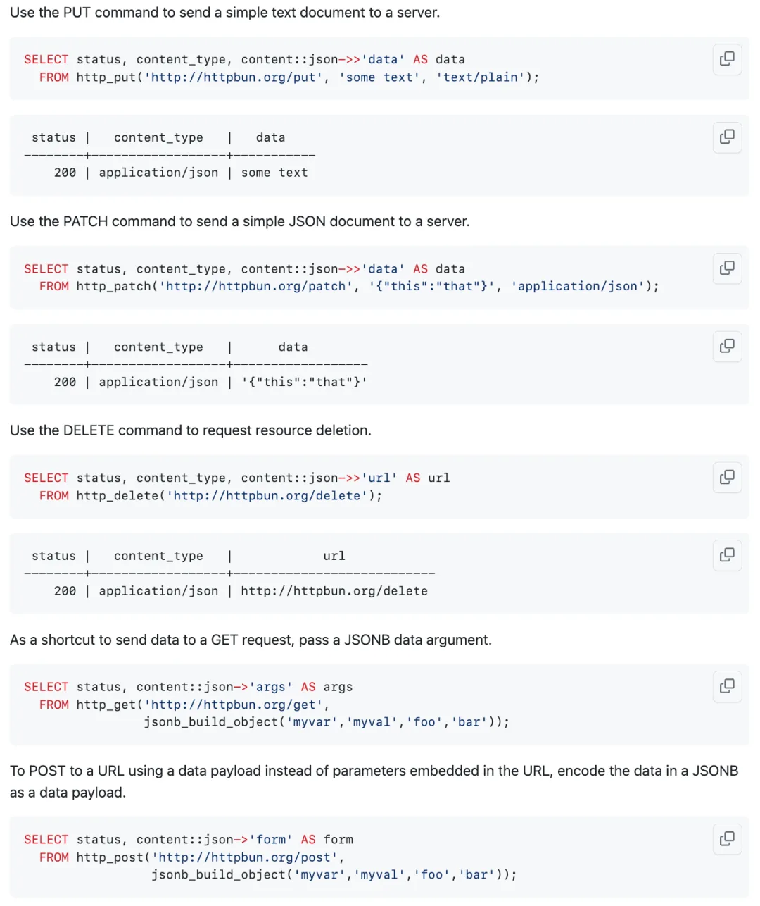

您可以直接使用 SQL 构建 HTTP 请求，拼接首部，使用 `pgcrypto` 对请求进行签名。同步/异步发送 HTTP 请求，并使用 JSON 特性来解析处理结果，这项特性有着近乎无限的想象空间 —— 可以玩出许多“骚操作”。比如，如果你的咖啡机可以响应 HTTP 请求，那么调用 API 就能让你的数据库煮咖啡的能力了。

你可以在数据库内写爬虫，查询天气，拉取账单，也可以用这个能力来实现一些更有生产价值的功能，比如任务执行完毕后发送通知，或者当表/行出现增删改时通过 HTTP 请求与外部进行通信同步：或者实现类似于 Infra as CMDB SQL 的效果。

## PG FileDump

`pg_filedump` 是 v2.4.1 引入的另一个“扩展”。它实际上是一个 PG 版本相关的二进制程序：可以用来从 PostgreSQL 数据页面中抽取数据。当您的数据库或者磁盘爆炸又没有备份的话，它会成为一棵救命稻草。

引入它的契机正是因为最近我们接了一个比较离谱的 PG 数据恢复的活儿，只有一些残余的二进制文件可供抽取还原。而 `pg_filedump` 就是这样一个趁手的工具。使用起来也很直接，用 `-D` 告诉 `pg_filedump` 如何解释表二进制文件里每一行的二进制数据就可以了。关于它的用法，后面我们准备了一篇关于底层数据恢复的案例，将于最近几天发出。

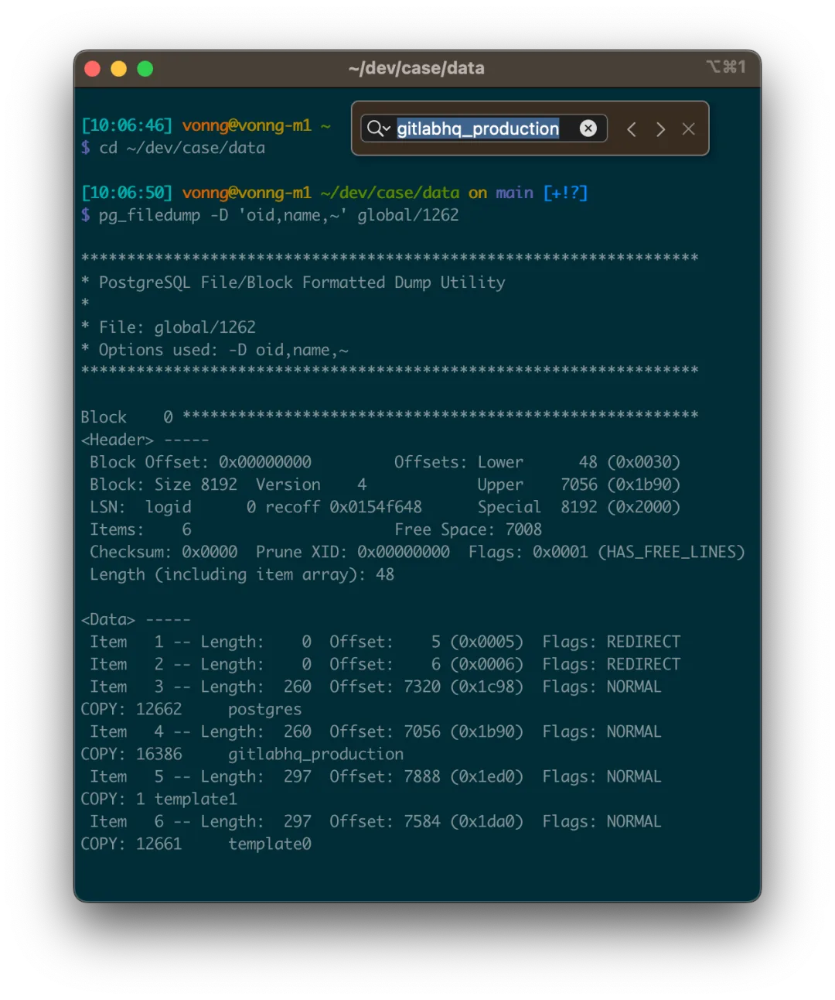

尽管 `pg_filedump` 还存在一些局限性：例如对于复杂的 JSON/数组数据处理还有缺陷。但作为一个应急工具来说，已经足够好用了。我们针对 PG 12 - 16 提供了此扩展。我们希望您永远也不要用到这个扩展，但我们也希望：当您需要它的时候，它已经在那里了。

## Hydra / Citus

Hydra 是一个列式存储扩展，旨在为 PostgreSQL 提供高性能的向量化列存储扩展。PostgreSQL 生态其实已经有一些列式存储扩展，例如 Citus 自带的 `columnar`，以及 TimescaleDB 针对时序数据的压缩列存引擎。不过看起来 `hydra` 在这个领域又达到了新的高度：在它给出的样例场景中（500G count），它可以达到令人震惊的加速比：从四五分钟到亚秒级。

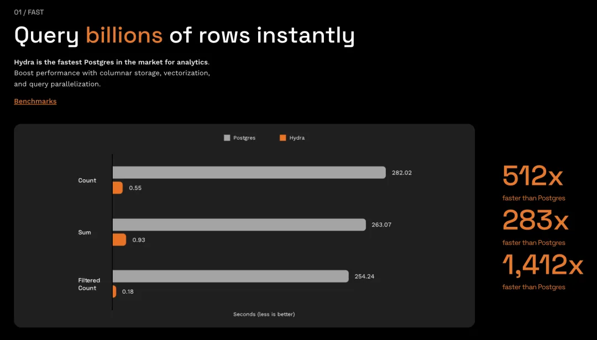

Hydra Fork 自 **Citus** 的列存插件 `columnar`，但进行了许多改进优化，例如矢量化执行，查询并性化，并进行了一系列针对性的调优。`hydra` 目前已经 1.0 GA，Pigsty 针对 PG13 - 15 提供了它的 RPM 包，放在 Pigsty 官方 yum 源中。

不过目前 Pigsty 的离线软件包里默认并没有收录它，因为它与 Citus 的 `columnar` 有同名冲突。Hydra 的列存插件号称可以原地替换掉 Citus 的列存实现，所以您依然可以方便地通过简单配置，一键安装替换。

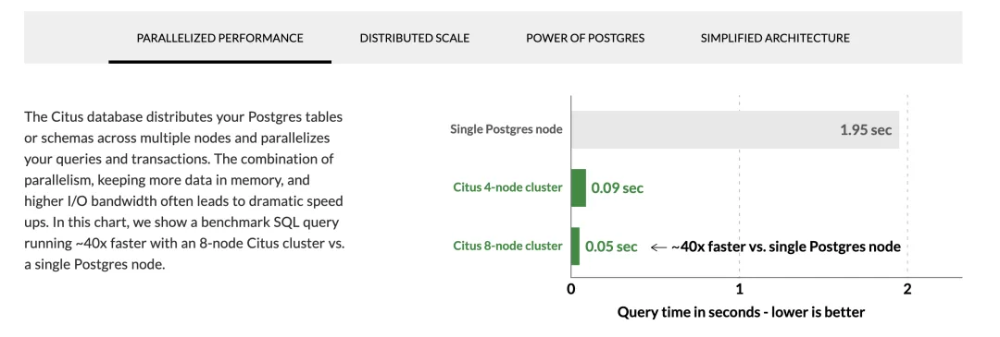

这里顺带一提，除了上面介绍的几个新增扩展外，Pigsty 本身也早已经支持了许多经典扩展，例如 Citus 就是最重要的扩展之一。Citus 可以将经典的主从 PG 集群原地改造为一个水平分片的分布式数据库集群，提供 scale out 与并行加速的能力。

Citus 被微软收购后变为 Azure 上的 Hyperscale for PostgreSQL 数据库，且使用 AGPLv3 协议完全开源。原本企业版的能力（例如在线分片平衡）也完全开源可用了，对于分布式 SQL 的支持程度要比许多基于中间件的方案还要靠谱得多。

Pigsty 很早便提供了对 Citus 的第一等支持：您可以方便地一键搭建由 Patroni 管理的高可用 Citus 水平分布式集群组，享受灵活的动态扩缩容与分布式 HTAP 查询能力。

## Embedding / Vector

向量数据库大火，PG 生态的 PGVECTOR 就是我们提进 PGDG 官方仓库的，所以我们之前也写了一些专题文章进行介绍（《[PGVECTOR 与 AI 大模型](/pg/llm-and-pgvector/)》）。不过 PostgreSQL 生态的向量数据库扩展，可不是只有 `pgvector` 一个选手，另一个有些许竞争力的向量扩展是 `pg_embedding`。

`pg_embedding` 由 PostgreSQL 当红炸子鸡创业公司 `neon` 维护，主打的卖点是性能：HNSW 索引比 IVFFLAT 有一些显著的优势。不过 PGVector 在最近的版本 [v0.5 之后也提供了 HNSW 索引](/pigsty/v2.1/)，所以这里的利弊权衡就比较微妙了。

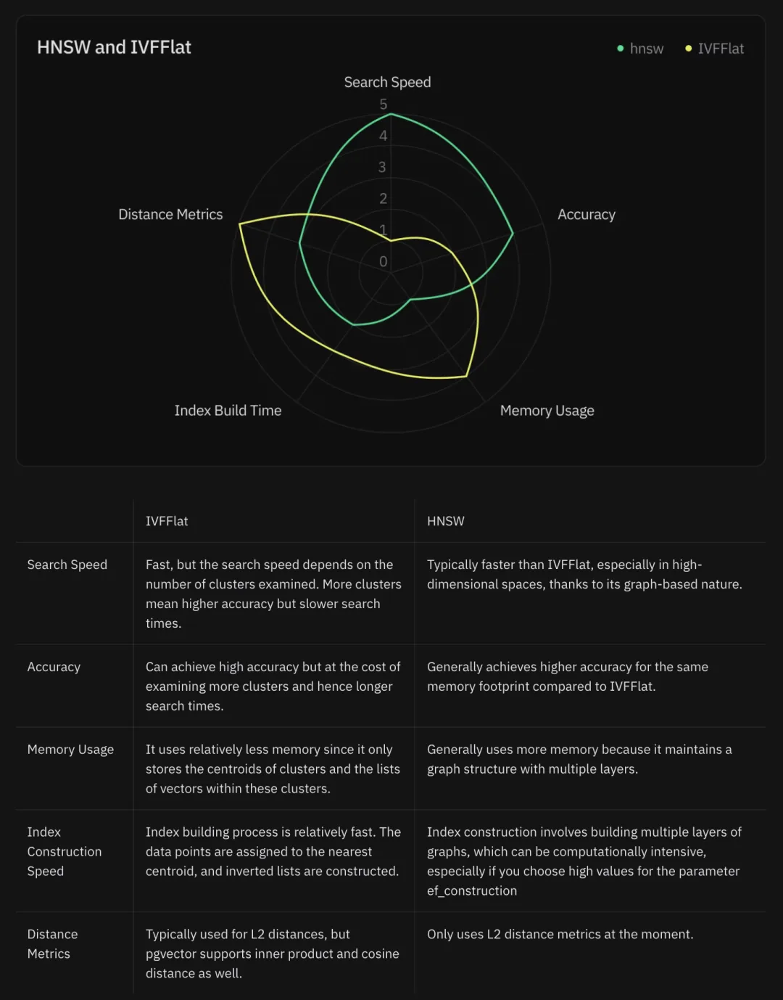

不同于 `pgvector` 使用独立的新类型 `vector`，`pg_embedding` 是建立在 PostgreSQL 现有的浮点数组类型之上的：向量的数据类型是 PostgreSQL 原生的 `real[]`。这种做法有利有弊：好处是不需要一个新类型，坏处是它指定死了浮点数的精度（Float4），不利于后面添加降低精度/量化之类的功能实现。但总之，我们也将其收录到了 Pigsty 的扩展列表中，供用户选用与评估。

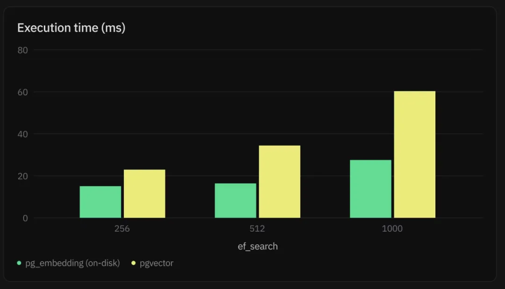

此外，还有几个向量扩展插件，例如使用 RUST 重写的 `pgvector.rs`，以及刚冒出来的 Latern。前者功能已经被 PGVector 完整覆盖，后者则是 `pg_embedding` 的拙劣分支换皮，因此并未收入 Pigsty 中。

## 经典的时空扩展

除了上面介绍的几个新增扩展外，Pigsty 本身也早已经支持了许多经典扩展，例如 **PostGIS** 与 **TimescaleDB**。便是为 PostgreSQL 提供了地理空间时序事件处理的能力，堪称 PG 的杀手级扩展。每一个的分量都配得上一个专用数据库的称号，但它们却愿意选择成为 PG 生态的扩展，而不是自立门户。\

PostGIS 的能力不用过多介绍，做 GIS 的人都懂。MySQL，Mongo 这些数据库确实跟进了一些 ST_XX 空间函数，但是在 PostGIS 依然有着碾压性的优势：它已经成为了地理空间信息处理的**事实标准**了。

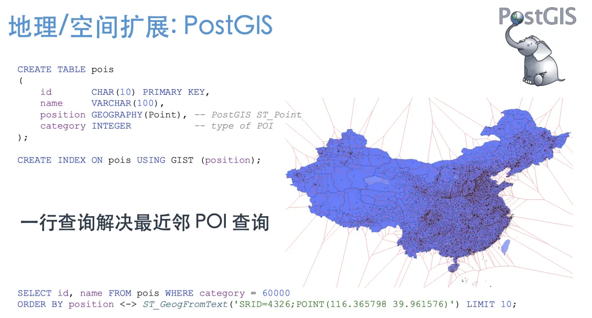

TimescaleDB 为 PostgreSQL 提供了一系列非常实用的功能：强大的写入能力，完整的 SQL 能力，时间桶聚集函数，持续聚集，数据生命周期管理：设置分区/分级/压缩/降采样/保留策略，列存储/分布式实现，覆盖了时序相关数据的方方面面。\

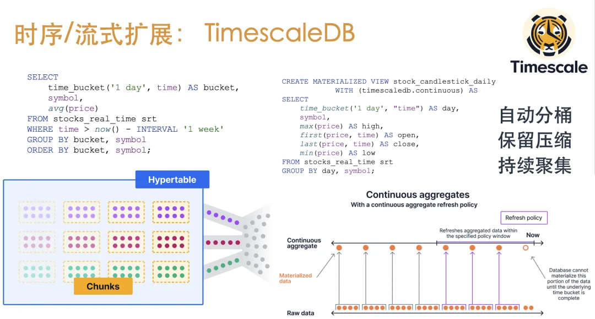

在 benchant 提供的时序数据库测评中，TimescaleDB 是唯一上榜的“扩展”，排在专用时序数据库 IoTDB 与 QuestDB 之后。尽管在性能单项上与榜一大哥有差距，但数据库领域比拼的从来都是综合实力 —— 它的背后，还站着整个 PostgreSQL 生态系统。

专用数据库并非不好：专用组件在自己领域中的实力毋庸置疑。但正如向量数据库领域正在发生的事一样：那些使用多种专⻔数据库客户会不断遇到这类典型问题：数据冗余、大量不必要的数据搬运工作、分布式组件之间的缺乏数据一致性、额外的专业技能劳动力成本、额外的软件许可成本、有限的查询语言能力、可编程性和可扩展性、有限的工具集成、以及与真正数据库相比更差的数据完整性和可用性。

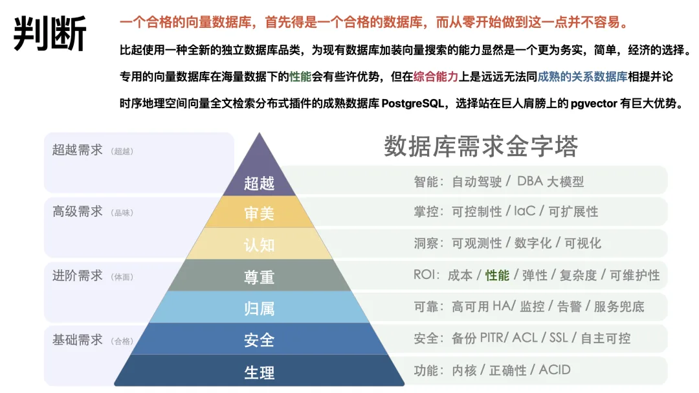

## 其他扩展

Pigsty 提供了 150+ 扩展插件（包括 PG 自带的一些 Contrib 插件），一次性同时把所有 150 个扩展安装上去是可行的，尽管这可能是一种相当疯狂的做法。

好在**所有**的扩展插件都是**可选项**，您完全完全可以按需定制，选择自己想要启用哪些扩展插件。Pigsty 确保所有这些扩展都可以一键从 Yum 安装，正确地 `CREATE EXTENSION` 不出错。对于重要的核心扩展来说，Pigsty 更是通过各种测试确保它们可以稳定运行并协同工作。

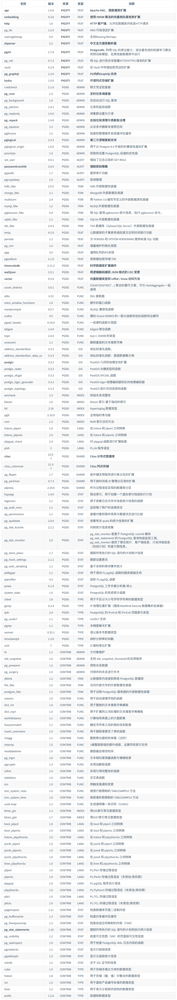

Pigsty 会为您**默认安装**一些重要的扩展：PostGIS，TimescaleDB，Citus，PGVector，PG Repack，wal2json。但并不是所有默认安装的扩展都会被激活：Pigsty 为您“自作主张”默认启用了 `pg_stat_statements` （查询监控），`pg_repack` （膨胀维护）以及 `timescaledb`（时序支持），您完全可以通过配置将其禁用。

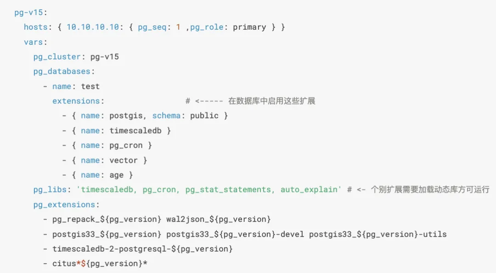

除了上面介绍的插件之外，PG 生态还有许多许多未被 PGDG 与 Pigsty 收录的扩展。如果您有一些想用的扩展没有被收录，欢迎在 Pigsty 仓库中提 Issue，或者使用 Pigsty 提供的编译基础设施自行打包、分发使用。

## The Linux of Database

可以说，在上面这些扩展的加持之下，PostgreSQL 已经从一个强大的关系型数据库，变成一个怪兽级的多模态数据库全能王：**自主可控自动驾驶时序地理空间 AI 向量分布式文档图谱全文检索可编程超融合联邦流批一体 HTAP Serverless 全栈式平台数据库**。

PostgreSQL 是**一专多长的全栈数据库**，天生就是 HTAP，超融合数据库，基本单一组件便足以覆盖中小型企业绝大多数的数据库需求：在关系型 OLTP 上对标 Oracle/MySQL，有 JSONB/GIN 对标 MongoDB，有 PostGIS 对标地理空间数据库，有 TimescaleDB 来对标时序/流数据库，有 Citus/Hydra 来对标分布式/列存储/HTAP 数据库，有全文检索来对标 ElasticSearch，有 AGE/EdgeDB 来对标图数据库，有 pgvector 来对标专用向量数据库。这些惊人的多模态能力，正是源自 PG 的扩展能力。

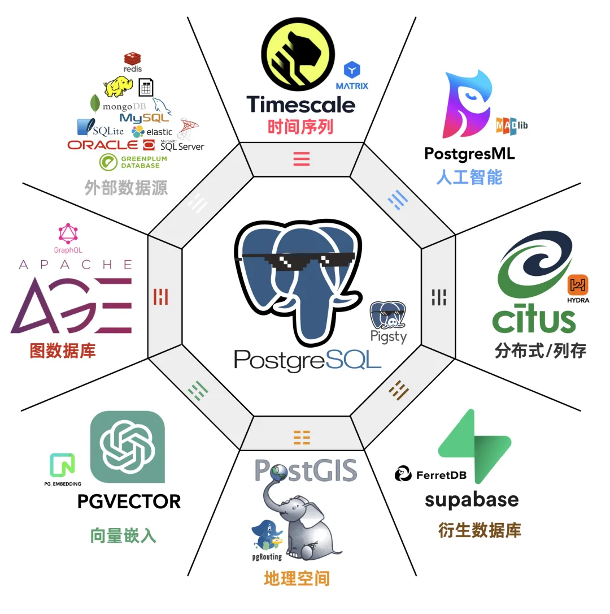

PostgreSQL 的可扩展机制与插件系统，让它不再仅仅是一个单线程演化的数据库内核，而可以有无数并行发展的支线，像量子计算一样同时探索各种方向上的可能性。每一个数据处理的细分垂直领域 PG 都不会缺席。就好比最近**向量数据库**领域大火，别的数据库都还没反应过来，PG 生态立刻就涌现出好几个相关插件，以迅雷不及掩耳之势抢占了这一块生态位。更有趣的是，**扩展完全是按需启用的**可选项**，并不会影响内核主干的稳定性**。

我认为在当下，[数据库领域即将迎来 Linux 时刻](/pg/pg-is-no1/) —— **PostgreSQL 成为数据库领域的 Linux 内核**。你并不难找到某个专业数据库在某个专业领域比 PostgreSQL 干的更漂亮：**但没有一个其他数据库能够与所有扩展加持下的 PostgreSQL 比拼综合实力**，包括 Oracle：是的，开源免费本身也是一种实力！

在一个相当可观的规模内，PostgreSQL 都可以独立扮演多面手的角色，一个数据库当多种组件使。更美妙的是，这些扩展的能力可以融合在一起，发挥 1+1 远大于 2 的效果来。单一数据组件选型可以极大地削减项目**额外复杂度**，节省大量成本与开发时间。如果真有那么一样技术可以满足你的各种数据需求，那么使用它就是最佳选择，而不是试图用多个组件来重新实现它。

而 Pigsty 的[愿景](/misc/modb-interview-vonng/)，就是凝聚这些 PostgreSQL 生态的合力，并让所有这些能力，都对用户唾手可及。当然，那就是另一篇要说的故事了。

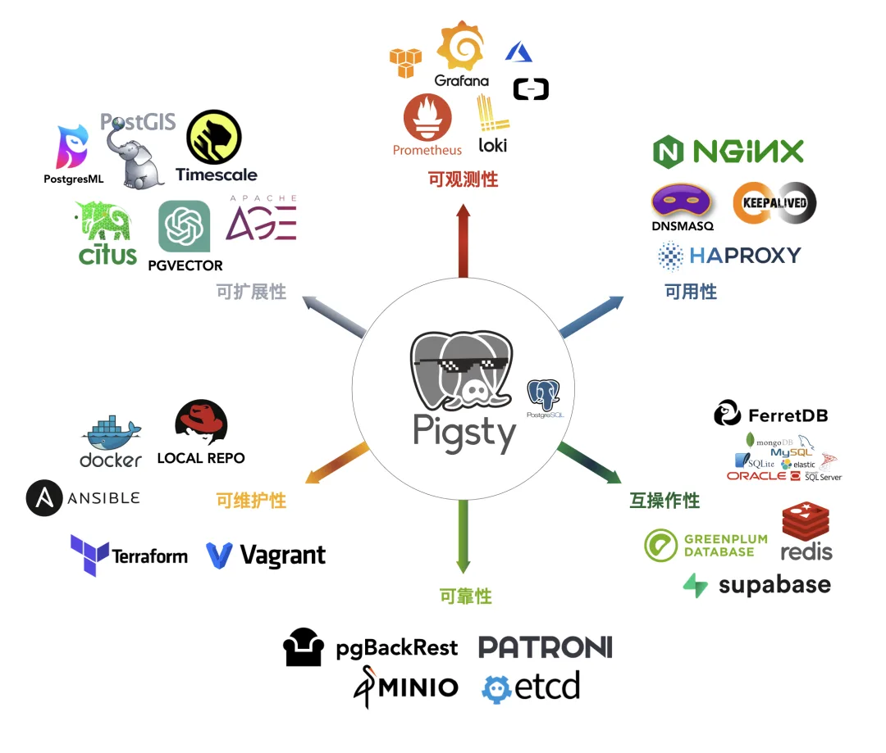

---

发布版本：[微信公众号](https://mp.weixin.qq.com/s/y3qY9eBfOic6tQYOiErIHg)
