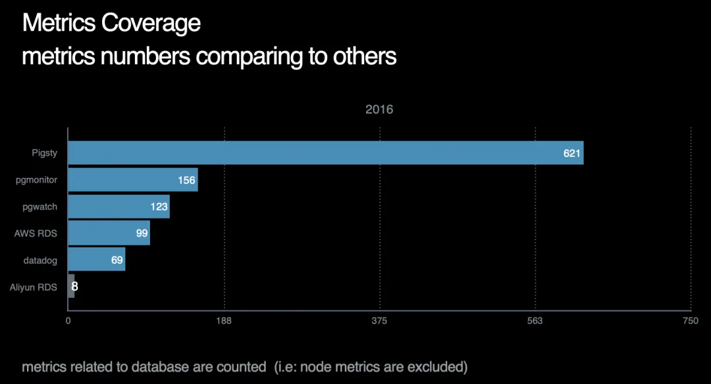
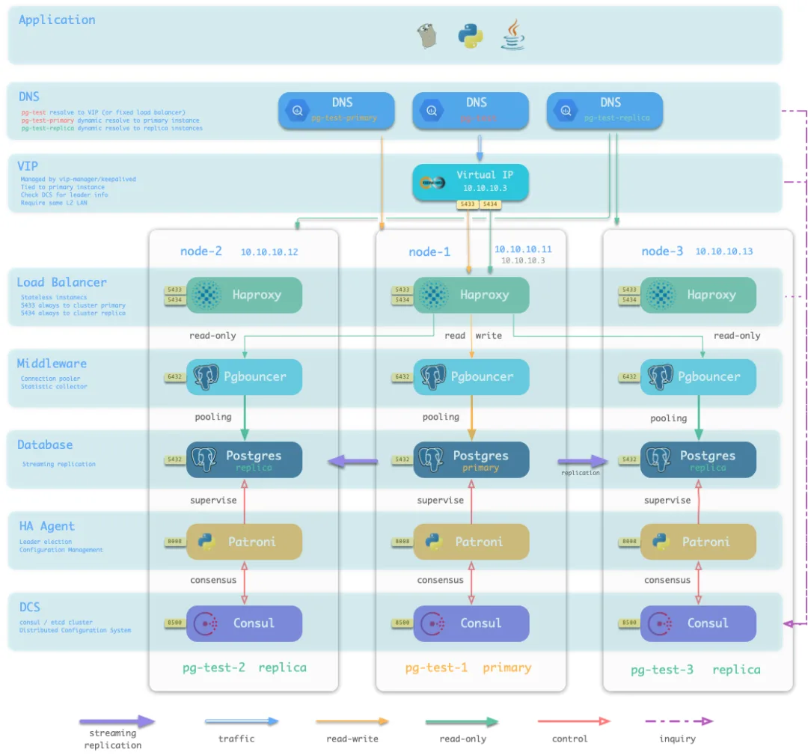
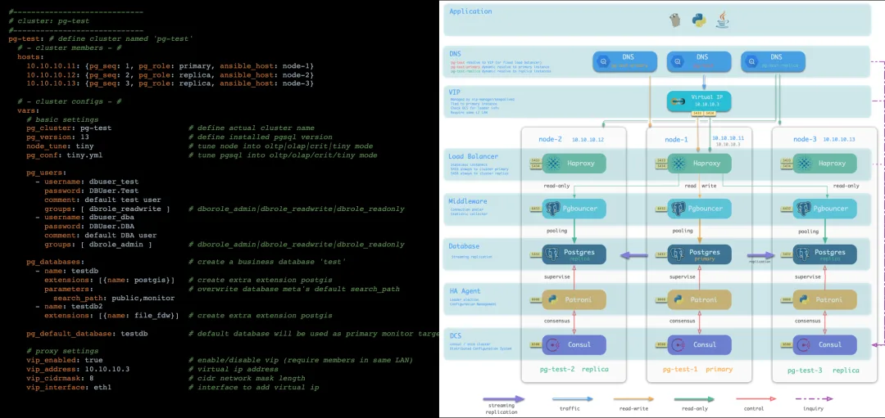
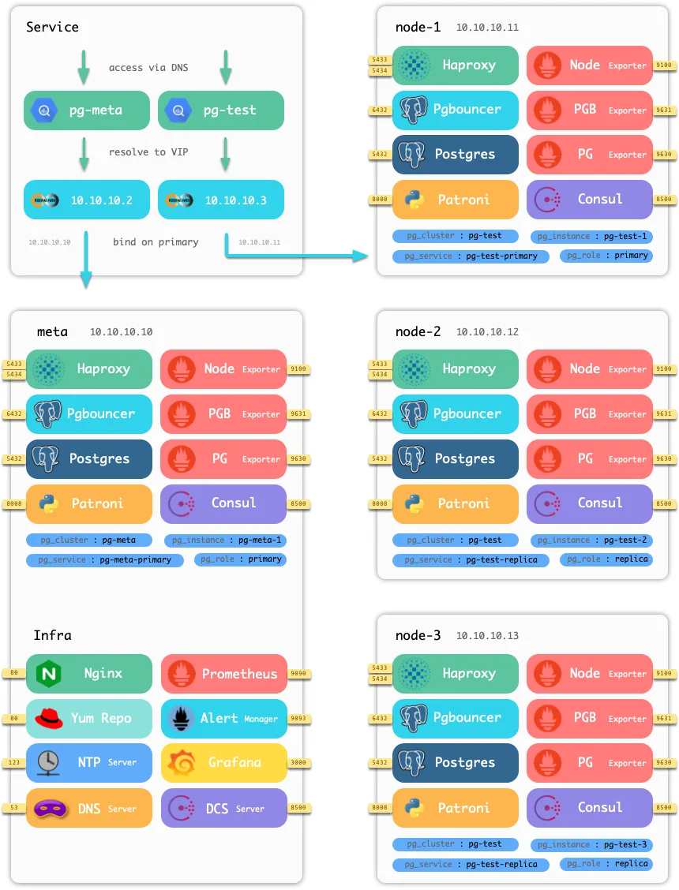

今天我很荣幸的宣布，**Pigsty 正式发布了！**

## 官方网站：<https://pigsty.cc>

## Pigsty 是什么？

- Pigsty 是针对大规模 PostgreSQL 集群的监控系统

- Pigsty 是高可用 PostgreSQL 集群的供给方案

- Pigsty 基于开源生态构建，是免费的开源软件

Pigsty 针对大规模数据库集群监控与管理而设计，提供业界顶尖的 PostgreSQL 监控系统与开箱即用的高可用数据库供给方案。Pigsty 基于开源生态构建，旨在降低 PostgreSQL 使用管理的门槛，为用户带来极致的可观测性与丝滑的数据库使用体验。\

## Pigsty 是监控系统

PostgreSQL 是世界上最好的开源关系型数据库，但在其生态中却缺少一个足够好的监控系统。Pigsty 即旨在解决这一问题：提供世界上最好的 PostgreSQL 监控系统，

开发 Pigsty 的初衷是：作者需要对一个大规模 PostgreSQL 集群进行管理，但找遍所有市面上的开源与商业监控系统方案后，发现没有一个是“足够好用”的。本着“**我行我上**”的精神，开发设计了本系统。

Pigsty 的界面基于 Grafana 深度定制，由 30+监控面板，上千+仪表盘，18 万行 JSON 定制而成，涵盖数据库与基础设施的方方面面。

Pigsty 提供近 1200 个监控指标，一骑绝尘，远超市面上现有的相关产品。提供从全局大盘汇总到某一个数据对象增删改查的全域数据支持。\

## Pigsty 是供给方案

Pigsty 同时还是一个高可用数据库集群供给方案。

监控系统要想发行与演示，必须要先有被监控的对象。可许多用户自建的数据库实在是千奇百怪。所以这里，Pigsty 项目决定将数据库供给方案作为项目的一部分发布。

将主从复制，故障切换，流量代理，连接池，服务发现，基本权限系统等成熟的生产级部署方案打包至本项目中，真正让用户做到**立等可取**，**开箱即用**。

数据库供给方案所做的事情一言以蔽之：**您填写一张表单，然后系统会自动根据表单的内容创建出对应的数据库集群**。真正做到傻瓜式数据库管理。

Pigsty 通过 130+配置项定义了数据库与基础设施的方方面面，采用声明式的语法与幂等的执行机制，使用代码定义基础设施，在物理机与虚拟机上达到了与 Kubernetes 类似的舒爽体验，简单易用。

## Pigsty 是开源软件

Pigsty 依托开源，回馈社区，是免费的开源软件。Pigsty 基于**Apache 2.0**协议开源，但也提供**专业版**与**可选的商业支持服务**。欢迎各位贡献 ISSUE 与 PR，也欢迎捐赠与赞助。

Pigsty 的监控系统基于开源组件 Prometheus，Grafana，Alertmanager，Exporter 进行深度定制开发。同时还包括 Nginx，Dnsmasq/CoreDNS，NTP/Chrony，Consul/Etcd 等基础设施。遵循业界监控最佳实践，可以方便地与已有监控基础设施集成。

Pigsty 的供给方案基于流行的 DevOps 工具 Ansible 进行开发，部署涉及的组件包括：Postgres，Pgbouncer，Patroni，HAProxy，Keepalived。所有部署逻辑都以 Ansible Role 的方式编写，可以方便地进行集成、定制与二次开发。

PostgreSQL 是世界上最先进的开源关系型数据库，而 Pigsty 旨在成为世界上最先进的开源关系型数据库的监控系统与供给方案。希望 Pigsty 能在各位使用 PostgreSQL 的过程中起到帮助。

## Pigsty 可以开箱即用

Pigsty 提供了详实的中英文档供您参考。

更重要的是，Pigsty 既提供了可公开访问的演示 Demo，也自带了基于 Vagrant 的本地沙箱。您可以使用以下命令简单的在自己的笔记本上一键拉起带有数据库集群与监控基础设施的沙箱环境。

    make up          # 拉起vagrant虚拟机
    make ssh         # 配置虚拟机ssh访问
    make init        # 初始化Pigsty
    sudo make dns    # 写入Pigsty静态DNS域名（需要sudo,可选）
    make mon-view    # 打开Pigsty首页（默认用户密码：admin:admin）

也可以在修改极少量配置后，使用完全相同的工作流初始化生产环境。

## Pigsty 的相关站点\

Pigsty 提供了详实的中英文档供您参考。

中文站点：<https://pigsty.cc>

英文站点：<https://pigsty.io/>

官方演示：<http://demo.pigsty.cc>

Github 仓库：<https://github.com/Vonng/pigsty>

---

发布版本：[微信公众号](https://mp.weixin.qq.com/s/4C1xtA3ngcIEB08VJQTWmQ)
