近自己做了套数据库监控系统，搞的还可以，简单给大家介绍一下。

> Pigsty is an advanced PostgreSQL monitoring systemd based on open source projects like prometheus & grafana. PIGSTY /pɪɡ staɪ/ is the abbreviation of "Postgres in Grafana Style".

Pigsty 是一个基于 Grafana 与 Prometheus 与 Consul 的 Postgres 数据库监控系统。

## 整体架构

> TLDR: (Node/Pg/Pgbouncer) Exporter Discovered by Consul to Prometheus to Grafana

    ┏━━━━━━━━━━━┓     ┏━━━━━━━━━━━━━━━━━━━━┓
    ┃   Node    ┃ --> ┃   Node    Exporter-┃┐
    ┃ Pgbouncer ┃ --> ┃ Pgbouncer Exporter-┃┼--> Prometheus ---> Grafana
    ┃ Postgres  ┃ --> ┃ Postgres  Exporter-┃┘        ↑
    ┃           ┃     ┗━━━━━━━━━━━━━━━━━━━━┛  (Service Discovery)
    ┃  Consul   ┃ ----------------------------->   Consul
    ┗━━━━━━━━━━━┛

### 一言以蔽之：用 Exporter 取指标数据，通过 Consul 服务发现赋予身份标签与组织结构，存进 Prometheus 中进行预处理计算，最后使用 Grafana 展示

这里能看到的主要还是 Grafana 里的 Dashboard，因此主要还是介绍脸面上的东西。\

### 层次组织

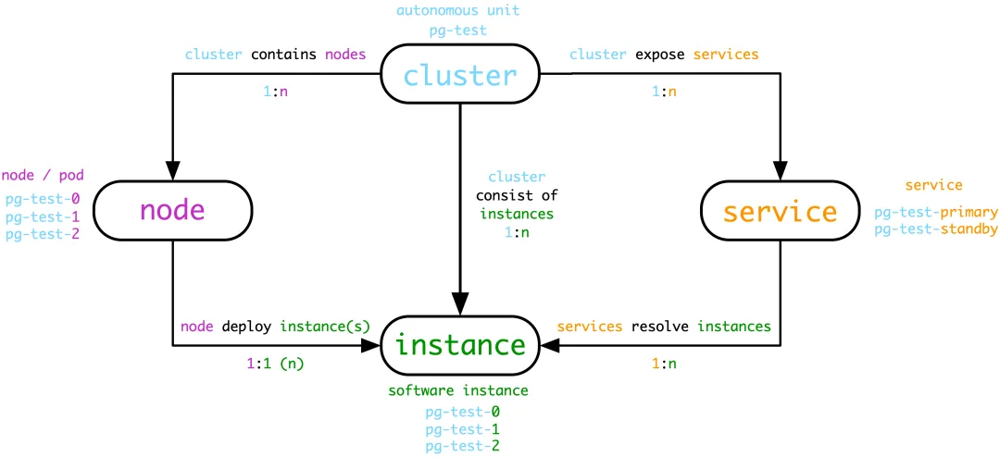

监控主要分为五个层次，集群（cluster），服务（service），实例（instance），数据库（database），与节点（node）。不过在本系统中，服务层次的监控指标被整合至集群级别，数据库层次的监控指标被整合至实例级别。因此实际上，只有三个核心层次的监控展示：集群，实例，节点。

- 集群使用`cls`唯一标识，名称类似于：`pg-test-tt`

- 实例使用`ins`唯一标识，名称类似于：`pg-test-tt-0`，以集群为前缀，序号为后缀。后缀为 0 的实例通常是集群中的主库。

- 节点使用`ip`唯一标识。

除此之外，还有一些其他层次的 Dashboard：例如全局大盘概览，分片库专用的 Shard Dashboard，每一个数据库具体的 Database Dashboard、连接池 Pool 层次的 Dashboard，具体到某一个库上某一个查询的 PG Query Dashboard，Pgbouncer 中间件专用 Dashboard，等等，这些衍生或周边的 Dashboard 就不介绍了。

## 功能简介

核心功能：日常巡检，故障排查，性能优化，全知即全能。

- PG 全局监控

- PG Shard 监控

- PG 集群监控

- PG 实例监控

- PG 实例监控（故障排查专用视图）

- PG 节点监控

- PG 慢查询平台

- Redis 全局概览

- Redis 集群监控

- Redis 实例监控

- PG 集群健康度评估系统

## 首页导航概览

包含 PG 和 Redis 两部分，左侧为全局指标概览，右侧为集群导航。中间为全局报警与事件提醒。点击右上角的导航链接，或者页面中的可导航元素（Shard，集群名，实例名，IP 等）可跳转至感兴趣的面板

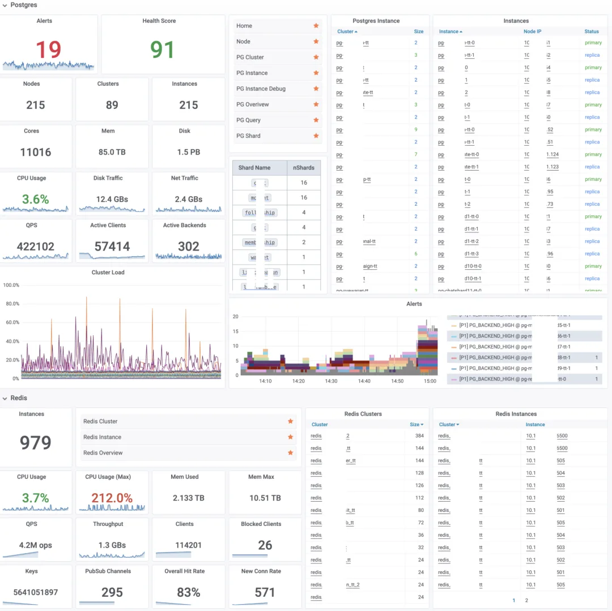

## DB 监控：指标介绍

### 指标丰富程度

> 你可以不看，我不能没有。

每个实例包括了约 3300 个指标，其中：

数据库与连接池指标 1000 个，其中规则定义衍生指标 250 个。

节点指标约 2000 个，其中规则定义的衍生指标 700 个。

举个例子，单纯一个 QPS，就可以衍生出下面近 30 个指标。\

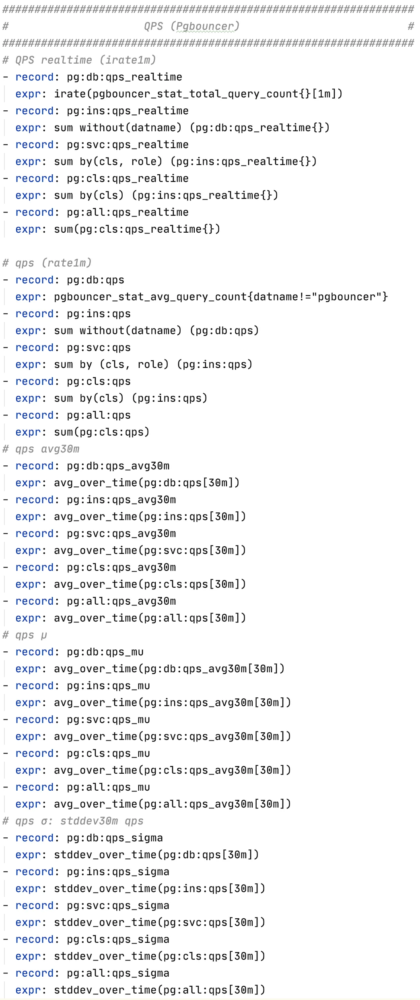

这里随便挑一些重要的指标介绍一下\

### 指标内容

按 Google SRE 实践划分的四类黄金指标

#### 错误

- 配置错误：关键功能是否配置正常：校验和，Numa，透明大页，同步提交等。

- 内存错误，TCP 错误，时间漂移错误

- 服务宕机：机器，数据库，连接池，监控组件

- 数据库客户端排队，IdleInXact 连接，超长事务，死锁，复制中断，大量回滚，监控报错

#### 饱和度

- **PG Load,** Node Load

- CPU 使用，内存使用，磁盘使用，网卡带宽利用率，缓存命中率，后端连接使用，连接池使用

#### 流量

- 数据库直接指标：QPS，TPS，查询细分 QPS

- 间接流量指标：连接池进出流量，WAL 写入量，增删改查条数，块访问量，缓冲区访问量

- 节点流量：磁盘 IO 流量，网络 IO 流量，内存页面换入换出

#### 延迟

- 事务平均响应时间 Xact RT

- 查询平均响应时间 Query RT

- 语句平均响应时间：Statement RT

- 磁盘平均响应时间：Disk R/W Latency

- 复制延迟（以秒或字节计算）

- 监控查询延迟

## DB 监控：PG 实例

### 实例概览

- 实例身份信息：集群名，ID，所属节点，软件版本，所属集群其他成员等

- 实例配置信息：一些关键配置，目录，端口，配置路径等

- 实例健康信息，实例角色（Primary，Standby）等。

- 黄金指标：PG Load，复制延迟，活跃后端，排队连接，查询延迟，TPS，数据库年龄

- 数据库负载：实时（Load0），1 分钟，5 分钟，15 分钟

- 数据库警报与提醒事件

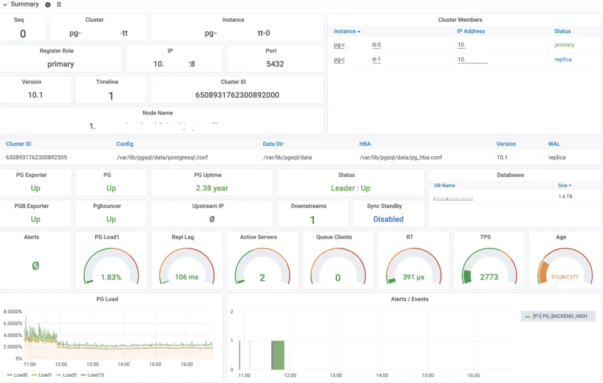

关于 PG Load，可以参考本号前一篇文章，如何给 PostgreSQL 定 KPI

### 节点概览

- 四大基本资源：CPU，内存，磁盘，网卡的配置规格，关键功能，与核心指标

- 右侧是网卡详情与磁盘详情

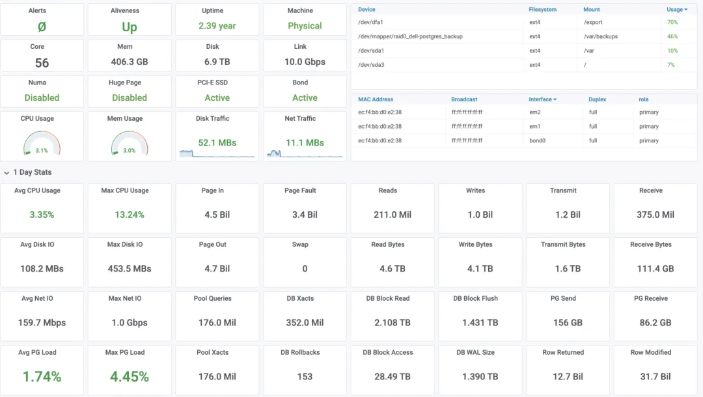

#### 单日统计

以最近 1 日为周期的统计信息（从当前时刻算起的前 24 小时），比如最近一天的查询总数，返回的记录总数等。上面两行是节点级别的统计，下面两行是主要是 PG 相关的统计指标。

对于计量计费，水位评估特别有用。

#### 复制

- 当前节点的 Replication 配置

- 复制延迟：以秒计，以字节计的复制延迟，复制槽堆积量

- 下游节点对应的 Walsender 统计

- 各种 LSN 进度，综合展示集群的复制状况与持久化状态。

- 下游节点数量统计，可以看出复制中断的问题

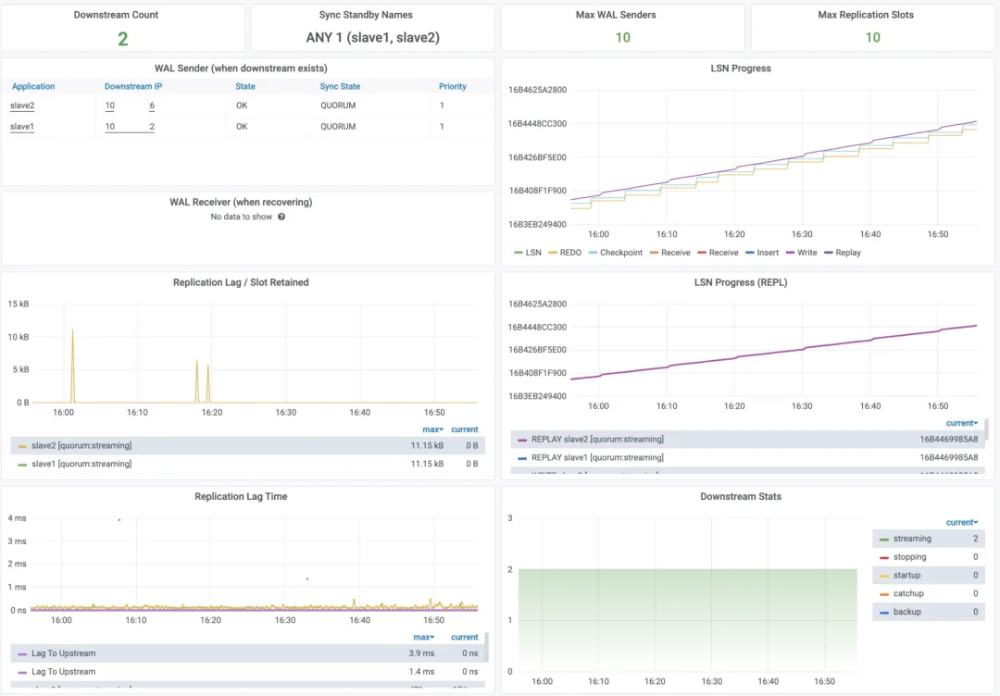

#### 事务

事务部分用于洞悉实例中的活动情况，包括 TPS，响应时间，锁等。

- TPS 概览信息：TPS，TPS 与过去两天的 DoD 环比。DB 事务数与回滚数

- 回滚事务数量与回滚率

- TPS 详情：绿色条带为±1σ，黄色条带为±3σ，以过去 30 分钟作为计算标准，通常超出黄色条带可认为 TPS 波动过大

- Xact RT，事务平均响应时间，从连接池抓取。绿色条带为±1σ，黄色条带为±3σ。

- TPS 与 RT 的偏离程度，是一个无量纲的可横向比较的值，越大表示指标抖动越厉害，计算方式为：(μ/σ)^2

- 按照 DB 细分的 TPS 与事务响应时间，通常一个实例只有一个 DB，但少量实例有多个 DB。

- 事务数，回滚数（TPS 来自连接池，而这两个指标直接来自 DB 本身）

- 锁的数量，按模式聚合（8 种表锁），按大类聚合（读锁，写锁，排他锁）

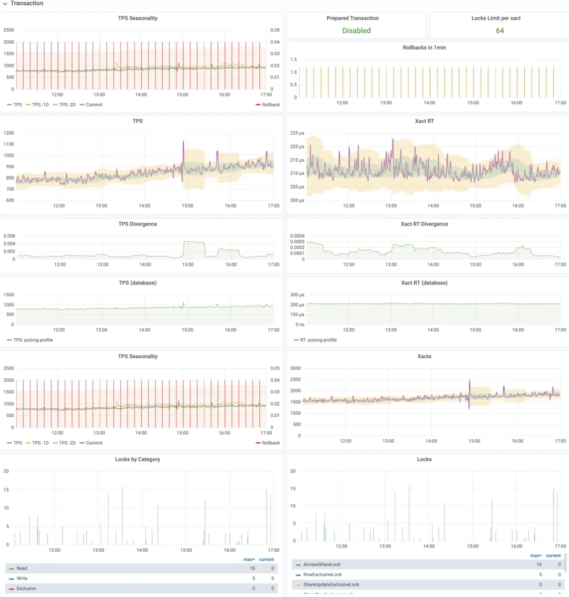

#### 查询

大多数指标与事务中的指标类似，不过统计单位从事务变成了查询语句。查询部分可用于分析实例上的慢查询，定位性能瓶颈。

- QPS 每秒查询数，与 Query RT 查询平均响应时间，以及这两者的波动程度，QPS 的周期环比等

- 生产环境对查询平均响应时间有要求：1ms 为红线，100ms 就该约谈了。

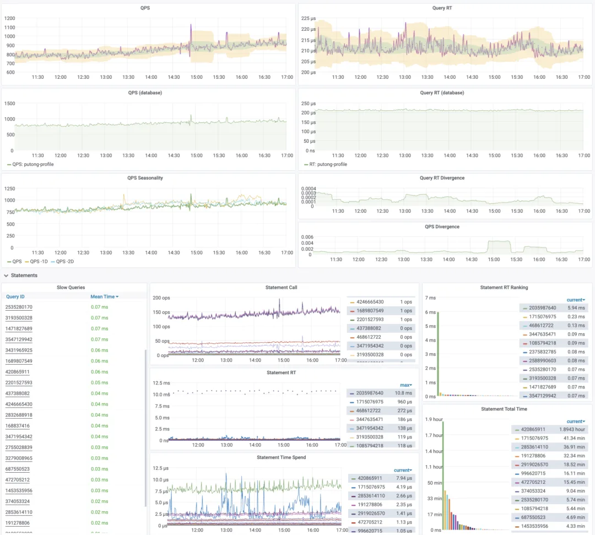

#### 语句

语句展示了查询中按语句细分的指标。每条语句（查询语法树抽离常量变量后如果一致，则算同一条查询）都会有一个查询 ID，可以在慢查询平台中获取到具体的语句与详细指标与统计。

- 左侧慢查询列表是按`pg_stat_statments`中的平均响应时间从大到小排序的，点击查询 ID 会自动跳转到慢查询平台

- 这里列出的查询，是累计查询耗时最长的 32 个查询，但排除只有零星调用的长耗时单次查询与监控查询。

- 右侧包括了每个查询的实时 QPS，平均响应时间。按照 RT 与总耗时的排名。

#### 后端进程

后端进程用于显示与 PG 本身的连接，后端进程相关的统计指标。特别是按照各种维度进行聚合的结果，特别适合定位雪崩，慢查询，其他疑难杂症。

- 后端进程数按种类聚合，后端进程按状态聚合，后端进程按 DB 聚合，后端进程按等待事件类型聚合。

- 活跃状态的进程/连接，在事务中空闲的连接，长事务。

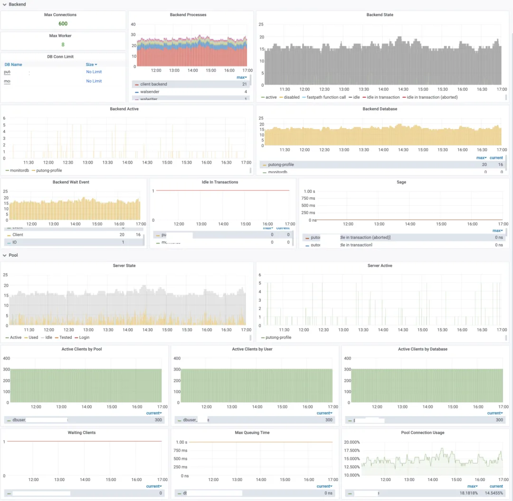

#### 连接池

连接池部分与后端进程部分类似，但全都是从 Pgbouncer 中间件上获取的监控指标

- 连接池后端连接的状态：活跃，刚用过，空闲，测试过，登录状态。

- 分别按照 User，按照 DB，按照 Pool（User:DB）聚合的前端连接，用于排查异常连接问题。

- 等待客户端数（重要），以及队首客户端等待的时长，用于定位连接堆积问题。

- 连接池可用连接使用比例。

#### 数据库概览

Database 部分主要来自`pg_stat_database`与`pg_database`，包含数据库相关的指标：

- WAL Rate，标识数据库的写入负载，每秒产生的 WAL 字节数量。

- Buffer Hit Rate，数据库 ShareBuffer 命中率，未命中的页面将从操作系统 PageCache 和磁盘获取。

- 每秒增删改查的记录条数

- 临时文件数量与临时文件大小，可以定位大型查询问题。

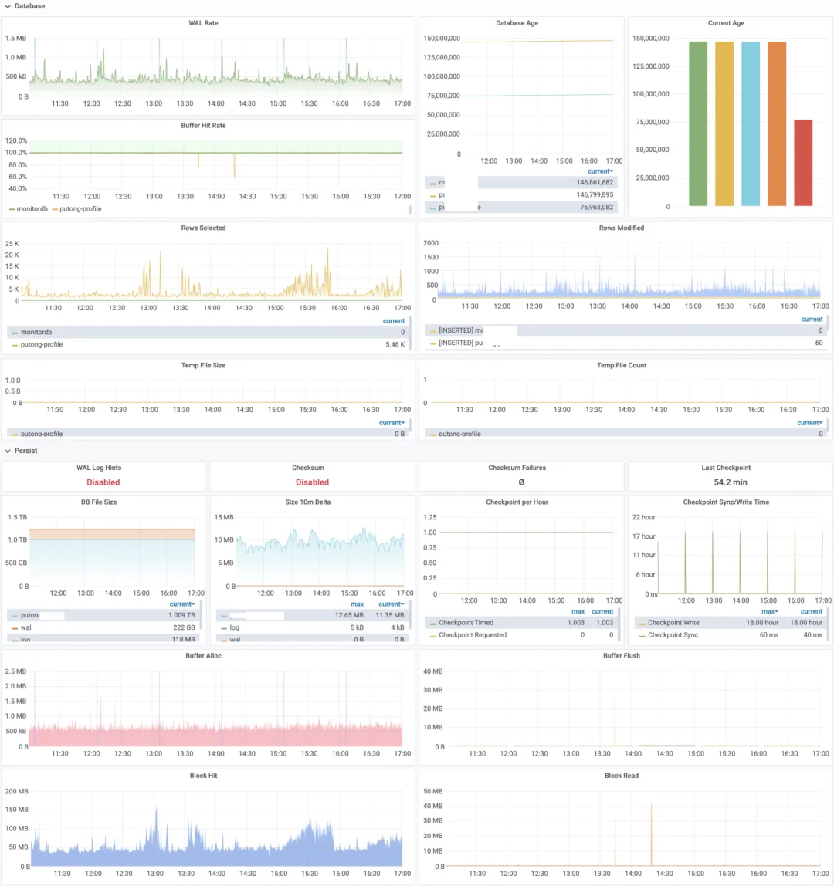

#### 持久化

持久化主要包含数据落盘，Checkpoint，块访问相关的指标

- 重要的持久化参数，比如是否出现数据校验和验证失败（如果启用可以检测到数据腐坏）

- 数据库文件（DB，WAL，Log）的大小与增速。

- 检查点的数量与检查点耗时。

- 每秒分配的块，与每秒刷盘的块。每秒访问的块，以及每秒从磁盘中读取的块。（以字节计，注意一个 Buffer Page 是 8192，一个 Disk Block 是 4096）

#### 监控 Exporter

Exporter 展示了监控系统组件本身的监控指标，包括：

- Exporter 是否存活，Uptime，Exporter 每分钟被抓取的次数

- 每个监控查询的耗时，产生的指标数量与错误数量。

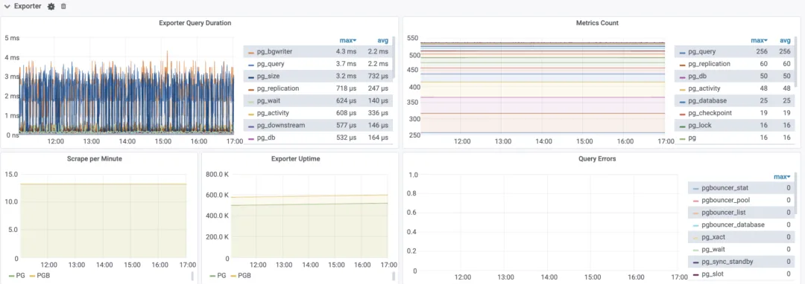

## DB 监控：PG 集群

PG 集群监控是最常用的 Dashboard，因为 PG 以集群为单位提供服务，因此 Cluster 集合了最完整全面的信息。

大多数监控图都是实例级监控的泛化与上卷，即从展示单个实例内的细节，变为展现集群内每个实例的信息，以及集群和服务层次聚合后的指标。

### 集群概览

Cluster 级别的集群概览相比实例级别多了一些东西：

- 时间线与领导权，当数据库发生 Failover 或 Switchover 时，时间线会步进，领导权会发生变化。

- 集群拓扑，集群拓扑展现了集群中的复制拓扑，以及采用的复制方式（同步/异步）。

- 集群负载，包括整个集群实时、1 分钟、5 分钟、15 分钟的负载情况。以及集群中每个节点的 Load1

- 集群报警与事件。

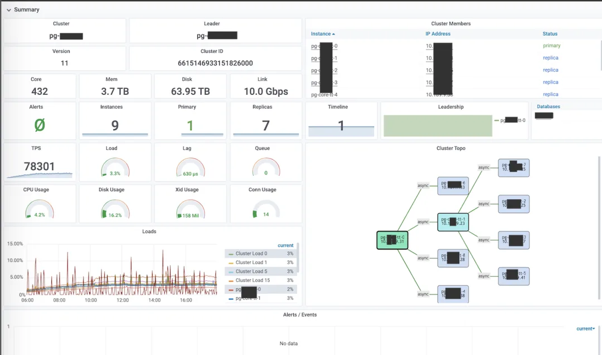

### 集群复制

Cluster 级别的 Dashboard 与 Instance 级别 Dashboard 最重要的区别之一就是提供了整个集群的复制全景。包括：

- 集群中的主库与级联桥接库。集群是否启用同步提交，同步从库名称。桥接库与级联库数量，最大从库配置

- 成对出现的 Walsender 与 Walreceiver 列表，体现一对主从关系的复制状态

- 以秒和字节衡量的复制延迟（通常 1 秒的复制延迟对应 10M~100M 不等的字节延迟），复制槽堆积量。

- 从库视角的复制延迟

- 集群中从库的数量，备份或拉取从库时可以从这里看到异常。

- 集群的 LSN 进度，用于整体展示集群的复制状态与持久化状态。

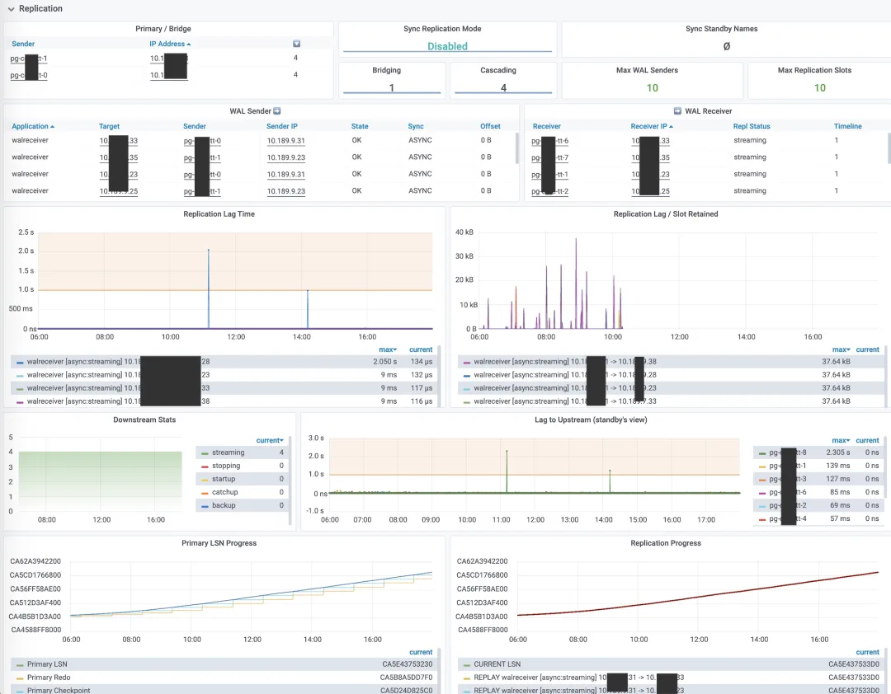

### 节点指标

PG 机器的相关指标，按照集群进行聚合。

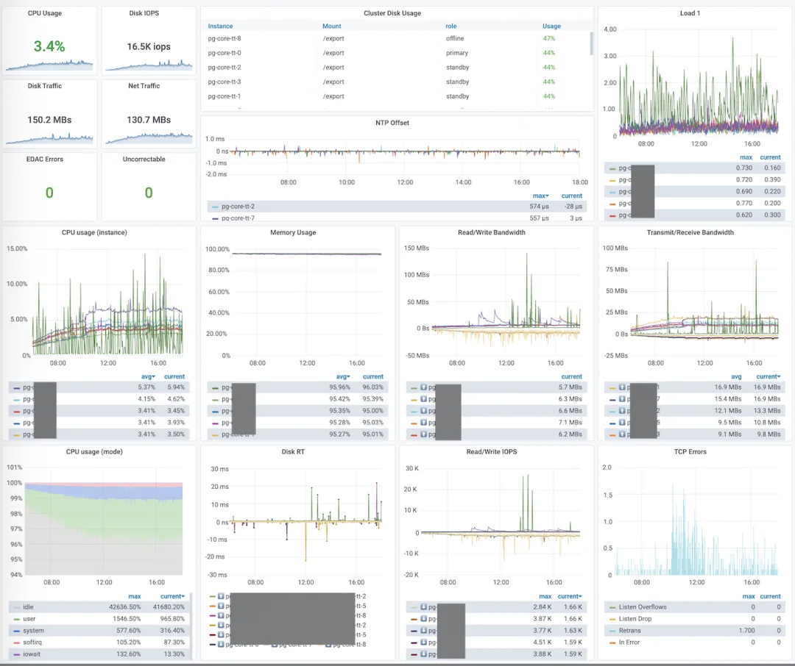

### 事务与查询

与实例级别的类似，但添加了 Service 层次的聚合（一个集群通常提供`primary`与`standby`两种 Service）。

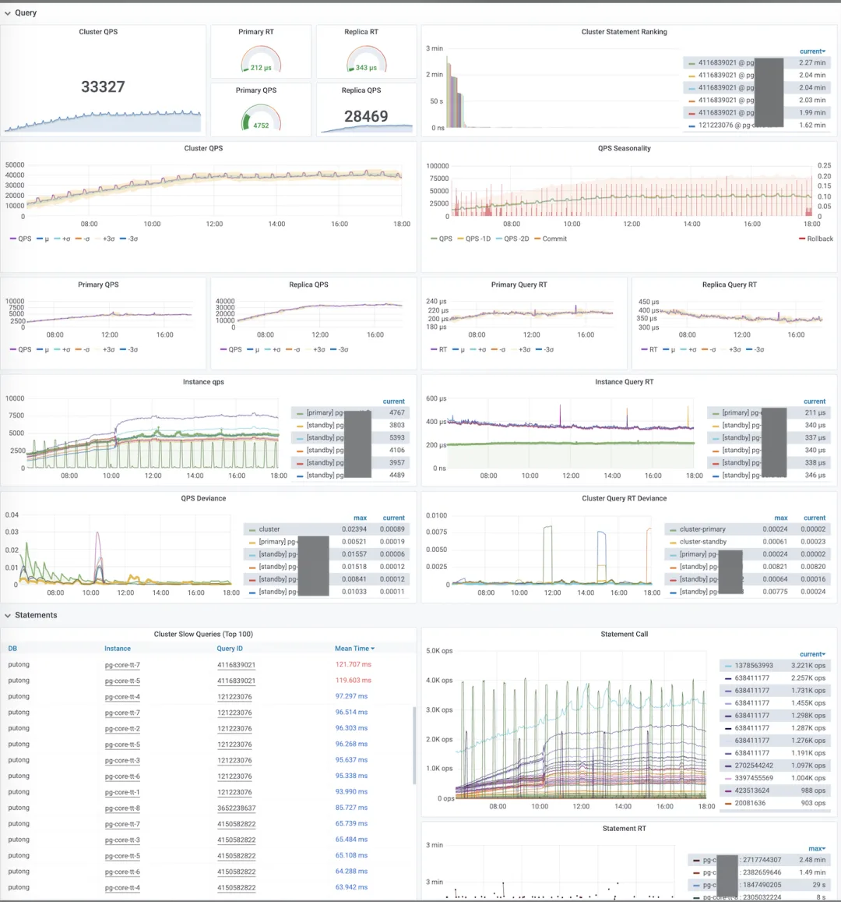

其他指标与实例级别差别不大。\

## DB 监控：PG 慢查询平台

显示慢查询相关的指标，上方是本实例的查询总览。鼠标悬停查询 ID 可以看到查询语句，点击查询 ID 会跳转到对应的查询细分指标页（Query Detail）。

- 左侧是格式化后的查询语句，右侧是查询的主要指标，包括

  - 每秒查询数量：QPS

  - 实时的平均响应时间（RT Realtime）

  - 每次查询平均返回的行数

  - 每次查询平均用于 BlockIO 的时长

  - 响应时间的均值，标准差，最小值，最大值（自从上一次统计周期以来）

  - 查询最近一天的调用次数，返回行数，总耗时。以及自重置以来的总调用次数。

- 下方是指定时间段的查询指标图表，是概览指标的细化。

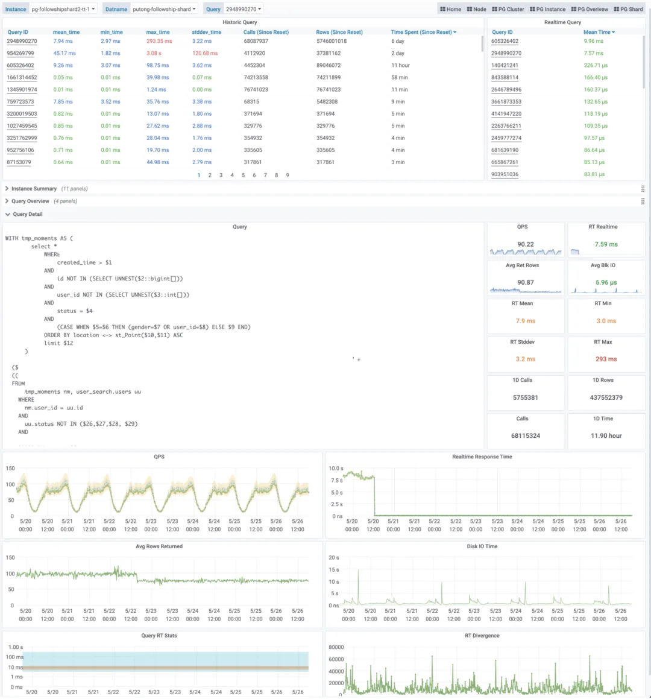

---

发布版本：[微信公众号](https://mp.weixin.qq.com/s/CESKKdl8odUu_grJXrv30g)
