上海开源信息技术协会最近搞了个优秀开源项目评选，以及优秀开源社区贡献者评选。老冯投了两个，都中了。第一个是 Pigsty，当选了优秀开源项目：

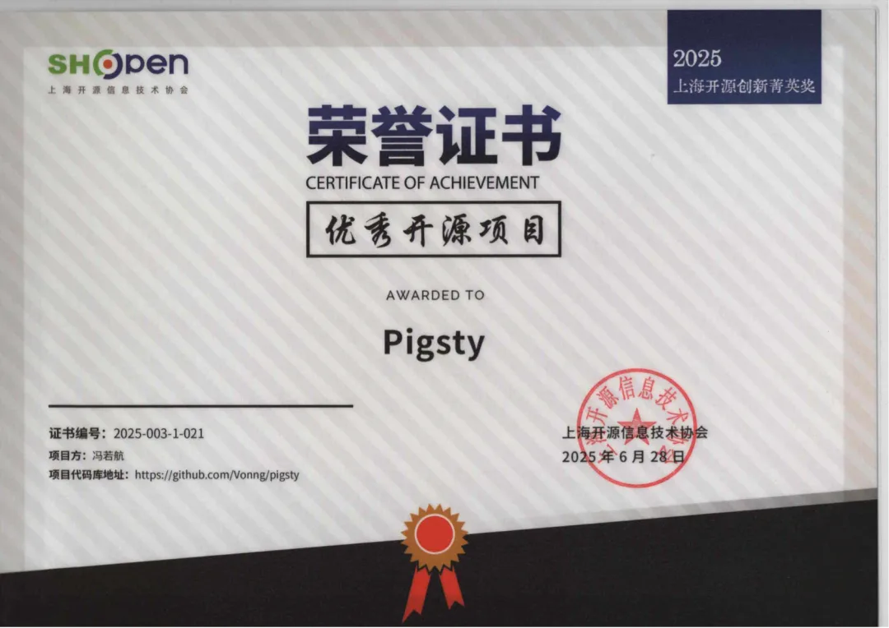

第二个是老冯自己，评了个优秀开源社区贡献者

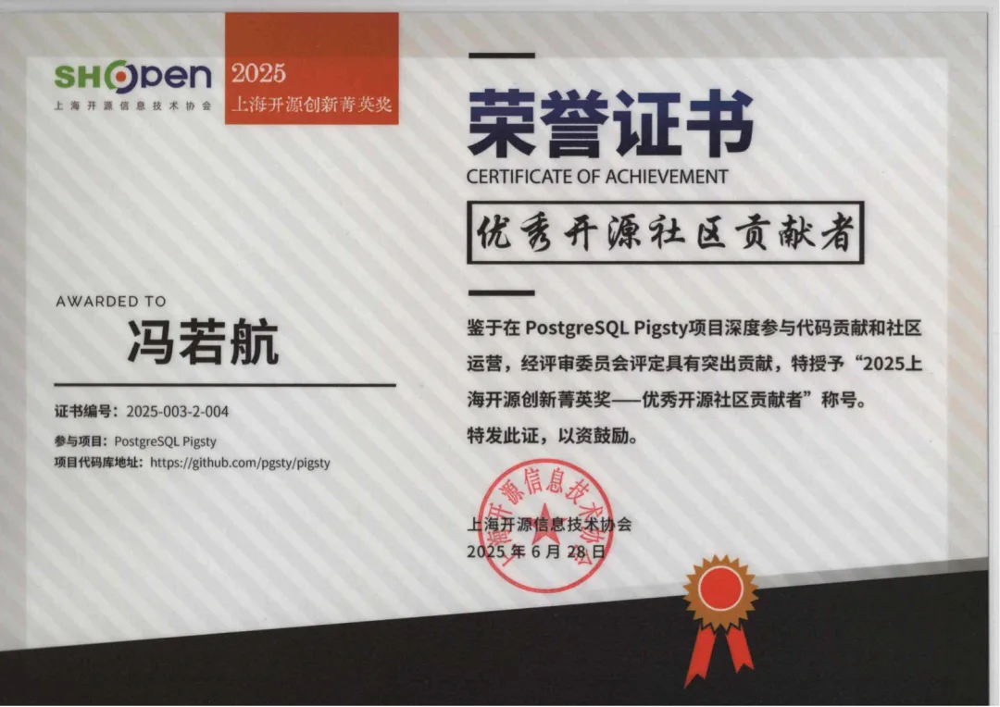

感谢上海开源信息技术协会，ITPUB，各位专家评委的认可。

这次比较可惜，周六在上海的颁奖活动真好和[在济南的 PG 高峰论坛时间](/pg/pg-summit-2025/)冲突了，所以没有参加，不过这俩奖状给寄到家里了。

老冯不喜欢那种费时间拉票的奖项，但这种花点时间填一下就能参与的奖还是很乐意参加的。拿个奖心里也是挺高兴的，哈哈。

---

另外最近 ITPUB 搞的新媒体评选，老冯的公众号还顺手搂了一个《最佳文章影响奖》<https://zt.itpub.net/topic/peanit/>

老冯最近的公众号发展的还不错，总关注数量达到了 44355，主要是常读用户比例有 22%，9904，这还真是不少。在这里老冯也要感谢各位读者朋友的关注与支持哈🙏。

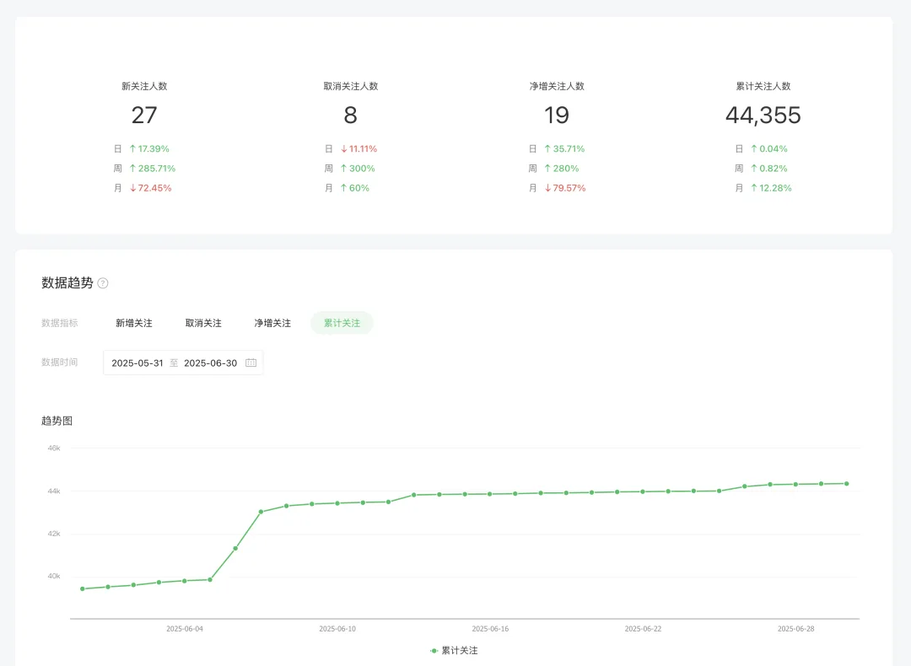

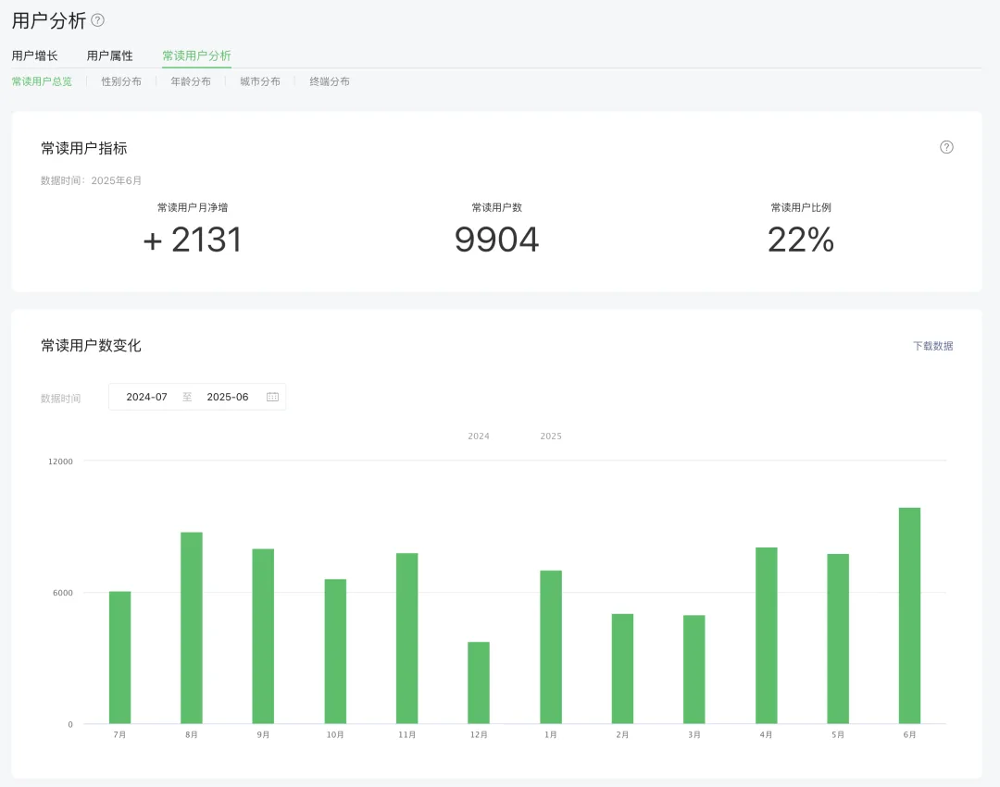

Pigsty 的发展势头也还行，目前在 GitHub 上的 Star 数量达到了 4K 的里程碑。增长的速度跟一些竞品比还是算快的。

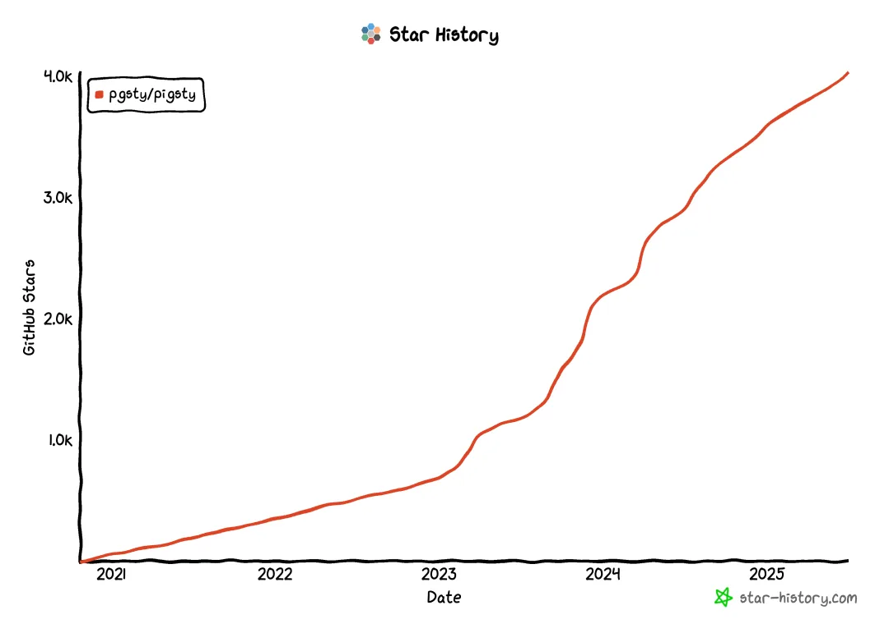

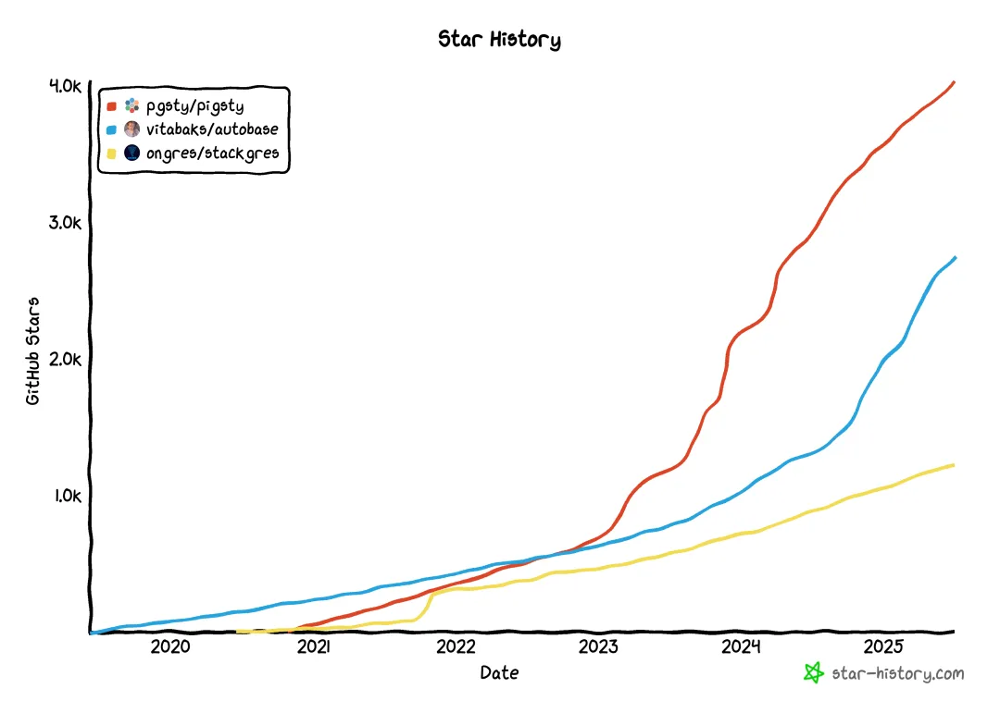

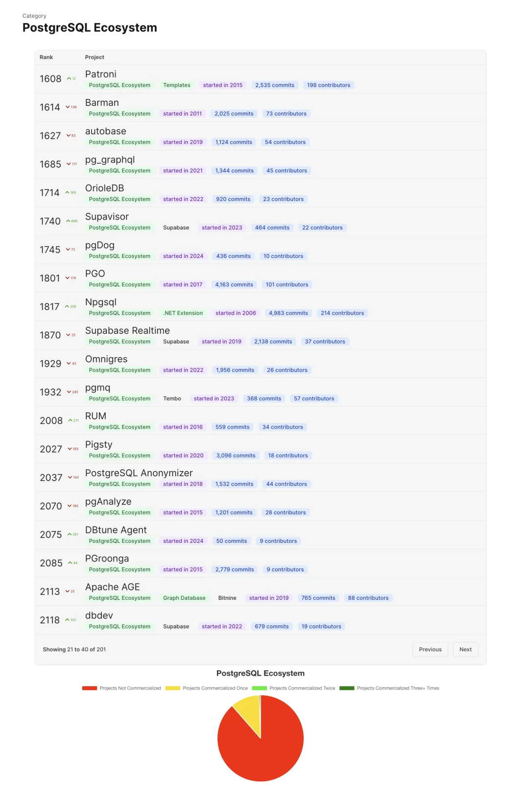

在 PostgreSQL 生态开源项目排行榜中，Pigsty 也进了前两页，算是一个国际知名的开源项目了。在中国人主导的 PG 生态开源项目里目前是第一名。

Pigsty 文档站的流量也还不错，pigsty.cc 年 UV 差不多大概十万，大概一半来自海外。

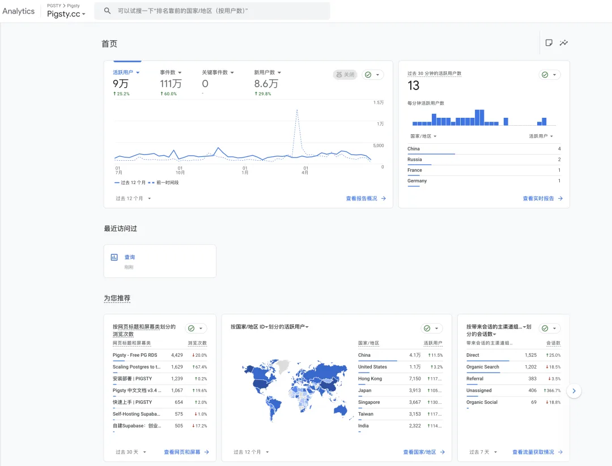

Pigsty 国内站点 pigsty.cc 和 Cloudflare 上的海外站点 pigsty.io 都有不少访问。另外最近还新搞了一个 pgsty.com，用 Next 重新糊了一遍。

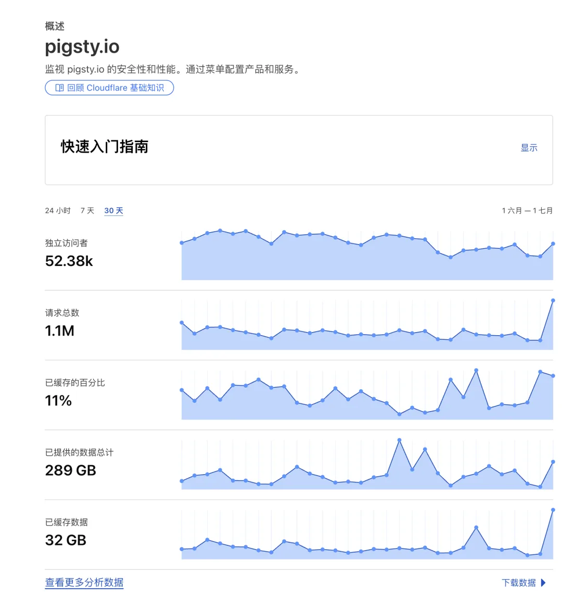

让我感到欣慰的是，写了这么多博客文章，还是有不少效果的，用 GPT 搜一些 PostgreSQL 相关的东西，Pigsty 的网站和博客经常成为权威参考来源了。

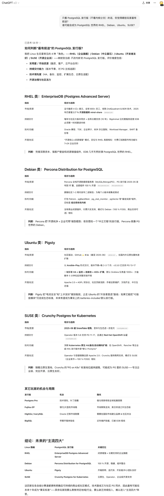

总的来说，这算是做 Pigsty 的第五个年头了，今年的发展总算是走上了正轨。耐心做好有价值的事情，美好的事情自然会发生。

做了这么久的 PostgreSQL 数据库发行版，终于赶上了 [AI 时代的数据库二次崛起](/db/db-for-ai/)。拿到了一张 数据库发行版大乱斗决赛的门票。这对一个一人公司来说，还真是挺不容易的。

好在，今年也有好几个用户决定成为我的客户。顺利的话，年底可以招几个实习生扩扩容了。

最后，再次感谢各位读者与用户朋友，你们的关注，鼓励与支持是我前进的不竭动力源泉。

## Pigsty 是什么？

Pigsty 是一个开箱即用的 PostgreSQL 数据库发行版，是数据库的自动驾驶软件，可以让你在本地一键用云 RDS 1/10 不到的成本，在没有专业 DBA 的情况下，拉起企业级 PostgreSQL 数据库服务，带有高可用，PITR，监控系统，IaC，以及 421 个 PG 生态的扩展插件，直接运行在 10 个主流 Linux 发行版上而无需容器或 Kubernetes 支持。

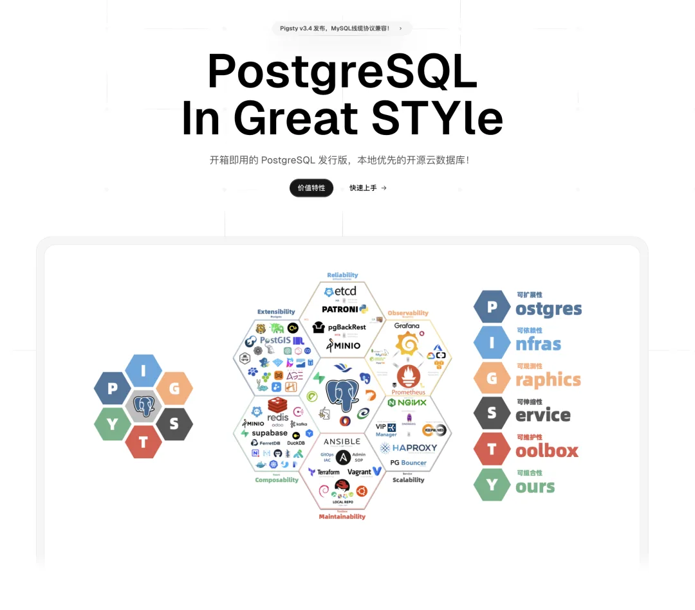

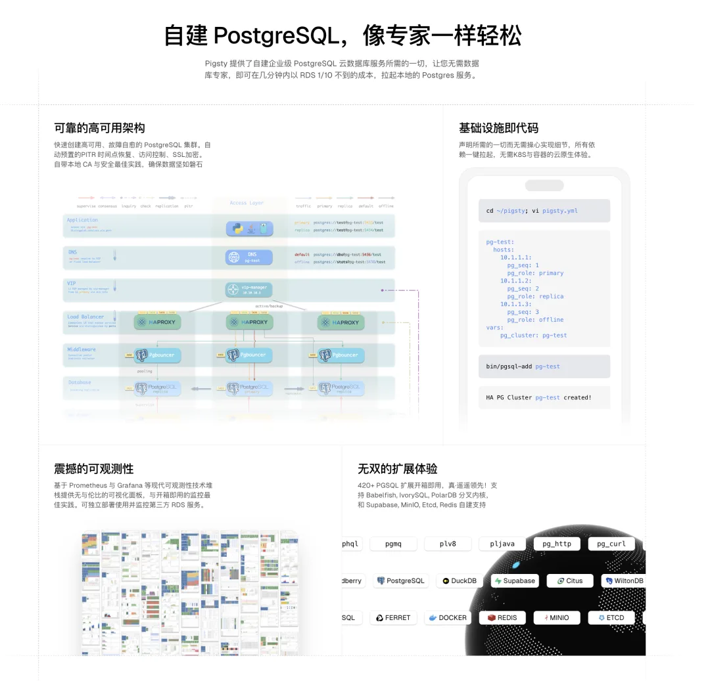

---

发布版本：[微信公众号](https://mp.weixin.qq.com/s/9kpLDrF-bGskmmUMucfWoA)
