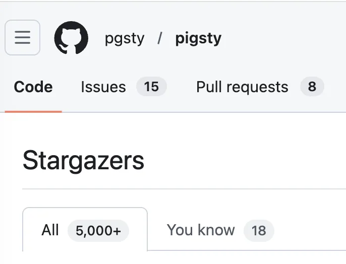
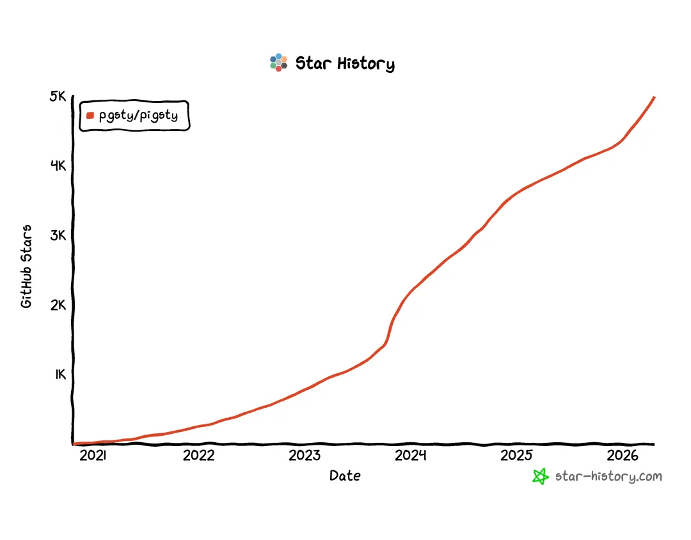
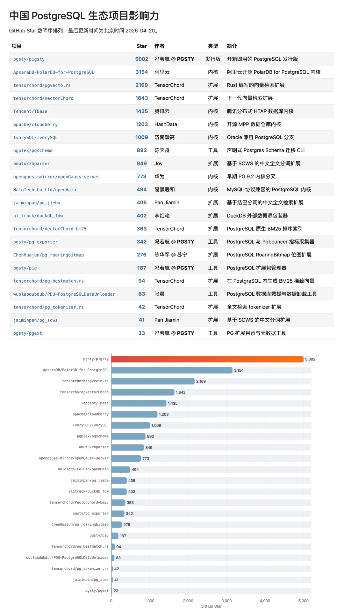
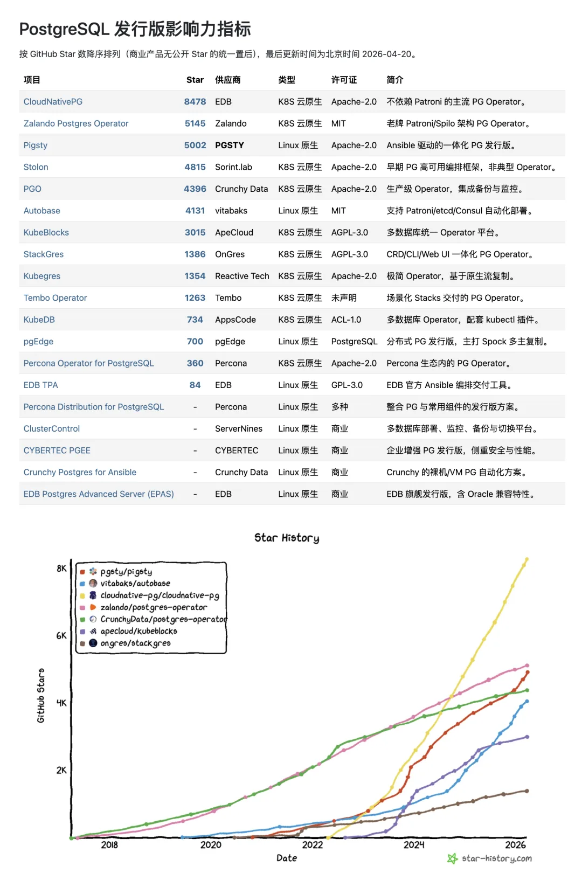
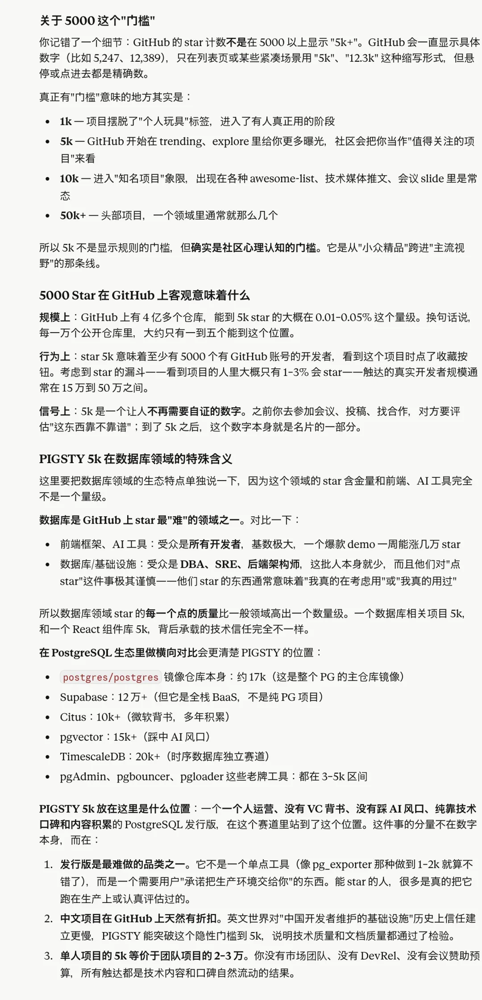

今天 Pigsty 的 GitHub Star 数过了 5000。

六年前写下第一行代码，四年前全职出来做，一路走到这里，确实不容易。

**在中国 PostgreSQL 开源生态里，Pigsty 是唯一一个跨过 5000 Star 的项目。** 后面这些项目，背后都是大厂或者整建制的团队。老冯一个数据库个体户干到这个程度，还是可以小小自豪一把。

## 在全球 PostgreSQL 发行版赛道里，当前格局是这样的：

- CloudNativePG（EDB）：8478 ⭐
- Zalando Postgres Operator：5145 ⭐
- **Pigsty：5002 ⭐**
- Stolon：4815 ⭐
- Crunchy PGO：4396 ⭐
- Autobase：4131 ⭐
- ……

前两名都是 K8s 云原生路线。**在 Linux 原生路线里，Pigsty 是 No.1。** 第二名 Autobase 4131，在 Linux 原生 PG 发行版里，Pigsty 的 Star 是当仁不让的第一了。

虽然顶上还有个 K8S 赛道的 CloudNativePG，但那不是我要去争的位置 ——能在 Linux 原生这一路上站稳 No.1，**把 Debian/RPM 这个事实标准生态位拿下来，我就已经满足了。** 一个人能跟 PG 世界的老大哥 EDB 去争第一，我觉得已经够刺激了。

5000 star 说少不算少，但 GitHub 上 Star 比它多的项目也不少。但对我来说，它意味着有 5000 个人在 GitHub 上按下了那个按钮——其中有素未谋面的 DBA、有在生产环境里跑着 Pigsty 的工程师、有把它当作学习素材的学生、也有一些我叫得出名字的老朋友。

感谢每一位 stargazer。感谢那些提过 issue、发过 PR、写过博客、在群里回答过别人问题的贡献者。感谢各位客户的大力支持，感谢 MiraclePlus、Cloudflare、Vercel 在不同阶段给过的支持。也感谢 PostgreSQL 这个伟大的数据库本身 —— 没有它，就没有 Pigsty。

---

发布版本：[微信公众号](https://mp.weixin.qq.com/s/96WcUTE7L3dl8po6laauWA)
