经过了半个月的 Alpha 阶段，Pigsty 于 7 月 15 日发布了**v1.0.0-beta**，并进入功能冻结状态，进行最后的生产测试。不出意外的话**v1.0.0 GA**将于**2021-07-31**如期与大家见面。

v1.0.0-beta 监控系统的公开 Demo 已经上线：**<http://g.pigsty.cc>**

## Pigsty 里程碑记

一年多的时间，一个人的力量，Pigsty 能走到现在这一步，已经远远超过了我的预期。

最开始它只是一个用来演示概念的沙箱环境，随即又成为我自己用来管理数据库的软件。后来又经过一年多的打磨，现在已经成为一个通用的、完整的，解决实际问题的软件产品，被不同行业的用户真正运行在生产环境中。而其定位也从监控系统和演示沙箱，发展到了 **数据库发行版** 这样宏大的目标。回头看看，还是很让人感慨的：日积跬步，竟能走到这样的程度。

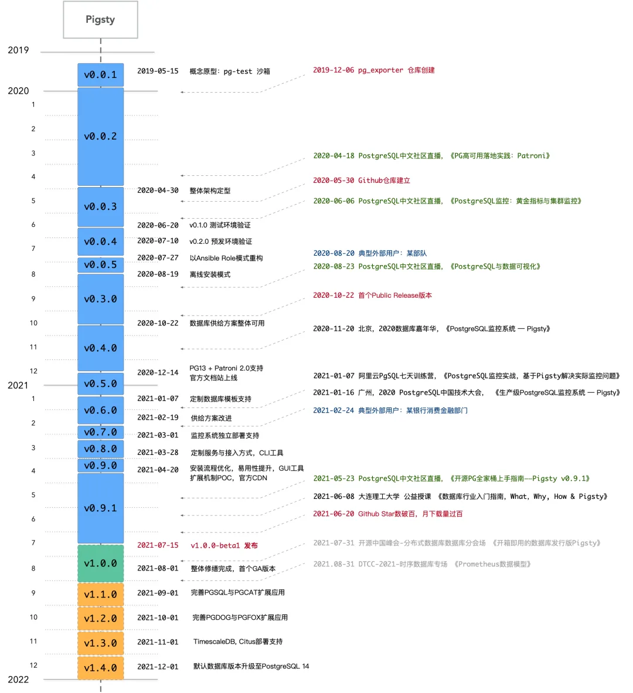

### 图：Pigsty 项目里程碑

v1.0.0 是这样一个里程碑：在我自己看来，Pigsty 已经足够好，值得我用自己的声誉来担保它足够好用。在 v1.0.0 以后，我会继续维护 Pigsty，可以承诺 Pigsty 会始终跟上 PostgreSQL 大版本迭代的脚步。毕竟一个开源项目灌注了作者的心血，就像自己的孩子一样。父母总是孩子的港湾，最起码我自己就是最大的用户（200+节点）。不用担心 Pigsty 会死掉，还是有老可以啃的（＾ω＾）

在 v2.0.0 前，现有数据库部署架构上都不再会有变化，毕竟部署好的数据库没几个人会想去折腾，稳定才是最重要的。v1.0.0 后的更新主要会集中在监控系统与基础设施部分，而这一部分是很容易升级的。v1.0.0 后续任何涉及到架构调整的版本都会给出升级的解决方案，所以 1.0.0 可以放心用于生产环境。

#### v1.0.0 的变化

1.0 相比 0.9 的最大改进，在于**完全重制了监控系统**，基于 PG 14 设计了全新的指标体系，并基于 Grafana 8.0 对监控面板进行了整体性重制。Pigsty 的监控面板有自己的版本号，而这是第 7 个大版本。

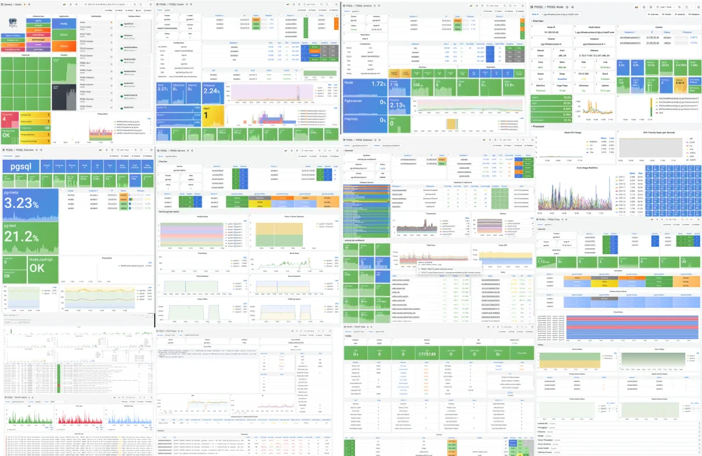

#### 图：重制后的监控系统概览(v7)

相比 v6 30+的监控面板，目前 v7 只是重制了其中的一半左右。一部分专题监控面板没有移植，不过问题不大，因为监控面板本身就是持续更新改进的，后面会进一步充实。而且现阶段的监控面板绝对足以满足日常管理与分析需求。

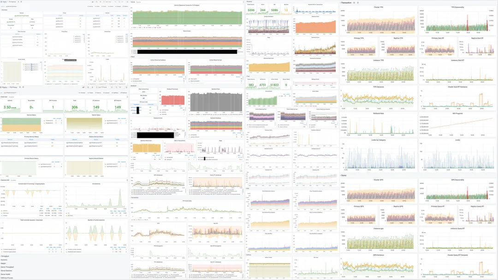

****图：重制前的监控系统概览(v6)****

更多关于 v1.0.0 监控系统变化的详情，可以拉到**本文末尾查阅**。

对于不了解 Pigsty 的朋友，这里我再简单介绍一下这个产品与项目。

## **Pigsty 简介**

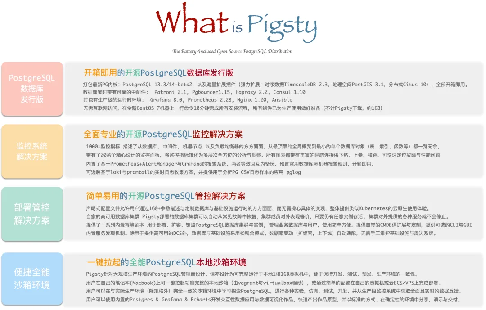

一句话：Pigsty 是**开箱即用的开源 PostgreSQL 发行版**。

这里有三个关键字：**发行版**，**开源**，**开箱即用**。

### 发行版

所谓**发行版（Distribution）**，指的是由数据库内核及其一组软件包组成的数据库整体解决方案。例如，Linux 是一个操作系统内核，而 RedHat，Debian，SUSE 则是基于此内核的操作系统发行版。PostgreSQL 是一个数据库内核，而 Pigsty，BigSQL，Percona，各种云 RDS，则是基于此内核的数据库发行版。

内核非常重要，但用户所接触到的往往都是**发行版**。Linux 的内核只有**几 MB**，但整个操作系统安装盘却往往有**几 GB**的大小。这些软件工具集围绕着内核组成了**一整个系统**，这样才构成了一个完整可用的操作系统。

数据库亦然。**一个在现实世界生产环境运行的数据库，也需要基础设施、运行时、工具来协同数据库内核一同工作**。这就是**数据库发行版。**例如，Oracle，EnterpriseDB，本质上售卖的都不是**数据库内核**，而是**数据库发行版**，或者更进一步，**运行中的数据库发行版服务**（各种云数据库）。因为采用了友善的协议，有很多数据库发行版都是基于 PostgreSQL 内核的：

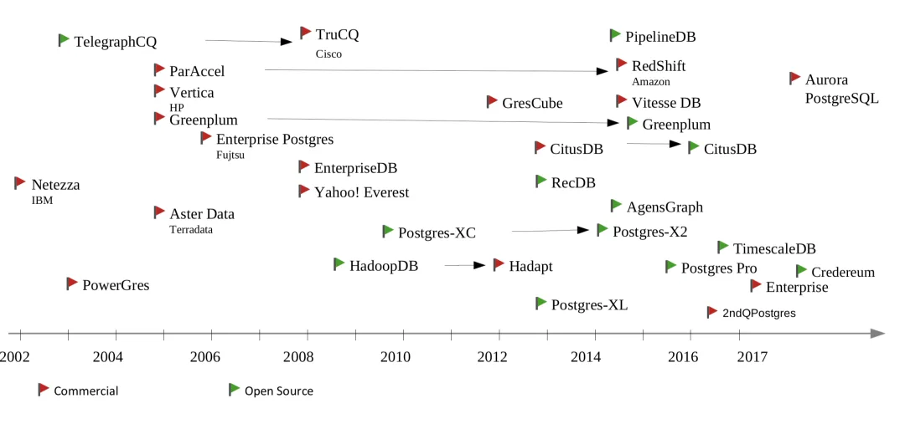

****图：PostgreSQL 及其衍生数据库发行版****

****（顺带一提，“国产数据库”的半壁江山都是 PostgreSQL 换皮，不在此列）****

PostgreSQL 是世界上最先进的开源关系型数据库，它是一个接近完美的数据库内核，比肩 Oracle，代码严谨，设计优雅，功能丰富，具有强大的可扩展性，更重要的是采用类 BSD 协议开源，**让所有人都可以免费获取到最先进的数据库内核**。

但只有内核是远远不够的，**PostgreSQL 的生态系统里缺少一个开源的数据库发行版，而 Pigsty 便旨在填补这一空白生态位**。

一个发行版就像一颗鸡蛋，有蛋壳（品牌），蛋清（软件工具），蛋黄（内核）。有一些优秀的数据库厂商，例如 Postgres Pro，EnterpriseDB，在**蛋黄（内核）**上做了很多工作。而一些数据库厂商，则是在**蛋壳（换皮）**上钻研。有的厂商比较中庸，几样都粘一点，内核稍微改一点，在蛋清上做一些自己的管理软件，然后套上蛋壳。

Pigsty 的工作主要集中于蛋清部分，它的**内核就是纯粹的原生 PostgreSQL**，它的核心定位就是向用户交付**开源**的，**开箱即用**的**数据库解决方案**。

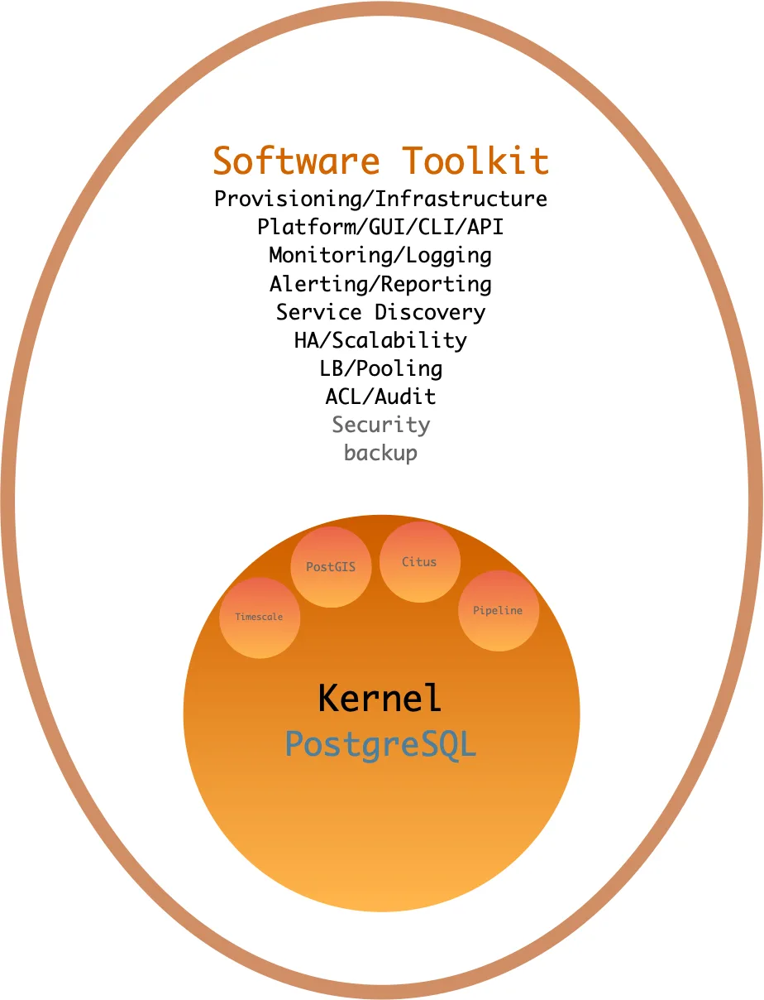

****图：Pigsty 数据库发行版****

****\****

> Pigsty 并集成打包了 PG 生态中最强大的三个扩展插件：地理空间 PostGIS，时序数据 Timescale，分布式集群 Citus，这几个每一个都足以视作一个新数据库内核，但它们仍然选择拥抱 PostgreSQL，成为一个 PG 的的扩展插件。

作为一个数据库发行版，Pigsty 区别于其他发行版的五个**核心特性**为：

- 全面专业的监控系统

- 稳定可靠的部署方案

- 简单省心的用户界面

- 灵活开放的扩展机制

- 免费友好的开源协议

更多关于 Pigsty 的介绍，可参阅 [**开箱即用的 PostgreSQL 发行版：Pigsty**](/pg/pigsty-intro/)

#### 开箱即用

所谓 **开箱即用（Battery-Included）**，就是说用户现在有一台刚装完系统的虚拟机，一行命令，在 10 分钟内完成基础设施、数据库，监控系统，管控平台的安装，立刻进入生产可用状态。

更直截了当的说，让大规模数据库集群的部署实施，管理运维，设计使用这种门槛很高的事情，成为普通 DBA/Dev/Ops 几分钟就能搞定的事情。

降低数据库的使用门槛，核心就是两件事：**部署** 与 **监控**，以 TiDB 类比的话，就是 tiup 和 tidashboard 这样的组件。所以，Pigsty 的核心功能聚焦在供给方案与监控系统这两个部分：**面向专业用户，提供最全面专业的监控系统；面向大众用户，提供最简单易用的供给方案。**

#### 监控系统

Pigsty 是一个数据库管理工具，核心用户群是 DBA，以及 Dev 与 Ops。管理数据库当然也是算管理，遵循管理学一般原理。

什么叫管理？从词源理解，通过施加控制（管）使得事物按规律（理）运行。实行有效控制，最重要的就是有 Measurement。正如名言所说：***“you can't manage what you can't measure”***。想要管理任何事物，都要先获取信息，对关键指标进行度量，才能采取正确的行动。监控监控，监就是看，控就是管。用什么看？监控系统。所以说，监控系统是管理的核心工具，是进行有效管理的基本要求。

当然按这种思路的话，健康码通信大数据是监控系统，金盾天网智慧城市是监控系统，核磁共振/CT 扫描也是监控系统。全知即全能，只有对数据库中所有指标了然于胸，才能真正将数据库玩弄于股掌之中。人与动物的最大区别就是人会使用工具，而高效的管理需要趁手的工具。

一个典型的 Pigsty 部署可以管理几百套数据库集群，采集上千类指标，秒级抓取百万级时间序列，精心组织为几百个监控面板，交织于几十个 Dashboard 中实时呈现。\

如果说传统的数据库巡检就像听诊器，血压计之类的赤脚大仙级装备，那么**Pigsty 就是数据库监控的核磁共振/CT 机，而且是实时出片，把整个数据库的方方面面剖析的明明白白**。

**在监控这一点上，在我的已知范围内，Pigsty 在这个细分领域做到了世界最好。即使是商业产品，目前也没看到在可观测性上有任何可以构成替代的产品。**

说到底，Pigsty 就是源于没有能满足我需求的产品，我才自己去做的。我行我上，这一点还是比较让人自豪的。

#### 部署与管控

当然，Pigsty 不仅仅是监控系统，它还是一套“**供给方案**”。“**管理**”这件事是有一个主体的：如果没有数据库本身，那么再好的监控系统也无用武之地。所以 Pigsty 集成了一套完整的数据库解决方案，这个解决方案主要关注**易用性**的问题。说到底，很多人管理数据库还处于原始人阶段。差不多类似于

    yum install postgresql13 && systemctl start postgresql

这样子肯定是不行的，自己玩一玩是没有问题的，但在真实生产环境中这样用就是在埋地雷。运气好马照跑舞照跳，运气差，就是救火删库跑路上吊。

但是太复杂的东西，新手也不会用。而 Pigsty 供给方案主打的特色就是**便利**，概括一下就是：一台机器（2 核 2G），一条命令，10 分钟，全家桶就位。提供类似于**Postgres.app，minikube，tiup**这样的丝滑体验。将创建/销毁集群，集群扩缩容，用户/数据库管理这几个核心功能做到极致，在 PostgreSQL 数据库管理这个细分领域比 Kubernetes 还简单好用得多才行。

#### 以安装为例

    git clone https://github.com/Vonng/pigsty && cd pigsty && ./configure && make install

同样是**一行命令**的安装，Pigsty 就能在你的环境中部署一整套完整的生产级解决方案。那肯定是比 yum install && systemctl start  要高到不知道哪里去了。

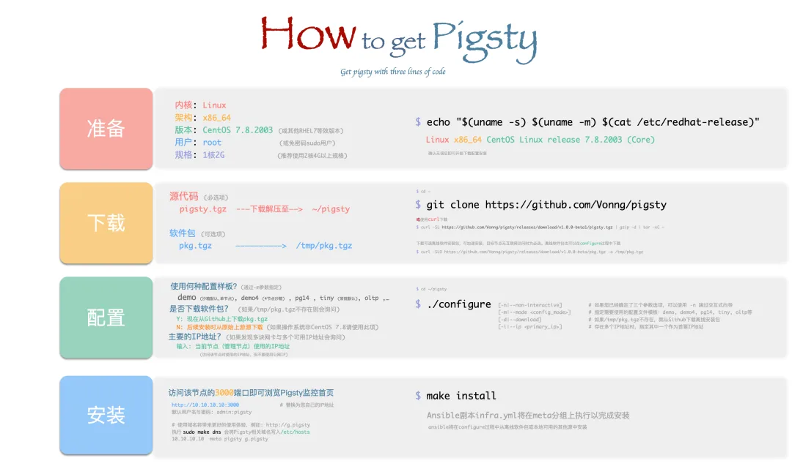

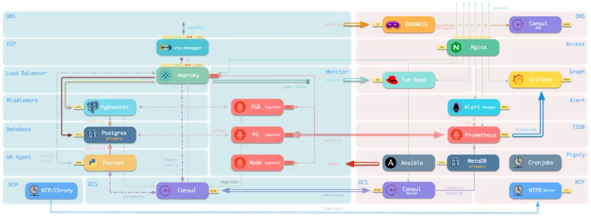

****图：Pigsty 单节点架构图****

#### 以部署为例

Pigsty 部署的数据库集群都是高可用、故障自愈、自带连接池、负载均衡、服务发现，完整监控，几乎无需人工介入。而且集群中的每个成员从效果上讲是等价的。任何一个成员都以提供所有服务（读写/只读）。只要集群中还有一个实例存活，整个集群对外提供的服务就不会中断。感觉上就像是在用分布式数据库一样。

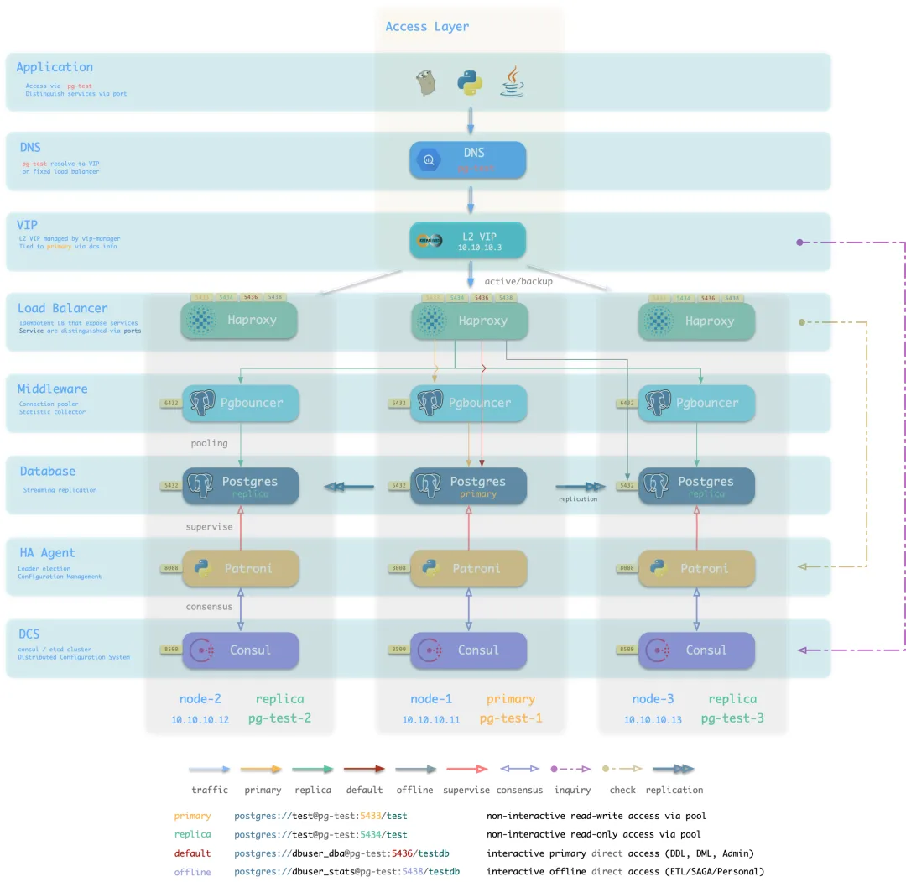

****图：Pigsty 部署的数据库集群（沙箱 pg-test 三节点演示集群）****

而新增这样一套数据库所需的配置工作也少的可怜，基本上只需告诉 Pigsty 你想在哪几台机器上部署一个集群，里面有什么数据库和什么用户这样的最基础的信息。\

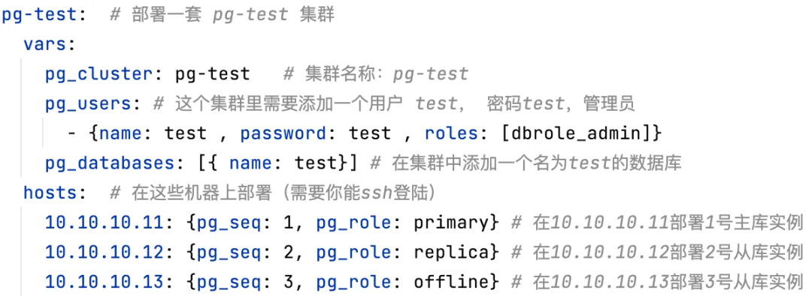

然后执行命令即可根据配置文件创建出数据库集群来

    bin/createpg   pg-test       # 创建pg-test集群
    bin/createuser pg-test test  # 在pg-test集群中创建test用户
    bin/createdb   pg-test test  # 在pg-test集群中创建test数据库

对于专业用户来说，有着 160+参数可以对数据库与运行时基础设施进行精细的定制。对于新手小白，什么都不配置也可以创建出非常不错的数据库：带有基本的用户角色，权限系统，配置好了所有默认权限，安装好了常用的扩展。Citus，TimescaleDB，PostGIS 这些的强力扩展也可以在配置中指定安装，或使用 CREATE EXTENSION 事后一键安装。

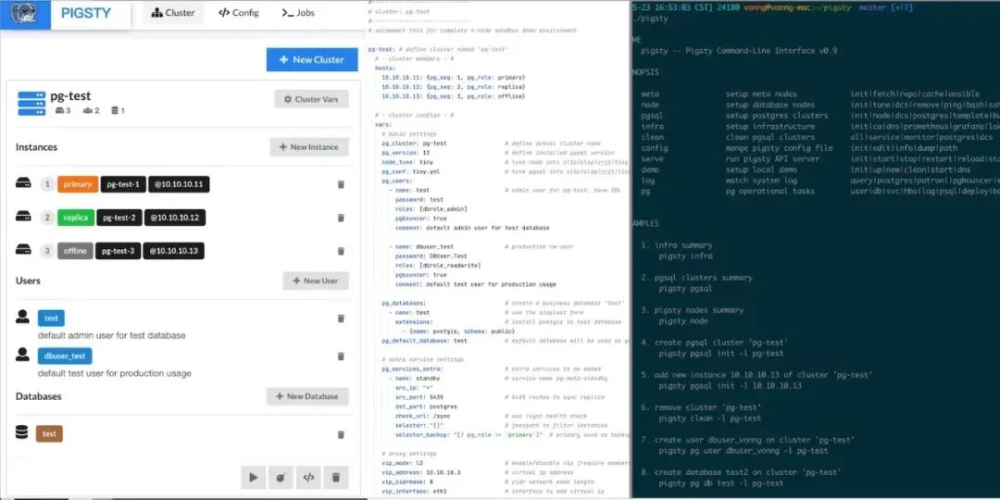

****图：如果你真的连命令都懒得敲，这儿还有个可行的 GUI/CLI 工具****

在管控部署这一点上，我自认为**在易用性上做到了极致**。在系统设计中把面向用户的复杂度压到了最小的程度：你只要有台机器（甚至只要有自己的笔记本），会敲一行命令就可以搞数据库了。Pigsty 可以说让世界上最先进的开源关系型数据库 PostgreSQL 的使用门槛降低到了一个全新高度。这也是一件值得自豪的事情。

#### 开源

> Once open source gets good enough, competing with it would be insane.
>
> *Larry Ellison* —— Oracle CEO

在软件行业，开源是一种大趋势，互联网的历史就是开源软件的历史，IT 行业之所以有今天的繁荣，人们能享受到如此多的免费信息服务，核心原因之一就是开源软件。开源是一种真正成功的，由开发者构成的 communism（译成社区主义会更贴切）：软件这种 IT 业的核心生产资料变为全世界开发者公有，人人为我，我为人人。

一个开源程序员工作时，其劳动背后其实可能蕴含有数以万计的顶尖开发者的智慧结晶。通过开源，所有社区开发者形成合力，极大降低了重复造轮子的内耗。使得整个行业的技术水平以匪夷所思的速度向前迈进。开源的势头就像滚雪球，时至今日已经势不可挡。除了一些特殊场景和路径依赖，软件开发中闭门造车搞自力更生已经成了一个大笑话。

依托开源，回馈开源。Pigsty 采用了友好的 Apache License 2.0，可以免费用于商业目的。Pigsty 永远欢迎任何人的反馈与贡献。只要**遵守 Apache 2 License 的显著声明条款**，也欢迎云厂商与软件厂商集成与二次研发商用。

> A system cannot be successful if it is too strongly influenced by a single person. Once the initial design is complete and fairly robust, the real test begins as people with many different viewpoints undertake their own experiments.
>
> — *Donald Knuth*

#### 发展规划

Pigsty 有极大的 Potential，假以时间与资源，它可以成为一个 **Game Changing** 的开源项目。例如：

Pigsty 可以选择专注于产出更多更丰富的监控面板，做**最好的开源 PG 监控系统**；

制作一系列基于此的数据应用与数据分析 &可视化作品，进一步**丰富应用场景与案例**；

添加对 PostgreSQL**衍生版本的支持**，例如 Citus，Greenplum，PipelineDB，openGauss

专注于容化与 Kubernetes Operator 开发，**拥抱云原生**；

提高**操作系统兼容性**，支持 SUSE（已有），Debian，Ubuntu 等其他 Linux 发行版；

选择海纳百川，用同一套现成的运行时监控管理其他开源数据库。

这些都是很有价值的事情，而且不仅仅是 PostgreSQL，也可以把 Redis（已有），MongoDB，甚至是 MySQL 都搞进来。让所有有意愿的用户**用好**数据库，用**好数据库**。形成合力，掀翻云厂商垄断，让优质的数据库重新成为人人可以拥有，人人可以使用的自由软件。

但即使最为天才的个人，也难以在合理的时间内完成这么多任务。只有凝聚社区的力量，才能将这样的事情推进下去。v1.0.0 就是这样一个里程碑：Pigsty 已经足够成熟，作为一个成年的项目，将走出自己的道路。1.0 后，我将逐渐专注于 Pigsty 社区建设与推广，顺便修养一段时间。这个项目能走到哪一步，就让我们拭目以待吧！

如果有什么问题，欢迎 **加入 Pigsty 交流群。**

了解最新进展，体验最新特性，答疑与故障排查，吹牛唠嗑灌水。

#### Pigsty v1.0.0 监控系统变更

#### 兼容性

v6 与 v7 的监控面板并不兼容。主要原因有二：第一是使用的监控指标体系发生了显著变化。第二是底层基础设施 Grafana 从 v7 升级到了 v8，这是一个重大版本变化（甚至连开源协议都改了）。但个人认为 Grafana 8.0 带来的用户体验改善非常显著的，还是很值得升级的，很多图表重制后给人完全不一样的感受。

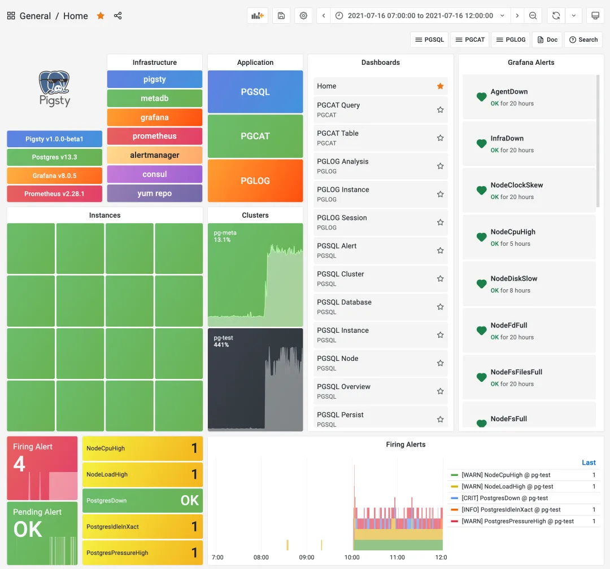

******图：新监控系统首页******

#### 设计风格变更

Pigsty 监控面板（v7）基于 Grafana 8.0 提供的诸多新特性彻底**重制**。采用了新的设计风格，给人带来焕然一新的用户体验。另外，这一版基于用户反馈采用了新的分级设计与主题化拆分理念：所有的导航监控面板（Overview，Cluster，Instance，Database）都比较简洁，只呈现关键核心指标，并提供到专门主题监控面板的**导航**。

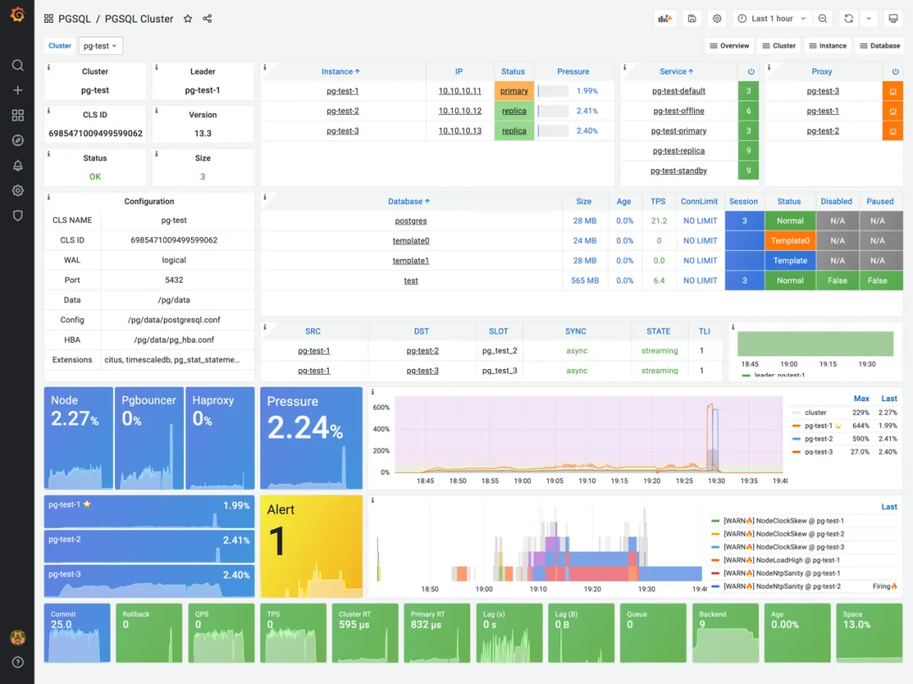

#### 图：新的 PGSQL Cluster 监控面板

#### 可以从这里直接前往集群内的：实例，节点，服务，负载均衡器，数据库，告警，流量管理界面

#### 主题化面板

采用简洁导航+专业主题面板的一个好处就是，普通开发者和新人用户不会因为海量的监控指标与面板感到困扰，而专业用户则仍然可以通过进入主题面板获取所有的细节信息。拆分后的主题面板更为紧凑专注，因此打开与渲染速度更快，而且可以围绕一类核心问题快速给出洞察。

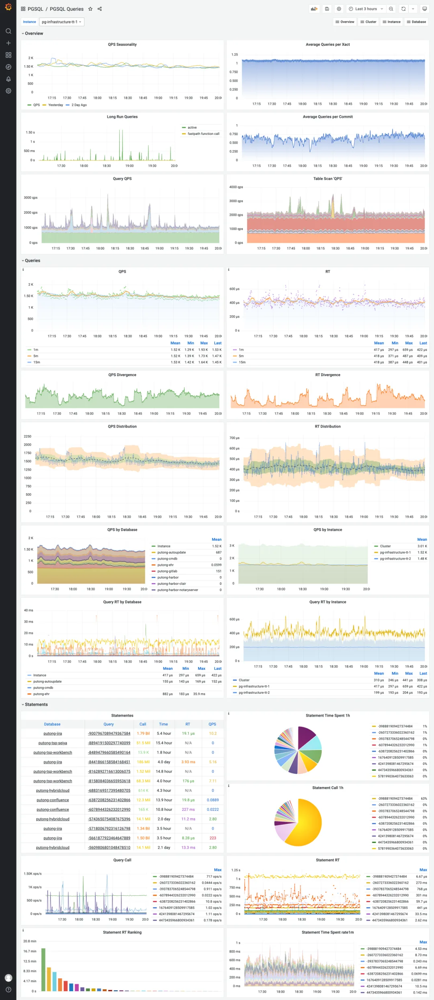

#### 图：新的 PGSQL Queries 主题面板，关注单个实例内的所有查询类指标

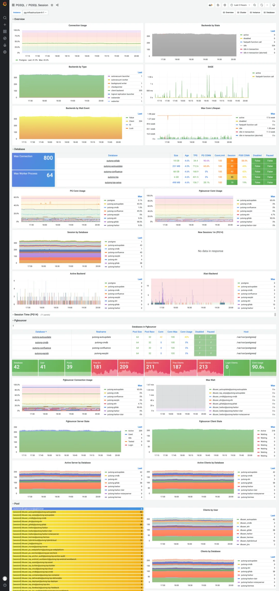

****图：新的 PGSQL Session 主题面板，关注单个实例内的所有会话类指标****\

#### 交互式导航

v1.0 监控面板最给力的改进是：绝大多数**监控图表现在都可以进行交互点击了**。例如在上图中，如果您从饼图中发现某一个查询执行所耗费的时间非常显著，希望查阅该查询的详细指标。那么只要点击对应的图形元素即可跳转至 **PGSQL Query** 面板并加载对应查询的数据。

以往当我们从图表中发现异常值时，通常要从图例中找到这个查询的 ID，然后再手工查找或复制 ID 执行查询。现在就可以直接点击图形元素「点、线、面」跳转。用户体验有了飞跃式的提升。

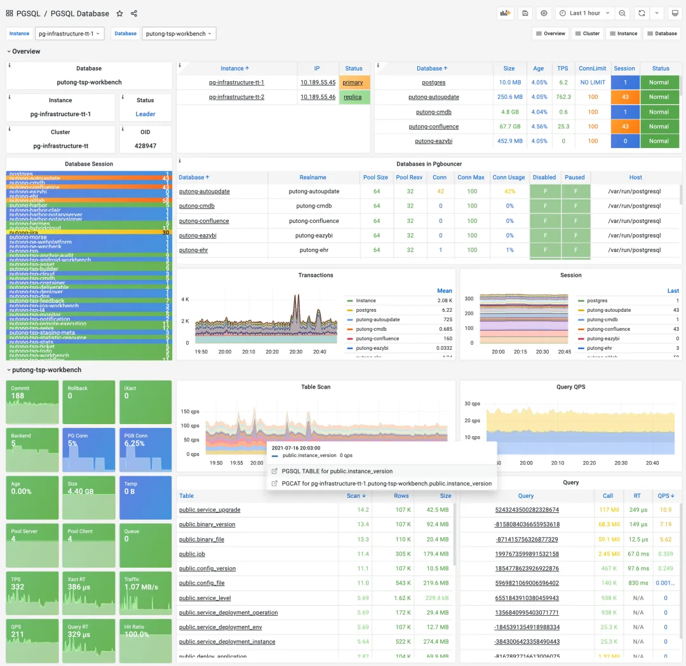

****图：新的 PGSQL Database 监控面板，可直接跳转至表或查询的详情 ****

用户可以快速进行下钻上卷横跳，而跳转也不仅仅局限在 Grafana 中。比如，可以直接点击负载均衡器跳转到 Haproxy 流量管理界面，也可以点击报警事件条直接跳转到**AlertManager**查阅或直接屏蔽告警。\

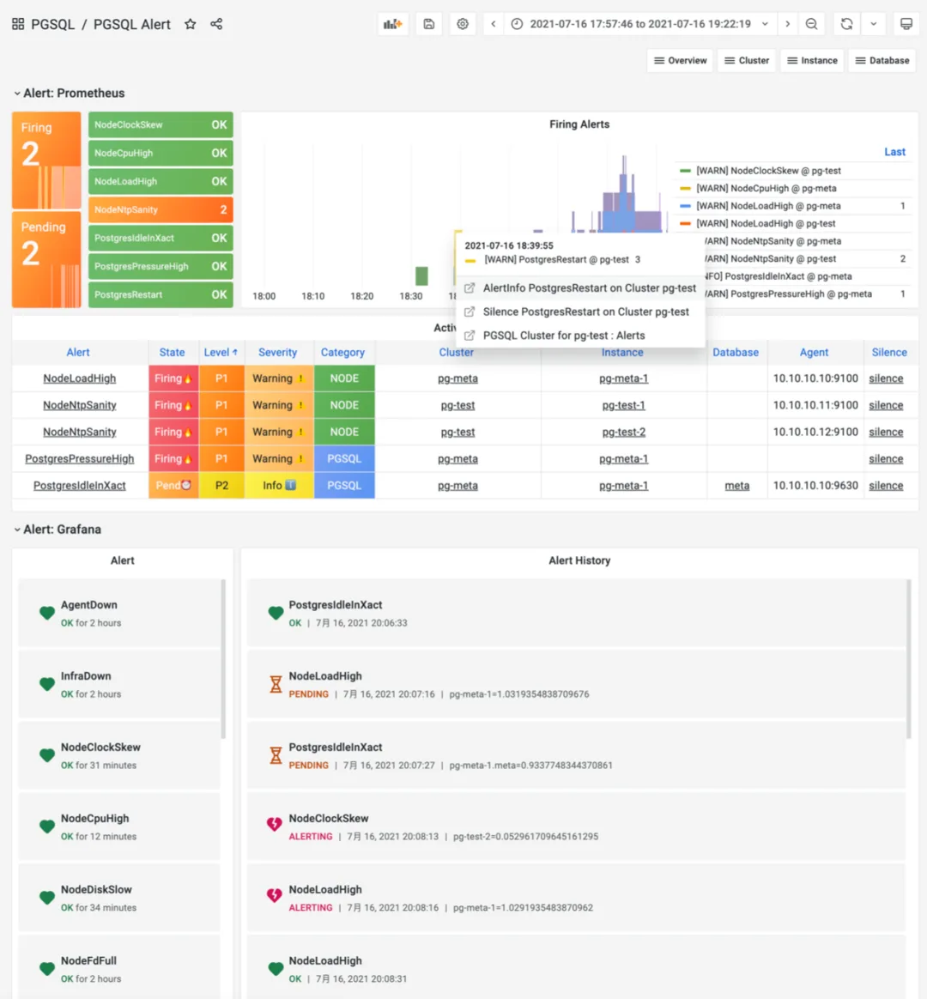

#### 自动注册数据源

在 1.0 中，所有由 Pigsty 托管的 PostgreSQL 都会在创建数据库与集群时，自动注册 PostgreSQL 数据源至 Grafana

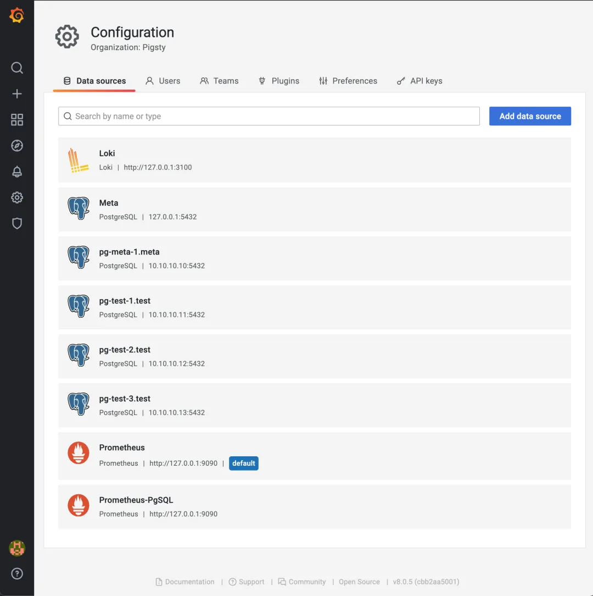

#### 图：自动注册的 PG 数据源，名称为：ins.db

这带来了很多新的可能性，例如：**直接从监控系统中查阅浏览系统目录**，获取关于某一个具体的表和某一类查询的详细信息，**目录数据**与**监控系统**中的指标数据可以相互印衬，提供更全面的信息。一个典型的场景就是：用户不需要登陆数据库查阅**pg_stat_statements**以将 QueryID 转换为具体的 SQL 语句了。

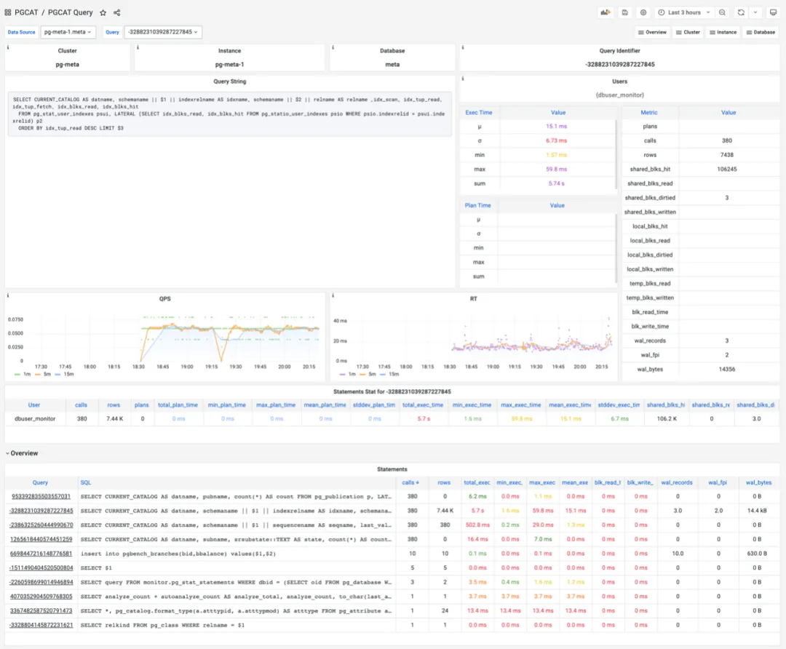

#### 图：CATATLOG 视角下的查询（包含语句与历史统计）

****点击 QueryID 可以跳转至 Metrics 视角下的查询****

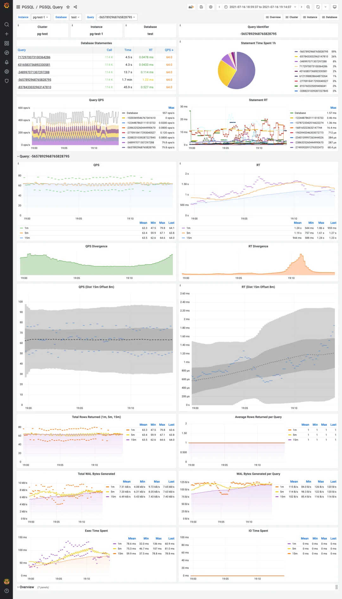

****图：Metrics 视角下的查询指标，可以与 Catalog 交叉对比。****

关注单个表的详情的 **PGSQL Table** 监控面板。详细展示了一张表上的增删改查，扫描与访问，IO 与命中率，垃圾清理与分析活动，所有相关索引以及其上的访问，与表相关的函数与序列号相关访问指标。同时点击 Relation 还可以跳转到 **PGCAT Table** 从数据字典的角度查阅这张表的详细信息。

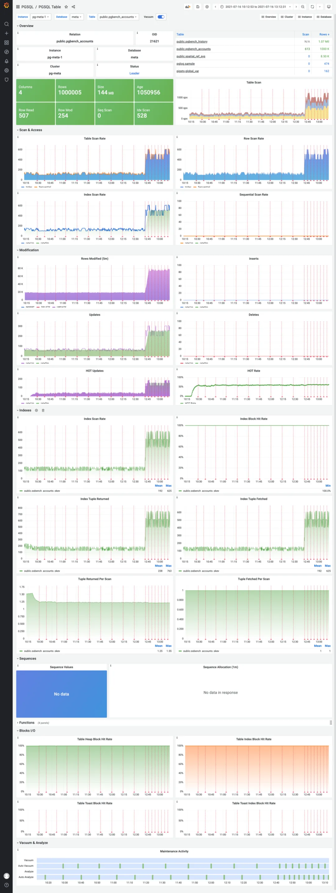

****图：新的 PGSQL Table 主题面板****，从监控指标的角度分析表********\

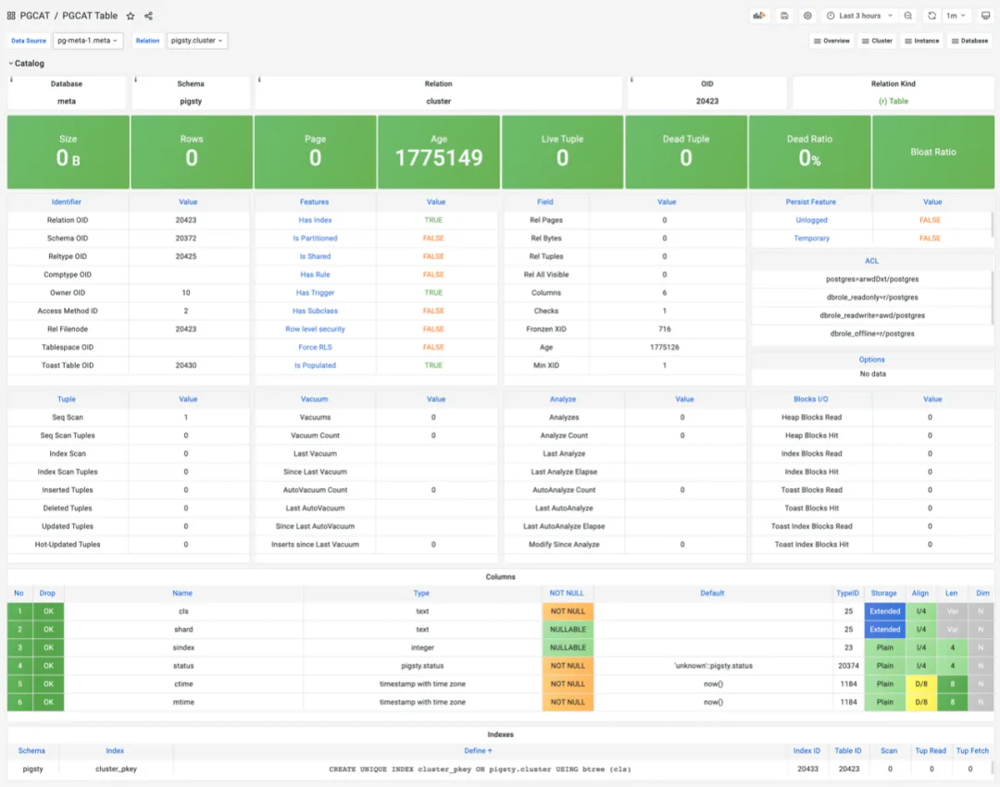

****图：新的 PGCAT Table 主题面板，从系统目录的角度分析表****\

#### 使用 PGLOG 应用分析 CSVLOG 样本

尽管基于**Loki**与**Promtail**的 **PGLOG Instance** 监控面板已经允许用户实时查询与搜索数据库日志（**Postgres，Pgbouncer，Patroni**）。但 grep 毕竟功能有限，对于更进一步的精细分析则有些力不从心。**一个典型的场景就是故障现场的日志分析，靠人眼看原始日志是很低效的**。但是通过 Pigsty v1.0 内置的新应用 **pglog**，我们就可以快速定位问题日志，并使用 SQL 对日志进行深度处理与分析。

pglog 是一个分析 PG CSV 日志的数据应用。您只需要在**管理节点**上使用一条简单的命令，即可将数据库日志导入 Pigsty MetaDB 中进行分析：

    # 获取当前节点当天的日志

catlog \| pglog\

    # 获取特定节点node-1具体某一天2021-07-15的日志

catlog node-1 '2021-07-15' \| pglog

    # 实际上干的事情就是把CSV日志灌入样本

    COPY pglog.sample FROM STDIN CSV;

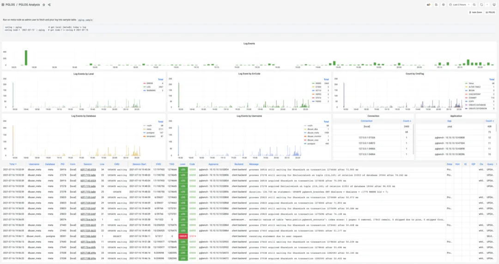

****图：PGLOG Analysis 面板，基于日志样本进行分析并呈现****

点击左上方的 AutoZoom 按钮即可将时间轴缩放至日志样本的时间范围上。

这里，用户可以在日志分布图上直接拖选时间范围，几次缩放就可以定位到毫秒级现场。通过 TimePickle 快速筛选，日志也会随之联动。发现错误日志后，可以点击日志项的 **Session ID** 字段连接，跳转到 **PGLOG Session** 面板查阅错误发生时的**上下文详情**。

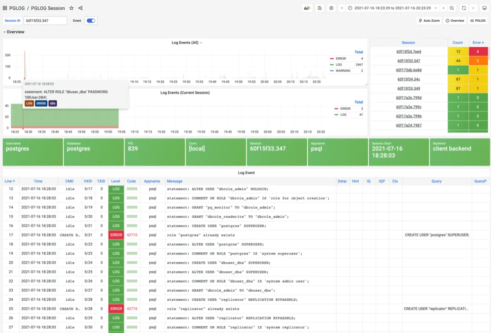

**\

******图：PGLOG Session 面板，专注于日志样本中的单条连接******

PG Session 会展示这条数据库连接相关的所有日志，并将日志事件以 Annotation 注解的方式显示在图表上。

#### 使用注解

Grafana 提供了 **注解（Annotation）** 机制用于呈现离散事件。在 Pigsty v1.0.0 中，诸如表的**垃圾回收（Vacuum）**，实例的**检查点（Checkpoint）** 都会使用注解的方式标记在图标上。

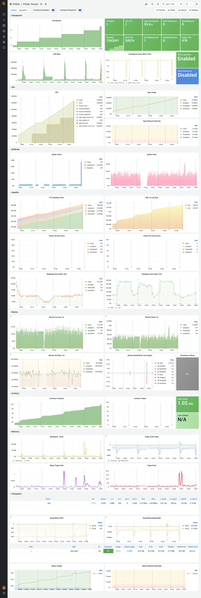

****图：关注单个实例持久化主题的 PGSQL Persist 面板****

****使用蓝线标注周期性检查点，使用红线标注手工检查点。****

例如，PostgreSQL Checkpoint 会使一些指标出现显著抖动。将 Checkpoint 事件标记在图标上，可以让用户一眼识别出指标的变化是否来自检查点，从而提高问题定位的效率。

## 报警规则重制

Pigsty v1.0.0 彻底梳理了所有的**告警规则**，现在告警系统有两种等效实现：Prometheus + AlertManager，以及 Grafana。前者更为专业，可定制化更强，便于与外部系统对接；后者更为灵活方便，可以集成不同数据源进行报警，并在告警消息中附带截图与连接。您可以同时使用这两种告警系统，互为备份。

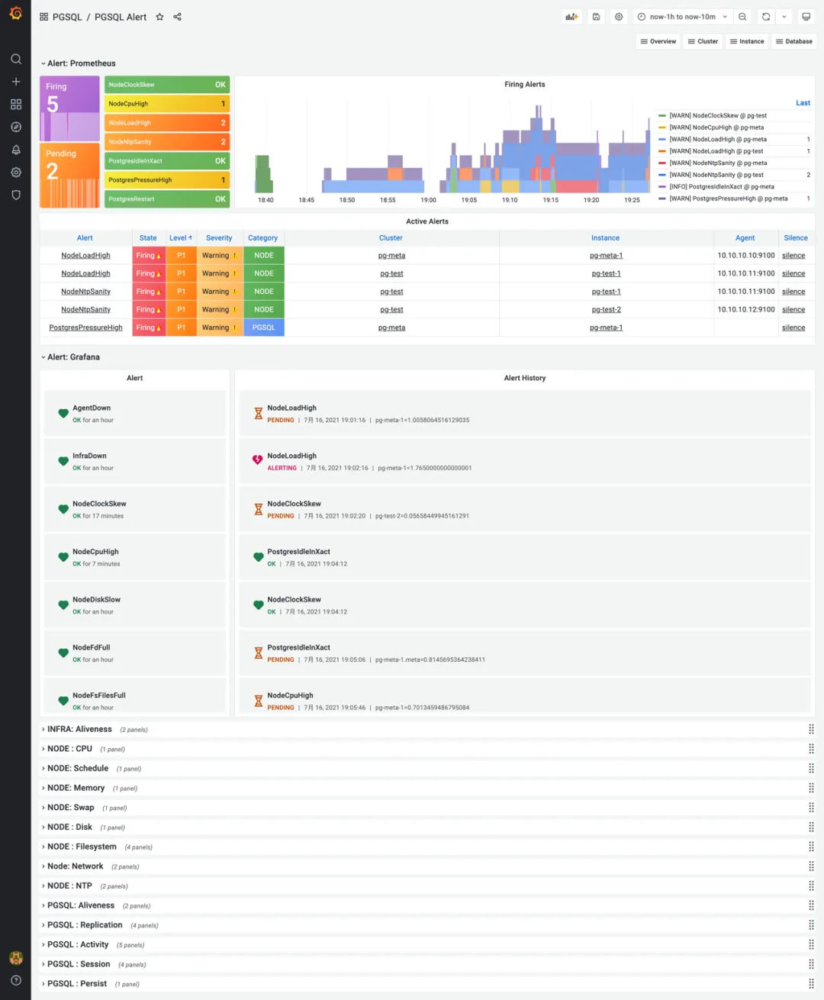

****图：PGSQL Alert 面板****

### 其他有趣的改进

限于篇幅，这里就不再一一列出。更多信息，敬请关注本公众号，Github Repo

，官方文档站，或加入末尾的微信群。

---

发布版本：[微信公众号](https://mp.weixin.qq.com/s/HgYTLv0WHnh47GGMAZ1kAQ)
