好消息，好消息，时隔一月，开箱即用的开源 PostgreSQL 发行版 —— Pigsty  正式发布 v1.1 版本！v1.1 带来了一些非常不错的特性，主要是关于基础设施的（毕竟部署好的数据库没人想去动它）。以下是更新摘要。


## 全新的首页

一直以来，Grafana 监控系统中的 Home Dashboard 都扮演着 Pigsty“主页”的角色，现在 Pigsty 终于有一个看上去还不错的独立的主页啦。如果想知道主页是什么样子，可以访问公开演示：<http://home.pigsty.cc>

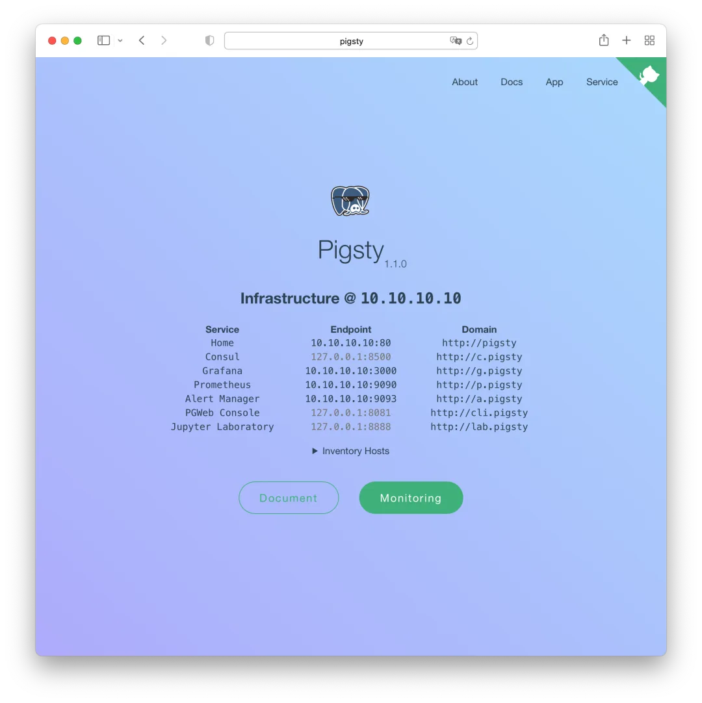

比较熟悉 Pigsty 的用户可能一下子就能看出来，这不就是文档站抽出来改了一改吗？哈哈是的，这个首页就是一个本地版的文档站，由默认的 Nginx 提供服务。

### 服务导航

这个主页提供了前往 Pigsty 各个服务组件的导航，包括以前就有的：Consul，Grafana，Prometheus，AlertManager，以及在 1.1 中新引入的 **PGWeb** 与**Jupyter Lab**。您可以直接点击首页正中的组件名称/URL，或通过导航栏右上角的`Service`下拉菜单进入。

#### 监控导航

首页现在也可以呈现 Pigsty 部署中的集群与实例（可选），并提供到具体集群、实例的监控首页，流量的管控界面的的直接跳转。

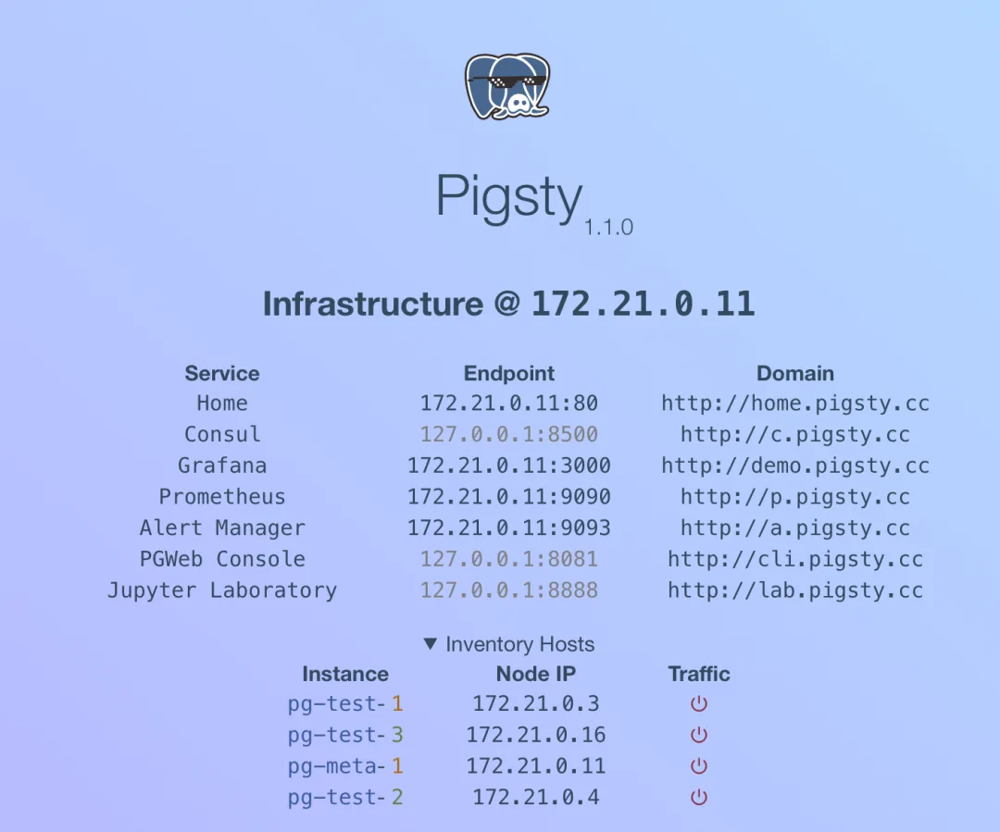

#### 应用导航

右上角的 App 下拉选单将成为 Pigsty 扩展功能的入口，在 1.1 中，Pigsty 自带了几个实用而有趣的应用。这些应用都可以通过配置选项添加。

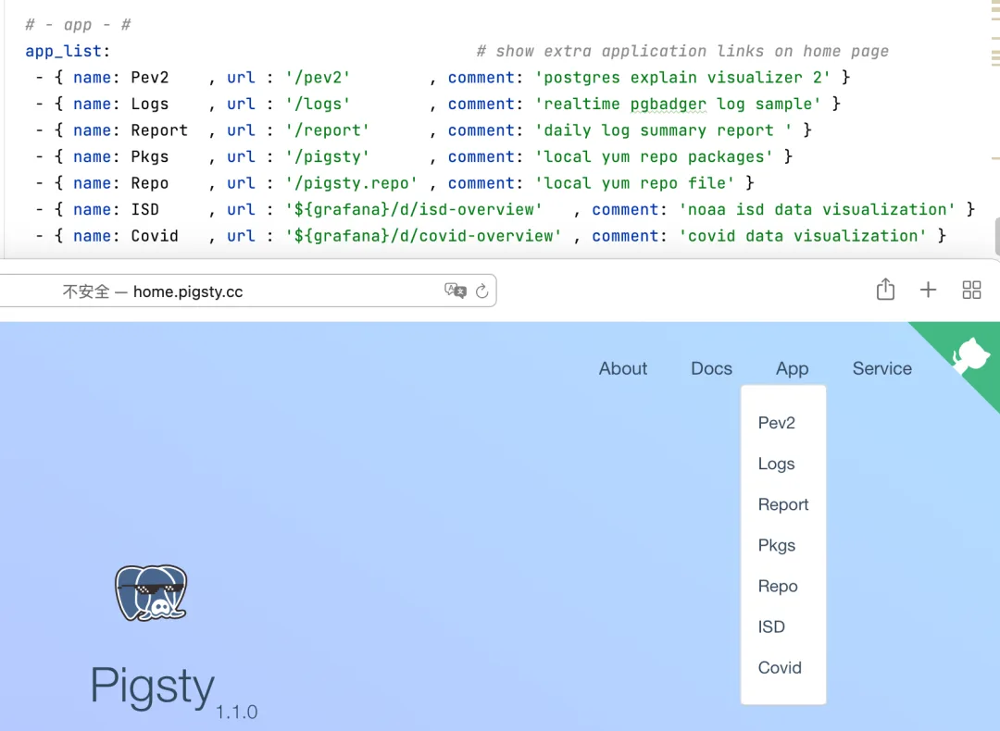

#### 本地文档\

在 Pigsty1.1 中，您可以直接从 Pigsty 首页访问本地离线文档，包括中英双语。

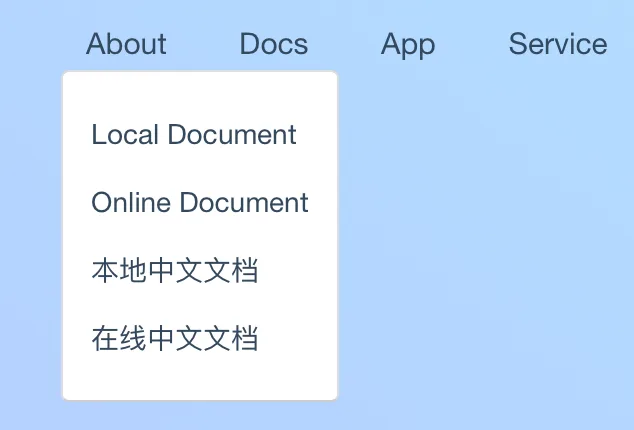

### Jupyter Lab

如果您曾使用 Python 进行数据分析，那么 Jupyter 一定不会陌生。Pigsty v1.0.0 打包了 Jupyter Lab 软件包，而 v1.1 则更进一步，将其放入原生支持中。在演示与个人配置模板中，Jupyter Lab 默认启用，在生产环境部署中则默认不启用。

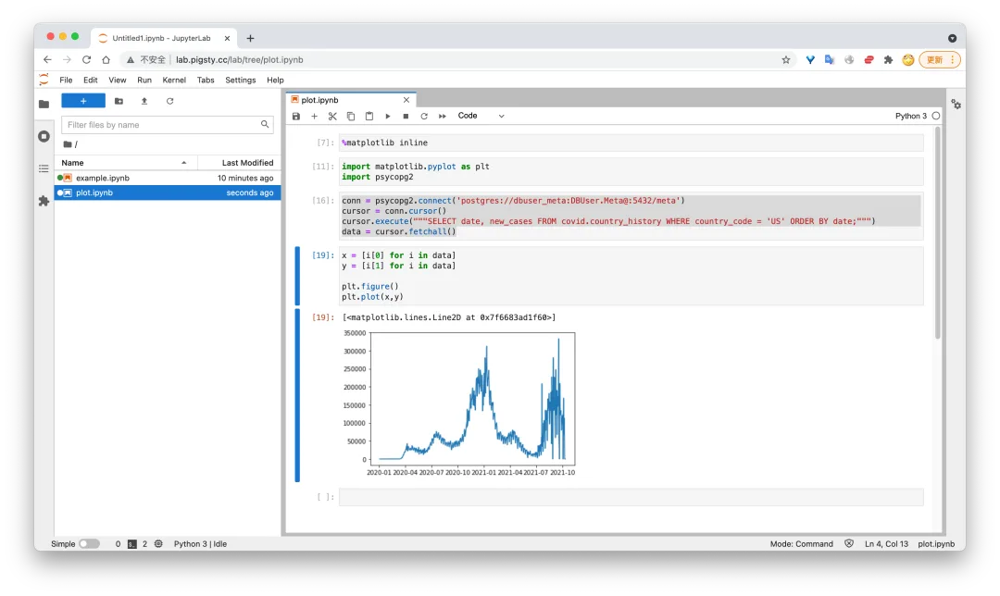

您可以通过 Jupyter Notebook，高效，敏捷地提取数据，处理、分析、转换、并进行可视化，组合使用 Python 与 SQL 的强大能力。（当然您也可以继续使用 Pigsty 提供的 Grafana 与 Echarts 进行可视化）

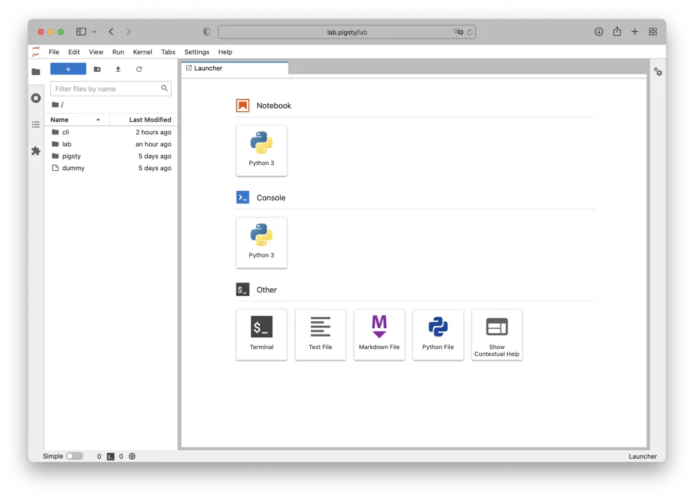

当然，强大与便利往往也蕴涵着风险。Jupyter 执行任意代码的能力对于生产环境仍然是一个过于冒险的配置，因此默认不会在生产环境配置模板中启用。

### PGWeb

作为一个开箱即用的数据库发行版，提供一个开箱即用的图形化客户端工具也是非常重要的。PGWEB 是一个使用 Go 编写的，小巧的，基于浏览器的 Postgres 图形客户端

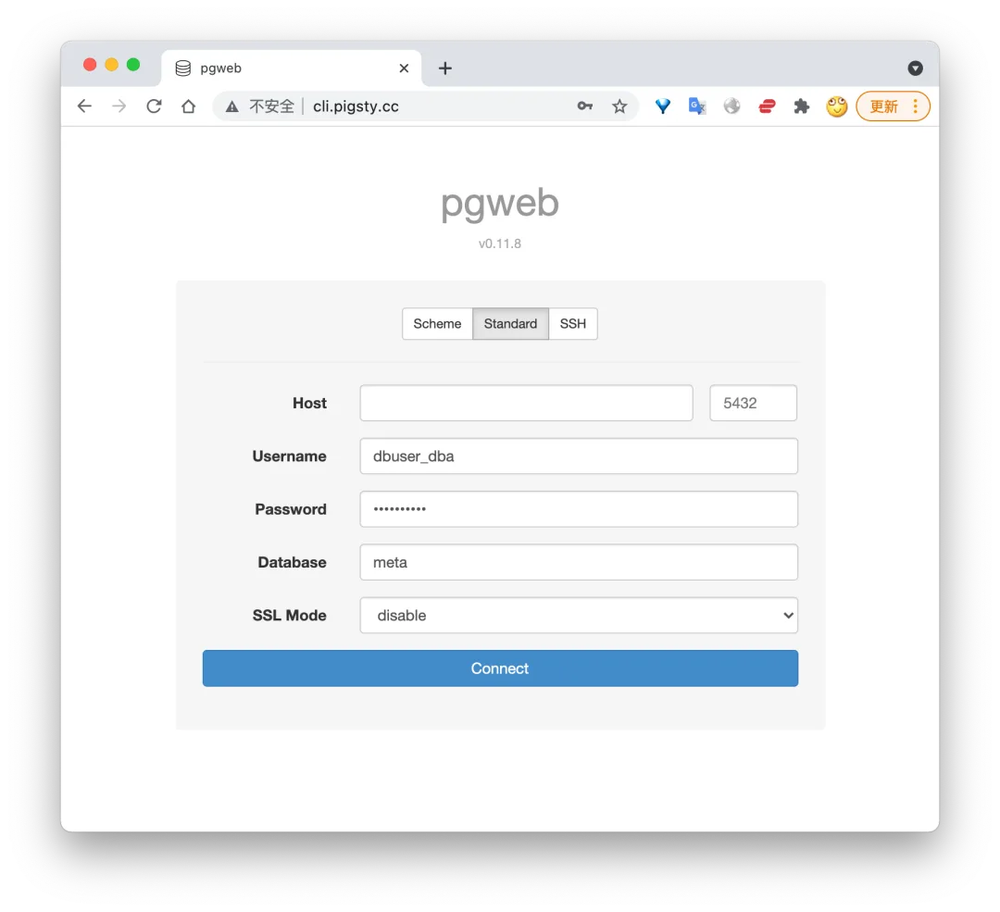

与 Jupyter 类似，PGWEB 在演示与个人配置模板中默认启用，在生产环境部署中则默认不启用。但 PGWEB 要求用户拥有访问数据库的连接串，因此相对安全，可以用于生产环境中个人用户查询少量数据的场景。

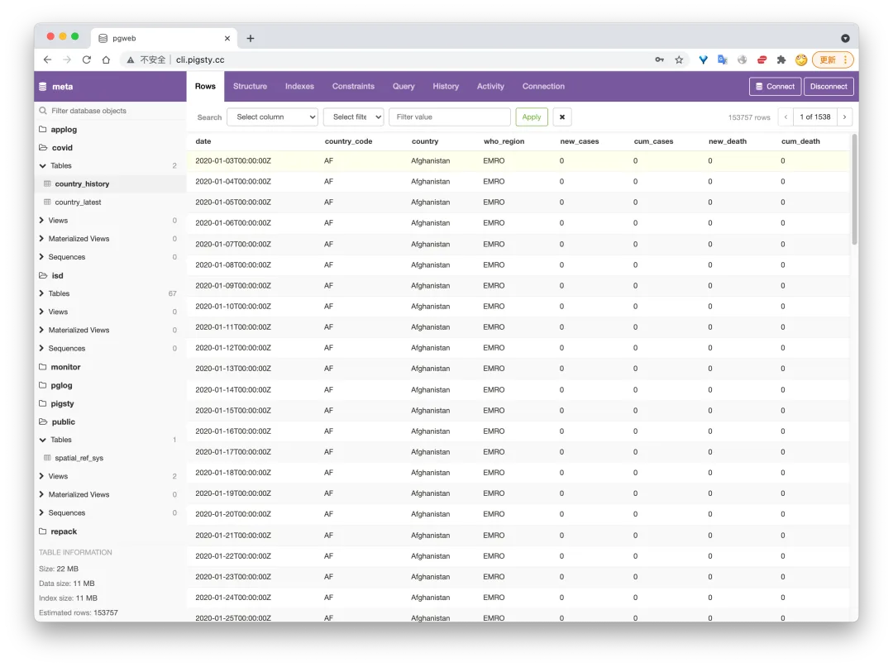

用户可以浏览数据库中的模式、对象。快速浏览表中的数据，执行查询等。

### PEV2

Pev2 是一个实用的执行计划分析器，可以把 PostgreSQL 查询 EXPLAIN 的结果转换为一颗直观的执行计划树。

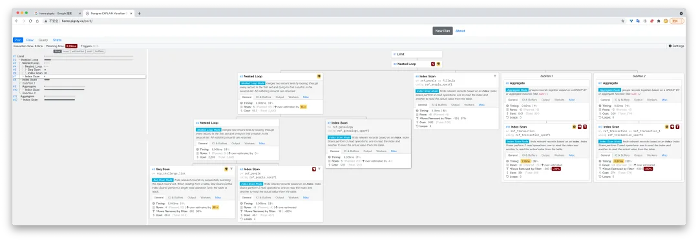

这个工具对于优化慢查询，分析 auto_explain 结果都非常好用。

### PGBadger

PGBADGER 是一个非常好用的 Postgres 日志分析组件，可以从 CSV 日志中快速生成精美全面的分析报告。

使用`bin/pglog-summary [ip] [date]` 即可拉取特定节点特定日期的日志，并创建日志分析报告。

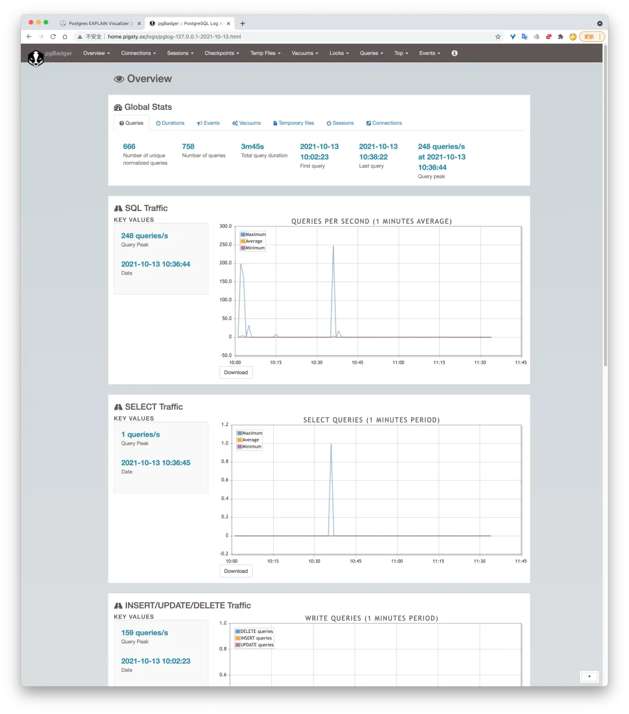

为该命令添加 Crontab，即可每天、或准实时地自动生成数据库运行报表。

### 软件更新

PostgreSQL 14 已经正式发布了，Pigsty v1.1 也第一时间进行了跟进与支持。`pigsty-pg14` 模板已经可以在生产环境中创建默认版本为 14 的 PostgreSQL 数据库了。但因为 PostgreSQL 的一个重要三方扩展 TimescaleDB 尚未正式支持 PG14 （预计时间 10-30），因此 PG14 还不是 Pigsty 的默认数据库版本。

Pigsty 将于 **v1.2** 进行默认 PG 版本升级，将默认数据库版本升级为 PG14。

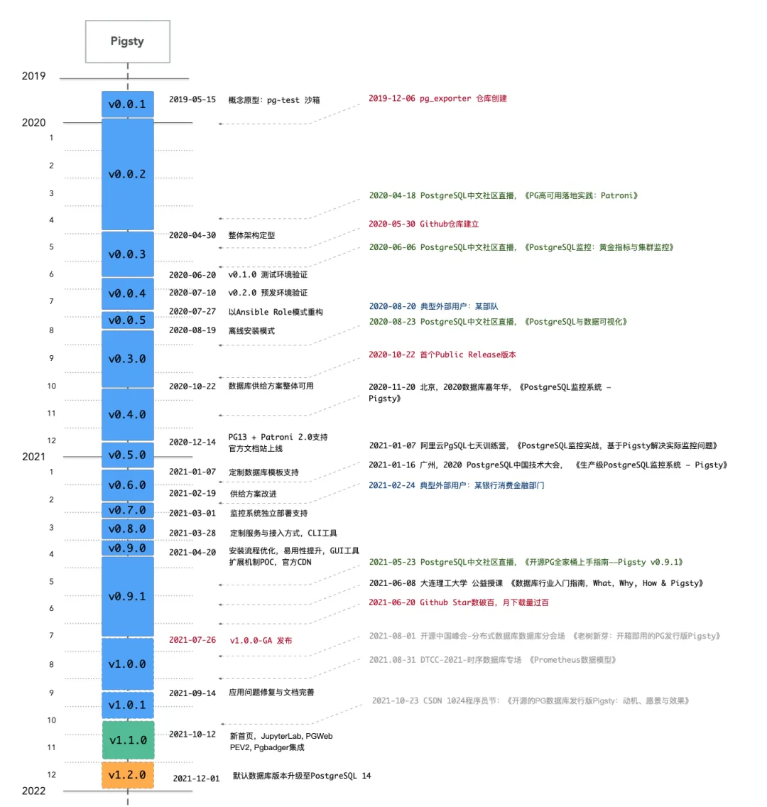

此外，其他软件也都有升级：

- postgres 升级至 v13.4

- pgbouncer 升级至 v1.16 (新增 2 监控指标)

- grafana 升级至 v8.1.4

- prometheus 升级至 v2.2.29

- node_exporter 升级至 v1.2.2

- haproxy 升级至 v2.1.1

- consul 升级至 v1.10.2

- vip-manager 升级至 v1.0.1

### 新的剧本：数据库迁移

Pigsty 内置了一个 数据库在线迁移的辅助脚本：`pgsql-migration.yml`，提供了一个开箱即用的基于逻辑复制的不停机数据库迁移方案。

填入源集群与宿集群相关信息，该剧本即会自动创建出迁移中所需的脚本，在数据库迁移时只需要依次执行即可，包括：

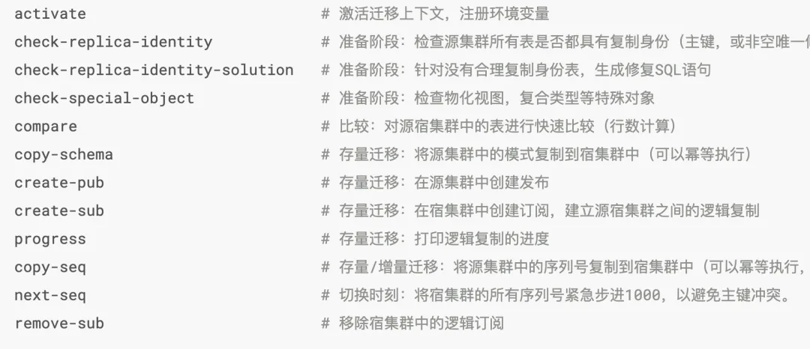

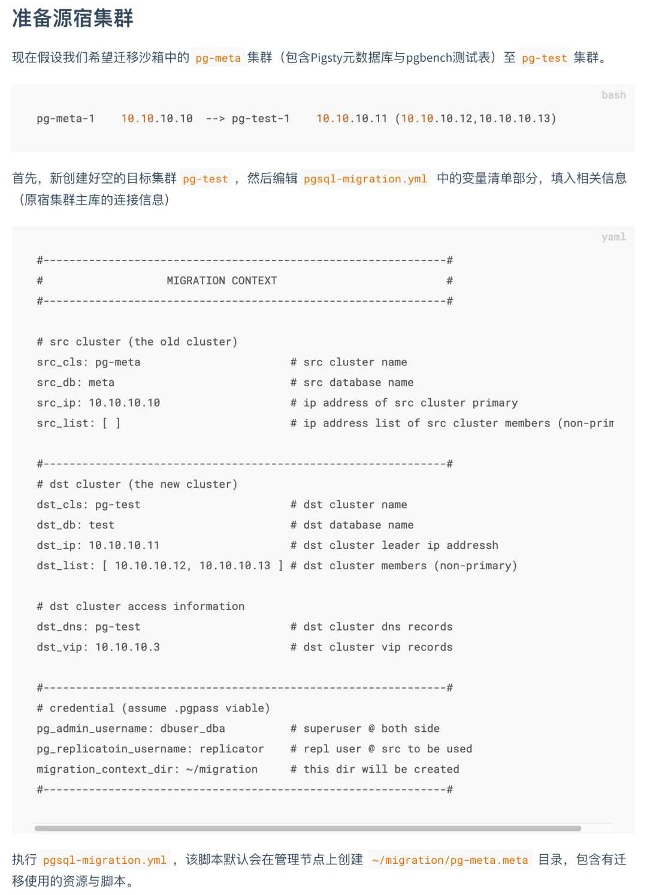

### 新的应用：苹果隐私日志可视化

最后，Pigsty 的自带的默认演示应用里又多了一个：苹果应用隐私日志可视化（APPLOG），您可以在 iOS15 系统中导出应用程序访问隐私的记录，并在此应用中进行可视化，细节可以参考公众号前一篇文章 《 [微信读相册这点事](/misc/wechat-spyware/) 》。

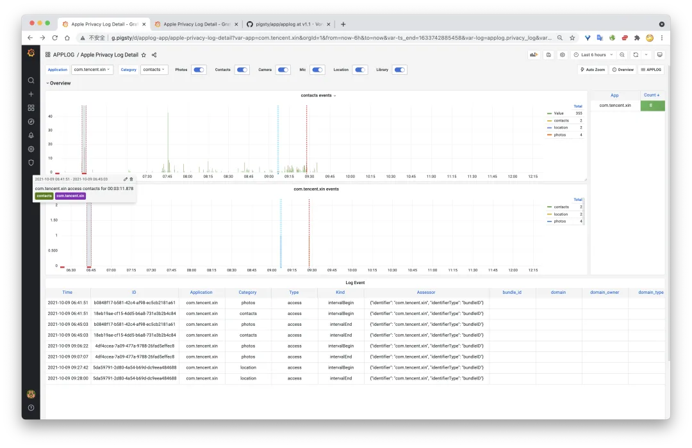

图：微信大清早偷偷访问我的相册长达 4 分钟

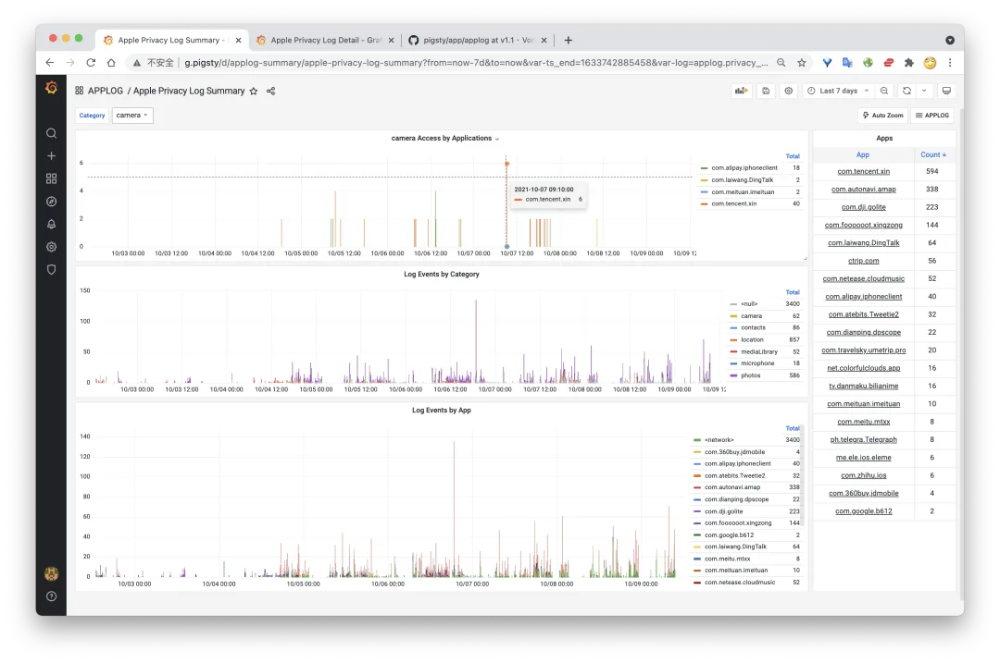

### 一些有趣的小功能

部署好的数据库没人想去动它，但 Pigsty 还是在 v1.1 加入了一个数据库实例上的新特性：Dummy file。原理很简单，创建一个一定尺寸（例如 1～4GB）的`/pg/dummy`，这样当出现磁盘写满的故障时（通常很多操作都无法正常完成了），只需要将其删除，就可以释放出一定的应急空间来。

这个功能非常实用，但对于已经创建好的数据库实例而言，手动`dd`或`filealloc`一个就可以与新版本保持一致，或者彻底无视也没有关系。

此外，v1.1 中还添加了 promscale 的安装包，这是一个有趣的组件，可以将 Prometheus 的时序数据存储替换为 TimescaleDB（Postgres），文档中的教程也更新了如何替换的细节。

Enjoy！

### 其他

此外，还有一些 Bug 与小问题的修复，文档的例行完善等

### 变更细节

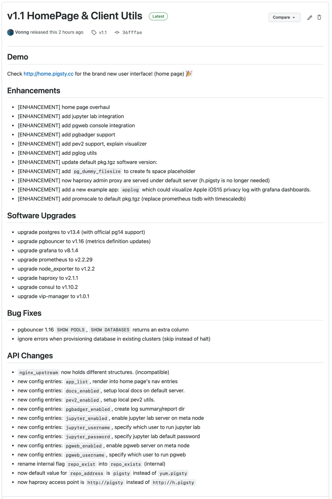

---

## v1.1.0 更新日志

### 功能增强

- 增加 `pg_dummy_filesize` 以创建文件系统空间占位符
- 主页大改版
- 增加 Jupyter Lab 整合
- 增加 PGWeb 控制台整合
- 增加 PgBadger 支持
- 增加 PEV2 支持，执行计划可视化工具
- 增加 pglog 工具

#### 软件升级

- PostgreSQL 升级至 v13.4（支持官方 PG14）
- pgbouncer 升级至 v1.16（指标定义更新）
- Grafana 升级至 v8.1.4
- Prometheus 升级至 v2.2.29
- node_exporter 升级至 v1.2.2
- HAProxy 升级至 v2.1.1
- Consul 升级至 v1.10.2
- vip-manager 升级至 v1.0.1

#### API 变更

- `nginx_upstream` 现持有不同结构（不兼容）
- 新配置条目：`app_list`，渲染至主页的导航条目
- 新配置条目：`docs_enabled`，在默认服务器上设置本地文档
- 新配置条目：`pev2_enabled`，设置本地 PEV2 工具
- 新配置条目：`pgbadger_enabled`，创建日志概要/报告目录
- 新配置条目：`jupyter_enabled`，在元节点上启用 Jupyter Lab 服务器
- 新配置条目：`jupyter_username`，指定运行 Jupyter Lab 的用户
- 新配置条目：`jupyter_password`，指定 Jupyter Lab 的默认密码
- 新配置条目：`pgweb_enabled`，在元节点上启用 PGWeb 服务器
- 新配置条目：`pgweb_username`，指定运行 PGWeb 的用户
- 将内部标记 `repo_exist` 重命名为 `repo_exists`
- `repo_address` 默认值改为 `pigsty` 而非 `yum.pigsty`
- HAProxy 访问点改为 `http://pigsty` 而非 `http://h.pigsty`

---

## v1.1.1 更新日志

- 用 `timescale` 版本替换 TimescaleDB 的 `apache` 版本
- 升级 Prometheus 到 2.30
- 修复 pg_exporter 配置目录属主问题（改为 `{{ pg_dbsu }}`）

### 升级说明

此版本主要变动是 TimescaleDB，使用 TimescaleDB License（TSL）的官方版本替代了 PGDG 仓库中 Apache License v2 的版本。

```bash
# 停止带有 timescaledb 的 postgres 实例
yum remove -y timescaledb_13

# 添加 TimescaleDB 官方仓库
[timescale_timescaledb]
name=timescale_timescaledb
baseurl=https://packagecloud.io/timescale/timescaledb/el/7/$basearch
repo_gpgcheck=0
gpgcheck=0
enabled=1

yum install timescaledb-2-postgresql13
```

---

发布版本：[微信公众号](https://mp.weixin.qq.com/s/1sFybkUlIDNidNQgPrgB3w)
