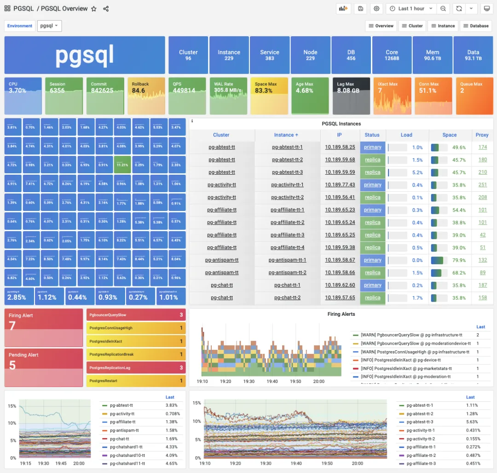
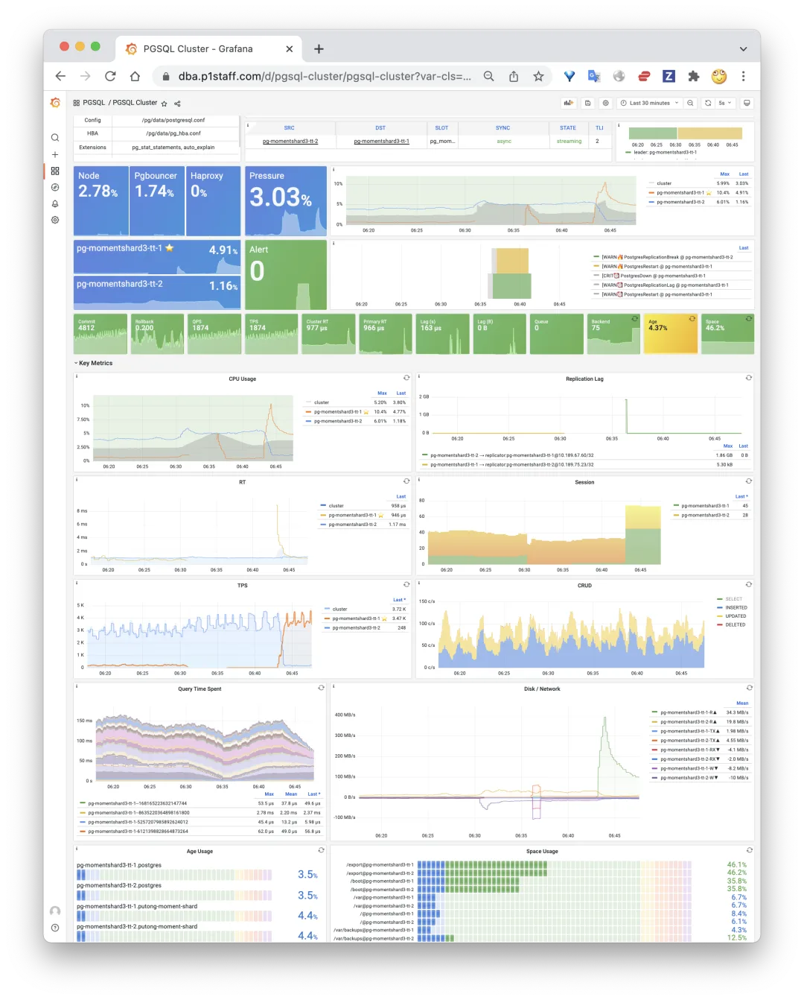
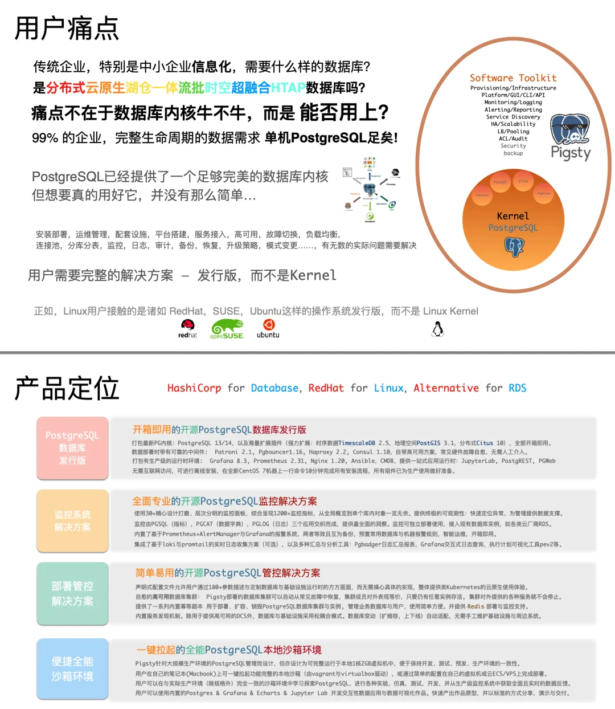
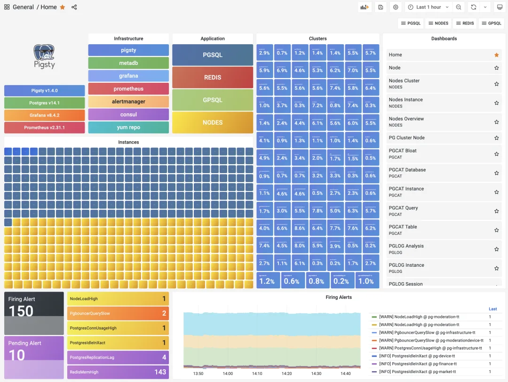
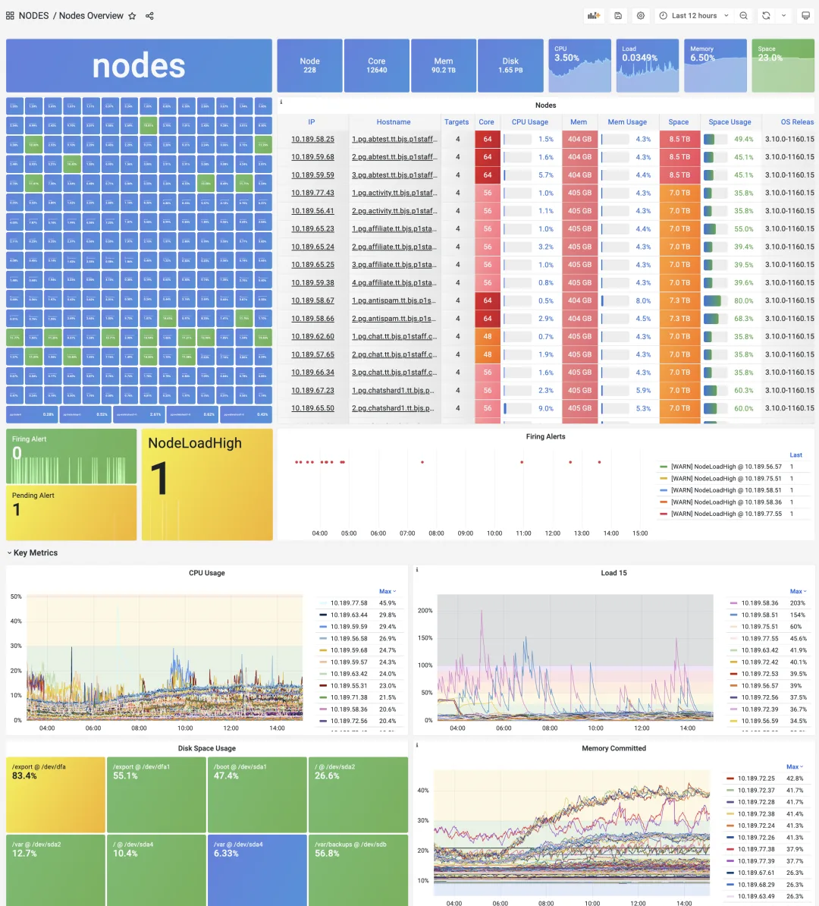
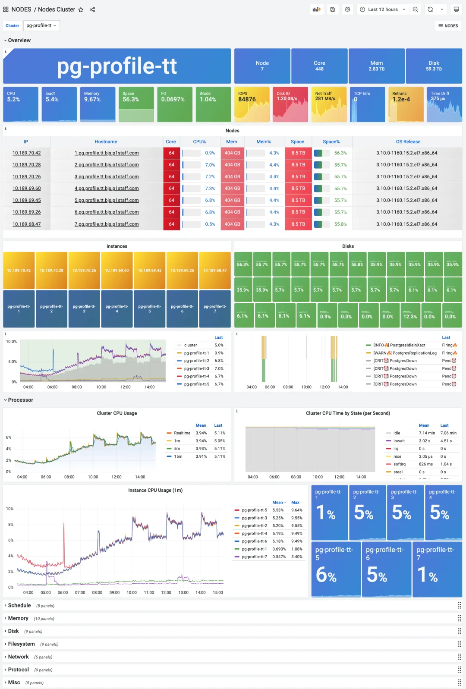
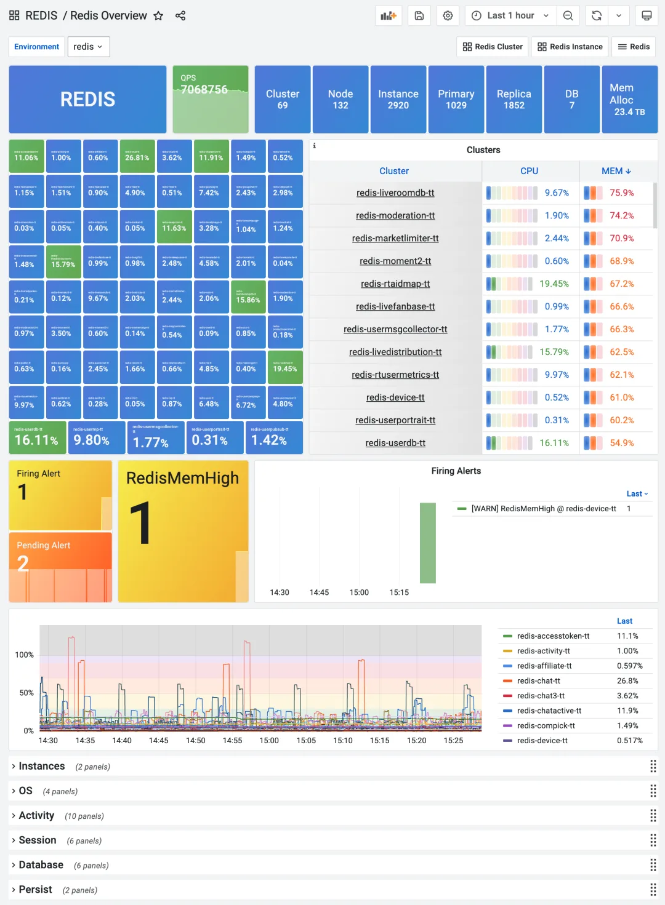
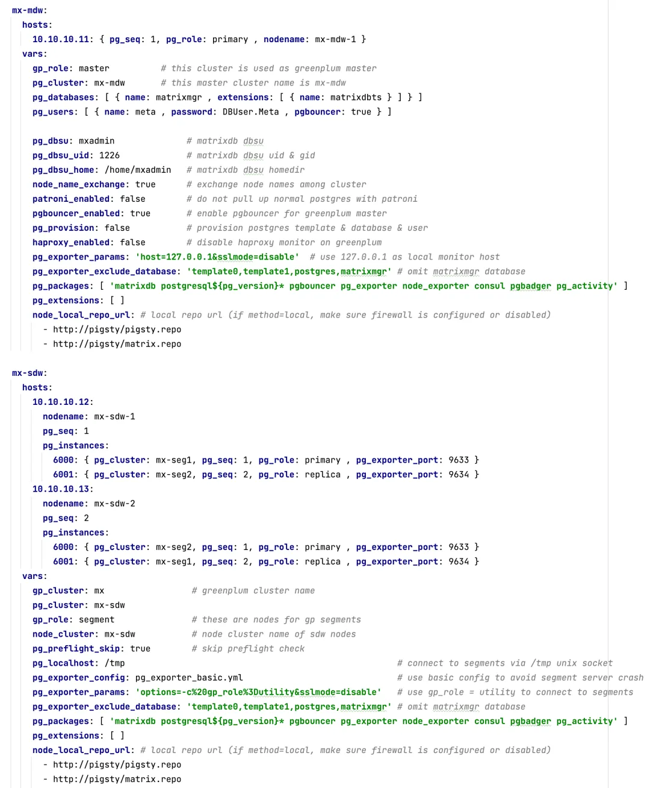
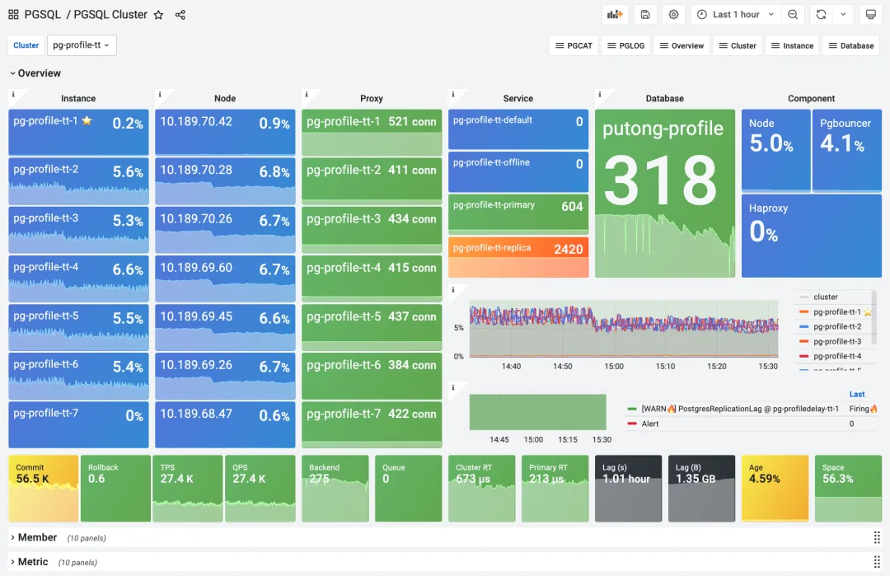
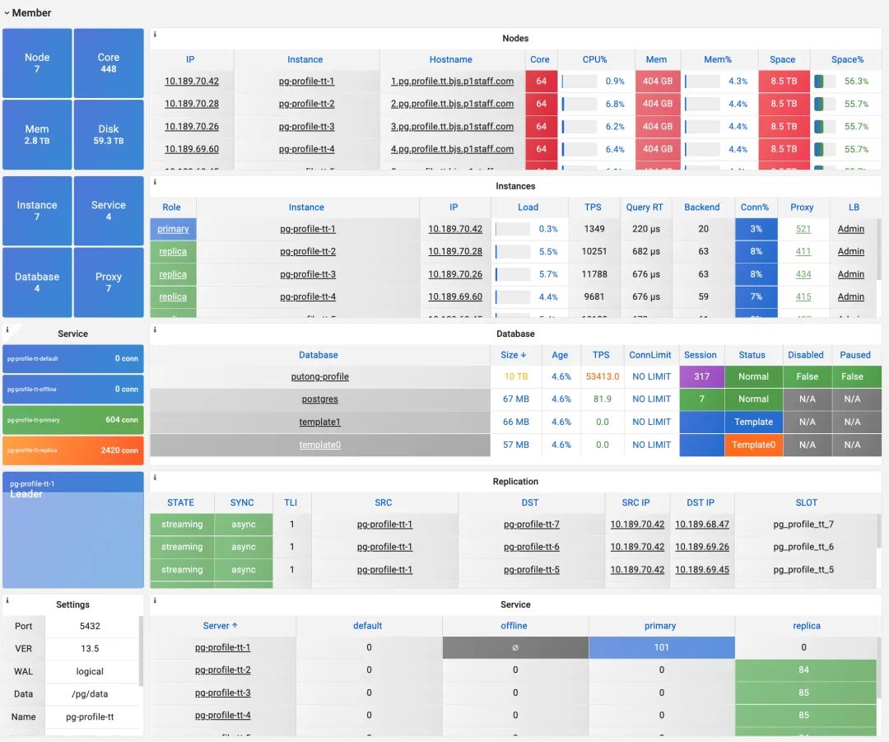

Pigsty v1.4 将于 3 月内发布，对监控系统进行了显著改进；探探所有 PostgreSQL 完整搬迁至 Pigsty；Pigsty 开始接洽 VC

## 探探全量迁移至 Pigsty

探探是 Pigsty 最大的用户案例，也始终是第一个吃螃蟹的人。今天探探下线了最后一套遗留的旧 PostgreSQL 数据库 `pg.meta.tt`。至此，探探主生产环境所有数据库均已迁移至 Pigsty，近一百套集群全部由 Pigsty v1.3.1 所托管。所有集群全部启用了高可用自动切换，历时近两年的**数据库飞升项目**正式宣告完工。

> 探探主生产环境的 Pigsty 部署：96 集群 12688 核的 PostgreSQL OLTP 集群。

**在探探，Pigsty 经过了长时间，大规模，高强度的实际生产环境测试**。在两年的时间里不断打磨完善，最终演变为今天的样子。在近日的混沌工程演练中，运维随机挑选数据库机器进行多次宕机演练，Pigsty 在无人值守的情况下可以自动进行高可用主从/流量切换。从库宕机无业务影响，主库宕机对业务写入影响不超过在 1 分钟。

> 一次典型从库宕机现场，读流量迅速由主库承担，业务只有极个别现场查询中断报错，而后立即恢复。

> 一次典型主库宕机现场。主库宕机 30s 后，从库被提升新主库，影响 30s 业务写入请求后自愈。

## Pigsty 与 VC

Pigsty 是一个开源项目，致力于 PostgreSQL 的推广，极大降低数据库的使用与管理门槛，显著拉高社区用户使用 PostgreSQL 的下限。依托于 PostgreSQL 中文社区，属于用爱发电的公益开源项目。

不过，数据库作为信息系统的核心组件，很多用户在使用中反馈，希望有专业的商业服务来兜底。因此 Pigsty 也不排斥进行一些商业化方面的探索，最近接触了一些 VC 机构，也与不少投资人聊过。

> Pigsty 的用户痛点与产品定位

今日，Pigsty 很荣幸通过了由陆奇博士主办的创业孵化器 奇绩创坛 的面试，有机会进入 2022 春季创业营。如果您也对投资 Pigsty 感兴趣，现在确实是一个好机会哦，请联系我。\

## Pigsty v1.4 新特性前瞻

最近经常听到一类用户的反馈：

1. Pigsty 可不可以用来监控管理其他类型的数据库？

    例如 Redis，MySQL，Greenplum？

2. Pigsty 的工作假设，DB：Node 1:1 部署是否合理？

    如何支持单机多实例的部署与监控？

3. Pigsty 的主机监控能不能独立使用？

    我不想用数据库，只想用主机节点监控怎么弄？

应。Pigsty 将于 3 月内发布 v1.4，对这些用户关心的问题做出回应，带来一系列体验改进与新功能特性，包括：

1. 独立的主机节点监控部署功能

2. 改进的 PostgreSQL 数据库监控

3. 对 Greenplum/MatrixDB 部署与监控的初步支持

4. 改进的监控数据模型，支持单机多实例。

> Pigsty v1.4 Home 主页

### 节点监控\

Pigsty v1.4 引入了一个全新的功能：节点监控。

这并不是说以前 Pigsty 没有关于机器节点的监控指标，而是在以前，机器的监控指标是 1:1 与 PostgreSQL 实例绑定的。对于一个 PostgreSQL 数据库发行版来说，这样的设计是没有问题的。但随着 Pigsty 的发展，这样的设计就开始显得不合时宜了。

>

用户可能有各种各样的使用方式与部署策略，例如，在一个节点上部署多个数据库实例，甚至部署多种不同类型的数据库。在这种情况下，合适的做法是把节点的管理与监控单独抽离出来，不与具体的数据库类型绑定。

这样做有两个显著的好处：一是如果用户不需要数据库监控与管理，只需要节点的监控与管理，那么会比以前简单很多；第二是一个节点上可以部署多个甚至多种数据库，并复用同样的节点监控指标数据。

> Node Overview 面板，关注所有节点的指标。

虽然 Pigsty 的定位是开箱即用的 PostgreSQL 发行版，但其中也包含着主机监控的最佳实践。有些用户根本不 care 数据库，只是拿 Pigsty 做主机监控…。

> 新增的 Nodes Cluster 面板，关注一组节点的聚合指标与集群内的水平对比

节点监控提供了全局概览，集群，以及单个节点三种不同的层次。节点的集群可以独立配置，也可以配置为默认与 PostgreSQL 数据库集群保持一致。

### 多数据库支持

节点监控与置备的剥离，为第二件事打下了基础，那就是多数据库支持。

PostgreSQL 是一个相当全能、相当完美的数据库内核了，但正所谓：红花还需绿叶配，一个好汉三个帮。当组织与数据成长到一定规模后，使用专有数据组件的需求也会随之出现。最典型的两类是：以 Redis 为代表的缓存，以及以 Greenplum 为代表的数据仓库。

Redis 可以进一步强化业务系统的 OLTP 处理能力，分担数据库压力，模型简单易用，受到广受开发者的喜爱。而 Greenplum 则可以显著强化业务系统的 OLAP 能力，采用与 PostgreSQL 一致的语言、驱动与接口，将数据分析的量级从几十 TB 提升到 PB 乃至 ZB 的级别。

Redis 与 Greenplum 在两个方向上扩展了 PostgreSQL 的能力边界，这两者都是 PostgreSQL 的拍档，经常在一起组合使用。因此，Pigsty 在 v1.4 中提供了对 Redis 与 Greenplum 的初步支持。

> Redis Overview 监控面板

> 复用 Postgers 剧本，声明一个 MatrixDB 集群

### PG 监控例行改进

Pigsty v1.4 提供了对新数据库种类的监控支持，但对于经典的 PostgreSQL 监控也没有落下。在 1.4 中，大量 PGSQL 的监控面板进行了调整与重置，最具有代表性的就是 PGSQL Cluster 面板。

> 全新的 PGSQL Cluster 监控面板

PGSQL Cluster 是 Pigsty 数据库监控中最核心的监控面板之一，承上启下，用于呈现一个自治数据库集群的关键状态。新的设计隐藏了不必要的信息，聚焦于集群资源。您可以从首屏快速点击集群内的资源对象，前往细分的监控面板：包括节点，实例，负载均衡器，服务，数据库，服务组件。

除了集群资源对象，PGSQL Cluster 的首屏只呈现最关键的监控指标，报警事件，集群/实例压力水位。其他细节都隐藏在下面的专题栏中。

> 成员详情表在默认隐藏的第二栏中

第二个显著改进是 PGSQL Database 面板。在过去，这个监控面板的存在感与使用频率并不高。因此在 v1.4 中，PGSQL Database 进行了彻底的改版。从笼统地介绍一个数据库实例的库级指标，变为关注整个数据库集群内部对象的详情。例如，您可以查阅一张表或一类查询在集群主库与从库实例上的 QPS，或者确认某一个索引在集群不同实例上的使用情况，从而对业务与应用进行有针对性的优化。

其他一些新的主题监控面板也在制作打磨完善中。例如，关注集群维护任务的 PGSQL Maintenance 面板，可以观察备份、创建索引、垃圾回收任务的实时进度。PGSQL Shard 面板，则关注多个水平分片的业务集群之间的横向比较。这些 Dashboard 都将在生产环境中不断打磨优化，臻至成熟后进入到 Pigsty 中。

### 使用方式与接口

Pigsty v1.4 提供了一系列新的 Playbook / 剧本。

在 v1.4 中，Pigsty 的使用方式变得更加直观了。如果您将 Pigsty 用作单机数据库或监控核心，只需要执行 meta.yml 即可。如果您希望部署额外的数据库集群，使用 node.yml 将这些节点先纳入管理，而后选择对应数据库的剧本（ pgsql.yml , redis.yml，gpsql.yml ）执行即可。

meta.yml 用于替代以前的 infra.yml，负责在单台节点上完整安装一套 Pigsty 系统。包括一套完整就绪的的 PostgreSQL 数据库。同时，新增的 meta-remove.yml 剧本用于 Pigsty 的卸载。

node.yml 从 pgsql.yml 中剥离，用于将新的节点纳入 Pigsty 管理。执行此剧本，会自动将目标节点置备为指定的状态，并安装 DCS（Consul Agent）与节点监控。如果您希望使用 Pigsty 在部署数据库集群，则应当使用此剧本将目标节点先纳入 Pigsty 管理。同时，新增的 node-remove.yml 剧本用于将节点从 Pigsty 中移除。

pgsql.yml 现在移除了节点初始化的部分，只负责在已经初始化好的节点上部署 PostgreSQL 集群与实例，并将其纳入监控。一些新的开关选项被添加至相关的 Ansible Roles 中，但主体配置仍与先前保持兼容。pgsql-remove.yml 剧本亦进行了相应调整，移除 DCS 服务现在由 node-remove.yml 负责。

redis.yml 也移除了节点初始化的部分，您需要在已经初始化好的节点上执行此剧本以部署 Redis 服务。新增的 redis-remove.yml 剧本用于从目标节点上移除 Redis 服务。

gpsql.yml 是新增的，用于部署 MatrixDB 的剧本（实际上是 Greenplum 7 的超集），目前仍然处于 Beta 阶段，可以对 MatrixDB/Greenplum 提供基本的部署与安装支持。

### 未来的路线图

从长期来看，我希望在 Pigsty 中再添加 Minio，Kafka 支持，让整个产品形成一个以 PostgreSQL 为核心的整体解决方案，覆盖中小型企业完整生命周期的数据存储需求，打造一个开源的、私有的云数据库管控整体解决方案。关系型数据库 PostgreSQL 作为核心，缓存 Redis 强化 TP 能力，数仓 Greenplum/MatrixDB 强化大规模数据分析能力，对象存储 Minio 用于备份管理以及存储图像音视频等数据，消息队列 Kafka 提供数据总线的能力。通过完备的 ETL/CDC 支持将这些数据组件融为一体，实现 turning the database inside-out！

从中期来看，Pigsty 将尽可能充分利用元节点上的 CMDB。CMDB 模式应当尽快适配多模数据库，命令行工具也应当及时更新，提供类似于云 CLI 工具的使用体验。多云部署与云厂商适配也应当尽快弄起来。

从短期来看，Pigsty 的监控面板还有大量的改善空间，包括 Catalog 数据挖掘与呈现，日志分析与提炼。从可观测性的角度讲，Blackbox 黑盒探测与 Mtail 日志衍生指标还有很大挖掘空间。此外，针对 Greenplum 的定制 Dashboard 也将提上日程。

当然，这些都需要大量的人力脑力投入，一个人用爱发电速度毕竟有限，特别是最近在热恋中，对 Pigsty 的爱被分走了很多呢。所以，也非常欢迎大家一起来 Contrib 啊，一起打造一款属于我们自己的 “RDS”。

---

发布版本：[微信公众号](https://mp.weixin.qq.com/s/O2VBjnRXL5LAH4oMvGZS2g)
