Pigsty v1.4 正式发布啦！全新的模块化架构：四大内置模块 INFRA，NODES，PGSQL，REDIS 可以独立使用并自由组合；新增时序数据仓库 MatrixDB 部署与监控支持；新建设了全球 CDN 加速下载；此外，Pigsty 完成种子轮融资，产品定位与战略进行重大升级，我也全职出来投入到此项目中。请系好安全带，老司机要加速发车啦！

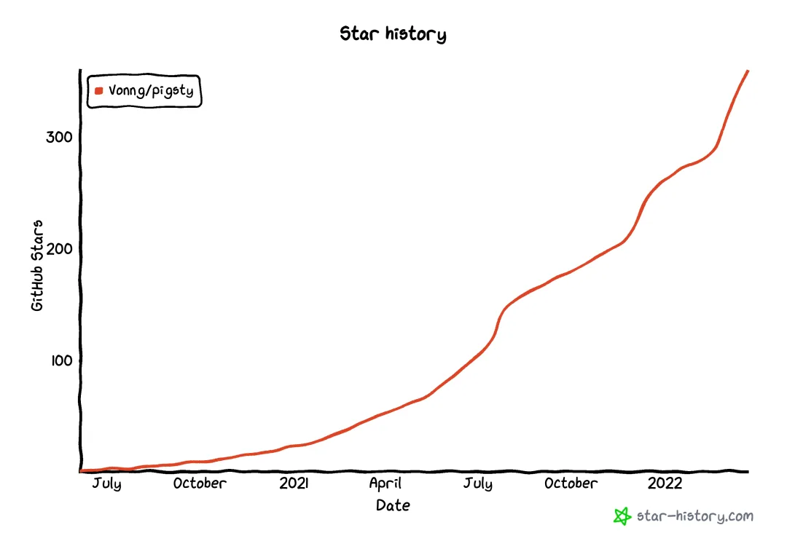

Github Star 指数增长，开始！

## 模块化架构\

如果要我说 Pigsty v1.4 最给力的特性是什么，我认为是对底层架构的重大重构，尽管听上去比较枯燥，但这一点确实很重要。

在 1.4 中，整个系统解耦成 4 个独立的模块，可以独立维护，自由排列组合使用。**`INFRA`**是 Pigsty 的基础设施部分，包括监控/告警/可视化/日志/DNS/NTP 等公共组件。**`NODES`**是主机节点管理模块，**`PGSQL`**是 PostgreSQL 数据库部署管控模块，**`REDIS`**是 Redis 数据库部署管控模块。

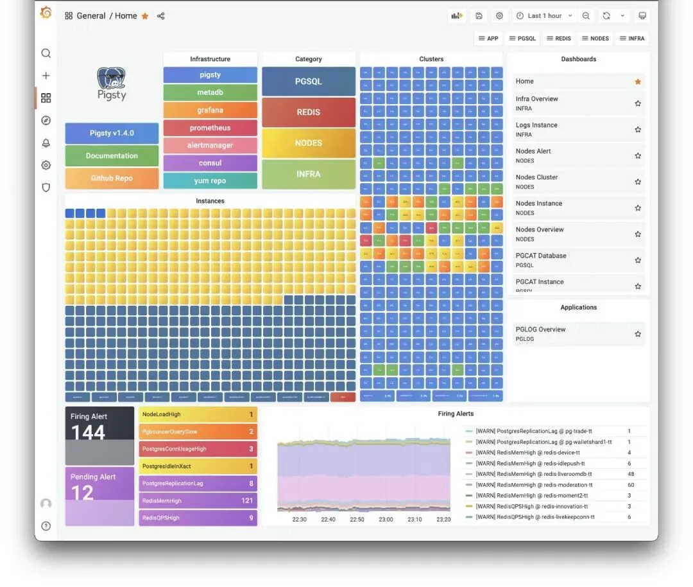

全新的 Pigsty v1.4 监控首页

如果您想将 Pigsty 当作单机的开箱即用的 PostgreSQL 发行版来使用，那么在一台机器上依次安装 **INFRA**,**NODES**,**PGSQL** 三个模块，就会有一个立即可用的，自我监控管理的数据库实例。

如果您想要一个生产环境的大规模主机监控系统，那么在一台机器上安装**INFRA**模块，在所有被监控的机器节点上安装**NODES**模块即可。所有的主机节点会配置有软件源，软件包，DNS，NTP，节点监控，日志收集，DCS Agent 这些生产环境所需的组件。纳入 Pigsty 管理的主机会带有详细的监控信息，并可以用于进一步部署各式各样的数据库模块。

如果您想部署管理大量的 PostgreSQL 集群，很简单，在这些纳入 Pigsty 管理的节点上再加装 **PGSQL**模块即可。您可以一键部署各种各样的 PGSQL 集群：单实例，一主 N 从的高可用集群，同步集群，法定人数提交的同步集群，带有离线 ETL 角色的集群，异地容灾的备集群，延迟复制集群，Citus 分布式集群，TimescaleDB 集群，MatrixDB 数据仓库集群。

如果你想部署并监控管理很多 Redis 集群，也很简单。只要在 Pigsty 托管的节点上加装**REDIS**模块即可。而且后续添加新类型的数据库也更加容易了：**KAFKA**,**MINIO**,**MYSQL**，…… 这些模块都可以用一种类似的方式加入到 Pigsty 中。一个成功的开源项目离不开开发者的贡献，而简洁优雅的架构，可以极大降低贡献的门槛。

Pigsty 1.4 在模块化上进行了大量的工作。无论是配置项，命名空间，剧本，标签，监控面板，全部按照这四个模块进行分类统筹。例如，下面是按照模块划分的剧本与配置项：

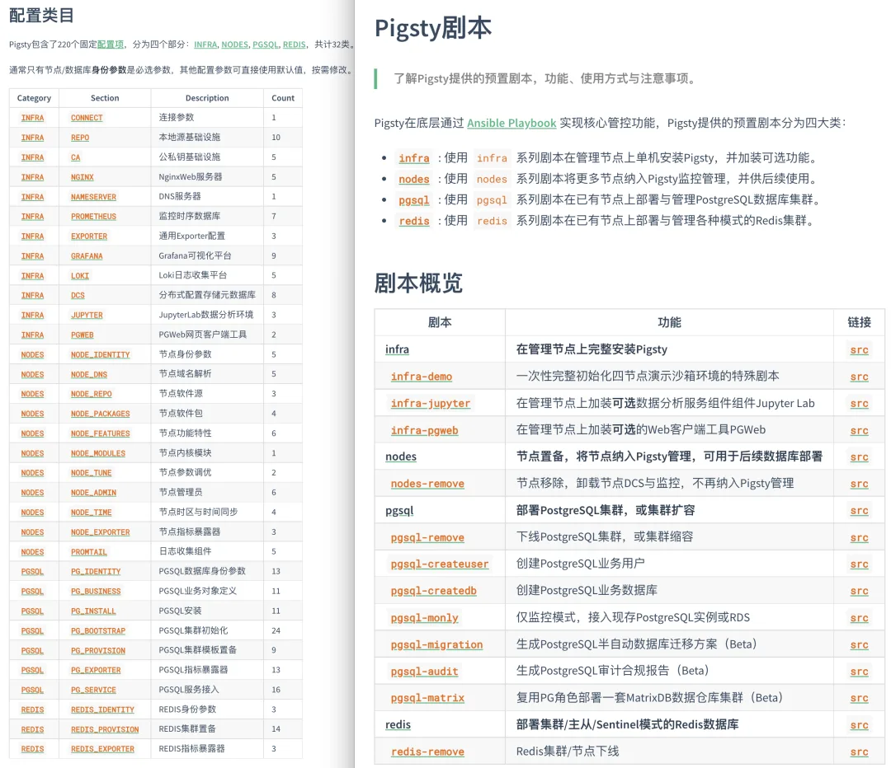

模块化后的剧本与配置参数

### 全新数据库支持

PostgreSQL 是一个相当全能、相当完美的数据库内核了，但正所谓：红花还需绿叶配，一个好汉三个帮。当组织与数据成长到一定规模后，使用专有数据组件的需求也会随之出现。最典型的两类是：以 Redis 为代表的缓存，以及以 Greenplum 为代表的数据仓库。

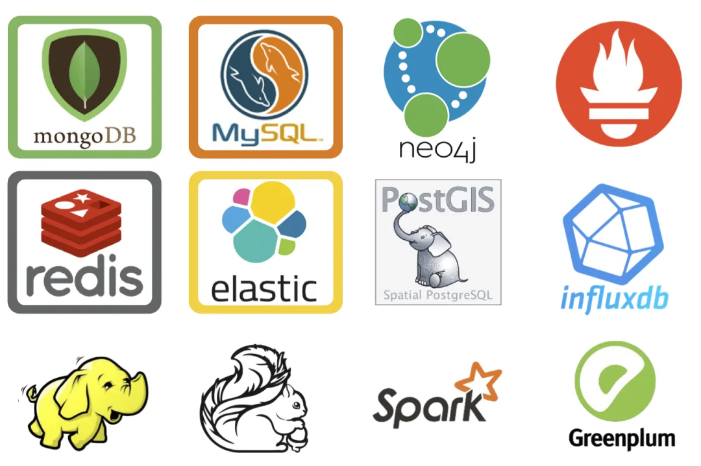

Redis 可以进一步强化业务系统的 OLTP 处理能力，分担数据库压力，模型简单易用，受到广受开发者的喜爱。而 Greenplum 则可以显著强化业务系统的 OLAP 能力，采用与 PostgreSQL 一致的语言、驱动与接口，将数据分析的量级从几十 TB 提升到 PB 乃至 ZB 的级别。

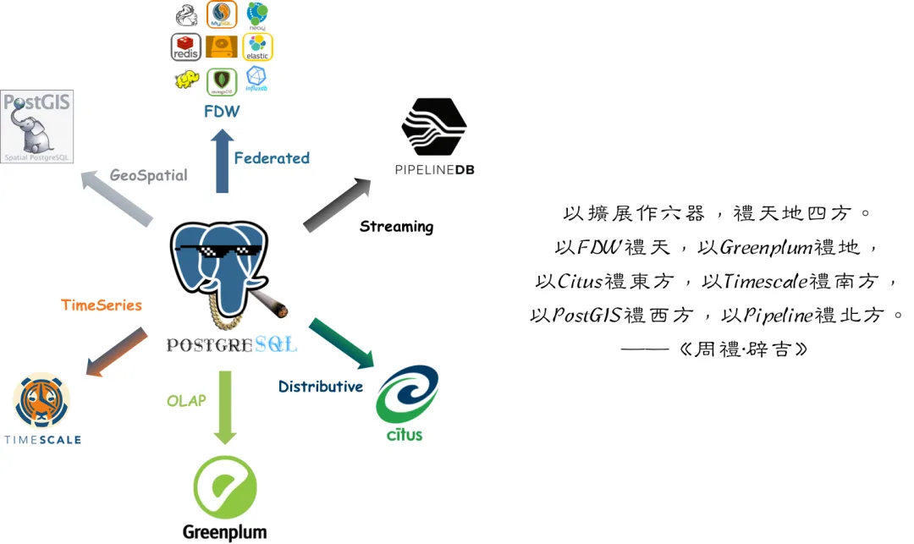

Redis 与 Greenplum 在两个方向上扩展了 PostgreSQL 的能力边界，这两者都是 PostgreSQL 的拍档，经常在一起组合使用。因此，Pigsty 在 v1.4 中提供了对 Redis 与 Greenplum 的初步支持。

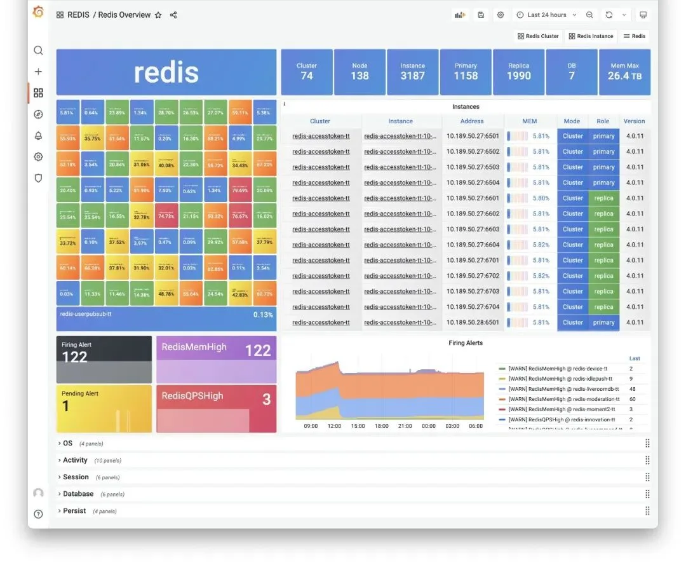

Redis Overview 面版

不过，Pigsty 支持的并不是原生的 Greenplum，而是它的一个分支：MatrixDB。Greenplum 的正式版本目前仍然是 6.x，基于 PostgreSQL 9.6 内核，有些太老了。而 MatrixDB 则基于 Greenplum 7 和 PostgreSQL 12 内核，还有额外的时序功能支持。因此 Pigsty 目前使用 MatrixDB 作为 Greenplum 的替代实现。

Pigsty v1.4 最得意的一点在于，并没有一个专门的 **MATRIXDB** 模块，MatrixDB 的部署完全复用了**PGSQL** 模块。您可以用熟悉的配置参数来配置 MatrixDB。在 Pigsty 看来，一套 MatrixDB 数据仓库在逻辑上就是 N 对标准的一主一从 PGSQL 集群：一个标准的 Master 集群（Master & Standby），以及很多组散布在多个节点上的 Segment 集群（Primary & Mirror）。所有 PGSQL 的面板都可以直接用在 MatrixDB 上。

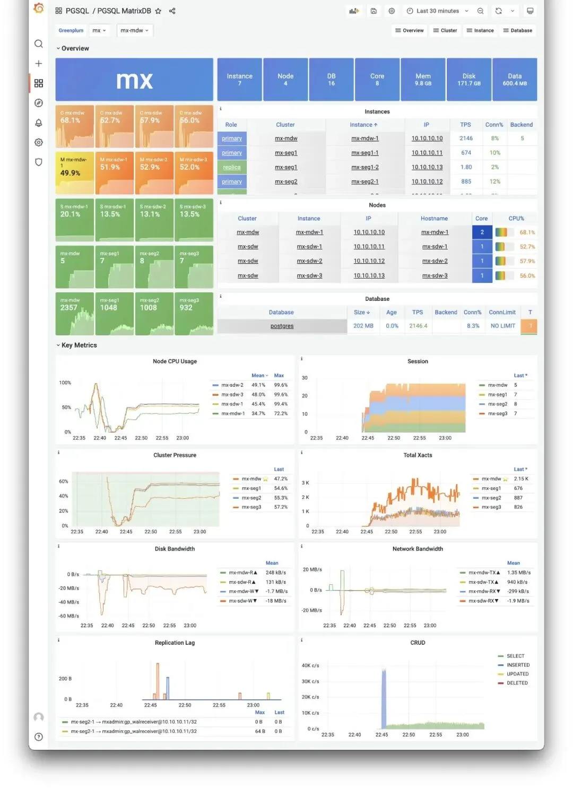

PGSQL MatrixDB 面版

专用的 Dashboard：PGSQL Matrix 用于展示一套 MatrixDB 的核心监控指标，其他监控面板均复用已有的 PGSQL 面板。

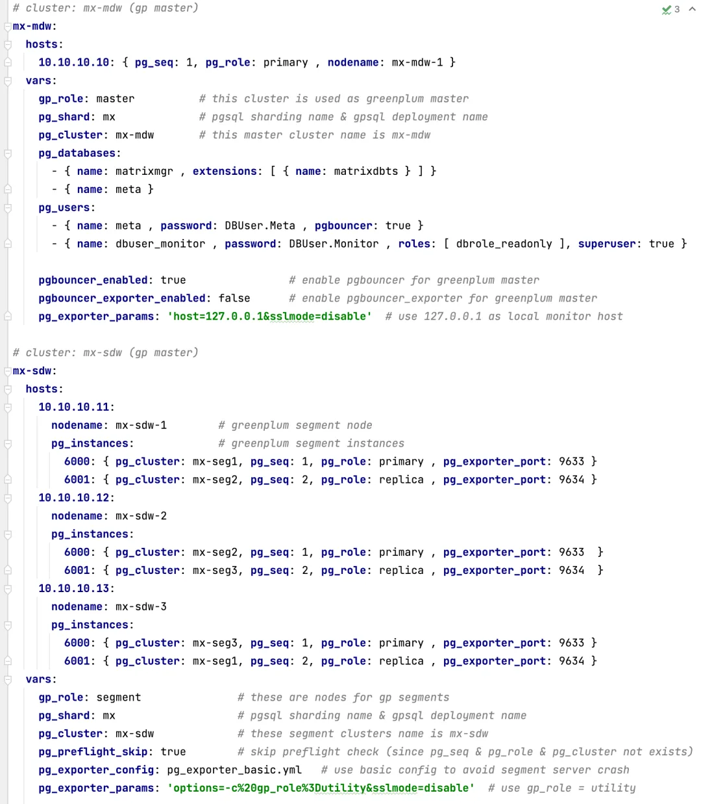

定义上面的 4 节点 MatrixDB 只需要这些配置

### 监控系统演进

监控系统一直以来在 Pigsty 中扮演着核心角色。在 1.4 中，Pigsty 的监控系统也有着很显著的改进。

#### 主机监控

Pigsty v1.4 引入了一个全新的功能：节点监控，这也是模块化改造的一个直接成果。这并不是说以前 Pigsty 没有关于机器节点的监控指标，而是在以前，机器的监控指标是 1:1 与 PostgreSQL 实例绑定的。对于一个 PostgreSQL 数据库发行版来说，这样的设计是没有问题的。但随着 Pigsty 的发展，这样的设计就开始显得不合时宜了。

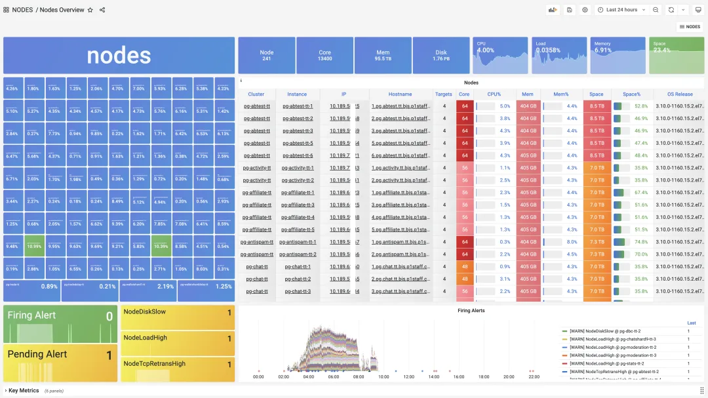

NODES Overview 面板，提供所有节点的导航

用户可能有各种各样的使用方式与部署策略，例如，在一个节点上部署多个数据库实例，甚至部署多种不同类型的数据库。在这种情况下，合适的做法是把节点的管理与监控单独抽离出来，不与具体的数据库类型绑定。

这样做有两个显著的好处：一是如果用户不需要数据库监控与管理，只需要节点的监控与管理，那么会比以前简单很多；第二是一个节点上可以部署多个甚至多种数据库，并复用同样的节点监控指标数据。任何时候，您只要点击 IP 地址，就可以跳转到具体的 NODES Instance，查看该节点的详情。

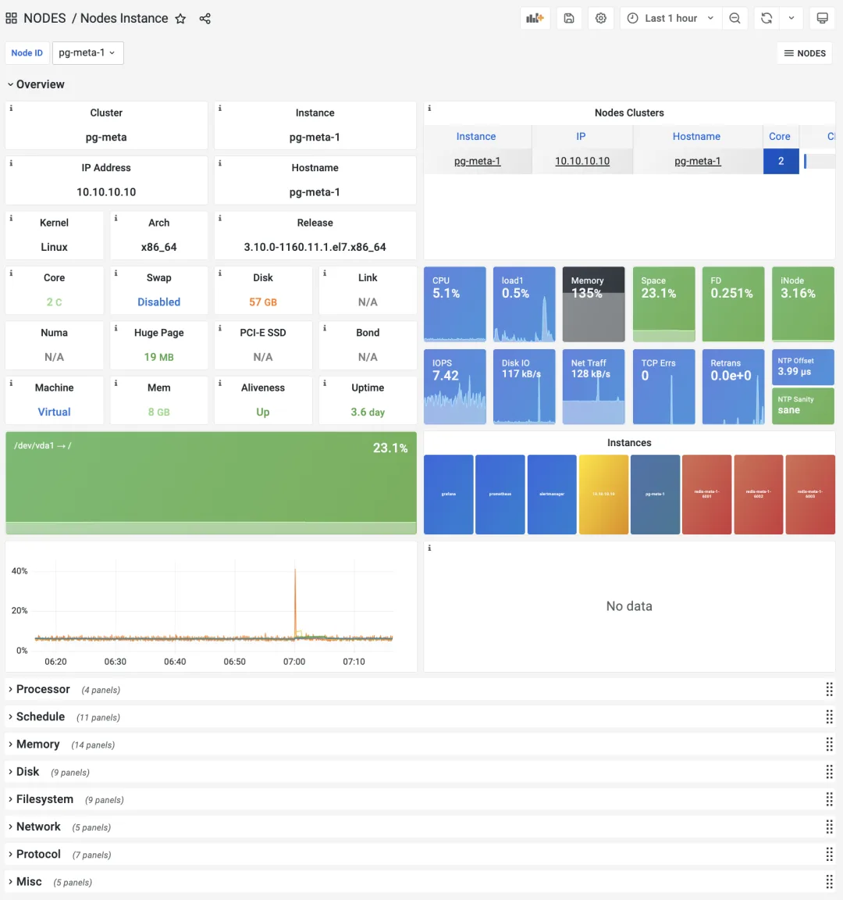

> 曾经的 PGSQL Node 现在变为 NODES Instance

节点监控提供了全局概览，集群，以及单个节点三种不同的层次。节点的**集群**可以配置为默认与 PostgreSQL 数据库集群保持一致，也可以有独立的身份配置。方便您从不同的角度来透视集群资源。

> 新增的 Nodes Cluster 面板，关注一组节点的聚合指标与集群内的水平对比

虽然 Pigsty 的定位是开箱即用的 PostgreSQL 发行版，但其中也包含着主机监控的最佳实践。有些用户根本不 care 数据库，只是拿 Pigsty 做主机监控…。

#### 日志收集

在 Pigsty 1.4 中，Loki 与 Promtail 日志收集组件升级为整个系统的默认组件。Loki 是 Grafana 出品的日志收集方案，采用与 Prometheus 类似的标签体系，与 PromQL 类似的 LogQL。是一个轻量化，优雅简洁的日志收集、处理、分析解决方案。经过了一年时间的测试与打磨，现在 Loki 已经成为了 Pigsty 的默认组成部分。会实时收集各式各样的日志：节点的 syslog，dmesg，cron 日志，数据库 postgres/pgbouncer/patroni 的日志，以及 Redis 日志。

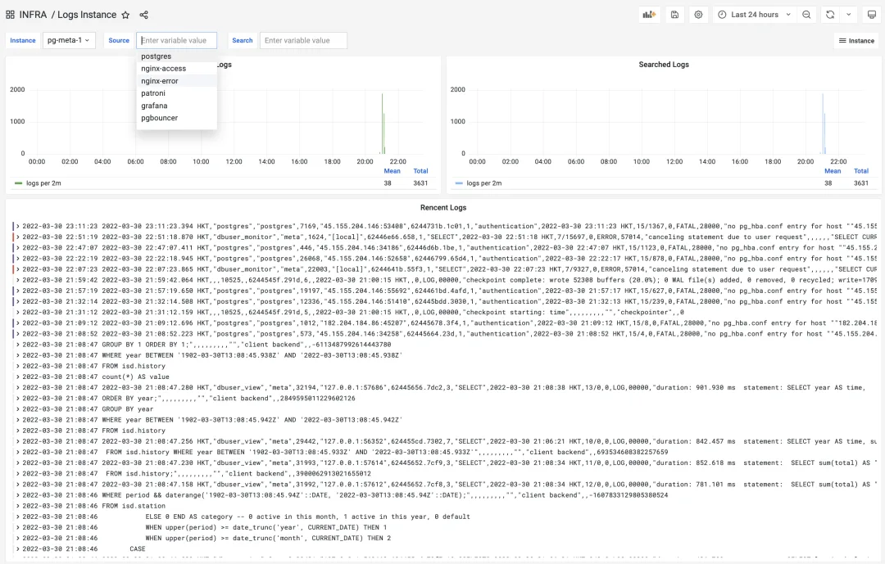

> INFRA 板块的 LOGS Instance 监控面板，可以实时浏览搜索所有日志。

ELK 对于 SRE 的日志需求过重，其实大家想要的就是一个高效快速的大规模并行 GREP，Loki 在这件事上干的很出色。\

此外，除了节点日志，您也可以从新的 INFRA Overview 面板，查阅基础设施产生的实时日志数据。

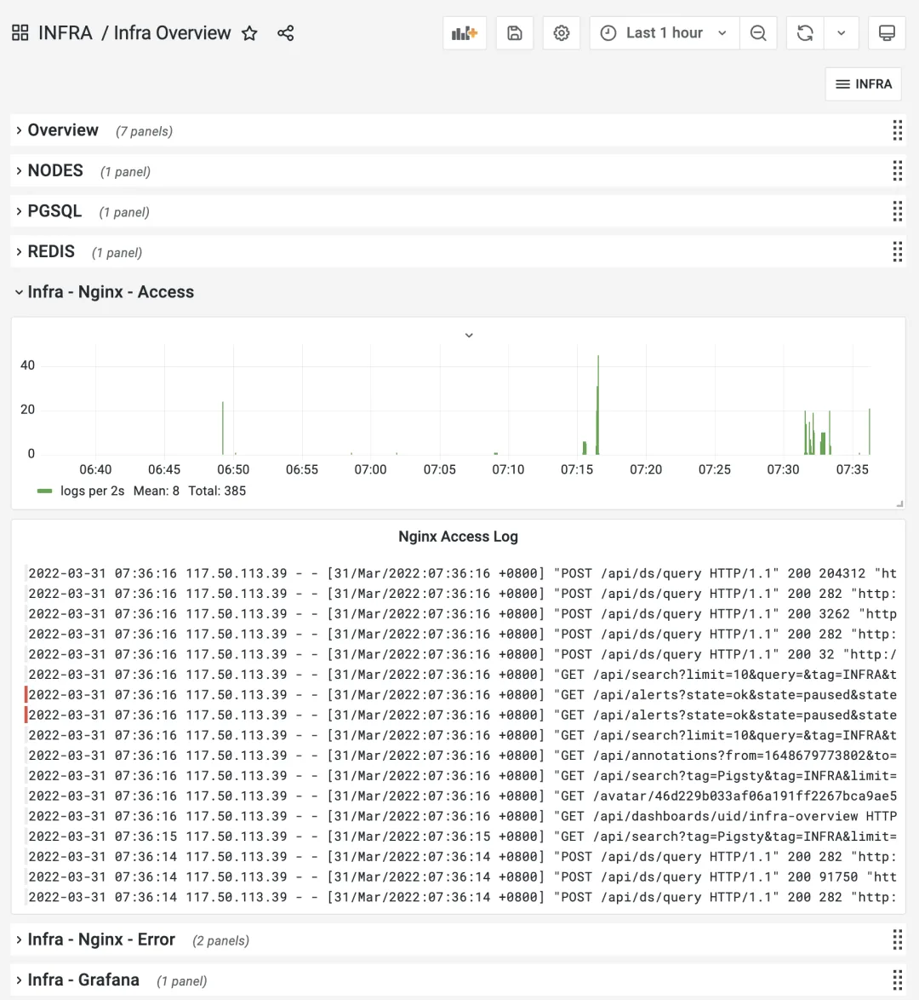

> INFRA 板块的 Overview 面板，可以看到基础设施的各项日志

#### PGSQL 监控

Pigsty v1.4 提供了对新数据库种类的监控支持，但对于经典的 PostgreSQL 监控也没有落下。在 1.4 中，大量 PGSQL 的监控面板进行了调整与重置，最具有代表性的就是 PGSQL Cluster 面板。

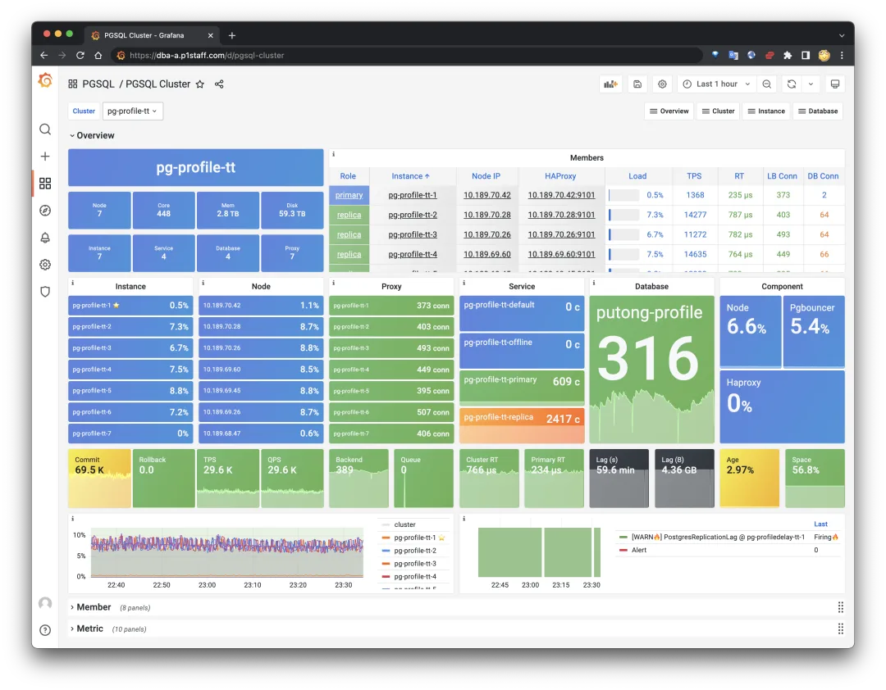

> 全新的 PGSQL Cluster 监控面板首屏

PGSQL Cluster 是 Pigsty 数据库监控中最核心的监控面板之一，承上启下，用于呈现一个自治数据库集群的关键状态。新的设计隐藏了不必要的信息，聚焦于集群资源。您可以从首屏快速点击集群内的资源对象，前往细分的监控面板：包括节点，实例，负载均衡器，服务，数据库，服务组件。

除了集群资源对象，PGSQL Cluster 的首屏只呈现最关键的监控指标，报警事件，集群/实例压力水位。其他细节都隐藏在下面的专题栏中。

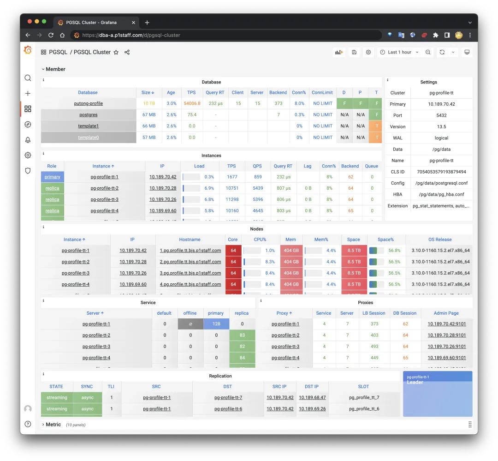

> 成员详情表在默认隐藏的第二栏中

第二个显著改进是新增的 PGSQL Databases 面板。在过去，数据库内监控只关注单个实例内的单个对象。但对于表、索引这样的业务对象，我们更关注的是它们在整个集群内的整体指标。PGSQL Databases 面板为此而生。您可以查询某一个数据库在整个集群内的表现，水平对比集群间不同实例的差异：

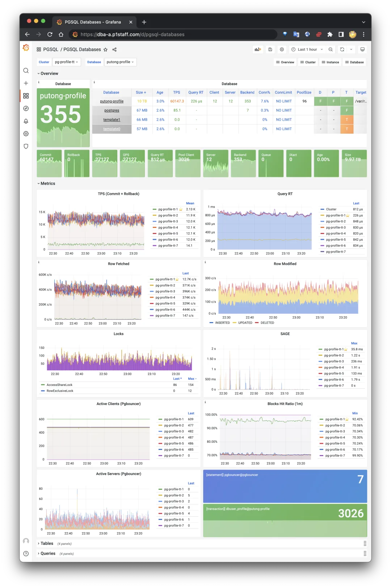

> PGSQL Databases 面板：agg(metrics{datname=\*}) by (ins)

更重要的是，您可以看到每一张表，每一类查询在集群范围内的汇总视图。例如，您可以查阅一张表或一类查询在集群主库与从库实例上的 QPS，或者确认某一个索引在集群不同实例上的使用情况，从而对业务与应用进行有针对性的优化。

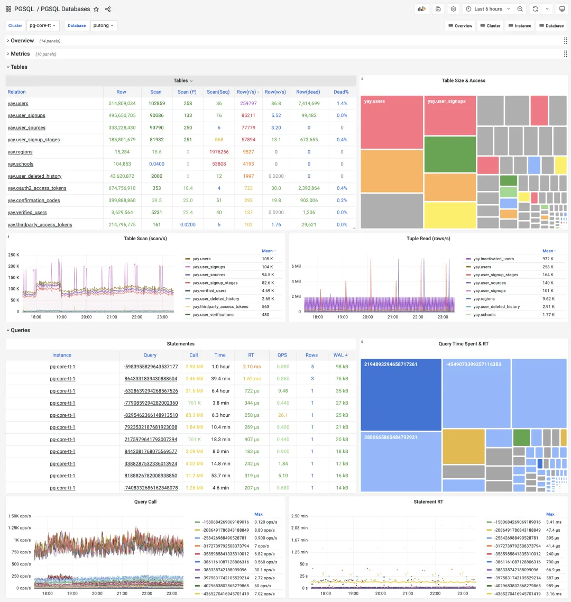

> 库内对象在集群层面的汇总展示：Tables & Queries，点击下钻。

带颜色的 TreeMap 可以快速反映出两个维度的属性：对于表而言，大小代表表占用的空间，颜色代表表被访问的频次。对于查询而言，大小代表在此查询上耗费的总时长，颜色代表该类查询的平均响应时间。

#### 应用面版

除了**INFRA**，**NODES**，**PGSQL**，**REDIS**四个核心模块外，Pigsty Grafana 的首页还有一个板块：**APP**。这是留给用户自己的应用的。任何带有**`APP`**和**`Overview`**标签的监控面版会被列入 Pigsty 的面版导航中。Pigsty 自带了一个开箱即用的小应用 PGLOG，用来分析 PG 自身的 CSV 日志，您可以快速从日志中定位异常，并快速定位跳转到具体连接的详情页。

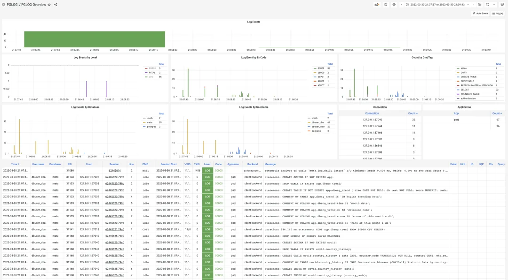

> PGLOG Overview，使用快捷方式快速将日志灌入应用表中分析。

此外，Pigsty 还建立一个专用的代码仓库：Vonng/pigsty-app，用于盛放 Pigsty 样例应用：**<https://github.com/Vonng/pigsty-app>**。目前的应用包括：

- ISD：NOAA 全球地表气象站历史天气数据查询

- COVID：WHO 新冠疫情数据查询

- DBENG：DB-Engine 数据库流行度趋势与预测

- APPLOG：Apple 应用隐私日志可视化

- WORKTIME：国内大公司上下班时间查询

后续将不断添加更多数据应用的样例。

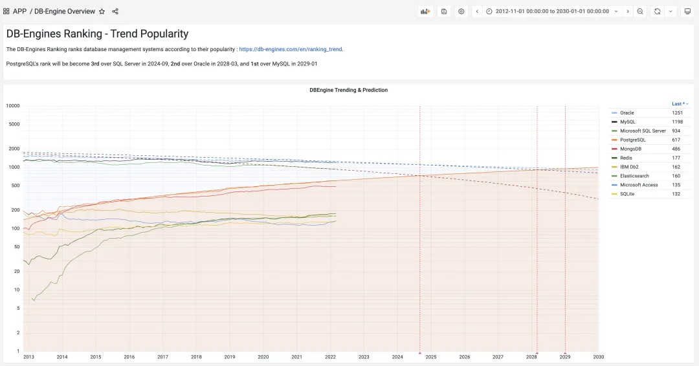

DBEng Trend：使用权威网站 DBEngine 流行度趋势数据，预测 PostgreSQL 什么时候会成为世界上最流行的关系型数据库。

### 安装体验优化/CDN

此前 Pigsty 使用 Github 作为发布平台，中国大陆访问起来还是比较吃力的。经常需要从百度网盘镜像下载，再手工拷贝到服务器上去。用户的体验就是我们的追求，所以我们又启用了全球 CDN 加速域名 **`http://download.pigsty.cc`**，朗朗上口，非常好记。例如最新的软件源码包与离线软件包的下载地址分别为：**<https://github.com/pgsty/pigsty/releases/tag/v1.4.0>** （2MB）**<https://github.com/pgsty/pigsty/releases/tag/v1.4.0>**（940MB）

Pigsty 的软件包进行了一次重新梳理与瘦身，从原本的 1.3GB 压缩至 v1.4 的 940MB。需要安装 Greenplum 与 MatrixDB 的用户，单独下载另一个离线软件包 matrix.tgz （338MB）即可。

一键安装是 Pigsty 的光荣传统。尽管如此，**下载**一直以来都是最最不让人省心的地方。因此在 Pigsty v1.4 中提供了专用的下载脚本**`download`**，可用于自动下载并解压可选的软件包**pkg.tgz，matrix.tgz，app.tgz**。这个脚本会自动检测您的网络环境是不是在墙内，如果在墙外使用默认的 Github Releaes，在墙内则使用腾讯云 CDN 下载。

当然，**`download`**本身也是 pigsty 源码包的一部分，因此我们还提供了一条类似**homebrew** 的一键安装命令，用来一键下载最新的 pigsty 源码包。于是，现在安装 Pigsty 的流程如下所示了：

    bash -c "$(curl -fsSL http://download.pigsty.cc/get)" # 下载
    ./download pkg matrix app   # 下载并解压可选的扩展软件包（可选步骤）
    cd ~/pigsty && ./configure  # 配置
    make install                # 安装

### 典型用户案例

探探是 Pigsty 最大的用户案例，也始终是第一个吃螃蟹的人。2022 年 3 月份，探探下线了最后一套遗留的旧 PostgreSQL 数据库 `pg.meta.tt`，生产环境所有数据库均已迁移至 Pigsty，一百套集群全部由 Pigsty v1.3.1 所托管（监控系统版本为 1.4）。所有集群的高可用自动切换也已经启用，历时近两年的**数据库飞升项目**正式宣告完工。

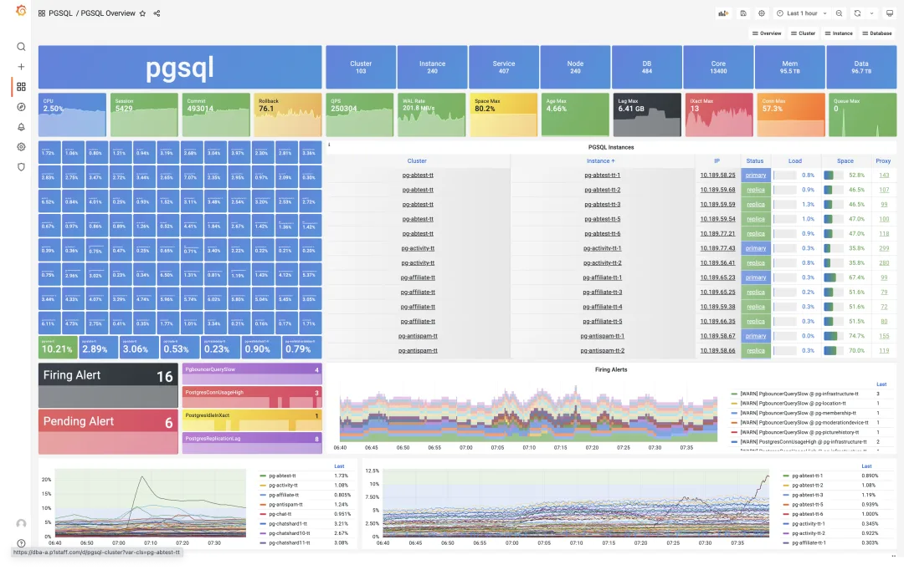

> 探探主生产环境的 Pigsty 部署：240 实例 13400 核的 PostgreSQL OLTP 集群。

**在探探，Pigsty 经过了长时间，大规模，高强度，惨无人道的实际生产环境测试**。在两年的时间里不断打磨完善，最终演变为今天的样子。在近日的混沌工程演练中，运维随机挑选数据库机器进行多次宕机演练，Pigsty 在无人值守的情况下可以自动进行高可用主从/流量切换。从库宕机无业务影响，主库宕机对业务写入影响不超过在 1 分钟。

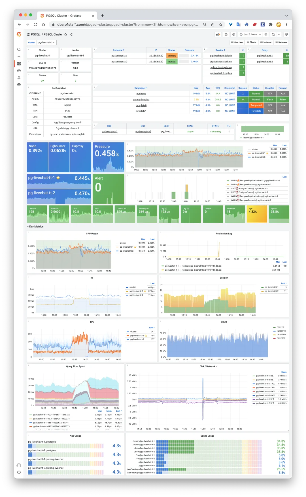

> 一次典型从库宕机现场，读流量迅速由主库承担，业务只有极个别现场查询中断报错，而后立即恢复。

> 一次典型主库宕机现场。主库宕机 30s 后，从库被提升新主库，影响 30s 业务写入请求后自愈。

### 潜在合作伙伴

一个篱笆三个桩，一个好汉三个帮。想要做大事，首先要确定的一点就是，谁是我们的敌人，谁是我们的朋友。Pigsty 定位了两个潜在的合作伙伴 Sealos，Bytebase，准备进行进一步接触。

Sealos 是一个很有趣的开源项目，可以把整个运行中的 K8s 集群打成镜像，然后一键部署到其他地方，Pigsty 和 Sealos 很互补：很多 SaaS 都是 DB + App 的方式。有了一个开箱即用的数据库，就差一个开箱即用的应用生态了，把 SaaS 软件丢进 K8s 里整体打成镜像，交付什么 Gitlab，Jira，Confluence，Odoo，Habour，金蝶啥的就很简单了，拉起来填个数据库连接串全部搞定。

另一个我比较关注的项目是**ByteBase**，这是一个做数据库 Schema Migration 的工具。用 Go 开发清清爽爽无依赖，使用 PostgreSQL 作为后端数据库，又可以用来做 PostgreSQL 的模式变更管理。那确实是极好的，Pigsty 可以用来做**ByteBase**的 Backend Database，**ByteBase**也可以作为 Pigsty 的 Migrator，预计在下个版本中会添加一个对 ByteBase 基本的集成与支持。

### 产品定位转换

Pigsty，是 Postgres in Graph STYle 的缩写，即图形化 PostgreSQL 的意思，在最初，它是一个针对 PostgreSQL 开发的专业监控系统。后来，随着各种各样功能的引入（声明式定义，一键部署，高可用 PG，自动流量切换，数据分析与可视化组件），Pigsty 在 1.0 的时候，定位调整为“**开箱即用的 PostgreSQL 数据库发行版**”。而现在，Pigsty v1.3 提供了 Redis 部署监控的支持，1.4 又引入了时序数据仓库 MatrixDB 监控部署支持。单一的**PG 发行版** 定位已经限制了 Pigsty 的想象力与可能性。

#### 开箱即用的发行版

##### RedHat for Linux

- Pigsty 打包最新 PostgreSQL 内核（14），集成强力的地理空间插件 PostGIS3.2，时序数据库插件 TimescaleDB2.6，分布式扩展插件 Citus10，以及上百功能扩展，全部一键安装，开箱即用。

- Pigsty 集成了完整的大规模数据库监控管控解决方案：Grafana，Prometheus，Loki，Ansible，CMDB。亦可作为生产级应用运行时直接使用，监控管理其他数据库与应用。

- Pigsty 集成了数据分析生态的常用工具：Jupyter，Echarts，Grafana，PostgREST，Postgres。可以低代码的方式，开发交互性数据应用与数据可视化作品。快速产出作品原型，并以标准的方式分享，演示与交付。

##### 多快好省的开发者工具：

##### HashiCorp for Database!

- Pigsty 采用 Infra as Data 的设计理念，用户描述自己想要什么样的数据库集群，而 Pigsty 自动为您创建！Just like Kubernetes！

- Pigsty 提供灵活丰富的部署支持，本地沙箱，云端，多云部署。无论是高规格物理机还是 1 核 1G 虚机均可运行，保持生产、预发、开发、测试环境高度一致。

- Pigsty 可以极大简化数据库部署实施维护工作，极大降低 PostgreSQL 数据库运维与使用的门槛，量产 DBA，有效降低软硬件人力成本。使用云厂商服务器的牛，耕云数据库的田，也能减少 50% 以上的 TCO，自建机房更是能节省 80% 的成本费用。

> Pigsty 为 DBA 留下了两个安全出口：PITR 备份与等保安全加固。

##### 自动驾驶 SRE 解决方案：

##### Alternative for RDS!

- 终极可观测性：监控是有效管理的基石。没有完善的监控，SRE 无从谈起。Pigsty 带有终极的可观测性，以 BI 的思路设计监控系统，从最顶层的全局洞察到最细节的每一个对象，都可以获取实时洞察，为决策提供数据支撑，做到“心中有数”。

- 高可用数据库集群：Pigsty 集成了久经考验的生产级高可用数据库架构方案：主从异地容灾，硬件故障自愈，高可用自动切换，自带连接池与负载均衡器，提供分布式数据库般的体验。冷备份与延时从库可有效应对各类软件故障与人为故障，确保系统稳定运行。极大简化运维工作。

- Pigsty 还可以作为完整的 SRE 解决方案：主机监控，应用部署，并将逐步添加其他数据库的部署与监控：Redis/Greenplum/Kafka/Minio，或支持其他 SaaS 服务，制作 POC，交付 Demo 等。

### 未来路线规划

从长期来看，我希望在 Pigsty 中再添加 Minio，Kafka 支持，让整个产品形成一个以 PostgreSQL 为核心的整体解决方案，覆盖中小型企业完整生命周期的数据存储需求，打造一个开源的、私有的云数据库管控整体解决方案。关系型数据库 PostgreSQL 作为核心，缓存 Redis 强化 TP 能力，数仓 Greenplum/MatrixDB 强化大规模数据分析能力，对象存储 Minio 用于备份管理以及存储图像音视频等数据，消息队列 Kafka 提供数据总线的能力。通过完备的 ETL/CDC 支持将这些数据组件融为一体，实现 turning the database inside-out！

从短期来看，Pigsty 将尽可能充分利用元节点上的 CMDB。CMDB 模式应当尽快适配多模数据库，命令行工具也应当及时更新，提供类似于云 CLI 工具的使用体验。多云部署与云厂商适配也应当尽快弄起来。监控面板也有大量的改善空间，包括 Catalog 数据挖掘与呈现，日志分析与提炼。从可观测性的角度讲，Blackbox 黑盒探测与 Mtail/Promtail 日志衍生指标还有不小的创新空间。数据库模式演化，可以考虑使用开源的解决方案 Bytebase。PostgREST 的能力也有待进一步发掘。冷备份/PITR 是 Pigsty 留给 DBA 们的一个安全出口，但也应当准备一个 Best Pracetice 指南。

### 社区问卷调查

Pigsty 有一个活跃的用户群组，微信搜索 `pigsty-cc` 或扫二维码添加 Pigsty 小助手拉群。

此外，我们还有一个关于 PostgreSQL 与 Pigsty 的用户问卷调查，填写会有社区周边与小礼品赠送哦～，问卷链接：**<https://www.wjx.cn/vj/Ys1hxik.aspx>**

扫一扫上面的二维码或点击连接参与问卷调查，我们会寄送精美社区周边～。

---

## v1.4.0 发行注记

### 架构

- 将系统解耦为 4 大类别：`INFRA`、`NODES`、`PGSQL`、`REDIS`，这使得 Pigsty 更加清晰、更易于扩展。
- 单节点部署 = `INFRA` + `NODES` + `PGSQL`
- 部署 PGSQL 集群 = `NODES` + `PGSQL`
- 部署 Redis 集群 = `NODES` + `REDIS`
- 部署其他数据库 = `NODES` + xxx（例如 `MONGO`、`KAFKA`...）

### 可访问性

- 为中国大陆提供 CDN。
- 使用 `bash -c "$(curl -fsSL http://get.pigsty.cc/latest)"` 获取最新源代码。
- 使用新的 `download` 脚本下载并提取包。

### 监控增强

- 将监控系统分为 5 大类别：`INFRA`、`NODES`、`REDIS`、`PGSQL`、`APP`
- 默认启用日志记录
  - 现在默认启用 `loki` 和 `promtail`，带有预构建的 [loki-rpm](https://github.com/Vonng/loki-rpm)。
- 模型和标签
  - 为所有仪表板添加了一个隐藏的 `ds` prometheus 数据源变量
  - 为所有指标添加了一个 `ip` 标签，并将其用作数据库指标和节点指标之间的连接键
- INFRA 监控
  - Infra 主仪表板：INFRA 概览
  - 添加日志仪表板：日志实例
  - PGLOG 分析和 PGLOG 会话现在被视为示例 Pigsty APP
- NODES 监控应用
  - 可以单独使用 Pigsty 作为主机监控软件
  - 包括 4 个核心仪表板：节点概览 & 节点集群 & 节点实例 & 节点警报
  - 为节点引入新的身份变量：`node_cluster` 和 `nodename`
- PGSQL 监控增强
  - 全新 PGSQL Cluster，简化并专注于集群中的重要内容
  - 新仪表板 PGSQL Databases 是集群级对象监控
  - PGSQL Alert 仪表板现在只关注 PGSQL 警报
  - PGSQL Shard 已添加到 PGSQL 中
- Redis 监控增强
  - 为所有 Redis 仪表板添加节点监控

### MatrixDB 支持

- 通过 `pigsty-matrix.yml` playbook 可以部署 MatrixDB（Greenplum 7）
- MatrixDB 监控仪表板：PGSQL MatrixDB
- 添加示例配置：`pigsty-mxdb.yml`

### 软件升级

- PostgreSQL 14.2
- PostGIS 3.2
- TimescaleDB 2.6
- Patroni 2.1.3（Prometheus 指标 + 故障转移插槽）
- HAProxy 2.5.5（修复统计错误，更多指标）
- PG Exporter 0.4.1（超时参数等）
- Grafana 8.4.4
- Prometheus 2.33.4
- Greenplum 6.19.4 / MatrixDB 4.4.0
- Loki 现在作为 RPM 包提供，而不是 ZIP 存档

### 错误修复

- 删除 Patroni 的 Consul 依赖，这使其更容易迁移到新的 Consul 集群
- 修复 Prometheus bin/new 脚本的默认数据目录路径
- 在 vip-manager systemd 服务中添加重新启动秒数
- 修复错别字和任务

### API 变更

#### 新增变量

- `node_cluster`：节点集群的身份变量
- `nodename_overwrite`：如果设置，则 nodename 将设置为节点的主机名
- `nodename_exchange`：交换 play 主机之间的节点主机名（在 `/etc/hosts` 中）
- `node_dns_hosts_extra`：可以通过单个实例/集群轻松覆盖的额外静态 DNS 记录
- `patroni_enabled`：如果禁用，postgres & patroni 的引导过程不会在 `postgres` 角色期间执行
- `pgbouncer_enabled`：如果禁用，pgbouncer 在 `postgres` 角色期间不会启动
- `pg_exporter_params`：生成监控目标 URL 时为 pg_exporter 提供的额外 URL 参数
- `pg_provision`：布尔值变量，表示是否执行 `postgres` 角色的资源配置部分
- `no_cmdb`：用于 `infra.yml` 和 `infra-demo.yml` 播放书，不会在元节点上创建 CMDB

---

## v1.4.1 发行注记

日常错误修复 / Docker 支持 / 英文文档

现在默认在元节点上启用 Docker，可以用它启动大量各类软件。

### Bug 修复

- 修复 Promtail & Loki 配置变量问题
- 修复 Grafana 旧版警报
- 默认禁用 nameserver
- 为 Patroni 快捷方式重命名 pg-alias.sh
- 为所有仪表板禁用 exemplars 查询
- 修复 Loki 数据目录问题
- 将 `autovacuum_freeze_max_age` 从 100000000 更改为 1000000000

---

发布版本：[微信公众号](https://mp.weixin.qq.com/s/dKVDLcnGtaWjdARo9rZncQ)
