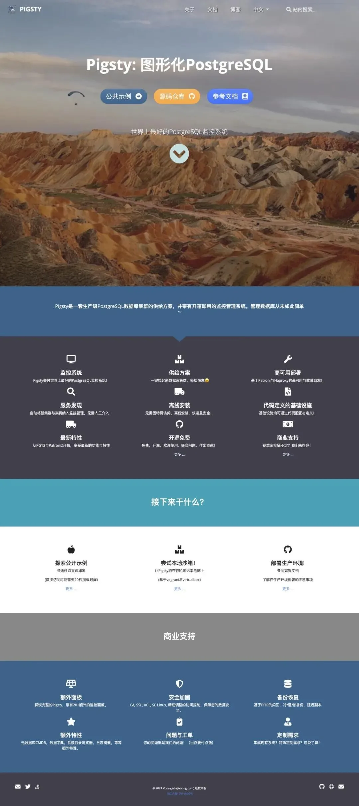
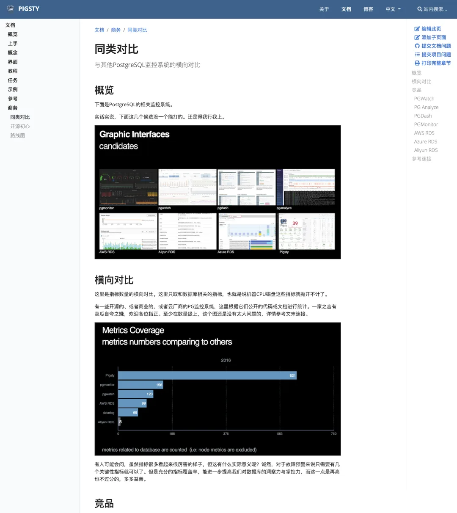
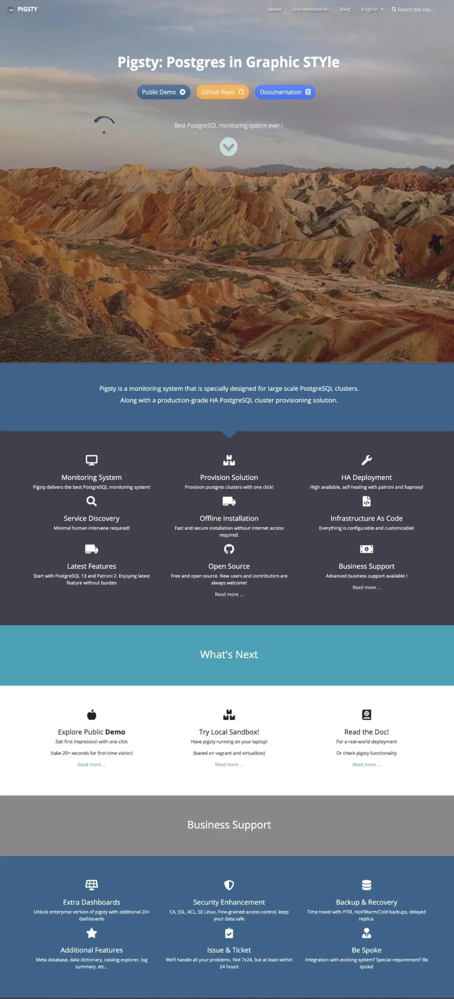
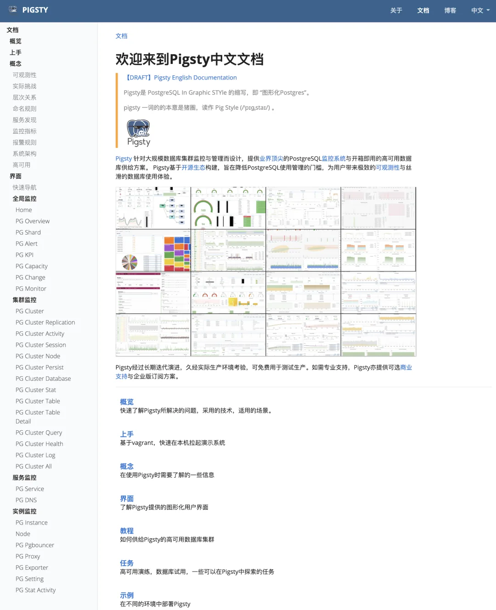
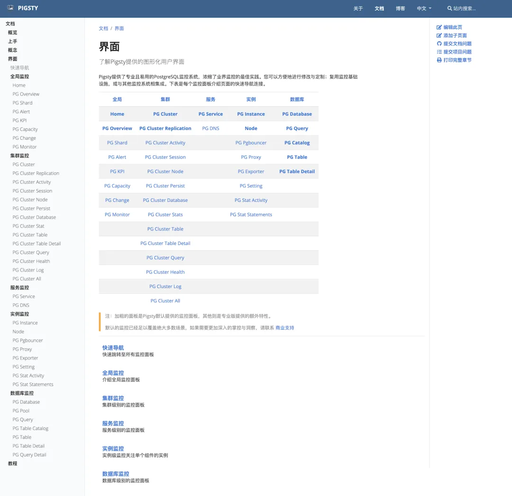
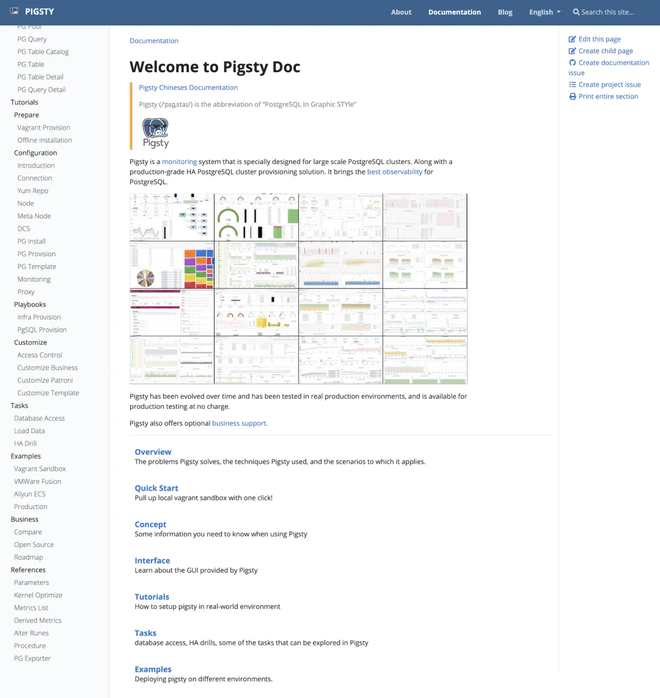
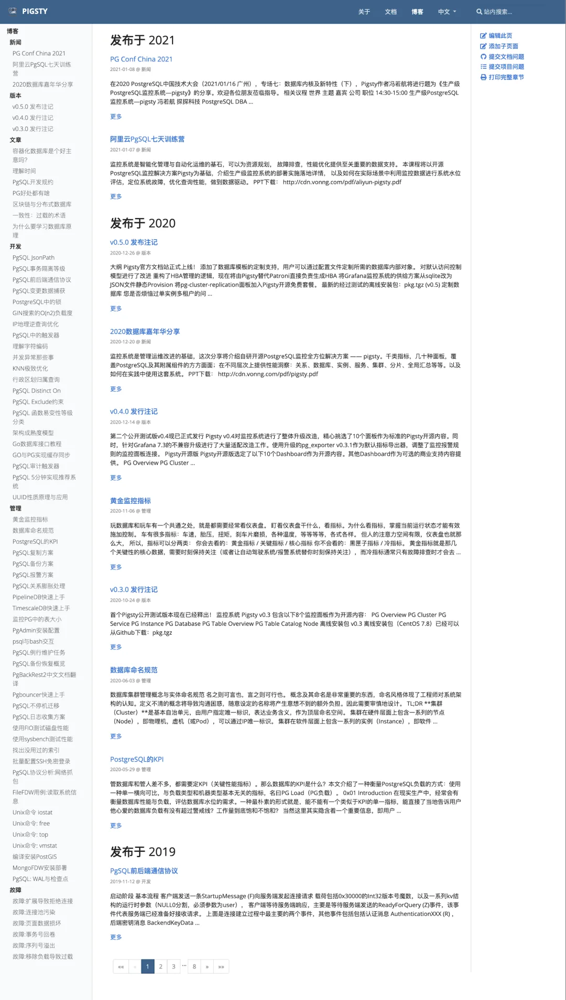
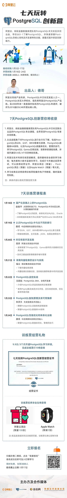

好久没有冒泡了！今天，俺很荣幸的宣布，Pigsty 官方文档站上线啦！

地址为：**<http://pigsty.cc>**\

什么？你问 Pigsty 是什么东东？\

Pigsty 是我**亲自**开发的 PostgreSQL 监控系统暨高可用数据库供给方案。

开源免费！详见下图，或者您点进那个站点看看也行啊。\

虽然 “世界上最好的 PostgreSQL 监控系统”这个口号好像有违反广告法的嫌疑，不过自己站在甲方爸爸的立场上，我也确实找不到比它更好的了。用真理说服人嘛，所以也就厚着脸皮这样写上了，反正我也没收钱嘛。

关于 Pigsty 本身，我就不多说了，该说的全都写在网站里了。但是建这个站可真是费老鼻子劲儿了！倒不是说建站有多难，毕竟都是现成的模板，我用的是 hugo，一个 go 写的静态网站生成器，主题用的是 Google 出品的 Docsy，相当方便，往里填内容就行了。改下文案改个图标和背景图片，用不了一会儿英文首页就都出来了。\

但写文档真是要了我老命了，文档怎么说也有几十万字（符）了，再加上还要中英文双语，写的我是头昏脑胀，把一个周末就这么交代了。港真，写文档真的是比写书还累。很耽误打《赛博朋克 2077》和《原神》的进度啊。

## 中文文档首页

特别费时间的就是监控系统的界面说明，几十个 Dashboard 需要一个个去截图配文。想想就有点抓狂了。

### 英文文档首页

更让人抓狂的当然是整个文档网站得做一个一模一样的英文版出来。

多亏了 DeepL，不少英文文档可以先机翻凑合一下。\

大体上弄完了中英文文档，看着空落落的博客里只有六篇新闻和 Release Note。我又想着要不把以前写过的和 PostgreSQL 相关的技术文章也搬运过来。于是整理了一部分，又是几个小又过去了

好了就说这么多吧。应该说看上去还是很不错的，总归有一些正经项目的样子了。也基本上算可以拿的出手了。所以最近呢，我准备推广一下 Pigsty，有两个相关活动。

一个是阿里云搞的 PostgreSQL 创新训练营，一个是 1 月 15 号在广州举办的 PG Conf 大会。

阿里弄的这个报名不要钱，还有小奖品。对 PostgreSQL 感兴趣的同学可不要错过哈。关于 Pigsty 的课程在 1 月 22 号那天。

#### PG Conf 2020

PG 大会在广州举办，具体时间是是 2021-01-16 下午 14:30-15:00

## 专场七数据库内核及新特性（下）

我也不知道讲监控系统为啥给分到内核里了，可能是比较硬核吧😎。\

大会具体议程原载于 Pigsty 旧站，原链接现已失效。

最后，如果您是 GitHub 用户，也非常欢迎来加个星，提个 Issue PR 什么的。

火钳刘明：<https://github.com/pgsty/pigsty>。

梦想还是要有的，万一🔥了呢对不对？

---

发布版本：[微信公众号](https://mp.weixin.qq.com/s/79IlaZ39XkQmJ69_Tzodfg)
