在介绍 Pigsty 前，我们必须要先说一说**PostgreSQL**！

## PG 是世界上最先进的开源关系型数据库

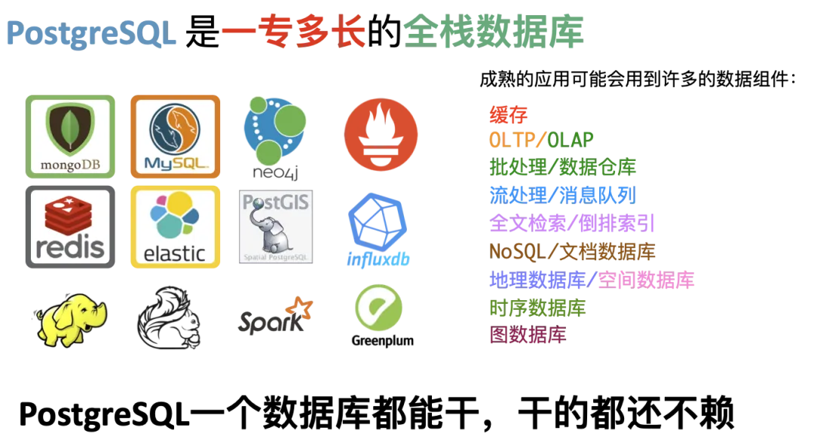

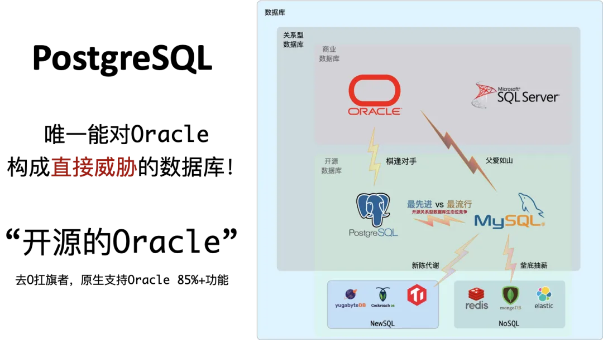

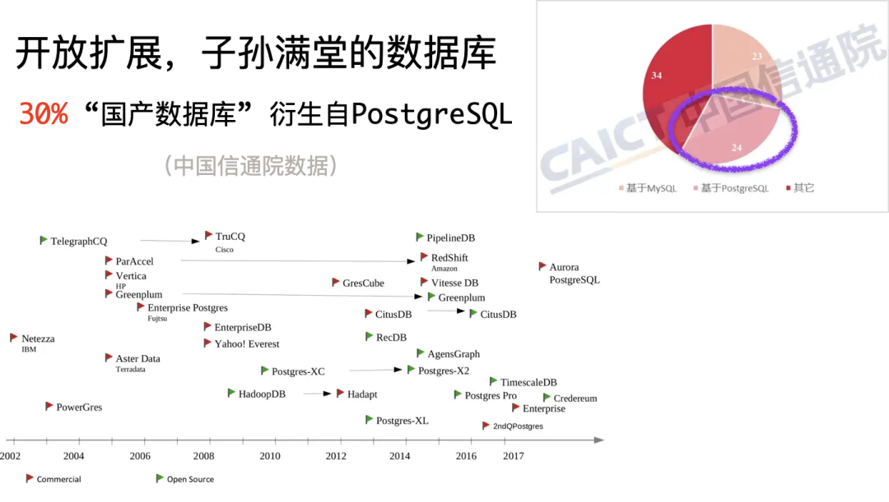

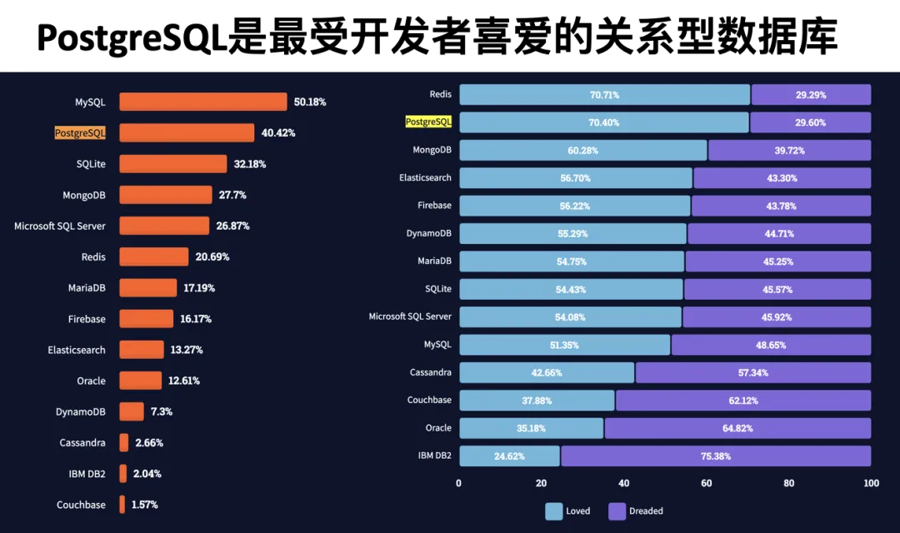

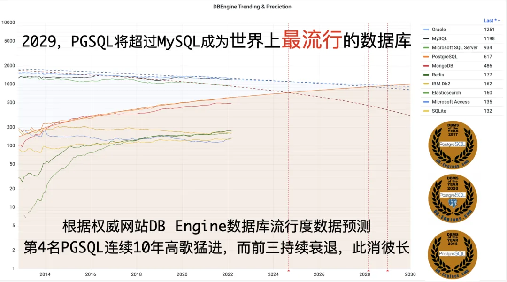

PG 是一个**足够完美**的内核，一颗强劲的引擎。

但用户要的 并不是发动机，而是 开门即走 的整车！

Pigsty 要做的就是这辆车：

开箱即用，物美价廉，自动驾驶，数据库界的 TESLA！

**Pigsty，让天下没有难用的数据库！**

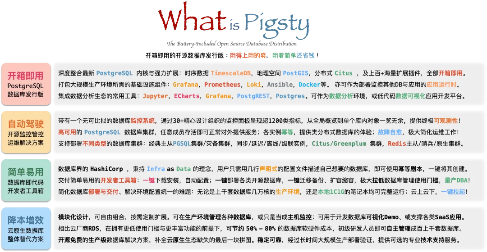

## PostgreSQL 数据库发行版

> RedHat for Linux！开箱即用！从无到有，让用户用得上！

Pigsty 将高可用集群部署，扩容缩容，主从复制，故障切换，流量代理，连接池，服务发现，访问控制，监控系统，告警系统，日志采集等生产级成熟解决方案封装为发行版。一次性解决在生产环境与各类场景下使用 世界上最先进的开源关系型数据库 —— PostgreSQL 时会遇到的各种问题，真正做到开箱即用。

Pigsty 深度整合最新 PostgreSQL 内核 (14) 与强力扩展：时序数据 TimescaleDB 2.6，地理空间 PostGIS 3.2，分布式 Citus 10，及上百+海量扩展插件，全部开箱即用。

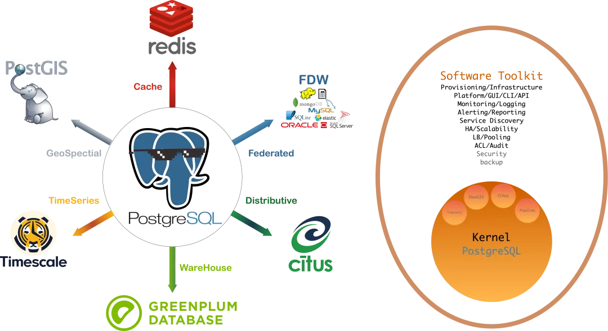

Pigsty 打包了大规模生产环境所需的基础设施：Grafana，Prometheus，Loki，Ansible，Consul，Docker 等，亦可作为部署监控其他数据库与应用的运行时/PaaS。

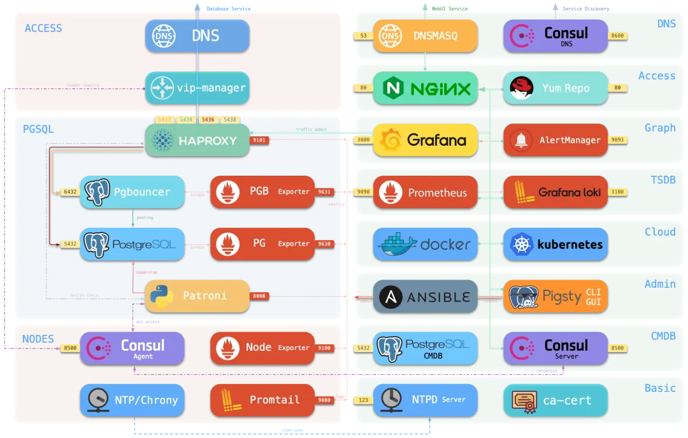

Pigsty 集成了数据分析生态的常用工具：Jupyter，ECharts，Grafana，PostgREST，Postgres，可作为数据分析环境，或低代码数据可视化应用开发平台。

## 智能监控管控运维解决方案

> Auto-Pilot for Postgres！自动驾驶！从有到优，让用户用的爽！

Pigsty 带有一个无可比拟的数据库监控系统，通过 30+精心设计组织的监控面板呈现超 1200 类指标，从全局概览到单个库内对象一览无余，提供终极的可观测性！

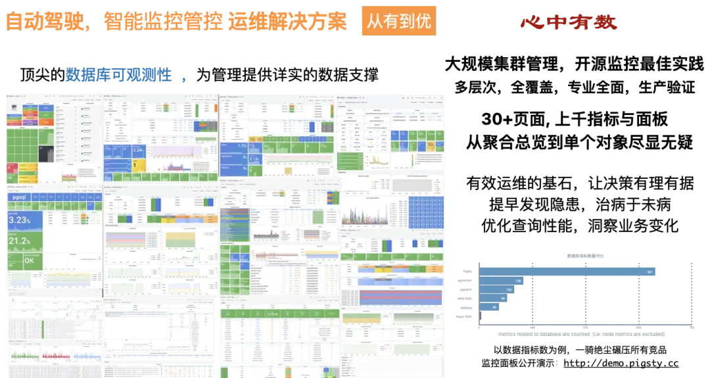

Pigsty 提供高可用的 PostgreSQL 数据库集群，任意成员存活即可正常对外提供服务；各实例幂等，提供类分布式数据库的体验；故障自愈，极大简化运维工作！

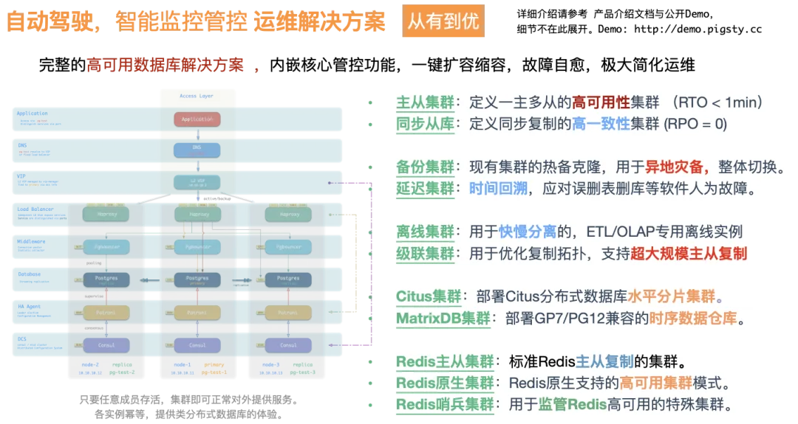

Pigsty 支持部署不同种类的数据库集群与实例：经典 PGSQL 主从复制集群/灾备集群，同步/延迟/离线/级联实例，Citus/Greenplum 集群，Redis 主从/哨兵/原生集群。\

## 数据库即代码开发者工具箱

> HashiCorp for Database！简单易用！从优到易，让用户省心！

Pigsty 秉持 Infra as Data 的设计理念，用户只需用几行声明式的配置文件描述自己想要的数据库，即可使用幂等剧本，一键将其创建。Just like Kubernetes！

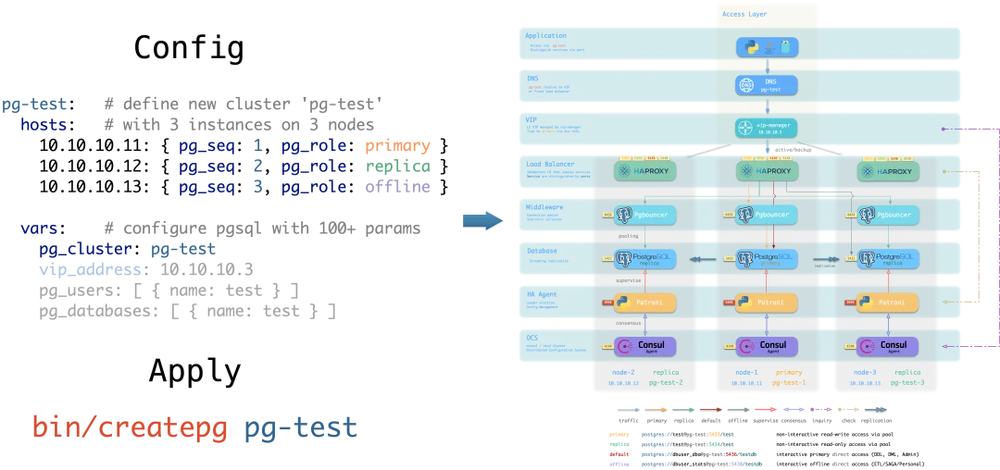

Pigsty 向开发者交付简单易用的数据库工具箱：一键下载安装，自动配置；一键部署各类开源数据库，一键迁移备份、扩容缩容，极大拉低数据库管理使用门槛，量产 DBA！

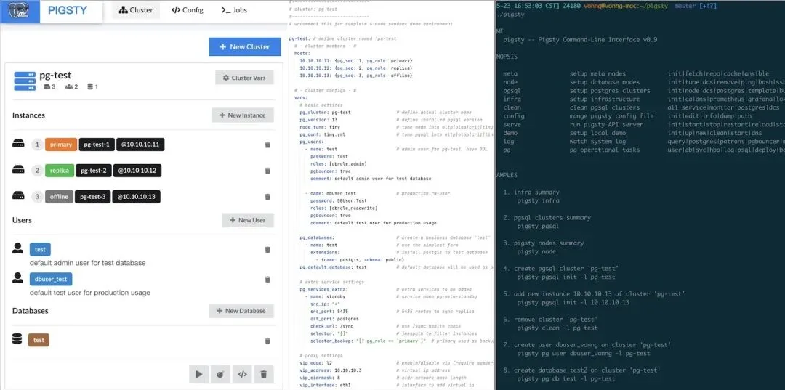

Pigsty 能够简化数据库部署与交付、解决环境配置统一的难题：无论是上千套数据库几万核的生产环境，还是本地 1C1G 的笔记本均可完整运行；基于 Vagrant 的本地沙箱与基于 Terraform 的多云部署，云上云下，一键拉起！

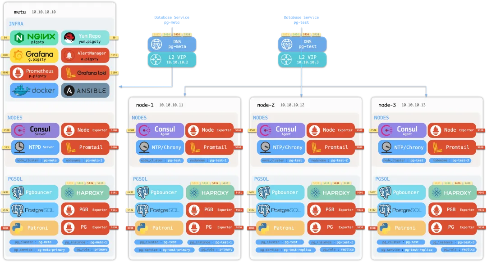

## 开源云数据库 PaaS 替代方案

> Alternative for RDS！安全可控，降本增效！从易到廉，给用户省钱！

Pigsty 相比云厂商 RDS，在拥有更低使用⻔槛与更丰富功能的前提下，可节约 50% - 80% 的数据库软硬件成本，初级研发人员即可自主管理成百上千套数据库。

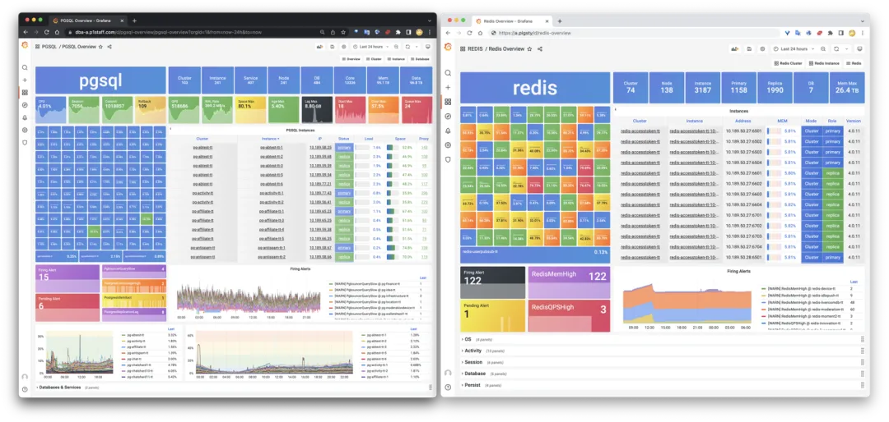

Pigsty 采用模块化设计，可自由组合，按需定制扩展。可在生产环境部署管理各种数据库，或仅仅将其当成主机监控；可用于开发数据库可视化 Demo、或支撑各类 SaaS 应用。

Pigsty 是开源免费的生产级数据库解决方案，用于补全云原生生态缺失的最后一块拼图。稳定可靠，经过长时间大规模生产部署验证，提供可选的专业技术支持服务。

## 自动驾驶高可用

以 PostgreSQL 为例，Pigsty 创建的数据库集群是分布式、高可用的数据库集群。只要集群中有任意实例存活，集群就可以对外提供完整的读写服务与只读服务。

Pigsty 的高可用架构久经生产环境考验，Pigsty 使用 Patroni + Consul 进行故障检测、Fencing 与自动故障切换，通过 HAProxy、VIP 或 DNS 实现流量的自动切换，以极低的复杂度代价实现了完整的高可用方案，让主从架构的数据库能用出了布式数据库般的体验。

数据库集群可以自动进行故障检测与主从切换，普通故障能在几秒到几十秒内自愈：主库故障 RTO \< 1min，只读流量几乎无影响，同步集群 RPO = 0 不丢数据。

数据库集群中的每个数据库实例在使用上都是幂等的，任意实例都可以通过内建负载均衡组件 HAProxy 提供完整的读写服务。任何一个或多个 Haproxy 实例都可以作为集群的负载均衡器，并通过健康检查进行流量分发，对外屏蔽集群成员的区别。用户可以通过配置灵活定义服务，并通过多种可选方式接入。

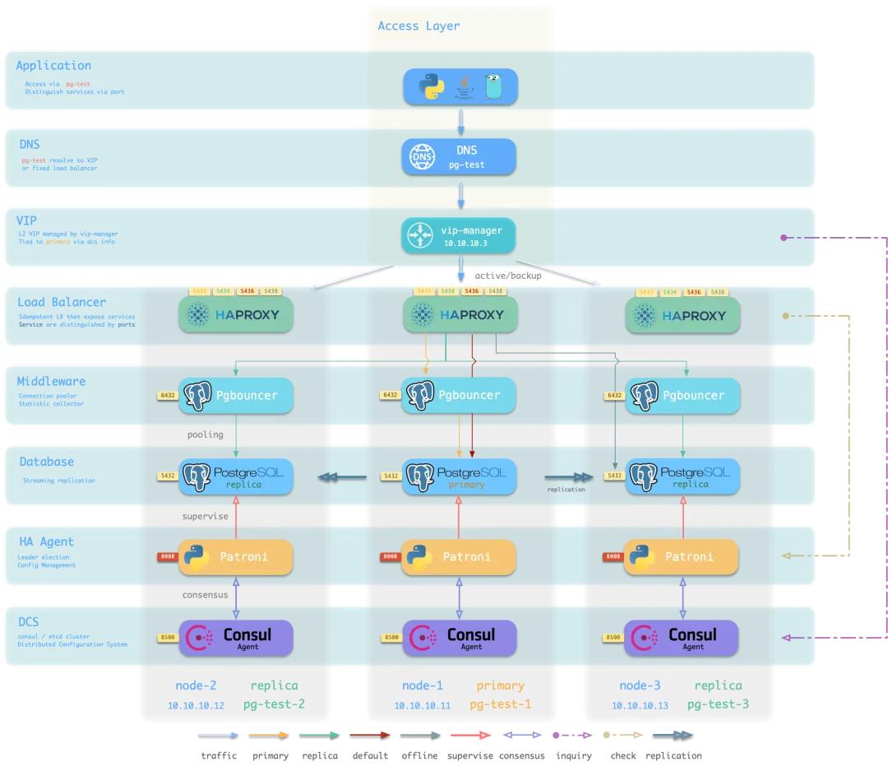

## 极致入微可观测\

> You can't manage you don't measure.

监控系统提供了对系统状态的度量，是运维管理工作的基石。

[公开 Demo](http://demo.pigsty.cc/)

Pigsty 带有一个针对大规模数据库集群管理而设计的专业级监控系统，基于业内最佳实践，采用 Prometheus、Alertmanager、Grafana、Loki 作为监控基础设施。开源开放，定制便利，可复用，可移植，没有厂商锁定。

Pigsty 在 PostgreSQL 监控上做到无可比拟，通过 30+监控面板与上千仪表盘综合呈现约 1200+类指标，覆盖从全局大盘到单个对象的详细信息，从数据库目录到节点日志全部一览无遗。与同类产品相比在指标的覆盖率与监控面板丰富程度上一骑绝尘，为专业用户提供无可替代的价值。详略得当的层次设计，为业余用户带来直观便捷的管理体验。

Pigsty 的监控系统可用于监控原生部署的各类数据库实例：PGSQL，REDIS，GPSQL 等，也可以独立使用，监控已有的数据库实例或远端云厂商 RDS，或仅仅作为主机监控使用，它还可以用作数据可视化作品的展示平台。

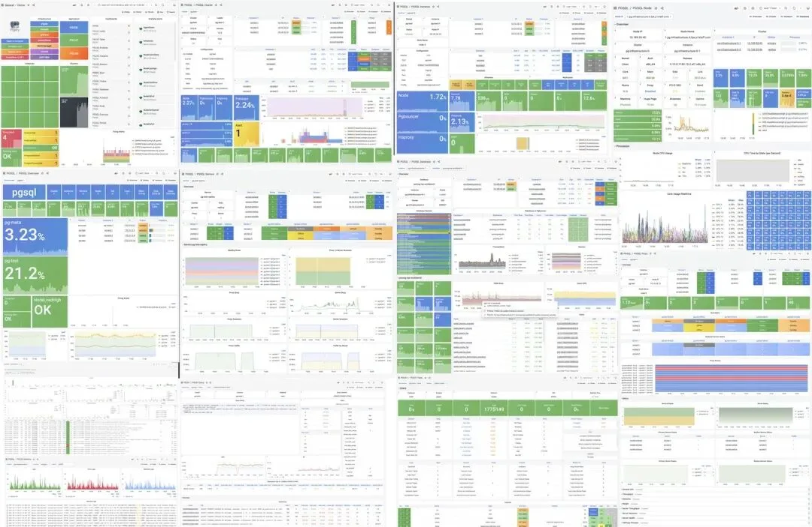

## 简单易用门槛低

## **HashiCorp for Database!**

Pigsty 采纳 *Database as Data* 的设计哲学，使用类似 Kubernetes 的声明式配置，通过大量可选的配置选项对数据库与运行环境进行描述，并通过幂等的预置剧本自动创建所需的数据库集群，提供私有云般的使用体验。

用户只需要通过配置文件或图形界面描述“自己想要什么样的数据库”，而无需关心 Pigsty 如何去创建或修改它。Pigsty 会根据用户的配置文件清单，在几分钟内从裸机节点上创造出所需的数据库集群。

例如，在三台机器上创建一主两从的数据库集群`pg-test`，只需要几行配置与一行命令即可创建出高可用数据库集群。

## 自由部署体验齐

> 无论是几万核的生产环境，还是 1 核 2G 的本地虚拟机，云上云下，用哪个云，体验如一！

无论是几万核的生产环境、预发环境、还是本地 1 核 2GB 虚拟机的开发测试环境，对 Pigsty 来说，只有配置文件的内容差异。无论在哪里部署，都能带来统一的使用体验。

Pigsty 可以利用**Vagrant**与**Virtualbox**，在您自己的笔记本电脑上拉起安装所需的虚拟机沙箱环境，或通过 Terraform，自动向云服务商申请 ECS/VPC 资源，一键创建，一键销毁，自动获取多云部署的能力。

应用广泛生态全\

> 一键拉起生产级 SaaS 应用，数据分析快速上手，低代码开发可视化大屏

### SaaS 软件应用

Pigsty 在元节点上默认安装了 Docker，您可以一键拉起各类 SaaS 应用：开源私有代码托管平台 Gitlab，开源论坛 Discourse，开源社交网络 Mastodon，开源 ERP 软件 Odoo，以及用友、金蝶等软件。您可以使用 Docker 拉起无状态的部分，修改其数据库连接串使用外部数据库，获取丝滑的云原生管理体验与生产级的数据持久性。详情请参考 教程:Docker 应用。

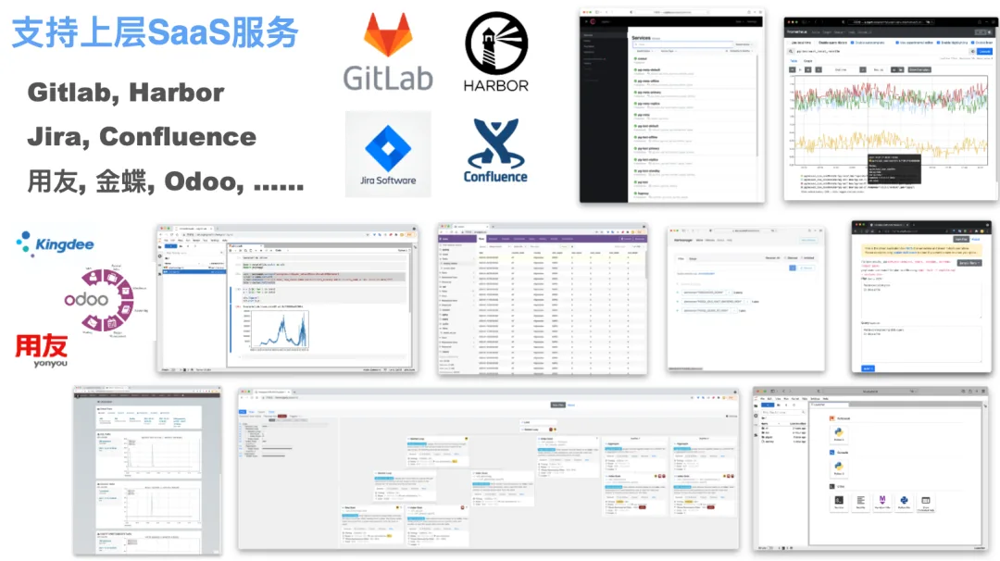

数据分析与可视化应用\

Pigsty 既是开箱即用的 PostgreSQL 发行版，也可以用做数据分析环境，或制作低代码的可视化应用。您可以直接从 SQL 数据处理到 Echarts 绘图一步到位，也可以使用更精细的工作流：例如使用 PG 作为主数据库，存储数据并用 SQL 实现业务逻辑；使用内置的 PostgREST 自动生成后端 API，使用内置的 JupyterLab 用 Python 进行复杂数据分析，并使用 Echarts 进行数据可视化，并通过 Grafana 获得交互能力。

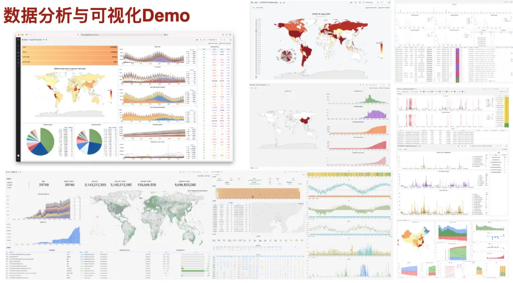

Pigsty 自带有几个应用样例作为参考：\

- 分析 PG CSV 日志样本`pglog`

- 新冠疫情数据可视化 `covid`

- 全球地表气象站数据查询 `isd`

- 数据库流行度排行趋势 `dbeng`

- 查询大厂工作上下班安排 `worktime`

## 自主可控更省钱

> Pigsty 可将数据库的综合持有成本降低 50% ～ 80%，
>
> 并让数据真正掌控在用户自己的手中！

公有云数据库/RDS，也是一种“开箱即用"的解决方案，但它交出的答卷离让用户满意还有很长路要走：相比自建数据库成本昂贵，许多需要超级用户权限的功能被阉割，愚笨的 UI 与大锅饭式的功能，但在所有问题中，最重要的问题莫过于云软件的安全与成本问题：

### 自主可控

- 运行在你自己的电脑上的软件，即使软件供应商倒闭也可以继续运行下去。但如果提供云软件的公司/部门倒闭或决定停止支持，这些软件就没法工作了，而你用这些软件创造的数据就被锁死了。因为数据只存储在云端，而不是你自己服务器的磁盘上，而您能指望的补偿通常只有鸡肋的代金券。

- 无法定制或扩展的问题在云数据库中进一步加剧。云数据库通常不向用户提供数据库超级用户，这将锁死一大批高级功能，以及自行加装扩展功能的能力。与此相对应，'流复制'，'高可用'这些本该是数据库标配的东西往往作为增值项向用户出售。

- 云服务可能在没有警告和追索手段的情况下突然暂停你的账户。您可能在完全无辜的情况下，被自动化系统判定为违反服务条款：未备案使用 80 与 53 端口，账户被爆破并用于发送恶意软件或钓鱼邮件，触发违背服务条款。或因为一些政治原因被云厂商锤翻，例如 Parler。

- 国内不用 SaaS 坚持自研或开源自建的习惯，是被恶劣的生态产业环境真金白银教育出来的。在信息时代把核心资产 — 数据放在别人的硬盘上，就像把金条放在超市存包柜中一样。您无法避免，无法监督、甚至无法意识到利益冲突的云厂商，或者仅仅是怀有恶意或好奇的运维与 DBA 人员偷窥盗窃您的珍贵数据。

Pigsty 则不然，它可以部署在任意地方，包括您自己的服务器上。它开源免费，无需 License，无需互联网访问，不收集任何用户数据。您可以在自己的服务器运行它直到海枯石烂。

#### 降本增效

云数据库的成本则是另一个问题：省钱是用户的刚需。公有云厂商的 RDS 相比传统商业数据库也许有优势，但在自建开源数据库前仍然是暴利天价。据统计，RDS 的综合持有成本比起基于云服务器自建要高达 2~3 倍，比起 IDC 托管自建更是高出 5～10 倍。

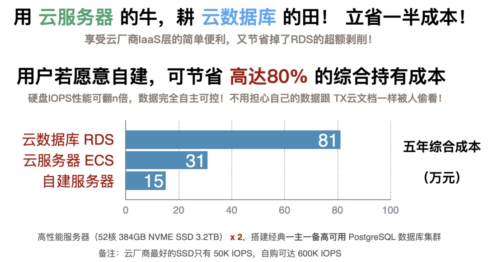

Pigsty 相比使用云数据库有显著成本优势。例如，您可以使用云数据库一半的开销购买同规格的云服务器，并使用 Pigsty 自行部署数据库。在这种情况下，您既可以享受公有云的绝大部分管理之快捷便利（IaaS），又可以立竿见影节省一半以上的开销。\

更重要的是，Pigsty 能显著提高用户效能：它允许一两个高级 DBA 将所有琐碎杂物交由软件处理，轻松管理几百套数据库集群；也可以让一个初级研发人员，经过简单的学习培训后，即可迅速达到一个高级 DBA 的廉价七成正确水平。

Pigsty 开源免费，在提供类似甚至超过云厂商 RDS 使用体验的前提下，可将数据库的综合持有成本降低 50% ～ 80%，并让数据真正掌控在用户自己的手中！

## 云原生运动的最后一块拼图

软件吞噬世界，开源吞噬软件，云吞噬开源；而吃掉云的，还得看**云原生**与**多云部署**。

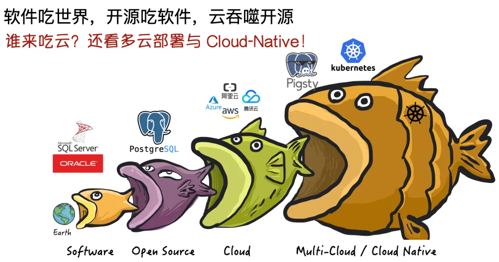

**云原生（Cloud Native，或曰“本地云”）**是一场从公有云厂商夺回软件自由的伟大运动。然而其图景中还缺少最后一块拼图 ——  数据库。

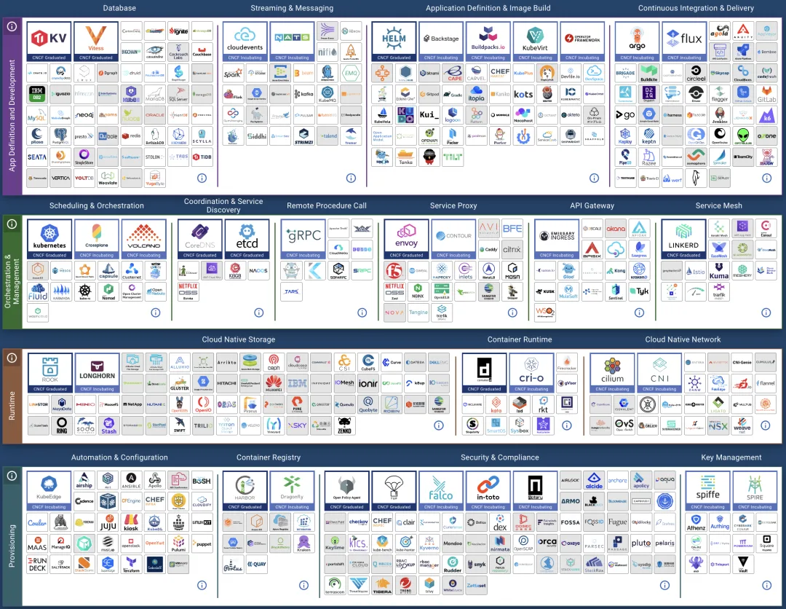

将数据库稳定可靠地放入 Kubernetes/容器中仍然是一个业界难题，即使是云厂商，也仍然在大量使用物理机与虚拟机部署管理数据库。而很多的用户，因为没有数据库的运维能力，不得不使用公有云/RDS 来补足这个短板，进而不得不把自己的业务跑在云上。

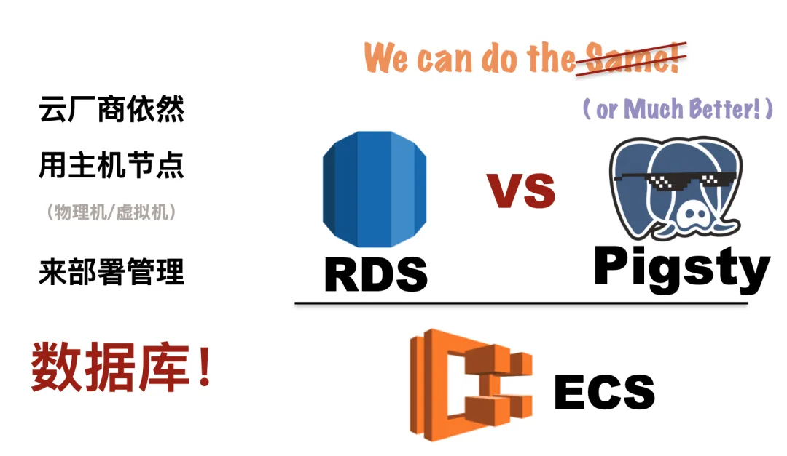

而 Pigsty 将会带来改变：用云服务器的牛，耕云数据库的田，享受绝大多数灵活性的同时立省一半开销；若是使用 IDC 托管/自建机房，综合持有成本省掉百分之八十都打不住！

Pigsty，要把 DB 的使用门槛压到地板，我们要把软件自由交还用户：让天下没有难用的数据库，谢谢！

---

发布版本：[微信公众号](https://mp.weixin.qq.com/s/oaPSLYw69Oh2ZXjNo4wJIQ)
