去年有大师给我算了一卦曰：**明年你没财运，后年的财运一般**，然后连着十年就起飞了。起飞不起飞我不知道，反正今年确实算的很准 —— 确实没啥财运。好在 —— 今年的事儿整的还不赖，哈哈。

---

## 开源

GitHub 是全球一亿开发者的精神家园，全球最大的♂同性交友网站。与去年相比，今年我在 GitHub 上挣到了大概 3700 颗 Star，在全球 Star Ranking 上的排名从 **483** 提升 26 名至 **457** 位。

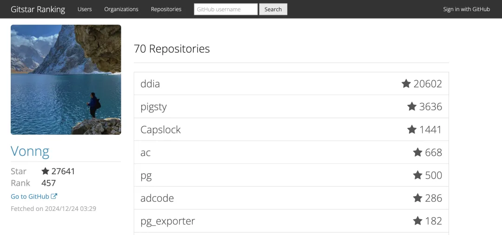

同时，在劳模活跃榜上，今年我以 2868 个提交成为中国地区活跃度第 16 的用户，以及 3058 个 Contribution 成为国区榜 20 的用户。年底还拿了个 “开源中国 2024 年度突出贡献专家”荣誉称号。

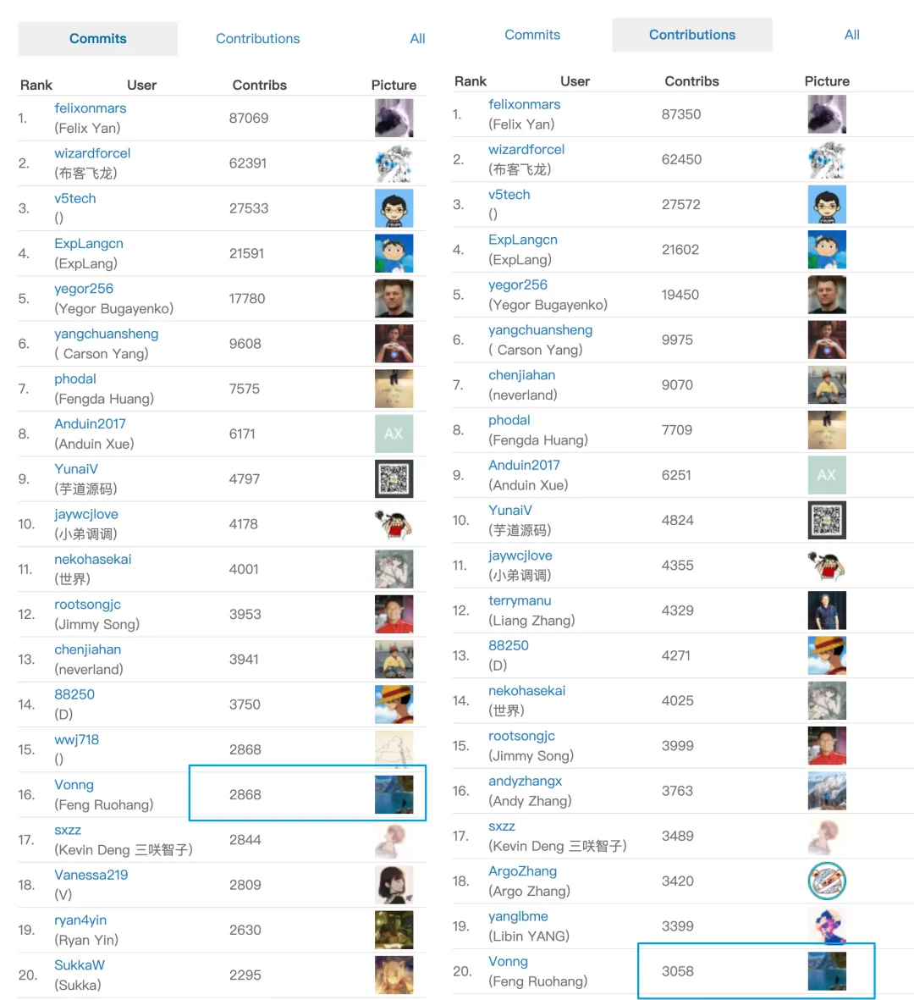

当然，这些贡献基本都围绕着 PostgreSQL 生态。主要是关于我的开箱即用的 PostgreSQL 数据库发行版 ——  Pigsty 展开的。

---

## 项目

在 2024 年，Pigsty 发布了 9 个版本，特别是 v3 的发布，基本标志着这个项目已经进入了非常成熟稳定的阶段。

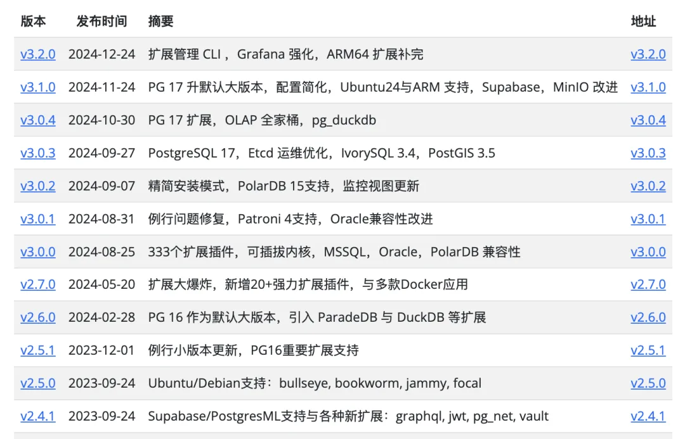

这一年里，Pigsty 明确了自己的定位，要站在数据库（PostgreSQL 吞噬数据库世界）与云计算（下云）与两个核心趋势的交汇点上。抢占本地优先开源 RDS PG 标准（非 K8S）的生态位。

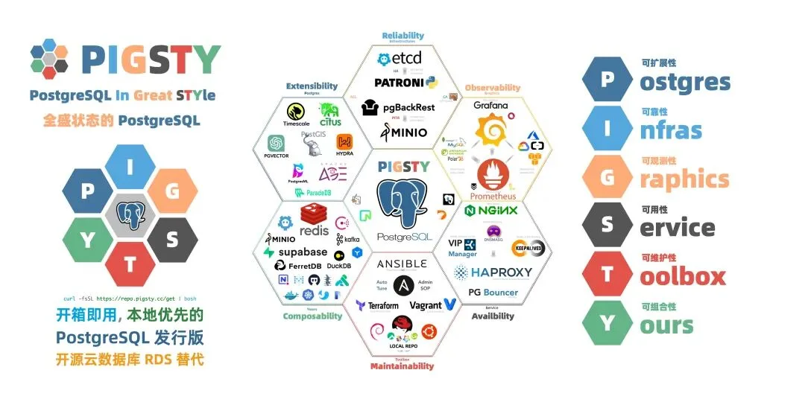

Pigsty 提出了六条核心价值主张，其中首当其冲的就是 可扩展的 PostgreSQL。在年初我发表的 《[PostgreSQL 正在吞噬数据库世界](/pg/pg-eat-db-world/)》一文中，我提出了扩展插件是 PG 成功的秘诀，得到了全球社区的广泛认可。而知行合一的表现就是，既然我认为扩展至关重要，是发行版的核心价值主张。那就应该去解决这个问题。

在这一点上，我还是可以比较骄傲的说，我对 PG 扩展生态做了相当显著的贡献。在过去一年里，我在编译打包维护了 PG 生态中 150 个扩展插件，超过了官方仓库维护的 100 个。并且修复了无数扩展问题，让 PG 生态开箱即用的扩展总数达到了惊人的 340 个，目前在整个 PG 生态中，没有能望其项背的竞争对手。

目前来看，我觉得 PG 生态很有可能在 OLAP 大数据/实时数仓领域再次出现一个类似 PGVECTOR 向量插件这样的爆款。[但不同于上次 PGVECTOR 冒头时我只能求助 PGDG Devrim 放入 PG 仓库](/pg/llm-and-pgvector/)，现在的 Pigsty 已经成了这些扩展插件分发的一个重要渠道了。

目前我已经说动了两家友商 AutoBase 和 Omnigres 使用 Pigsty 的扩展仓库作为上游，目前还在游说其他几家，总的来说我觉得问题不大，只要保持目前的态势，不难打造出一个 PG [扩展分发事实标准](/pg/pig/)来。

---

除了扩展，Pigsty 还在另一个方向上，Pigsty 开始围绕 PostgreSQL 摊大饼，那就是 Fork 内核。Pigsty 目前支持了 Oracle 兼容的 IvorySQL，SQL Server 兼容的 WiltonDB，国产数据库 PolarDB （PG / Oracle），以及开源 Firebase，出海创业当红炸子鸡 Supabase。

马上 Neon 和 OrioleDB 也要加入进来 —— Pigsty 能为这些 PG 分支/衍生内核提供完善的高可用，备份，连接池，扩展插件。将简单的 RPM 改造成一个开箱即用的云数据库服务。这意味着只要你是 PostgreSQL 生态的内核公司（没有瞎魔改），那么你就能从 Pigsty 的工作中享受到免费红利。从而打造一个互惠共赢的生态。

---

## 指标与数据

从运营指标上看，Pigsty 从年初的 2200 Star 到年底的 3645，虽然比不了去年的 3 倍增长，但也有可观的 50% 增长，收获了 1400 多 Star。

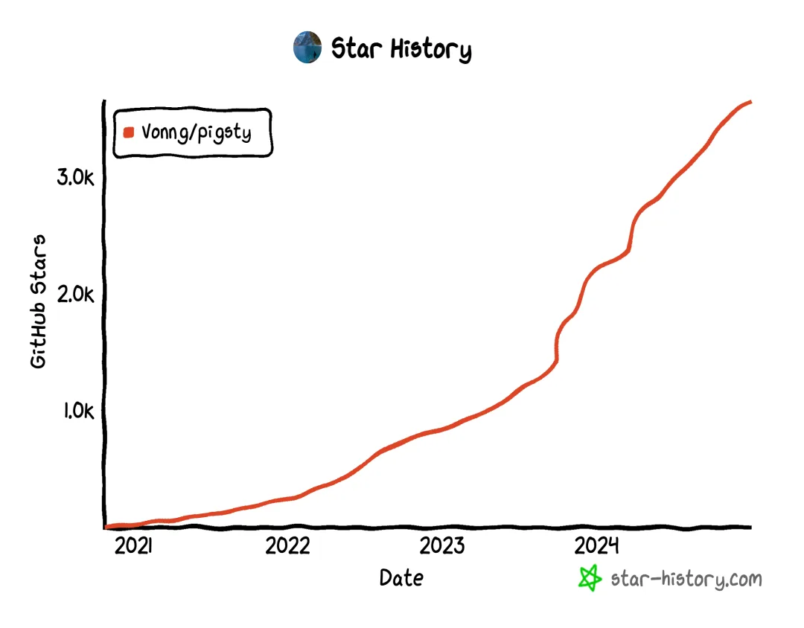

当然 Star 是一方面，主要是在全球 PostgreSQL 生态也开始有了知名度，目前在 OSS Rank 上 PG 生态开源项目排行榜中从去年的第 37 位提升到了 23 位，挤进第一页指日可待。

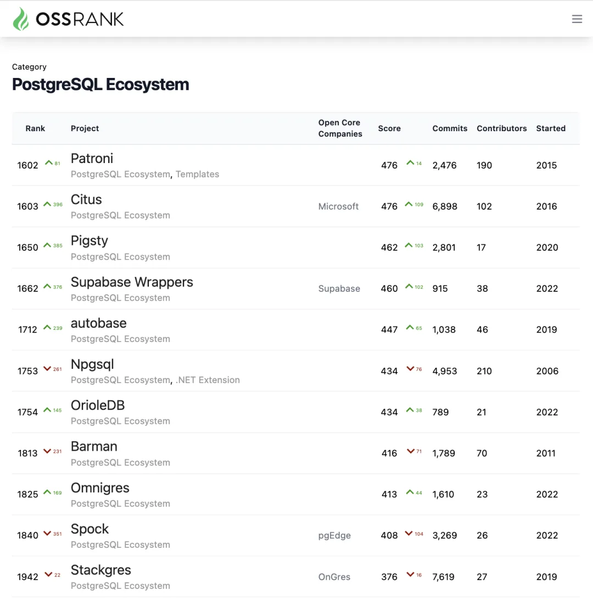

从 Google Analytics 上来看，今年 Pigsty 网站的总访问用户达到 10 万+ （pigsty.cc 加 pigsty.io ），相比去年的 5 万 UV 翻倍。

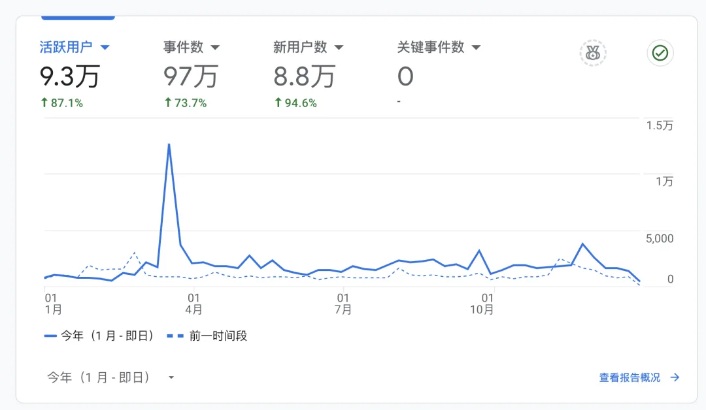

这个尖刺来自《[PostgreSQL 正在吞噬数据库世界](/pg/pg-eat-db-world/)》，英文版引爆了 PG 社区，带来了大量的流量。\

而且来自海外的关注度与流量出现显著增长，去年海外用户占比大约占 20%，而今年则几乎翻倍来到了 40%

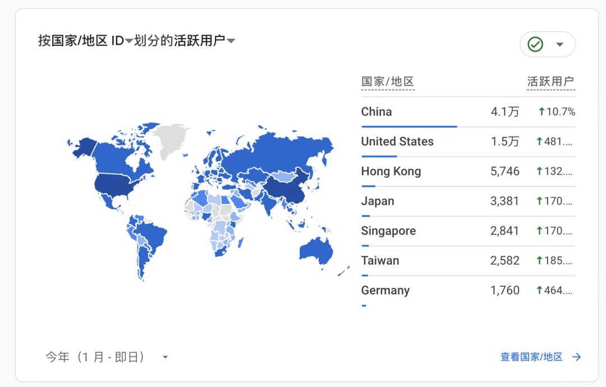

---

## 商业化

今年下半年，我开始进行了一些商业化方向的尝试。老实说，这不是我喜欢干的事情。我喜欢搞纯粹的研发，产品设计，写文章营销也还行，但销售真是要了血命。所以，我的商业化策略很简单：

—— **没有销售**。

在网站上放个页面，你要想买直接找我来买就好了。

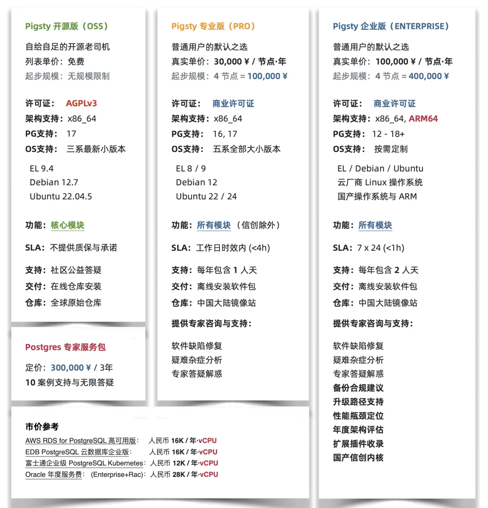

虽然没有销售，也没有吆喝，但就这样还是卖出了几单，基本上也就挣了个工资钱。但是知足常乐，反正我干的是自己喜欢的事，挣了钱的目标不就是为了干自己喜欢干的事么？

当然比起客户，用户侧的发展就要繁荣多了。这一年里，有许多新增的用户案例，比较知名的有 B 站，影视飓风，还有一些奇绩校友企业，一些科研院所军工部队单位都有用例，制造业，化工，新能源，各行各业基本都覆盖到了，毕竟数据库这东西太基础太万能，哪里都能用得上。特别是最近两年对 向量 pgvector 的需求激增，这带动了 PG 和 Pigsty 的显著增长。

总的来说，适当的商业化确实能解决一些现金流上的问题，有了现金流也就不用在乎融不融资了，可以开心长久地干自己喜欢的事情。\

---

## 自媒体副业

今年，自媒体算是一个副业。写公众号纯粹是为了传达自己的理念，另外就是 —— 这个时代吧，任何公司组织，都必须想办法搞流量 —— 要么去买，要么自己上，那我就只能自己上了。

关注用户数量从年初的一万八正好翻倍来到了三万六。两个专栏《[**数据库老司机**](/db/guru/)》 和 《[**云计算泥石流**](/cloud/exit/)》都有了一些口碑，在数据库领域的关注量大概是做到 Top1 了。

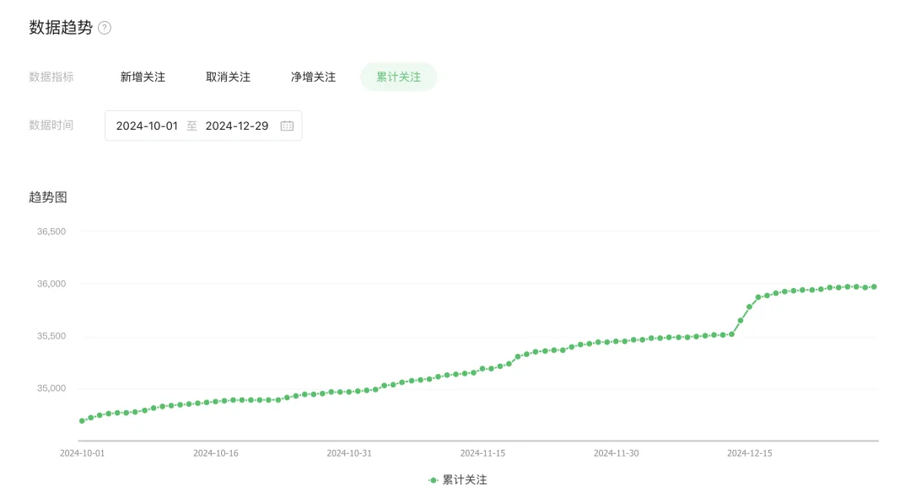

今年虽然有很多软文生意找上门，但我还是保持住了节操 —— 我可以骄傲的宣称本号不接软文，所以我写文章的时候可以肆无忌惮地输出自己的观点，完全不顾及数据库厂商/社区和云厂商的脸面，哈哈，嘴炮很过瘾，没少得罪人，但也有了许多老铁读者与铁杆支持者。

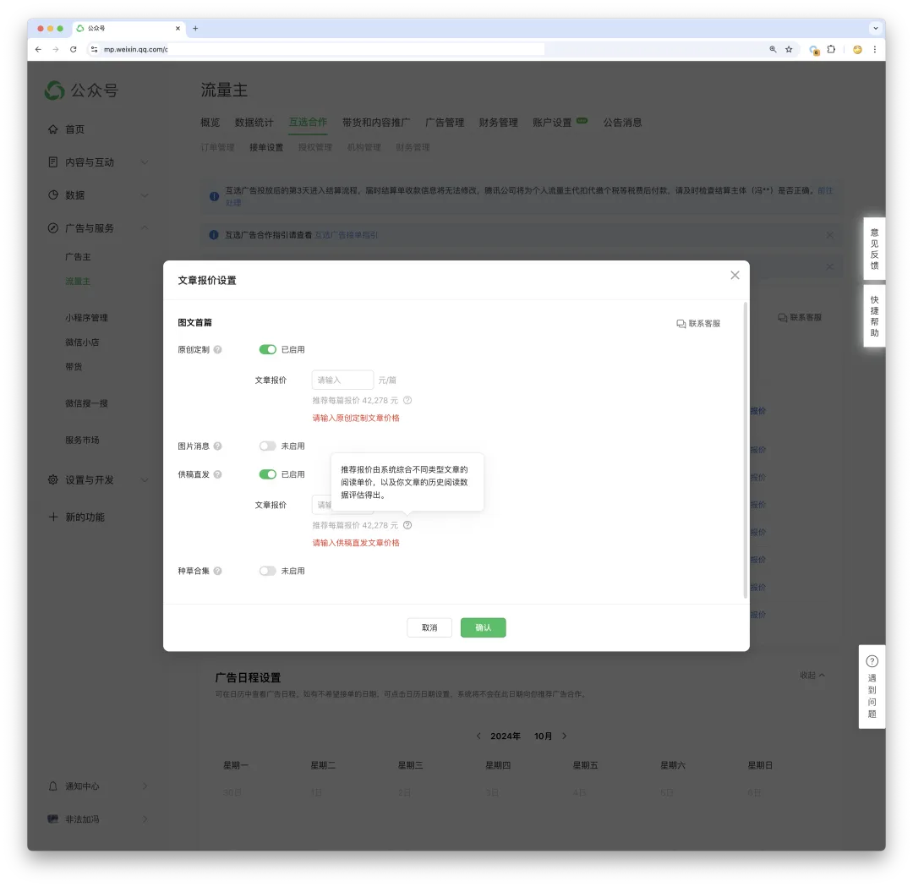

总的来说，搞的还不错，海外平台上 Medium 有了几百个订阅，X 上关注破了一万一，接近千万展现，佛系运营，也算还行吧。

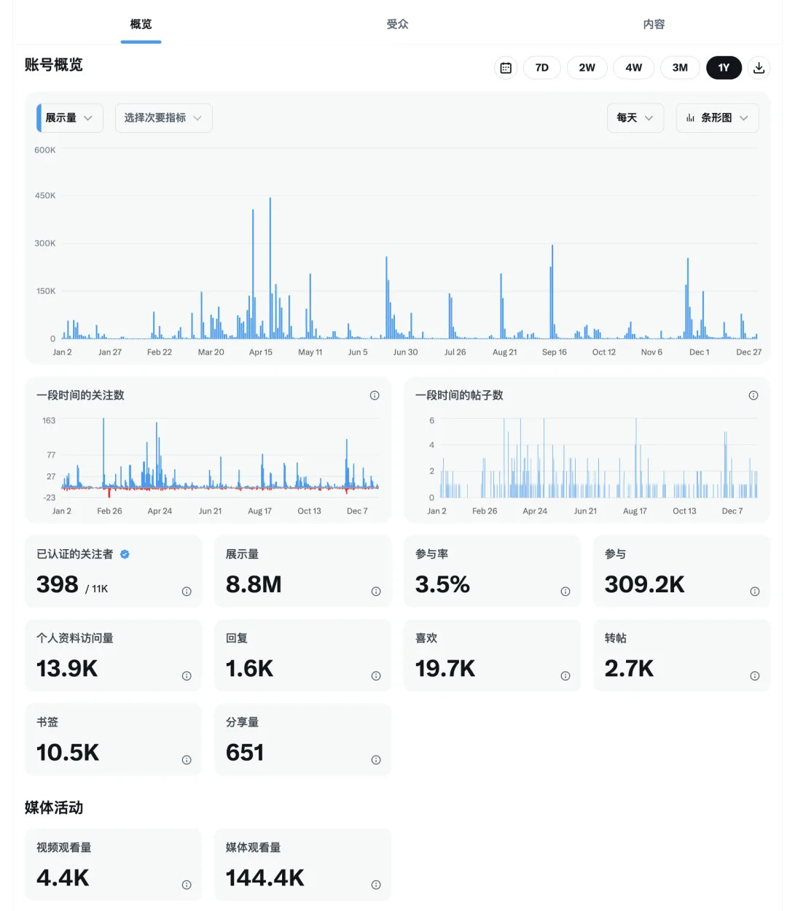

---

## 总结

总的来说，2024 年，全职创业的第三年。一人公司，没啥功耗，时间自由，可以做自己喜欢的事情（这里要再次感谢媳妇的大力支持），基本上是一个比较满意的状态。明年，大师说我也没啥财运，宜广结善缘，则后年腾飞矣。俺希望大师没有骗我，总之，努力干吧。

---

发布版本：[微信公众号](https://mp.weixin.qq.com/s/WxnApDbw8Mi-rD5mkBnYwQ)
