## 引子

本来计划了[四十篇游记](/trip/20200216-westward-prologue/)，但一直以来都在忙其他事情，没有时间补上。但今天恰好是踏上旅程的一周年，相当有纪念意义。选这一天发游记，很有仪式感。我可以假装现在正好是一年前，按照同样的日期把所见所闻所思所感发出来。这样为了保持和实际行程同步，我就有理由 Push 一下自己，不要再拖延了。不过游记嘛，也不是什么正经文章，就是吐吐槽扯扯淡随便写写，不用给自己太大压力。

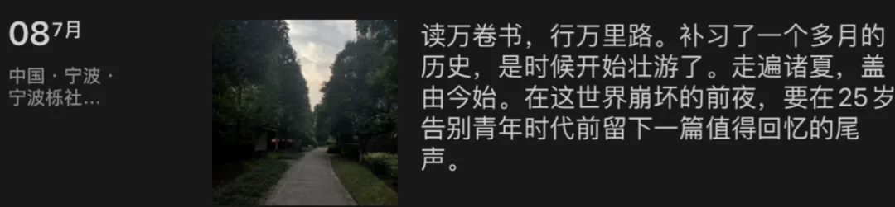

说起这趟旅程，基本上属于半临时起意，机票和目的地都是出发前一天临时决定的。本来只是想花几周随便逛逛，但不知不觉就变成了三个月的游历。游历的动机也很简单：有一种强烈的直觉，现在不出去看看，以后可能再也不会有这样的机会了。在充满惊涛骇浪的 2020 年回头看，直觉诚不欺我哉。

旅途的起点，本来想定在丝绸之路的起点 —— 洛阳，或者东方之珠——香港，然后走到哪算哪。不巧天公不作美，这几天到处都在下雨，最后也就西安天气好一些。于是，于是，旅途的起点就这样愉快的决定了 —— 长安。

## 长安古意

旅途的第一站是帝都长安。时值《长安十二时辰》热播，去这里倒是挺应景。

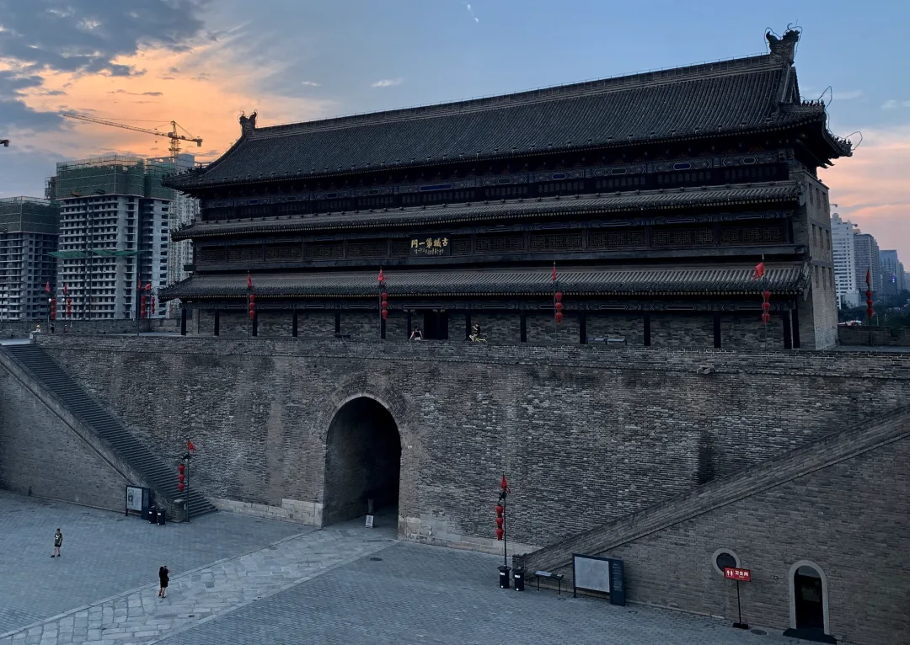

长安的历史可以追溯到西周丰镐时期，十三朝古都，历史悠久。当然，也有更久的，比如什么黄帝时期的河洛，商朝时期的武汉盘龙城这些。但按有据可考的历史与文明传承的关系，称长安为华夏文明的缩影还是当之无愧的。

长安知名的景点很多，兵马俑，唐僧翻译经文的“烂怂大雁塔”，杨贵妃洗澡的华清池，诸如此类。当然，这些维基百科和携程蚂蜂窝上的都有的东西我就懒得搬运了。

但我觉得，长安城本身才是最大的看点。当代的西安市区和华夏文明巅峰时刻盛唐的长安城区几乎是完全重合的。今天的朱雀大街和唐代的朱雀大街都是同一条路，名称与位置都一模一样。走在长安的街道上，会有一种奇妙的穿越感。在古城中穿梭要比打卡经典有趣的多，总能发现各种小惊喜。毕竟在长安，修个地铁都能挖穿无数古墓，随便什么砖砖瓦瓦说不定都有惊人的历史。

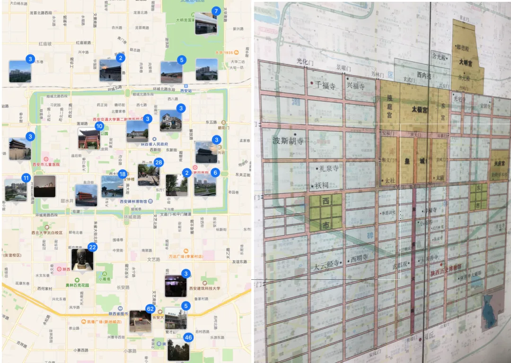

## 城墙

=

## 西安的城墙可能是这座城市最有特色的地方了，从隋唐至今有一千多年历史，几个城门的名字和位置也基本和历史上保持一致。长安城墙很有特色，可以在上面骑自行车，一圈 14 公里，用不了一个小时，风景上佳。

[嵌入媒体](https://mp.weixin.qq.com/mp/readtemplate?t=pages/video_player_tmpl&action=mpvideo&auto=0&vid=wxv_1419807885374373889)

## 古时（先秦时期）“國"字的含义就是：里面有武士守卫的城墙。长安作为华夏十三朝帝都，可谓真正是字面意义上的“中國"了。

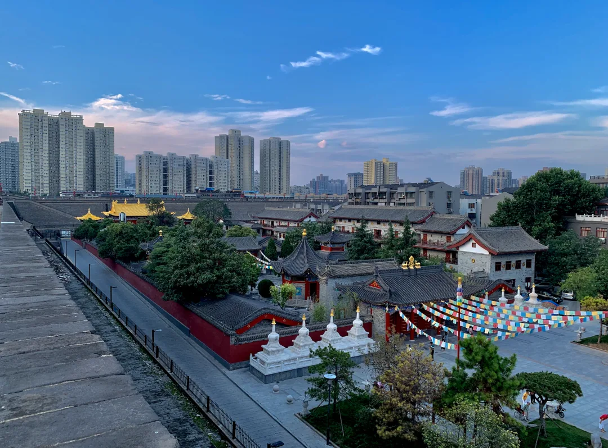

## 以前，住在城墙里的是“国人”，住在城墙外的就是“野人”。不过沧海桑田，现在城墙外面反倒是高楼大厦不少了。

=

## 晚上的城门门洞也是挺别致的，很有鬼片的感觉。

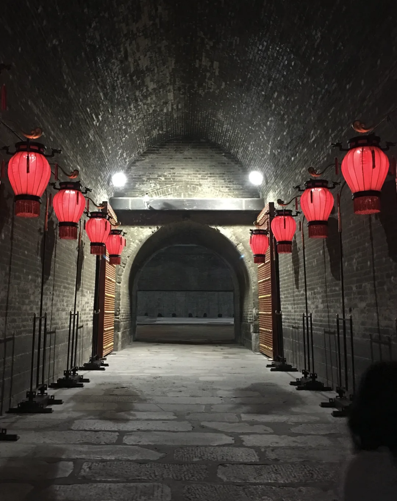

在城墙南门附近，我突然看到了一个很熟悉的地名，突然想起来原来是白居易《琵琶行》里那句：自言本是京城女，家在虾蟆陵下住。一查发现竟然还真是这里。

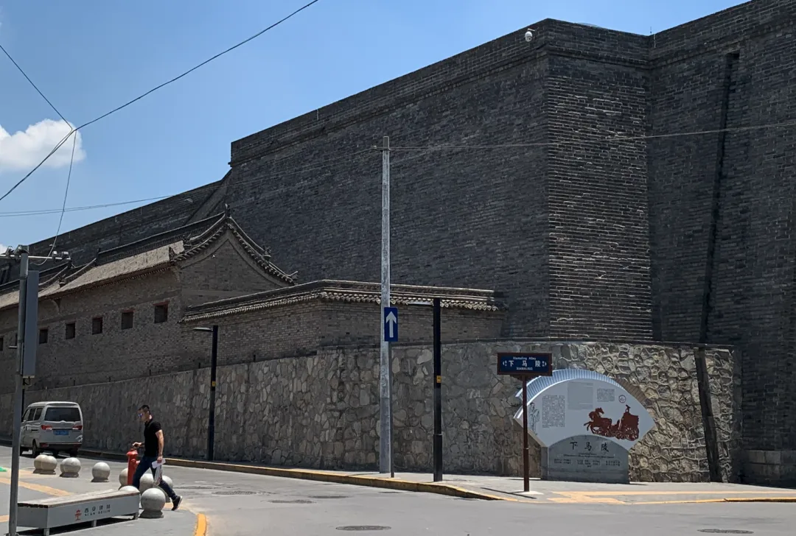

## 据说是这里埋着董仲舒，弄罢黜百家独尊儒术那个，汉武帝经过董仲舒陵地时特意下马表示尊重，下马陵因此而得名。那个墓据说在旁边的干休所里看不到，当然真假就不知道了。像这种逛着逛着突然看到一个有历史典故的地点，在西安感觉像是再正常不过了。

## 碑林

## 下马陵再往前走几步，就到了碑林。碑林是书法爱好者的圣地，有人在这里拓片，观摩了一下，挺有意思

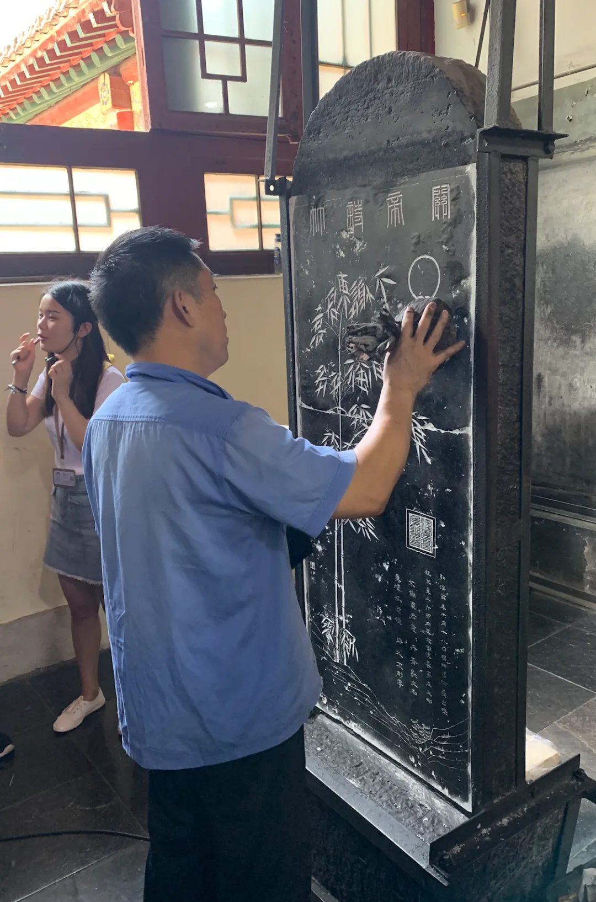

## 虽然我不是书法爱好者，但这里仍然有一些有趣的东西。

比如，碑林里最有名的当然就是那块“大秦景教流行中国碑”，这个名字起的相当直白，景教就是波斯版的基督教异端，《长安十二时辰》里还特意给景教和十字寺加了不少戏。这块碑引起了我的兴趣，还因此发现了一本有趣的书《撒马尔罕的金桃》，专门介绍唐代文化与技术上的对外交流，好多我以为是国产货的东西竟然也是舶来品。

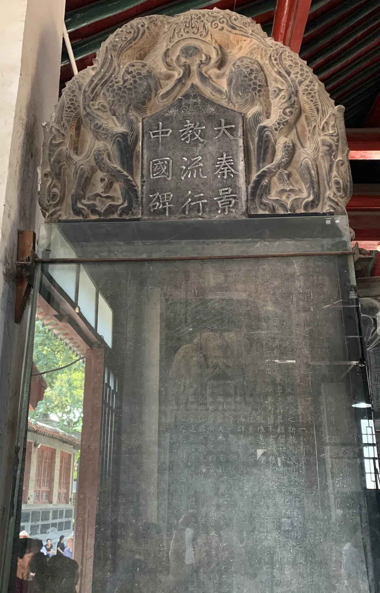

另一个引起我注意的是“郝连勃勃”，我在好几块碑上都看到了这个名字。这个名字实在是过于生机勃勃，太让人印象深刻，以至于在我的脑海中扎下了根，特意去查了之后大吃一惊，这家伙竟然是个开国皇帝，创立了十六国之一的胡夏（大夏），甚至还占领过长安城，各种仿佛穿越小说一般的剧情集于一身。

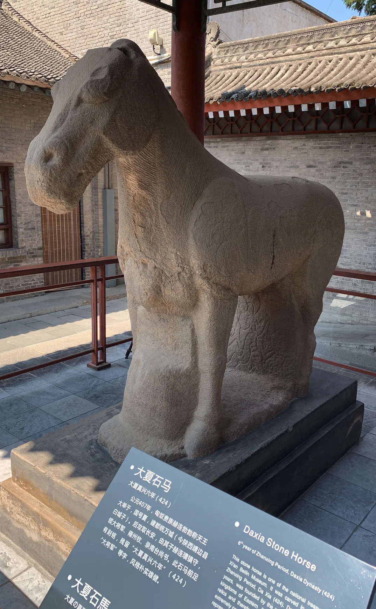

勃勃是匈奴人，原来还有个汉姓刘，后来又改性了郝连。他觉得自己是夏后氏的后代，所以给自己的王朝起了个"夏"的名字，但。《史记》里也说匈奴人是夏的后裔，不过现代人种学基因测序好像又不支持这个结论。总的来说，这段教科书里轻飘飘一笔带过的历史里还有这么多有趣的东西，这是我没想到的。

## 博物馆

对我来说，博物馆是城市里有趣程度仅次于城市本身的地方。

全国一百三十个一级博物馆已经逛了近一半。按照经验，通常博物馆都不会太令人失望。西安有很多大名鼎鼎的博物馆：陕西历史博物馆，秦始皇兵马俑博物馆，碑林博物馆。别的博物馆可以不去，到了西安不去陕西历史博物馆那就真的是可惜了。

虽然有很多有趣的文物，但我是懒得弄个流水账出来。总体感受上，以唐代文物居多，秦汉次之。而且第一华夏秦汉帝国和第二华夏唐朝之间的风格有非常显著的区别。秦汉是古典的传统华夏帝国风，但唐朝的胡风还是很浓厚的，混合着东北亚鲜卑，内亚外伊朗，东亚传统汉地几种风格。如果细心考证是能得出一些很微妙的结论的。

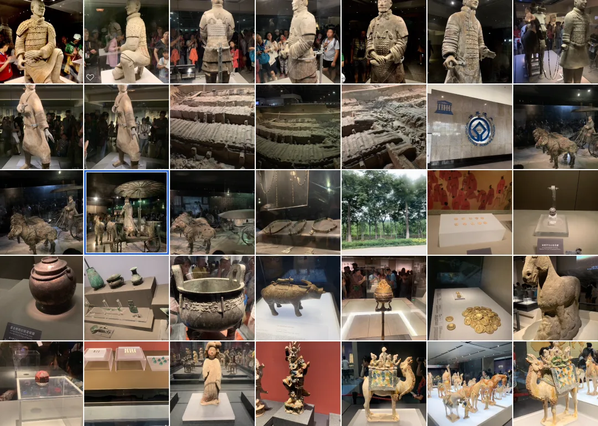

说起博物馆，这里友情插播一个小广告，朋友出了本书，介绍国内博物馆的。写的不错，可惜等我玩完了才出来，一看发现路上错过了好几个还不错的博物馆。

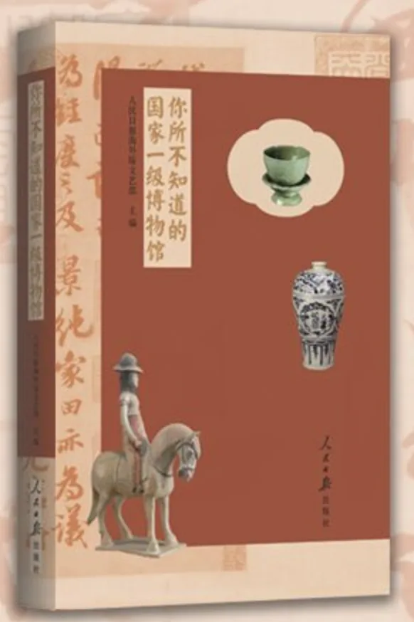

## 回民街

逛完博物馆，就准备去回民街附近的小巷子里弄点吃的。祖传的经验是，回民的小吃店通常会卫生一点儿。当然那种纯商业的“古街”就不一定了↓

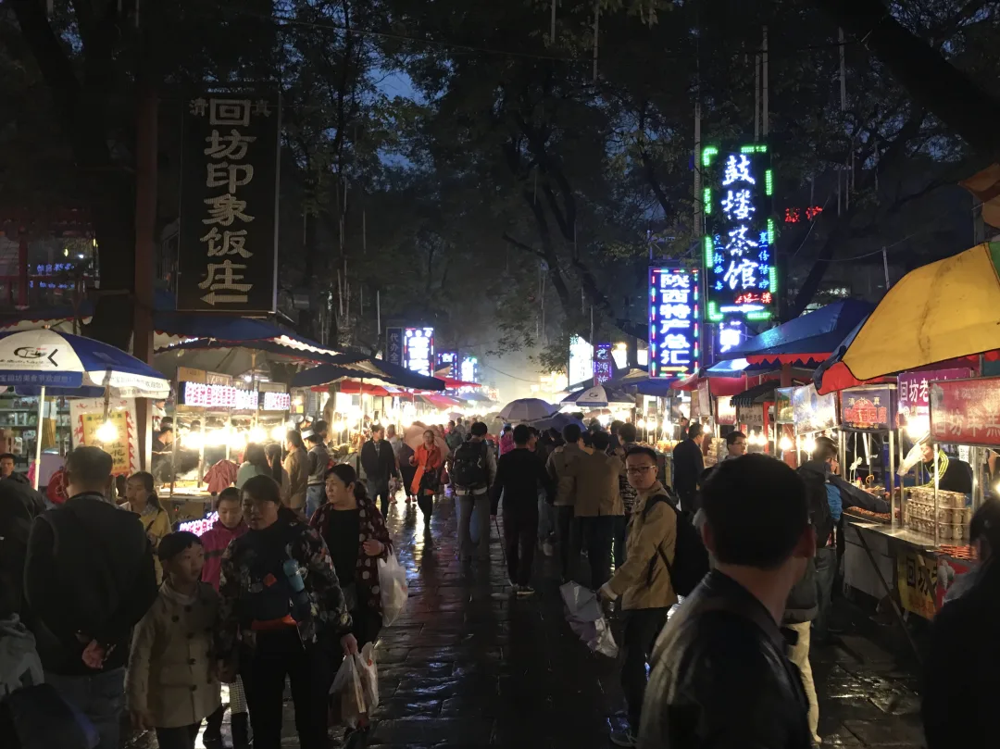

附近就是西安斯坦大清真寺，这是一座中国风的清真寺，挺少见。

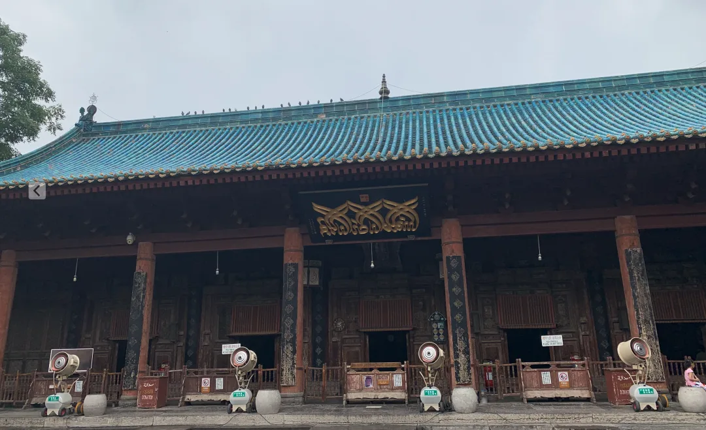

陕西的回族并不多，但西安市的回民特别多，也是有历史原因的，表过不提。

西安的凉皮肉夹馍都很好吃，biangbiang 面的话感觉也就是那么回事，噱头居多。比较有趣的是在面馆里碰上了包场的夏令营团队。几十号人，从小学到高中都有，穿着“横穿中国”的衬衫，四五个老师带队。跟几个带队老师聊了聊天，原来是准备从沿海一路玩到新疆去。

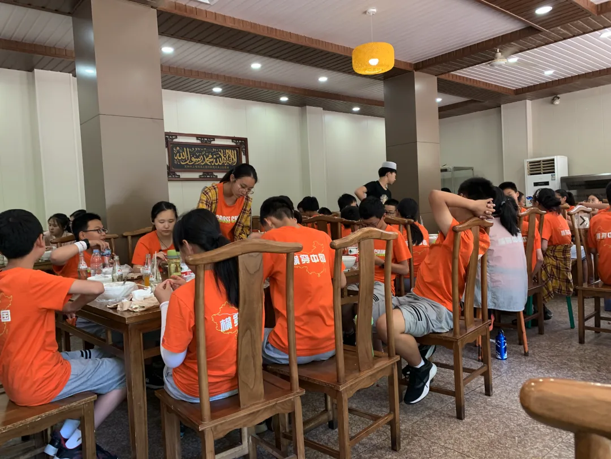

突然有点羡慕这些年轻人，在最合适的年纪就可以走南闯北，来一场横穿中国的壮游。但是转念一想，现在也不算晚。于是乎，接下来的行程也有了一个模糊的想法：从长安沿着丝绸之路西行，穿过河西走廊，到西域去看看。

独自游历的最大好处就是，所有的事情都是自己说了算。一切事情由自己做主是非常爽的体验，想去哪就去哪。诗云：

昔日龌龊不足夸，今朝放荡思无涯，

春风得意马蹄疾，一日看尽长安花。

就这样，我买好了前往下一站——宝鸡的车票，正式踏上了丝绸之路。\

---

发布版本：[微信公众号](https://mp.weixin.qq.com/s/PghO2slyzk13-0wbVHFrpg)
