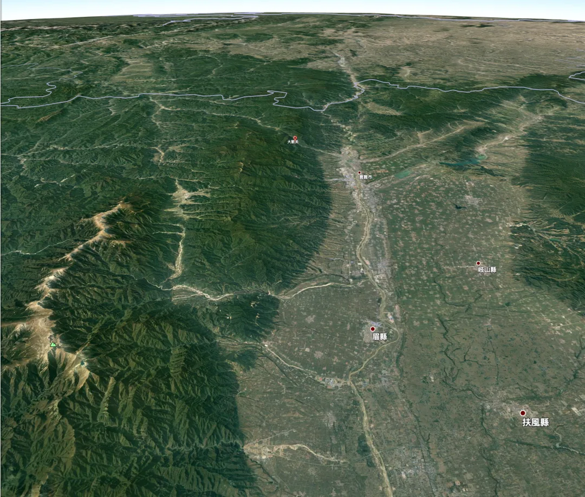
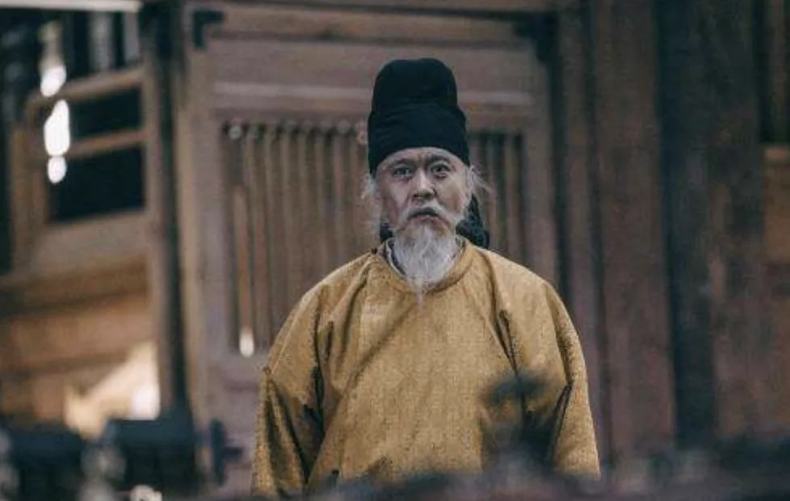
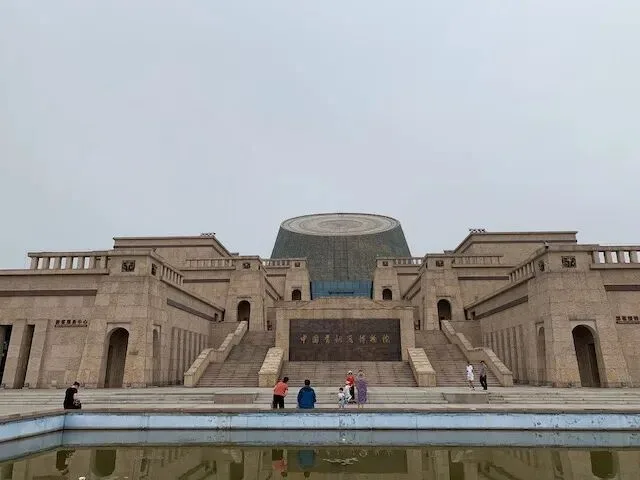
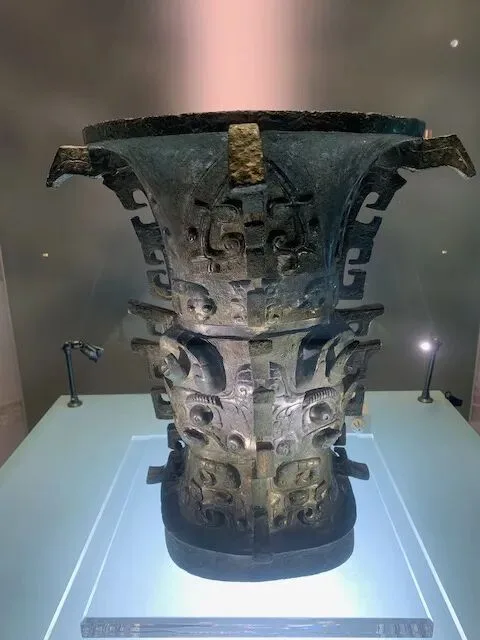
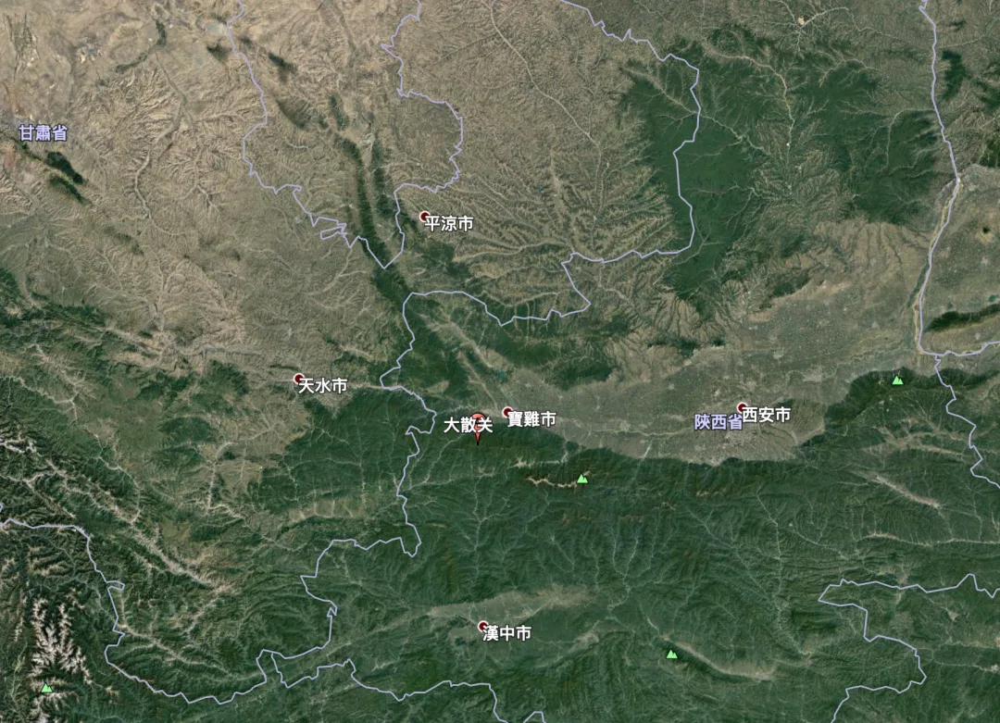
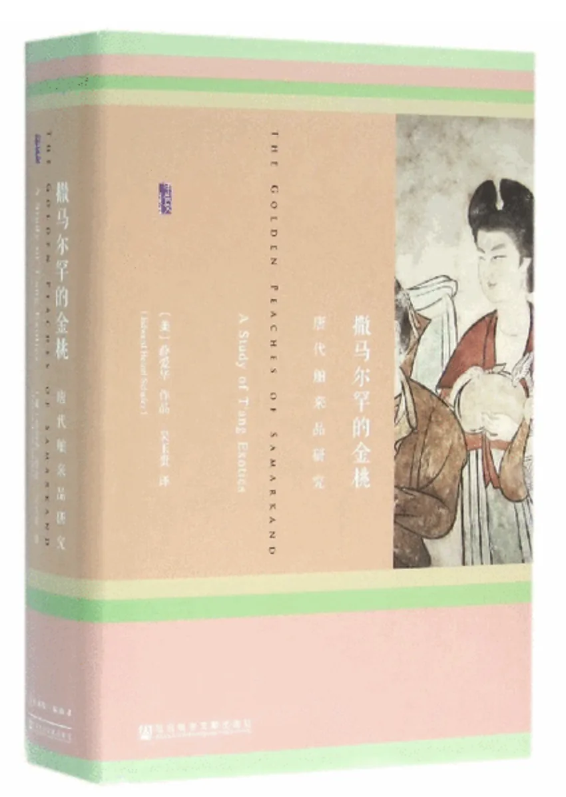
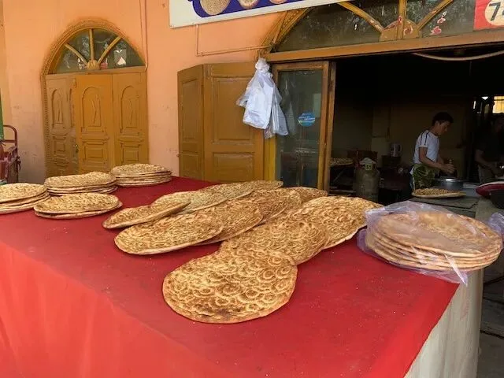
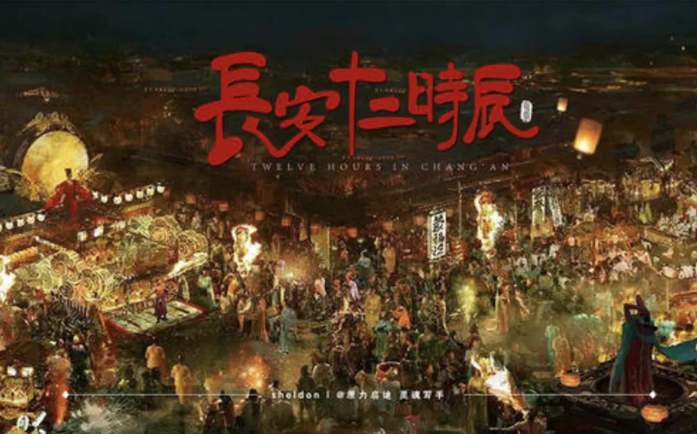

从西安出发，沿丝绸之路西行，第一站就是宝鸡。

宝鸡这个地名虽然很有特色，但它古时候的名字——陈仓，也许要比当代的地名知名度高得多，就是那个“暗度陈仓”的陈仓。

宝鸡的曾用名包括：岐山，雍州，扶风郡，岐州，凤翔府；如今下辖的几个区县：渭滨区、金台区、陈仓区，凤翔县、岐山县、扶风县、眉县、陇县、千阳县、麟游县、凤县、太白县。都透露出一种古典的华夏审美，唯独宝鸡这个名字独树一帜，略带滑稽感。

图为从西安的方向俯瞰宝鸡，左侧山脉为龙脉秦岭，南北方分界线。绿色山峰标识即最高峰太白山。

不过宝鸡这个名字倒也不是谁拍脑袋定出来的，来源众说纷纭，一种比较主流的说法与安史之乱有关。大体意思就是唐玄宗在马嵬坡驿兵变后继续逃跑，跑到陈仓这儿眼瞅着就要被叛军干翻了，突然天降祥瑞出来两只山鸡，做法下了一场大冰雹把叛军砸的七荤八素，玄宗得以脱身。乃曰：“陈仓，宝地也，山鸟，神鸡也”，宝地神鸡金口玉言就成了宝鸡。

华夏历史上的巅峰，莫过于盛唐。文明迭起兴衰，起起落落，但在大趋势上，安史之乱乃整个华夏历史由盛转衰的关键转折点。宝鸡名字背后的故事后，实在是让人唏嘘不已。

宝鸡是中国版图的几何中心（重心，采用多次悬吊方法），本身是一个交通枢纽，宝成铁路，宝中铁路，陇海铁路在这里交汇，去新疆，甘肃，四川，宁夏通常都会路过这里。其中宝成线名气很大，它是中国历史上第一条电气化铁路，风景绝美，还有着著名的观音山展线大爬坡，火车迷的最爱。我在小学时坐过一次宝成线，对路上的风景记忆犹新。主要是秦岭的山景和四川的水景。

 图为宝成铁路路上拍摄，我小的时候，路上的江水都是青蓝色或者碧绿色。

云横秦岭家何在，一路上都是这种云雾缭绕的风景。

宝鸡的钛产业很发达，据说钛产品产量占了全国 80%，全世界五分之一。另外汽车变速箱也占了很大份额。不过旅游的人一般都不会关心这个，通常都会关注另一个地方，就是全国唯一一家青铜器专题博物馆—— 宝鸡青铜器博物馆。这是一个国家一级博物馆，建筑样式还是很有特色的。

宝鸡青铜器博物馆，也是一个国家一级博物馆。

通常来说，我对锅碗瓢盆一类的东西也不是特别感冒。不过，这里有一件很有名的宝贝 —— 何尊。当年农民地里刨出来 30 块卖到废铁站，但是因为这玩意上面刻了“中国”两个字，于是就牛逼大发了。上面有“宅兹中国”这几个字，成为“中国”这一词最早的来源。

 著名的何尊

这件器物让我突然对“中国”这个概念产生的兴趣，特意研究了一番。

民族国家(Nation)这个概念诞生才不过两百多年，要说周朝就有中国那不是扯淡嘛。考证后，“中国”一词，至少有三层涵义。

第一层涵义始于先秦时代，也就是古典华夏时代，这个“尊”的时代。中，即中央，而“國”则是与“野”相对应的概念，按照造字法，指的是由武士持戈守卫的城墙。城墙的出现是文明演化成功的可靠标志，拥有城墙的部族会被称为国。因此这里的中国，就是位置居中的城池。

第二层涵义出现在汉魏时期，这时候的中原通常指的就是与“江表”对应的以洛阳许昌为中心的中原地区。那个著名的“五星出东方利中国”（还原后的完整卜辞：五星出东方利中国，讨南羌，四夷服，单于降，与天无极）应该就是这种涵义。

最后是现在主权国家意义上的“中国”，不幸的是，这个“中国”的词源来自《尼布楚条约》，当代语境里的“中国”一词最早出现的地方应该就是这里了，这个确实是有点让人沮丧的。

宝鸡再往西走，就是另一处知名的古迹——铁马秋风大散关。大散关乃是关中平原的西大门，向西可以得陇，向南可以望蜀。楚汉相争，先入关者王。明修栈道的樊哙与暗度陈仓的韩信就是在这里汇聚，一举平定三秦，夺取关中，让汉中王的“汉”变成一个民族的名字，大一统与多国体系的争斗尘埃最终落定，奠定两千年来的华夏基本格局。

## 关陇

宝鸡的西边是六盘山，古称陇山。隋唐立国之本关陇军事贵族集团即起源于这一地区。关陇指的是关中平原和陇山周边，确切的说，就是河西走廊（以乌鞘岭为界）以东，河套以南，函谷关以东的这一片地区。

说起关陇集团，这个概念还是陈寅恪提出来的，他的观点还是很有趣的。北周宇文氏，隋朝杨氏，唐朝李氏都是关陇集团出来的，有着浓厚的鲜卑血统。不过血统民族和文化民族是两种事情，按照传统华夏政治秩序，夷狄入中国，则中国之，中国入夷狄，则夷狄之。强盛的帝国总会包容多元文化，唐朝即使真的是鲜卑人搞起来的，只要接下汉魏衣钵，也仍然是华夏，这跟罗马帝国有异曲同工之妙。不管是朝鲜，岭南还是西域，只要你说中文，写汉诗，大家就认同你是华夏的一份子。\

所谓夷狄是对周边民族的蔑称，但实际在唐朝，很多邻居也是高度富裕，文明，强大的。《撒马尔罕的金桃》一书详细介绍了唐朝的外来文明，包括人口，家畜，野兽，飞禽，毛皮，植物，木材，香料，食物，医药，纺织品，颜料，矿石，宝石，金属制品，手工艺品，宗教器物，等等等等，很多习以为常默认是华夏出产的东西，我都甚至没想到也是进口的。唐朝人是很喜欢搞这些东西的，譬如吃胡饼，那个胡饼其实就是新疆烤馕，确实好吃。唐玄宗喜欢看的那个胡旋舞，也是西域舞蹈。波斯对中原的文化输出与技术输出也俯拾皆是。尽管这些都系都不是“国产的”，但这一点儿也不妨碍唐朝的伟大。所谓“天下英雄入吾彀中”也。

白居易是一个显著的代表，根据库车博物馆的说法，白居易是龟兹人。但写得一手好唐诗，显然没人会怀疑他是一位标准的唐朝士大夫，白居易非常好胡风，自己有屋子不住，还非要在院子里搭个突厥帐篷住里面。尽管如此，不会有什么人会指责他崇洋媚外。这一点显然是真正强盛与自信的表现。

美味的胡饼 —— 烤馕

关于盛唐景象，我觉得《长安十二时辰》这部剧拍的非常好，好就好在对唐代的历史风貌做了一个非常全面，直观，贴切的呈现。

又扯远了，再往西去，就要到河西走廊和西域了。河西走廊算是我的故乡之一，但一直没有好好欣赏一下，详情请听下回分解。

---

发布版本：[微信公众号](https://mp.weixin.qq.com/s/ndSV5o3FfMDTx5cV2MkKKA)
