夏日消融，江河横溢，人或为鱼鳖

—— 《念奴娇·昆仑》

去年的这几天我在兰州小憩，兰州虽然是甘肃的省会，但不能算作河西走廊，所以这几天没什么压力，可以聊一些别的话题，比如大洪水。最近到处都是洪水的新闻，有些地方水位都达到了历史峰值。不过对我来说，其实在去年就已经被剧透过了。

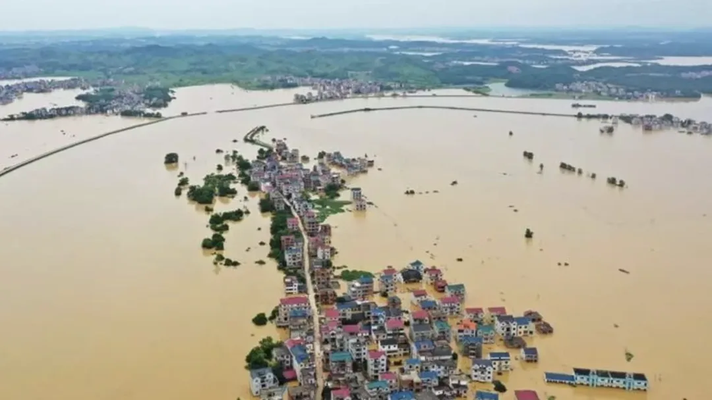

这图不是我的，随便网上扣了一张鄱阳湖的新闻图。

在整个西北游历的过程中，一个非常深刻的感受就是，气候真的发生了巨大的变化。去年在路上看到各种反常现象，听到不少消息，知道今年会有大洪水，三月份水利部也发警告算是官宣确认了。

以我自己的见闻为例，可可西里在大多数人心中应该是一望无际的大草原，草原嘛，说明降水量相对较少。不过我去的时候，整个高原都成了一滩烂泥塘。（这么说好像有点不太客观，因为这个“烂泥塘”远看还是挺漂亮的）

不过很多东西都是可远观不可近看。

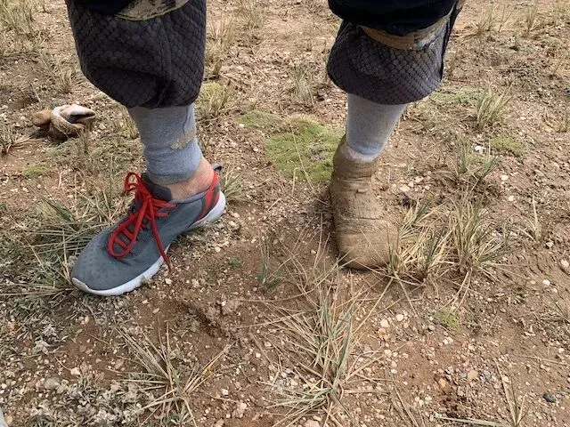

要是蜻蜓点水的轻功不过关，一脚下去就变泥足巨人了

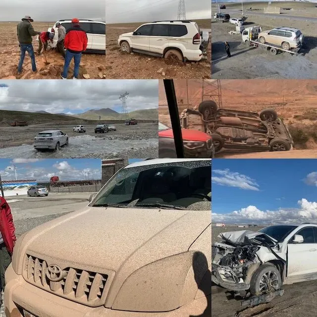

青藏公路路途凶险，随便都能看到翻车撞烂的。即使是老司机+丰田霸道，在这种地方也折戟了两次，让我坐了两次拖车回格尔木……

我去的时候正好是 8 月底，连着几天都是雷雨阴云。中科院的朋友说青藏高原确实是显著变暖变湿了。最近一年可可西里核心区五道梁的降水量达到 60 年来的峰值。再加上气候变暖，冰川冻土融化，高原水塔是蓄了满满的水。就待夏天奔涌而下了。

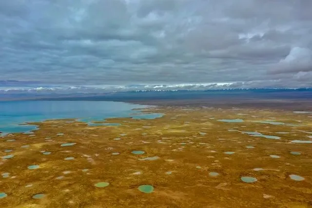

星罗棋布的小水泡子

前几天看到一篇文章，讲高原湖泊侵蚀基建的事情。当时我就在那个湖现场，看他们在施工挖涵道，加固两岸以免溯源侵蚀。不管的话基本青藏公路和青藏铁路就冲断了。施工队的人说明年水肯定小不了。现在看真的是一语成谶。

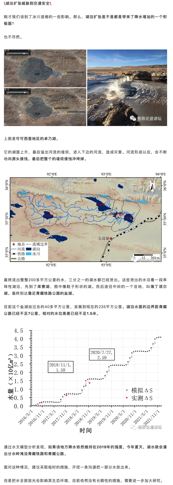

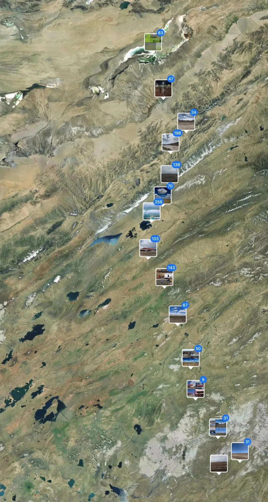

沿着青藏公路考察

因为气温升高冻土融化，青藏公路变得跟面条一样扭曲，上面充满着裂纹和补丁。在这种路上开车真的是很刺激的体验，跟蹦蹦车一样。即使是老司机，也有可能阴沟里翻车。

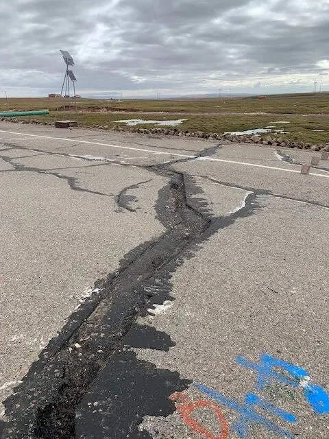

因为冻土融化与冻结，导致路面变成了马赛克艺术。

另一件比较有趣的事是，在故乡之一酒泉，鸟不拉屎的大戈壁滩上，竟然碰到了“洪水”。

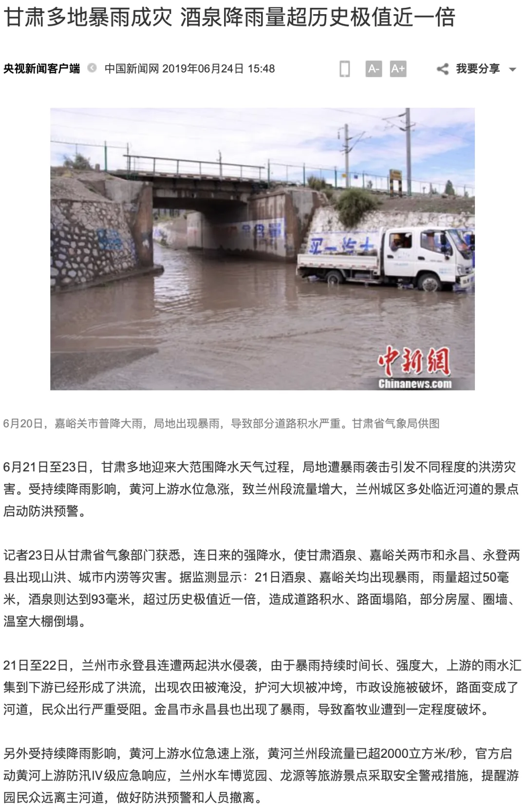

在临夏河州，也正好赶上了难得的刘家峡水库开闸泄洪，当时说是黄河水量比去年多了 50%，50 年来最大值。相当壮观。

[嵌入媒体](https://mp.weixin.qq.com/mp/readtemplate?t=pages/video_player_tmpl&action=mpvideo&auto=0&vid=wxv_1428524877849673728)

黄河之水天上来，奔流到海不复回。

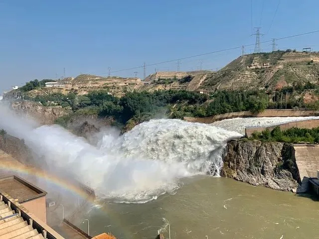

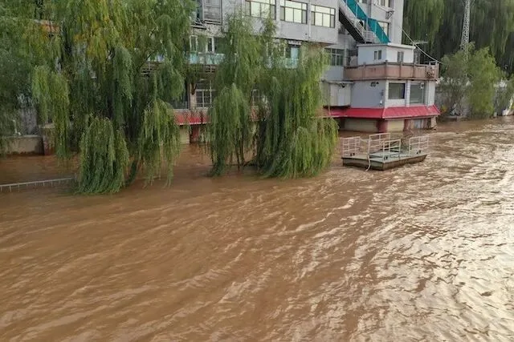

前年的兰州公园

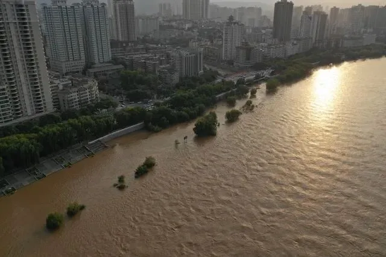

兰州的黄河水也不小啊，大水漫灌，不过这个是 2018 年路过的时候拍的。

其他气候反常的现象包括，在年均降水量几毫米到十几毫米的塔克拉玛干沙漠边缘，竟然好巧不巧还碰上两次下雨。在腾格里沙漠里，竟然看到了大片大片的植物

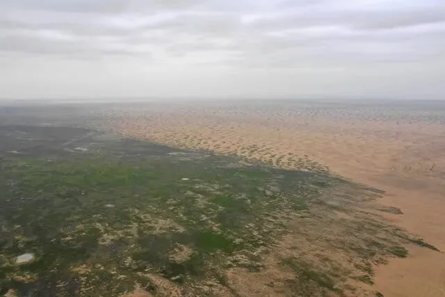

腾格里沙漠，民勤县，注意这不是沙漠的边界。

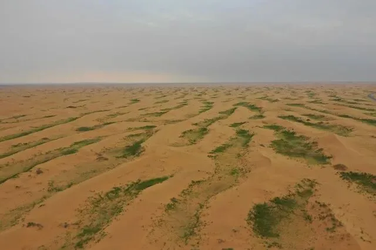

像这种沙漠草，都是飞机撒草籽长出来的。不过以前也撒也种树，但是降水量不够再怎么种都活不了。所以不少沙漠绿化项目给自己脸上贴金，其实还是老天爷赏饭吃。\

在前往红其拉甫的中巴友谊公路上，有一段路基都差点被水淹没。应该都是冰川融化流下来的。

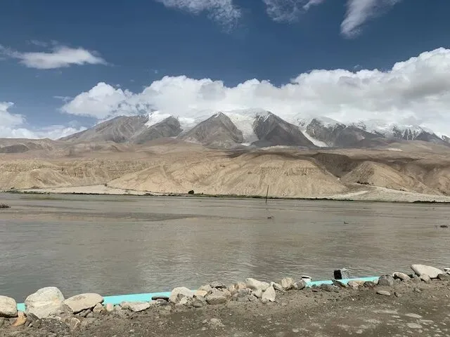

夏日消融，江河横溢，人或为鱼鳖。

在拉萨，当地人告诉我，最近青藏高原雨下的太多，把布达拉宫墙上牛奶藏红花做的颜料都冲花了。

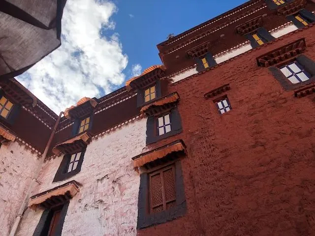

大师，布达拉宫掉色了……

旅游的时候，天气永远是一个安全的话题。许多人与我分享了最近的气候变化，我也亲眼目睹了无数的证据。全球变暖确实从一个理论上的概念变成了一个会对整个人类产生巨大影响的棘手问题。如果全球变暖继续下去，那洪水估计只能是一年更比一年大了，沿海地区的地块也够呛。

气候变化确实是未来人类将面临的最大挑战，发达国家很多人都在关注这一点并不懈努力，不过全球气候对于这个世界上的绝大多数人来说可能都远远算不上需要操心的问题。可惜的是，在这个逐渐崩裂倒退的世界中一切已为时已晚，我是看不到有什么希望能改变这一点了。都说我死后哪管洪水滔天，人生最惨的一点就是，我还没死呢，洪水就滔天了，这可真是一个悲伤的故事。

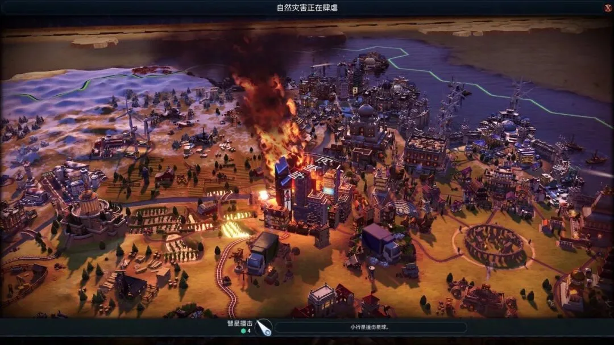

站在上帝视角上，这在某种意义上也算是自然的负反馈调节机制了。其实道理和病毒差不多：病毒如果疯狂繁殖，消耗宿主资源，破坏宿主体内稳态环境，如果它没能在吸干老宿主前找到新的宿主，那么最后的结果当然是与宿主同归于尽了。相反，比较“成功”的病毒，就会以一种比较温和的方式与宿主共生，甚至还有益于宿主，比如噬菌体。

这里成功的定义就是按生命的最本质特征 —— 信息复制来说的。类比人类就是，人类要想开枝散叶，征战寰宇八方星辰大海，那首先最重要的一点就是别把自己搞死了。不过，我对整个人类的未来还是比较乐观的，有生之年应该还是可以看见极少数人类走出地球的。只不过在演化意义上讲，也许就是 5% 的人类继承 99% 的未来了。

另外说大洪水，大洪水的英文是 cataclysm，这个词本身可以泛指一切巨大而激烈的灾难性变动，特别是也经常用于社会秩序领域。在这种语境下的大洪水，第一个让我联想到的人就是张献忠。正好看到这几天某地在“纪念民族英雄张献忠”，这种妖操作实在让人瞠目结舌。本来计划是第三十三篇张献忠屠蜀记里说一说，不过有空的话，下一篇番外游记，就与大伙聊一聊大洪水与张献忠。

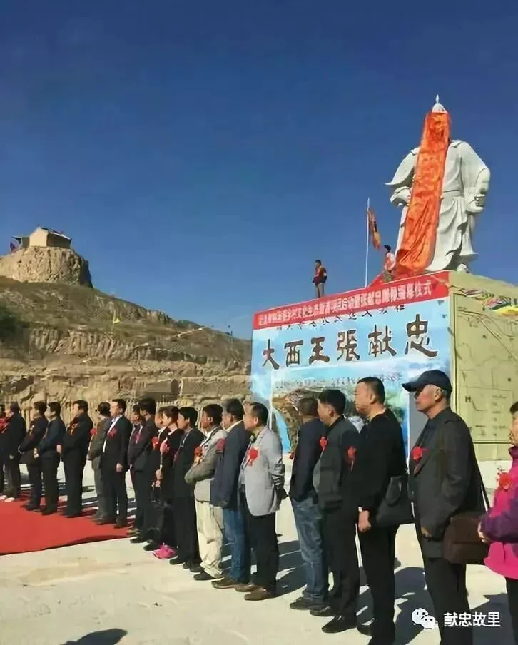

---

发布版本：[微信公众号](https://mp.weixin.qq.com/s/ybjWls9ggRlgTYBKsFLmoA)
