旅途的下一站，就是河西走廊，也是我的故乡，我人生最初的十二年就在这里度过。

大戈壁的血色落日，沙漠绿洲的清冽夜空，弱水河畔的金胡杨，祁连山阴的绿草场。这些是故乡给我留下的最美好的印象。

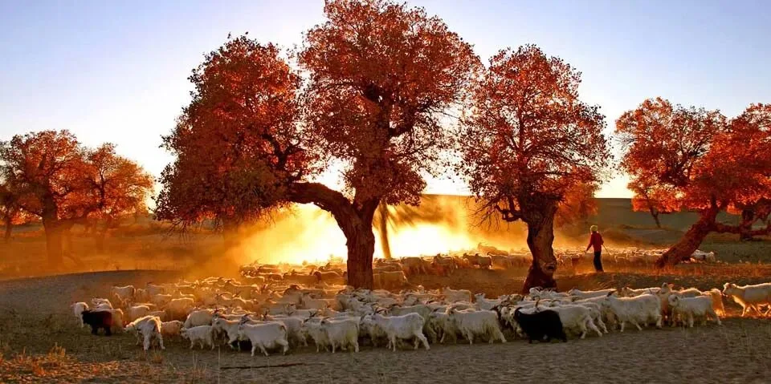

## 《秋牧》

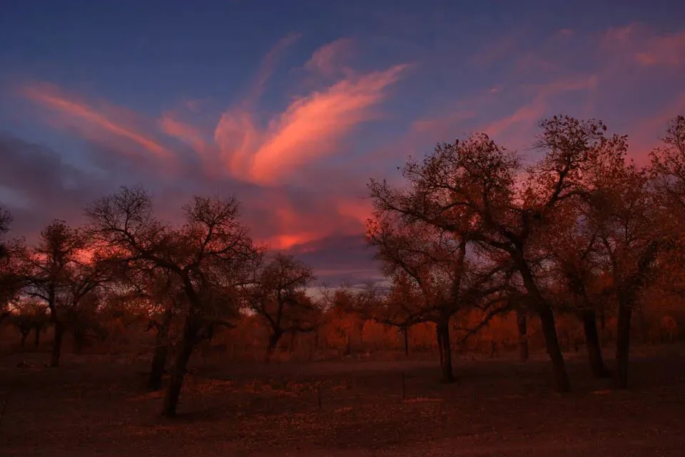

《火凤凰》，有几张照片不是我拍的，但盗亲爹的图算盗图吗？

可惜在那十二年间，我的活动范围也仅局限于酒泉卫星发射中心周边 —— 酒泉市区，嘉峪关，额济纳旗，去敦煌和居延海玩就已经算出远门了。对河西走廊的其他地方也并不熟悉，因此这次必须得弥补遗憾，好好去看一下河西走廊的其他地方。

《激情燃烧》 —— 胡杨生而千年不死，死后千年不倒，倒后千年不烂

### 河西走廊

河西走廊东起乌鞘岭，西至玉门关，南侧为青藏高原，北侧为蒙古高原。因为地处黄河以西，又夹在两个高原中间，形若一条狭长的走廊，因此得名河西走廊。

乌鞘岭是中国季风区与非季风区边界的一部分，来自海洋的水汽止步于此。因此河西走廊本应属于干旱区，好在河西走廊南边还有个祁连山，祁连山融雪化成的河流在这片本应是沙漠戈壁的土地上滋养出了肥美的草原与绿洲。

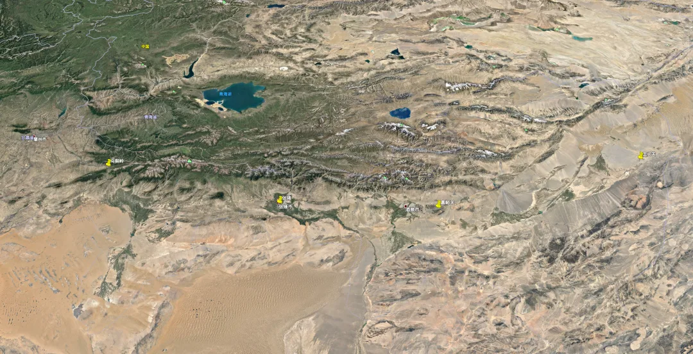

图为从蒙古高原方向望向祁连山。\

河西走廊，是一个空旷而孤寂，热烈而深沉的地方。在这里沉睡着着的，是古典华夏的荣耀与辉煌。张骞出使西域，霍去病横扫匈奴，在这里留下了传颂千年的故事。

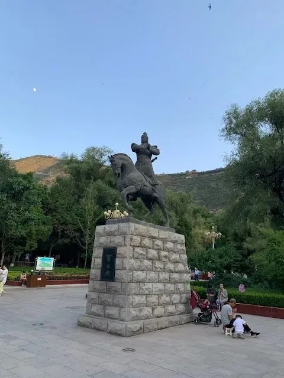

《霍去病雕像》—— 兰州五泉山公园。说起来，兰州虽是甘肃省会，因在乌鞘岭东侧，却并不属于河西走廊。这符合“山川形便，犬牙交错”的行政区划防割据原则。

河西走廊本来是月氏人的地盘，然而月氏被匈奴人打跑到了现在阿富汗乌兹别克斯坦那块去了。这块水草肥美，战略咽喉就被匈奴占了。后来汉武帝西征，又把匈奴打跑了。并在此设立河西四郡：武威（凉州），张掖（甘州），酒泉（肃州），敦煌（沙洲）。

《祁连山下》—— 天空宛如湖面一般清澈

河西走廊是中原连接西域和内亚的交通孔道，在大航海时代以前，这里就是陆地上的马六甲海峡。文明技术思想在此交流碰撞，是华夏对外联系的重要纽带，也是技术传播的输液管。

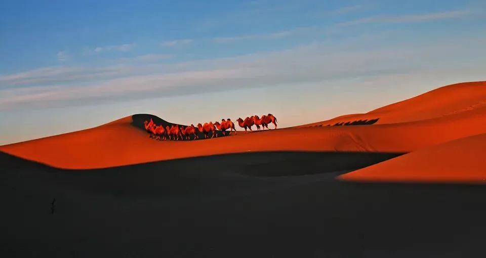

《瀚海行舟》—— 沙漠骆驼

不过，随着海运兴起以及世界文明重心的西移，河西走廊的重要性也有所下降。更实际一点的说法是，甘肃真是太穷了，人均 GDP 和居民收入都是全国倒数第一，整个省 GDP 加起来还没一个二线城市多（参考数据，2019 年甘肃省 0.87 亿，浙江宁波 1.2 万亿），这真的是个悲伤的故事。不过，如果后面搞内循环，这条丝绸之路内亚通道估计还有机会焕发第二春。

河西走廊上有三个主要的城市：金张掖，银武威，玉酒泉。至于敦煌，虽然属于河西四郡，名气也很大，但现在实际上是酒泉下辖的一个县级市，酒泉跟敦煌的关系与金华跟义乌的关系差不多。

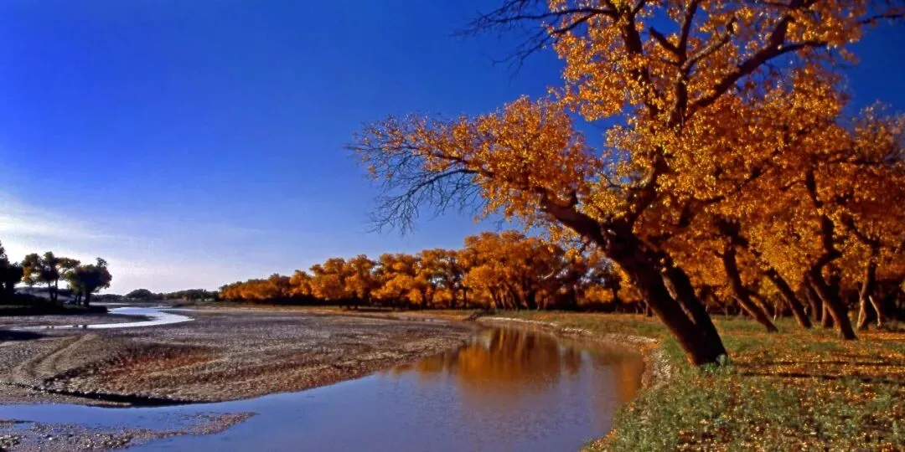

《胡杨河畔》 —— 弱水三千，只取一瓢饮

有水的地方才有城市，河西走廊的主要城市都在祁连山融雪河畔。武威有石羊河，张掖有黑河，酒泉有北大河。北大河与黑河汇合后，就成了著名的“弱水”，全国唯一的载人卫星发射中心 —— 酒泉卫星发射中心就在弱水河畔。BUT，16 年新修了个文昌发射中心，也可以打载人飞船，这个地位就不再是独一无二的了，甚是遗憾。

## 武威

虽然我很想吹一把“武功军威”，但武威这个城市，给我的第一印象其实挺不好的。

一般来说，宣传的原则都是缺啥补啥。如果某个地方电线杆上贴着不要打架，不要种植罂粟的劝诫通告，根据经验法则，你懂的。

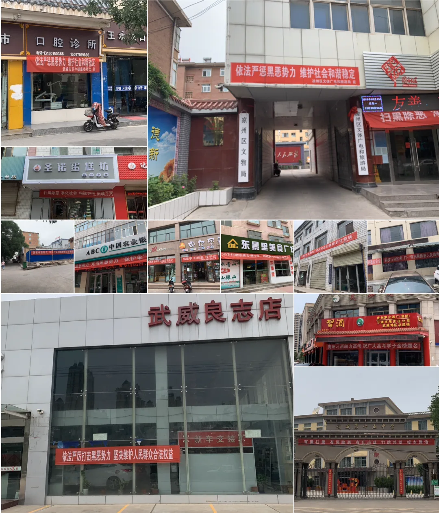

《打黑除恶》—— 武威市各单位宣\

在武威，我骑着自行车绕着整个城区转了一圈，全程毛估估见到了能有上千个“打黑除恶”的标语，随便找个点环视，都能看到十几个红条幅，这种宣传阵势，其他城市我是没见过的。按照缺啥补啥的原则，岂不是黑恶势力已经无孔不入啦？真是让人瘆得慌。

武威市区的景点，主要是雷台汉墓和鸠摩罗什塔。

雷台汉墓，就是挖出铜奔马的地方，铜奔马俗称“马踏飞燕”，是中国旅游的 Logo。

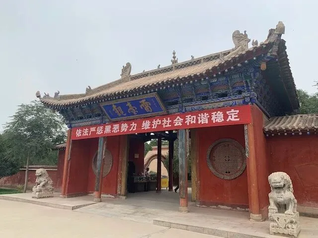

《雷台》—— 在古寺上挂这个真的大丈夫？

不过这个东西被甘肃省博物馆薅走了，遍地的标语也让甚是扫兴。

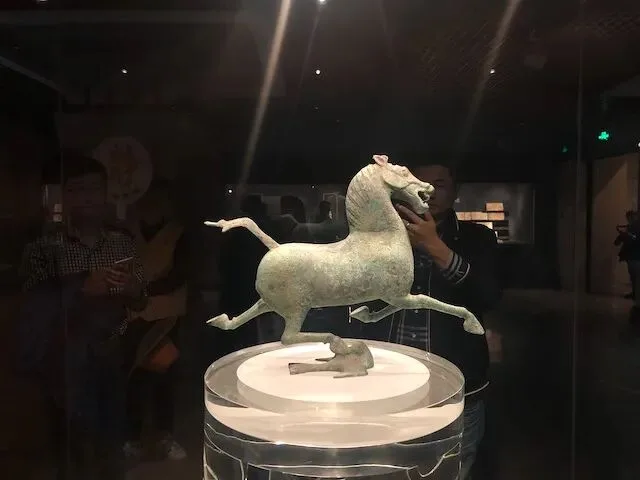

《铜奔马》—— 现藏于甘肃省博，武威最有名的宝贝就这么被薅走啦。

鸠摩罗什寺是很有名的，为纪念西域高僧鸠摩罗什在武威弘扬佛法、翻译经典的功绩而建造的，不过这个景点被一圈铁皮墙围着，只能远远看个尖儿。

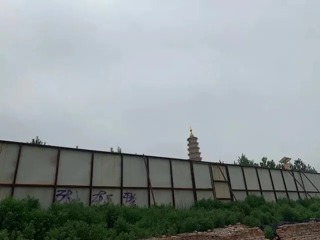

《鸠摩罗什寺（远观）》—— 你们这样搞旅游是不行的……

总的来说，我对武威市区还是挺失望的，实在是没法把历史上那个繁荣兴盛的凉州首府与眼前这个有点土了吧唧的地方联系起来。

不过武威市区虽然没啥意思，但武威辖区里还是有不少有意思的地方的。河西走廊的一端，著名的乌鞘岭就在这里。乌鞘岭是河西走廊和陇中高原的分界线，这个名字来自突厥语，和尚岭的意思。开车从兰州过来，会经过著名的乌鞘岭特长隧道。

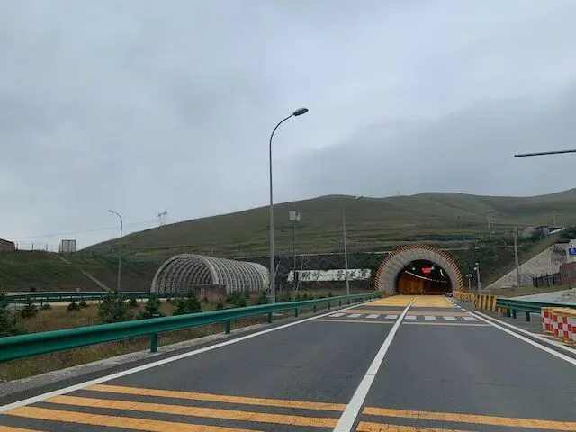

《乌鞘岭特长隧道》

这个特长隧道有多长呢？总共有四十多公里，穿山而过，开车要半个多小时，还是挺压抑的。在这种隧道里要是出个事故那可真是乐子大了。

乌鞘岭的火车隧道要短一些，20 公里。09 年的时候新军从这里出关曾出过一起事故。有个机车在隧道里烧了，1700 多旅客徒步从隧道走里出来。

说起来，兰新高铁和原来的兰新铁路还有点区别，原来的一条走乌鞘岭，而新高铁绕开了这里，绕行西宁避开了武威乌鞘岭直接穿到了张掖。隐隐觉得还是有微妙的联系的。

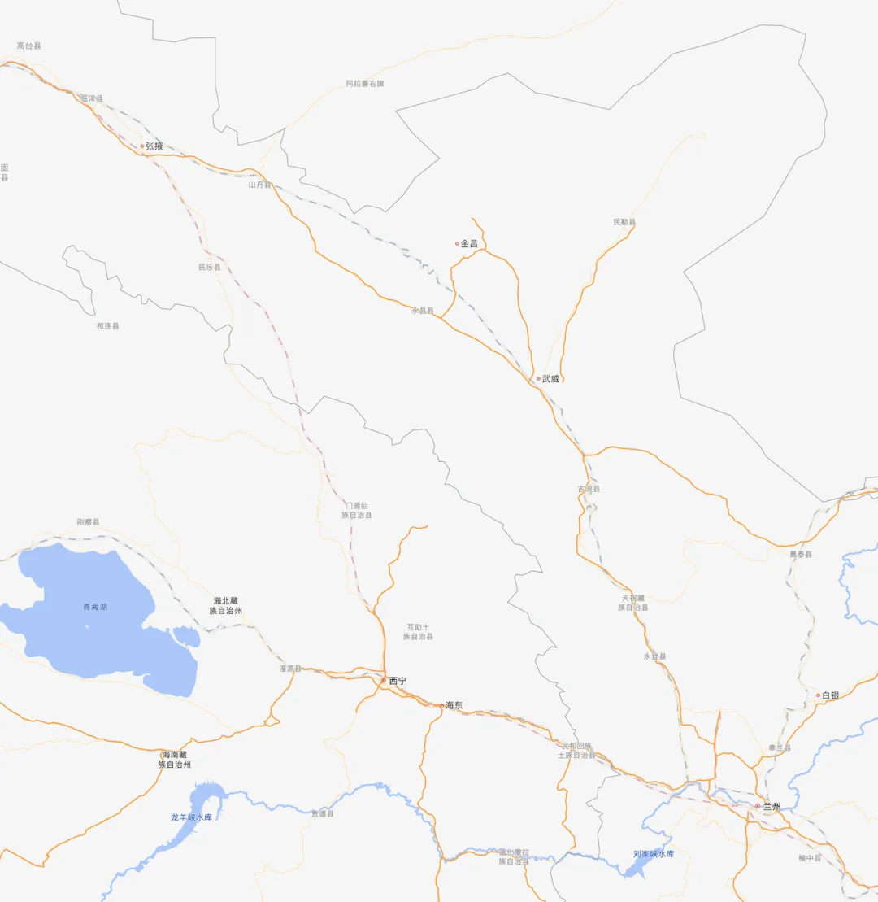

《兰新高铁与兰新铁路》在乌鞘岭这里分叉了。

武威的另一个人我感兴趣的地方是民勤县大沙漠，就是蚂蚁森林种梭梭树的那个沙漠。为什么我会对这种鸟不拉屎的地方感兴趣，纯粹是因为有人说这里在沙漠中央修了个超级 XXX，本着不作不死来都来了的心态，我特意开车过去拜访了一下，后来发现是个闲置的奶牛场。为什么在这种鸟不拉屎的大漠深处修奶牛场，我也不知道，估计和独山县的水司楼原理差不多吧。

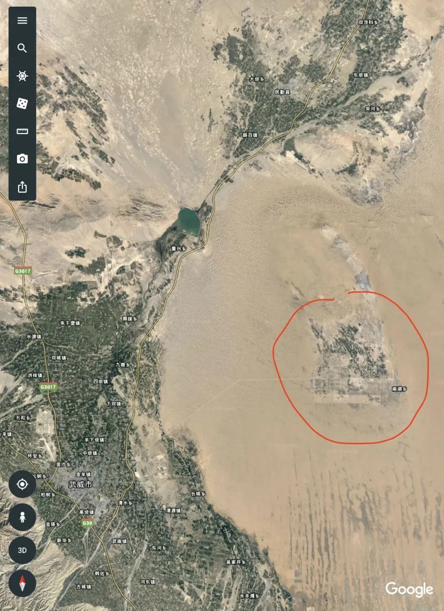

《大沙漠中间的养牛场》

从武威民勤县穿过大沙漠，就可以到内蒙阿拉善盟，

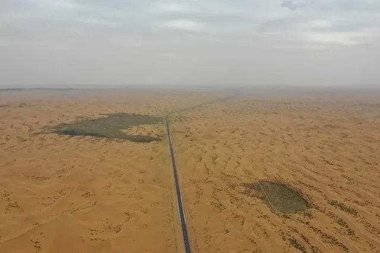

《阿拉善沙漠公路》

路上你一定不会错过无数巨大的路牌——“阿拉善英雄会”，香艳的沙漠海天盛筵，真是会玩啊。不过，那是另一段旅程的故事了。\

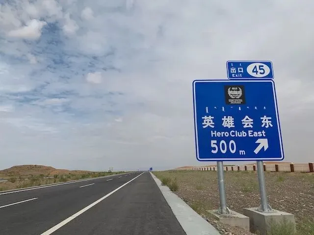

《英雄会路牌》。说起来我有个疑惑，路牌上可以画这种定制的 Logo 吗？从没在别的地方见过。

## 张掖

比起“银武威”，“金张掖”倒是给我留下了非常好的印象。

张掖这个名字取自“张国臂掖，以通西域”，相当大气。不过转念一想这名字翻译成白话就是大汉掏咯吱窝，黑河和祁连山的突起就像腋毛一样，感觉气氛又有点微妙了。

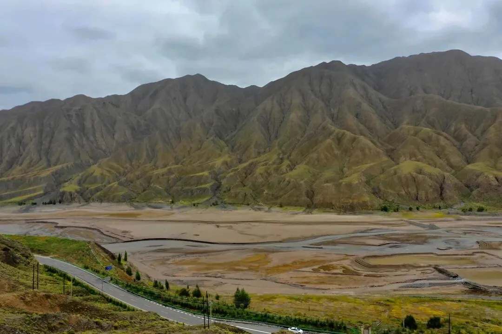

《张国臂掖》—— 祁连山脚

说起张掖，就让人想到丹霞。《文明 6》中张掖丹霞是一个占 3 个单元格的山脉自然奇观，纳入领土后每回合提供 2 点大将军点数和 2 点大商人点数，倒是相当贴合河西走廊的历史。

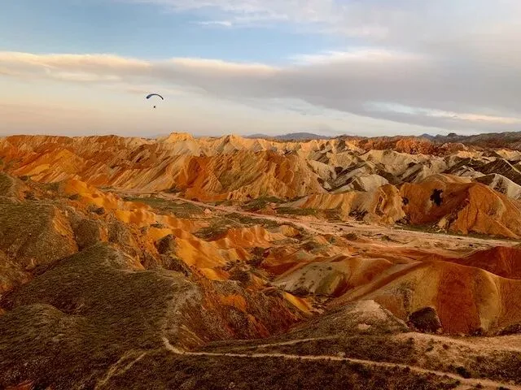

《张掖七彩丹霞》  —— 现场比照片美多了

张掖有两种丹霞，七彩丹霞和冰沟丹霞。不过还是七彩丹霞比较出名，冰沟丹霞其实你在外面的国道边也能看个七七八八。

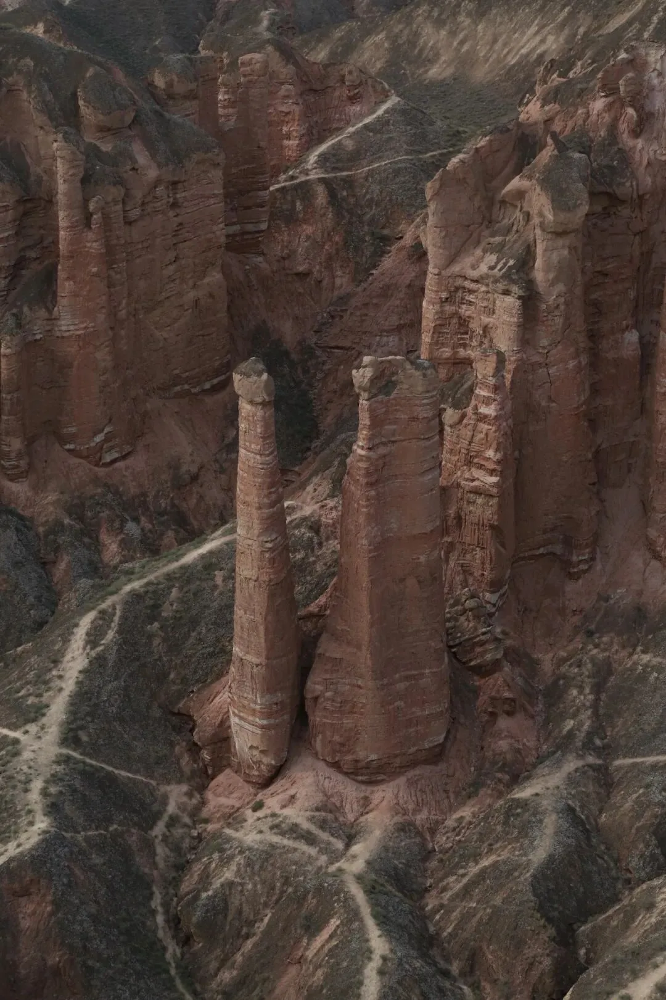

《张掖冰沟丹霞》—— 像这种形状清奇的丹霞国道边上还是没有的…

七彩丹霞这儿有个热气球和滑翔飞机项目，感觉很爽的样子，不过体重超过 90 公斤的人是不能坐的，残念……

[嵌入媒体](https://mp.weixin.qq.com/mp/readtemplate?t=pages/video_player_tmpl&action=mpvideo&auto=0&vid=wxv_1440100986651262976)

《张掖丹霞延时》 —— 朝晖夕阴，气象万千

张掖的另一个知名去处就是焉支山下的山丹军马场了。据说是世界上最大也是最古老的军马场。这里产🐴，匈奴有这里的马时，压着汉朝打。但是后来被霍去病击败赶走了，发出了“失我祁连山，使我六畜不蕃息；失我焉支山，使我嫁妇无颜色”的悲鸣。不过后来西夏占有这里时，骑兵也是打的宋朝嗷嗷叫。

从张掖或者酒泉翻过祁连山，就到了裕固族的地盘儿，全国独此一家。裕固族（Yughur）和维族（Uygur）其实是同源的，回鹘汗国分裂的时候，跑到新疆吐鲁番的就成了高昌回鹘，最后成了维族。留在甘肃的就成了甘州回鹘，最后成了裕固族，其实看名字的发音就大概能猜出来了。

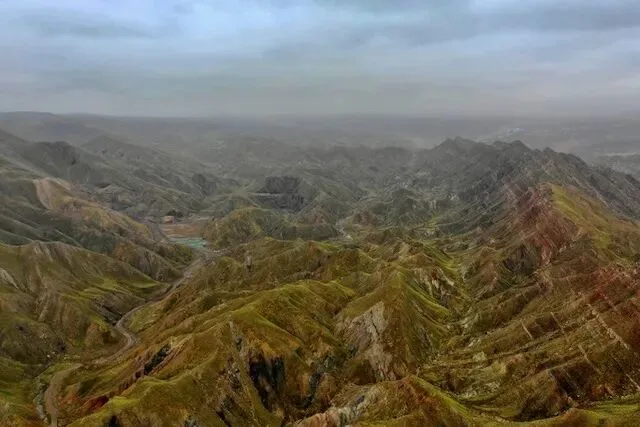

《祁连山的另一侧》 —— 走廊之所以称之为走廊，就是因为两边山路确实不是人走的。这里的山也有点丹霞的意思，没景区的好看就是了。

离开张掖的路上，会路过高台县，高台县明水乡明水村。这个地名纯粹是一本书里介绍的，既然路过我就顺便去看了一眼。

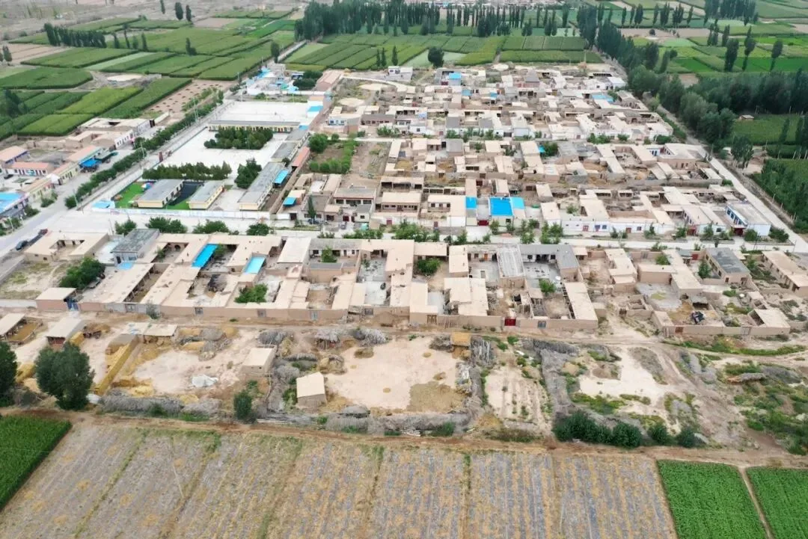

《明水乡纪事》—— 村庄掠影

像这种旁边就是铁路和高铁，甚至还有车站的村子，其实真的还是算不错了。总理说的六亿年收入不到千元的人口，大抵生活在比这还烂的地方。在这种不是太偏的基层稍微看两眼，非常有助于清醒头脑。

说起来高台县，这里还有个红四军纪念碑，这个真的是纯属路过时偶然发现的。当年在这个山谷里，大体上发生的就是这个碑上的内容，非常惨烈。

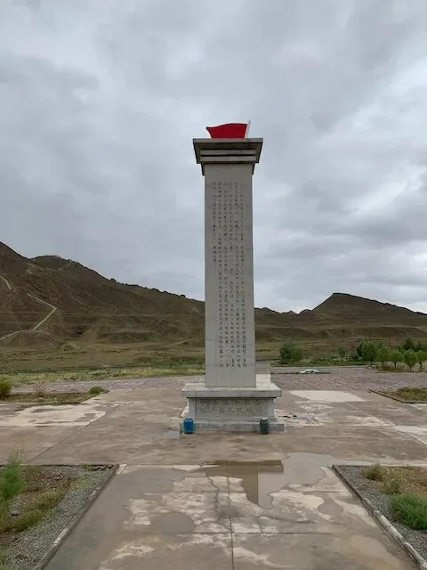

红四军全军覆灭这件事一直是党史研究的敏感地带，争议非常非常大，水太深，不展开，自行了解。

离开张掖，就到了河西走廊的最后一个（地级）城市——酒泉，酒泉我就单列一篇，下次再说啦。

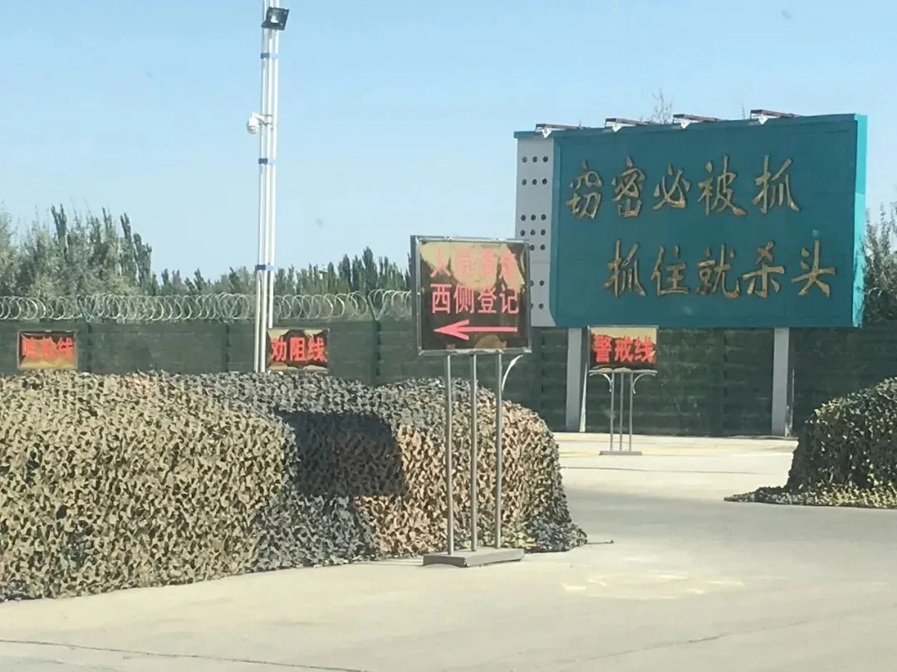

《酒泉（卫星发射中心）欢迎您~》，这块招牌估计每个去基地的人都会印象深刻吧。

---

发布版本：[微信公众号](https://mp.weixin.qq.com/s/wGKCpbzxWO1K2IIlTpMakw)
