雪峰映碧波，林深藏野鹿。溪声穿古道，日落彩云多。

在温哥华参加完 [PostgreSQL Conf.Dev](/pg/pgcondev-2024/) 后，我想在加拿大游览一番。朋友推荐我去班夫国家公园转一转。班夫果然名不虚传，其中美景让我留恋往返，沉浸其中，以至于本号也连着十几天都没更新啦。

班夫是加拿大最古老的国家公园(Since 1885)，也是世界上第二个国家公园（第一个是美国的黄石 @ 1879），属于联合国世界自然遗产。有着非常独到的管理模式 —— 被视作自然保护与旅游业共存的典范。

---

整个班夫之旅总共花费 7 天 6 晚，覆盖了贾斯帕，班夫，幽鹤，库特尼四个国家公园。从温哥华出发单人自驾，往返路上各占一个白天，所以实际在国家公园里是五天五晚的时间。

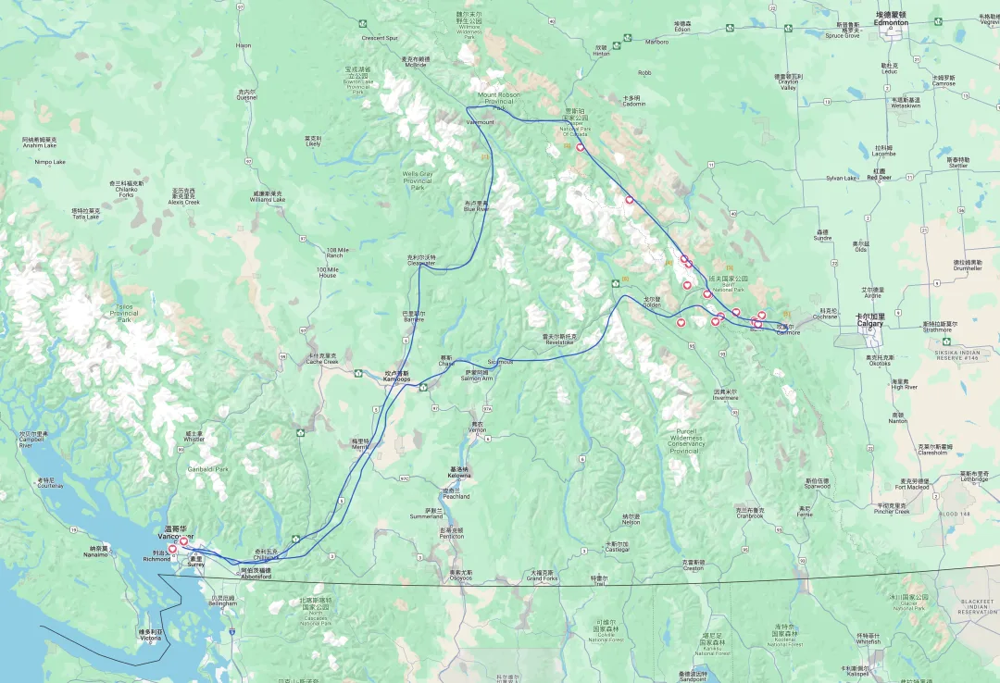

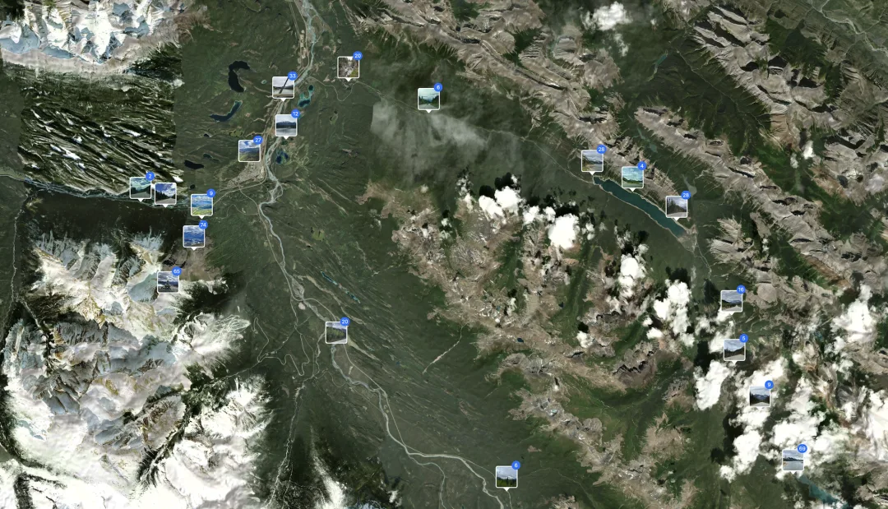

今天呢，就来聊一聊旅程的上半段，Jasper 国家公园，下半段班夫就留给下一篇来说啦。

---

## Day 1 前往落基山脉

第一天上午，做了些准备工作，在温哥华本地超市买了点吃的装车，中午 12:00 出发。进入落基山脉后，路上的风景非常不错，车也越来越少。路况很好，不过很多路段没有信号。

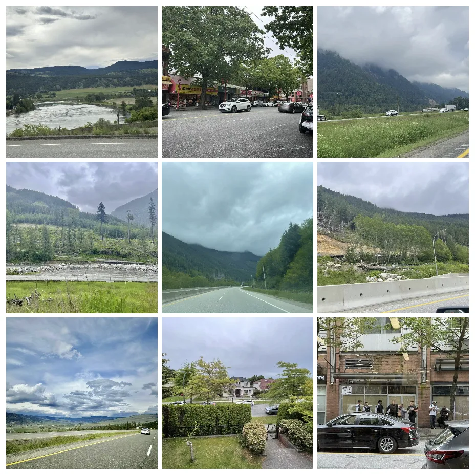

加拿大这边路上没有那些拍超速红灯压线的摄像头，所以相对自由一些，我就定速巡航自动跟车道设置在限速 + 10% 以内开。

大约开了 600 多公里，本来想一步到位开到 Jasper 小镇，果然还是上了年纪不比当年，路上就开始犯困了。于是在刚过 BlueRiver 的山野里找了个露营小木屋住。

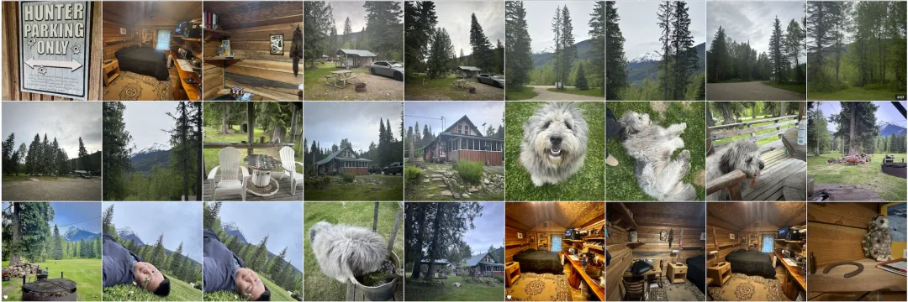

小木屋只要 66 刀，在当地算很便宜的了，但入住体验吊打温村四百刀的酒店。雪山松林，溪水潺潺，鸟语花香，营地有两条硕大无朋的狗看门赶熊。老板是个老太太，跟我说我是两年来的第一位客人，非常热情。

住的屋子跟美剧里那种猎人小屋一模一样！屋里还有子弹壳，马蹄铁之类的东西。还有一本入住客人写的日记，我正好写上最后一页，上一位留言的客人还是 2023 年 1 月，看来老板也许所言非虚。

---

## Day 2 贾斯帕走马观花

第二天起来，开车进入 Jasper 国家公园，早上这条路没有什么车子，也没有什么游客。整个国家公园区域的门票是通用的，每人每天 11 加币。买完贴车玻璃上就可以了。

一路上和太平洋铁路沿着并行前进，几公里长的火车横亘在山间，是在是非常壮观。在路上可以看见非常壮观的 Robson 山，这也是一个省级公园。

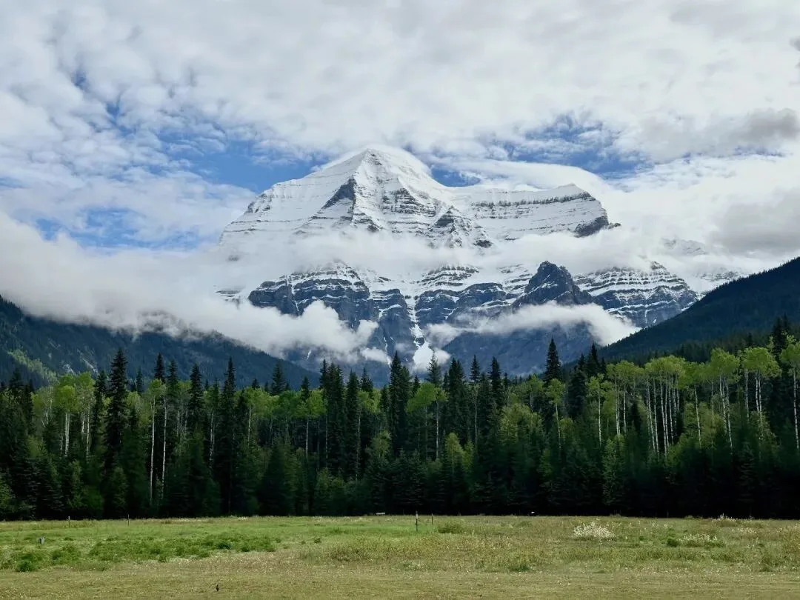

过了  Robson 山之后，可以看到一个著名的湖：麋鹿湖。过了这里，就要离开 BC 省，进入 AB 省了。\

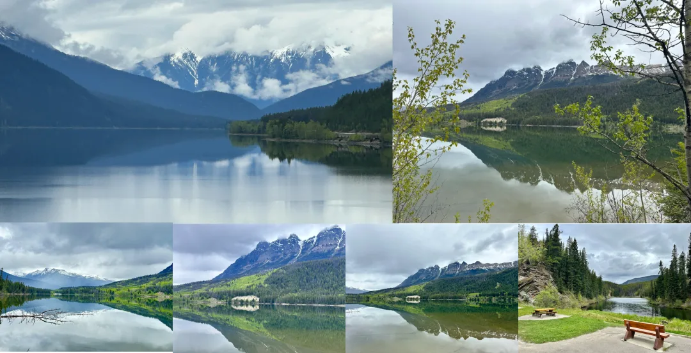

开到贾斯帕小镇的第一站，我去做了 SkyTram 天空缆车，非常推荐，缆车会给你拉到海拔 2263m 的地方，然后你可以自己继续走个往返四公里，往上爬升 200 米到口哨山顶 2460m 的地方。

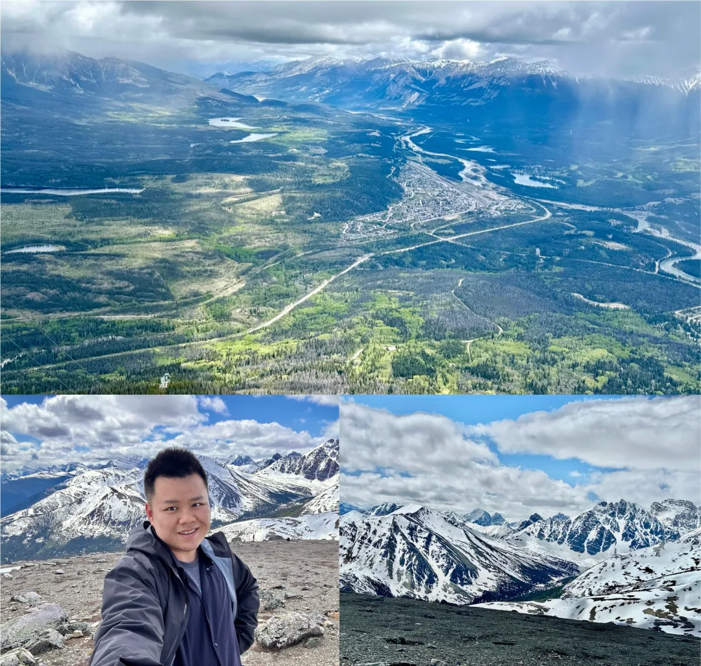

因为整个国家公园区域内禁止飞无人机，所以这种登高望远的景色是独一无二的。一望无际的雪山尽收眼底，俯瞰整个 Jasper 小镇，碧绿翠蓝如同宝石一般的湖泊，那种震撼人心的美，我觉得二维照片是很难表现出来的。

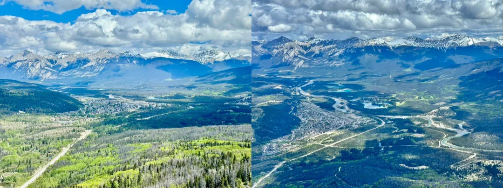

从山上下来，我首先就去了山顶上看到的那两个绝美的湖泊：Edith 湖，安妮湖，不过从山顶上看的颜色和湖边上看确实大不一样。

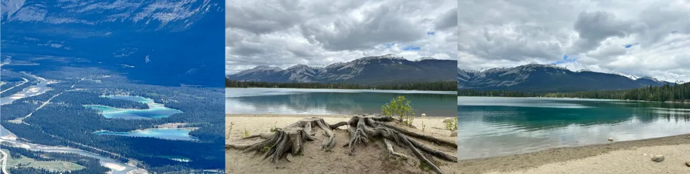

逛完这几个湖泊，准备驱车前往 Jasper 的招牌玛琳湖了。去玛琳湖是一条单线，贾斯帕小镇过去大概 50 公里，路上会经过两个著名的景点，巫药湖和玛琳峡谷。

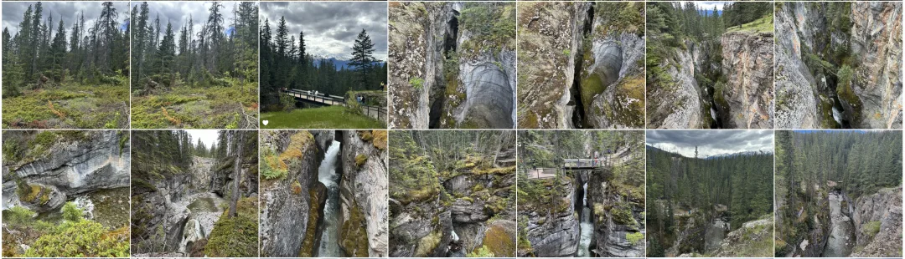

**玛琳峡谷**的环境很优美，这是一条徒步环线，也有很多游客。**巫药湖**的周围刚遭受过山火，所以山上都是灰突突的树干，确实挺像巫婆居住的环境。让人惊喜地是，这个湖里有白头鹰的巢穴，用望远镜看还能看见秃头鹰在湖上捕鱼，巢穴里有三只小鹰。

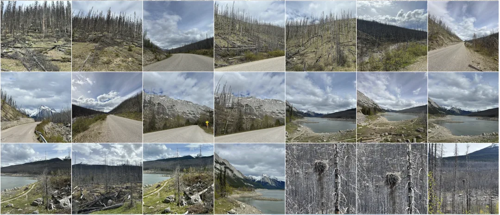

但其实最后的玛琳湖，因为天色比较阴，所以感觉并没有想象中那么惊艳，因此也就放弃了玛琳湖巡游的项目，而是在湖边兜兜转转绕了半圈。

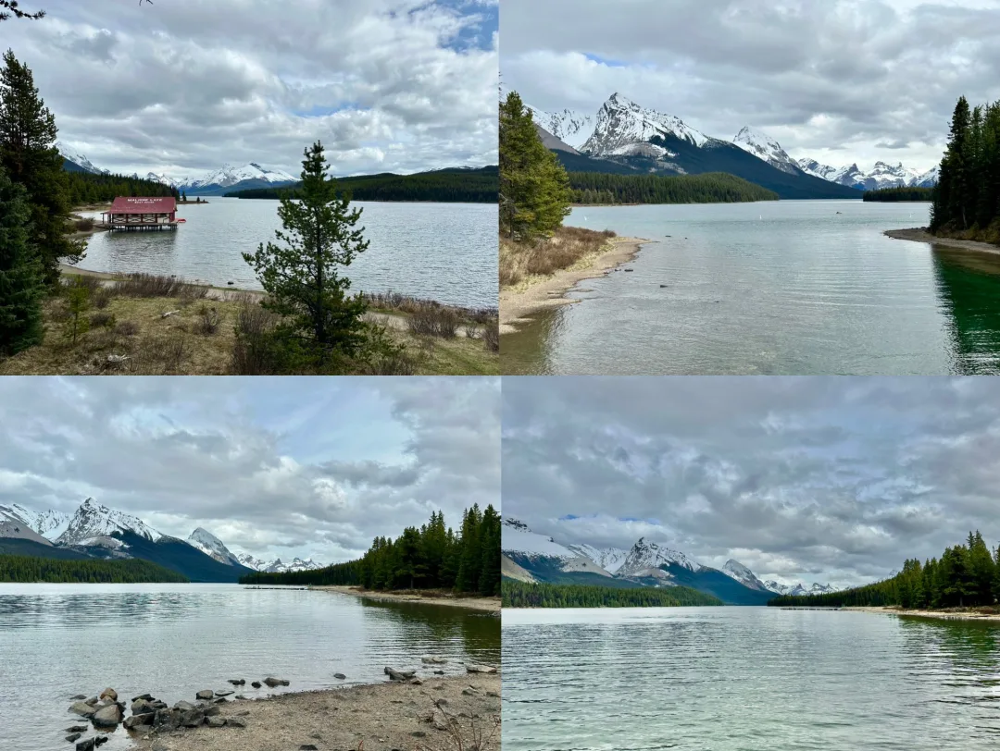

逛完玛琳湖，开车返途的路上，连着十来个小时的活动终于让我犯困了，必须扇自己大耳刮子，开窗吹凉风保持清醒。路上的景色，虽然不叫 “景点”，但也非常的美！

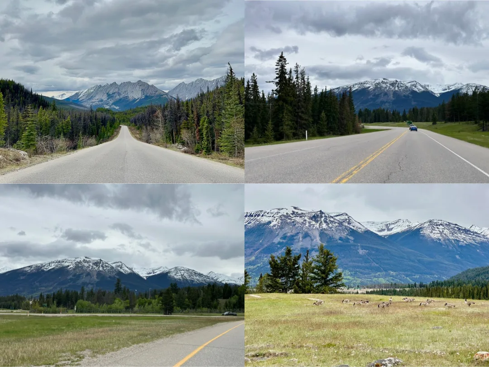

回到贾斯帕小镇上，我去 TripAdvisor 上推荐的加拿大本地餐馆品尝了特色菜 ——  ELK 肉排 （加拿大马鹿），我只能说这个味道还是不如牛排啊，60 加币感觉相当不值……

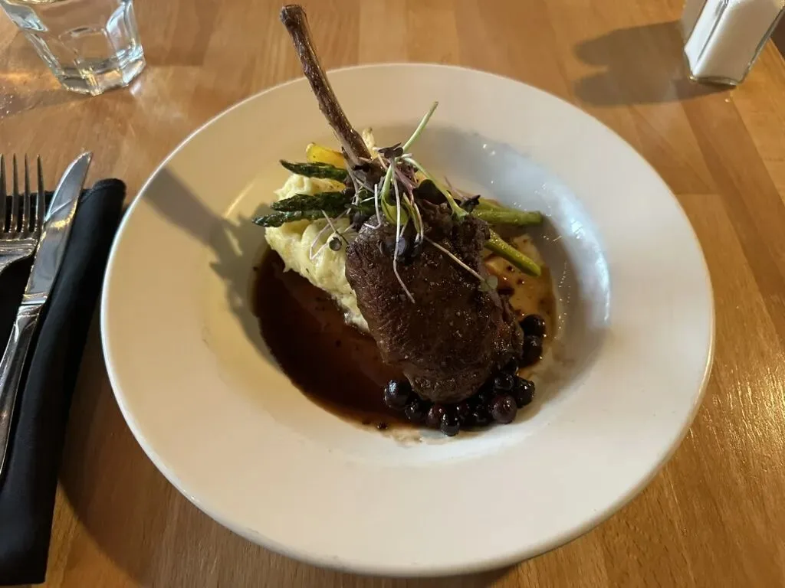

什么，你问我为什么一天可以逛这么多地方？我觉得有三个原因，第一是贾斯帕这边纬度和中国最北漠河差不多了（52N），所以夏天的日照时间极长，早上 4 点天就亮了，五点多日出，晚上 10 点天还微亮，一天能有 16 - 18 个小时的活动时间。

第二个原因是这里的国家公园没有国内那些山炮景区弄的接驳车之类的破玩意，景点基本上都在路旁，直接开车到那里一停，下车拍照都用不了半分钟，看够了拍拍屁股上车出发就行。最后第三个原因是这次媳妇没来，所以这次一个人特种兵式旅游，把白天的时间都填的满满当当了。

---

## Day 3 冰原公路与湖景

第三天大清早，找了家开门的 Tim Hortons 解决了早饭，就开车上路了。第一站是阿萨巴斯卡瀑布，瀑布与河流的颜色也让我想起了喀纳斯，新疆一带的风光。

当然要说最有趣的，是真的在路边亲眼看见一只野生的黑熊！整个班夫国家公园区域里有 250 只熊，所以遇见的概率还蛮大的。

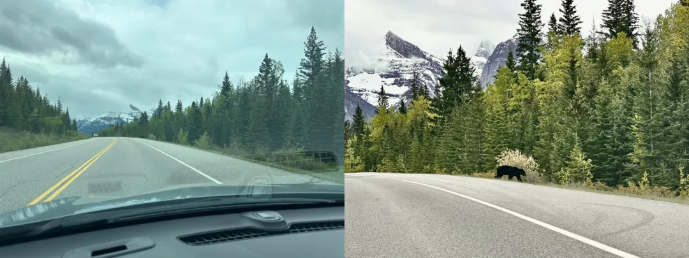

开了一百多公里，这一路上的风景非常优美 —— 从贾斯帕到班夫（露易丝湖）这一段公路，是世界十大最美公路之一。不过天公不作美，一路上都下着毛毛细雨。

早上十点，赶到了今天的主要目的地之一 —— 哥伦比亚冰原。据说冰原特大号的冰川，这里的 Ice Dome 是著名的三洋分水岭，向北的阿萨巴斯卡河流入北冰洋，西边流入太平洋，东边流入大西洋。

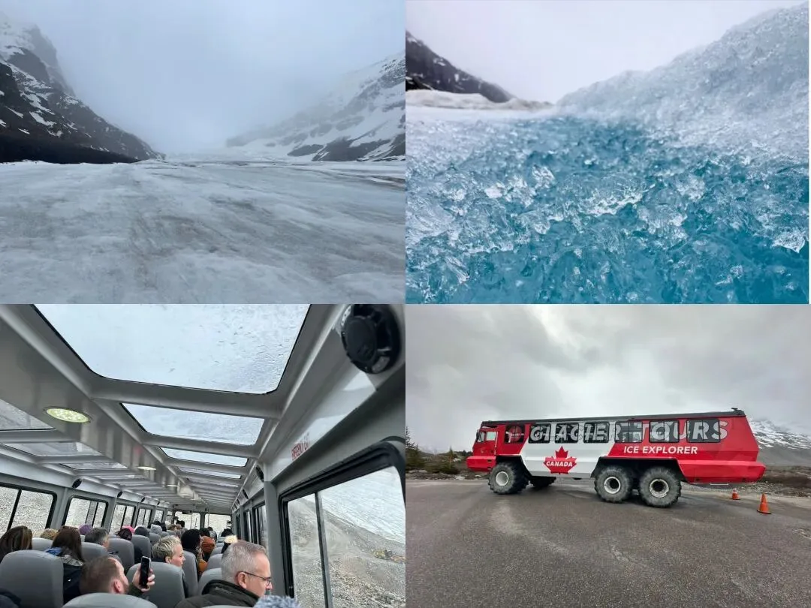

我们乘坐着这种号称世界上只有二十辆的天价冰川专用车，沿着冰川的 Lateral Moraine （侧碛），沿着一个极陡的坡上到了冰川上。冰川上的雨已经变成了雪雹，风霜泼面。这里的景色让我想起了[**徒步乌孙古道**](/trip/20201001-wusun/)**翻越达坂**时的感觉。

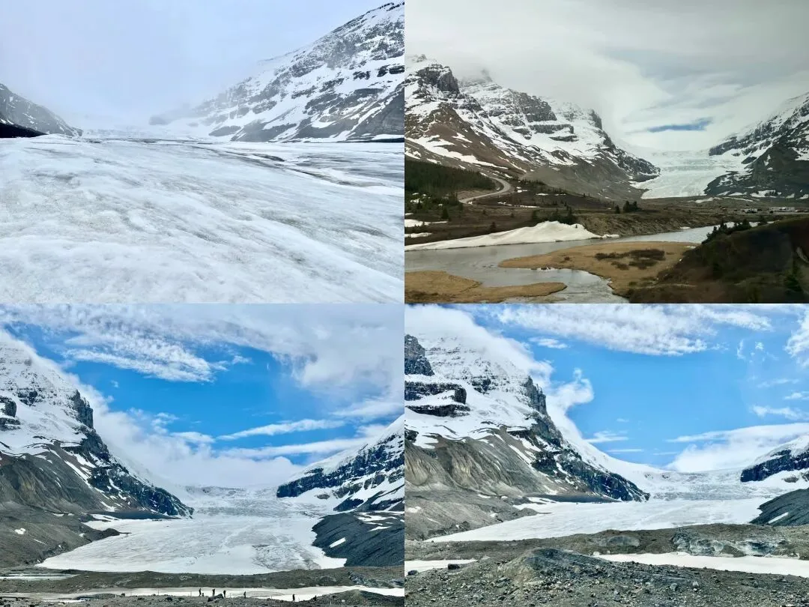

到了中午，不下雨了，天放晴之后，冰川才展现出它最美的一面来。我又沿着冰川脚下的山路，走到了冰川的脚下。曾经，这里的冰原填满了整个山谷 ——  山谷两边的侧碛刻下了冰川的印记，但随着气候变化，冰川也在逐渐消融，一路上的标牌会标记出，在 19xx/20xx 年时，冰川曾经延展在这里。而再过五十年，这里的冰川也许就不复存在了，让人嘘唏。

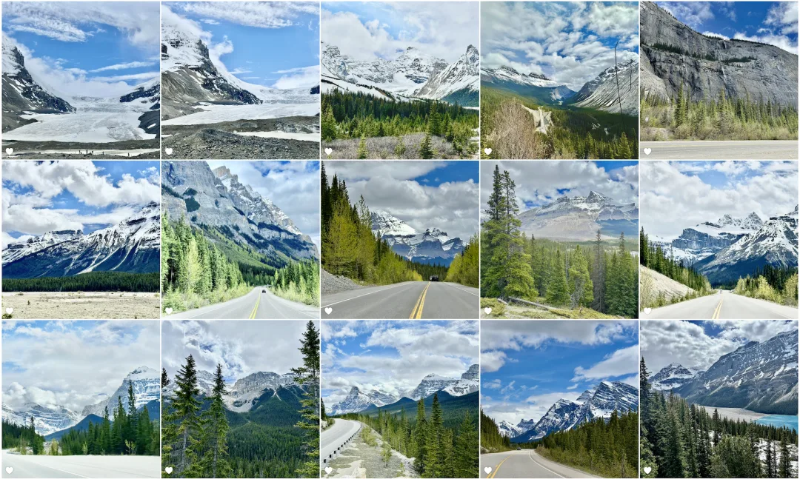

过了冰川之后的景色也非常值得一提，天晴后的冰川大道相比前一段有着更丰富的光影变化，一路上有许多美景。

过了哥伦比亚冰原的分水岭之后，河水的流向就调了个个。沿着河与路向南走，第一个知名的景点就是 Bow Lake，不幸地是，我去的时候弓湖还没有完全化冻。\

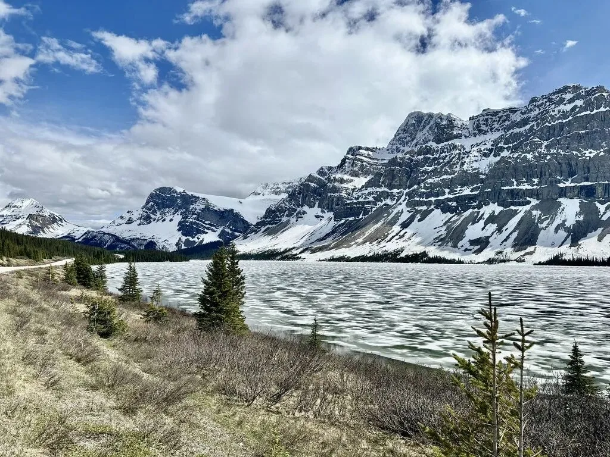

另一个湖，Peyto Lake 沛托湖 则要徒步走一公里山路，但确实不虚此行，湖的颜色非常惊艳。

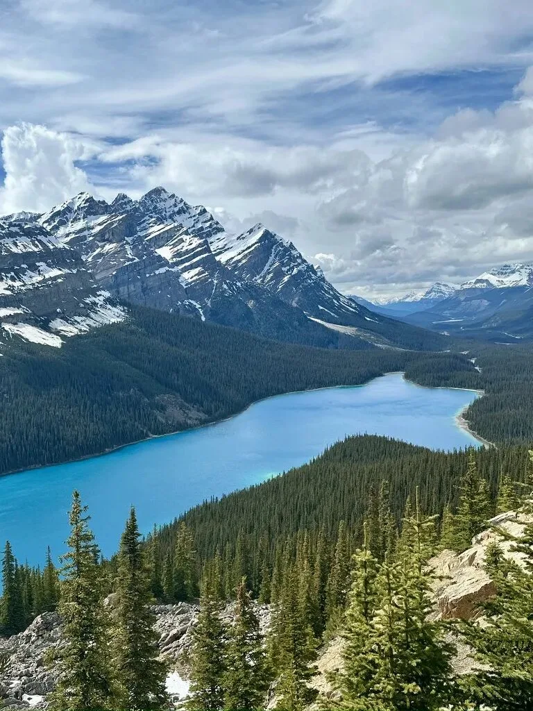

再往南走，就到了著名的露易丝湖。这里是一个知名的三岔路口，向北是贾斯帕国家公园，向南是班夫国家公园，向西则是幽鹤国家公园。这里有一个著名的城堡酒店 —— （在装修，懒得进去喝下午茶了）

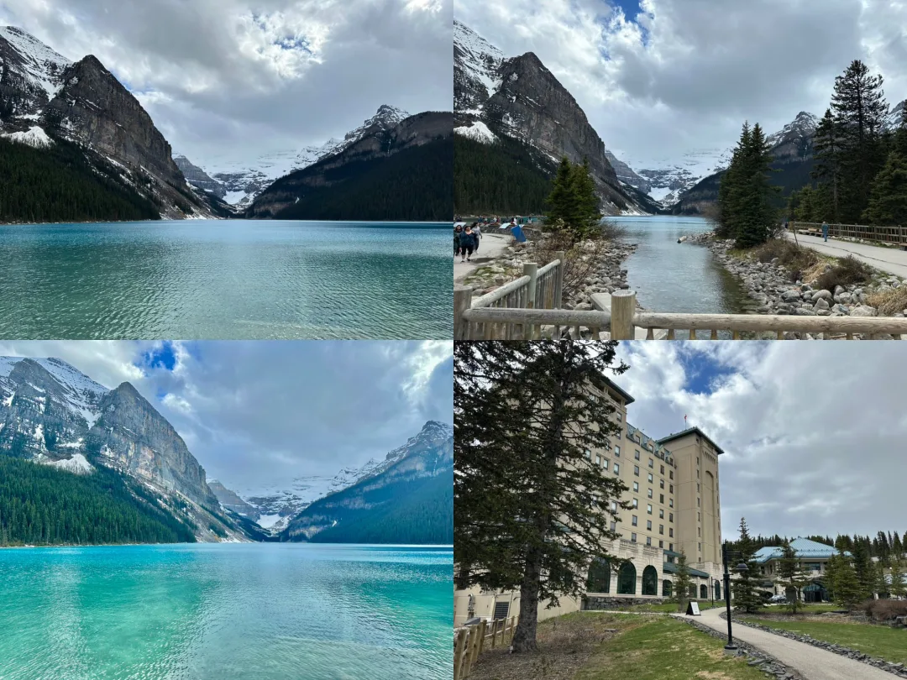

露易丝湖这里也是前往班夫国家公园的精华明珠 —— 梦莲湖的必经之路。

不过不幸地是，从去年开始，梦莲湖不允许游客自驾前往了，路口有两个交警拦着。必须要乘坐接驳车大巴（理由是停车场停不下了），但例外是如果你定了梦莲湖畔的住宿，就可以自驾进去，但据说提前半年就订满了。我是不太信邪，上它们官网一看，竟然明天晚上还有一间房，带税 841 加币，想想能看日照金山就订了一间。

不过明天才能入住，今天车也不让开进去。那么今天住哪儿呢？就去班夫小镇住吧。从路易斯湖离开后，开车前往班夫，这里是班夫著名标志性的兰德尔山 —— 从朱砂湖望去，蔚为壮观。

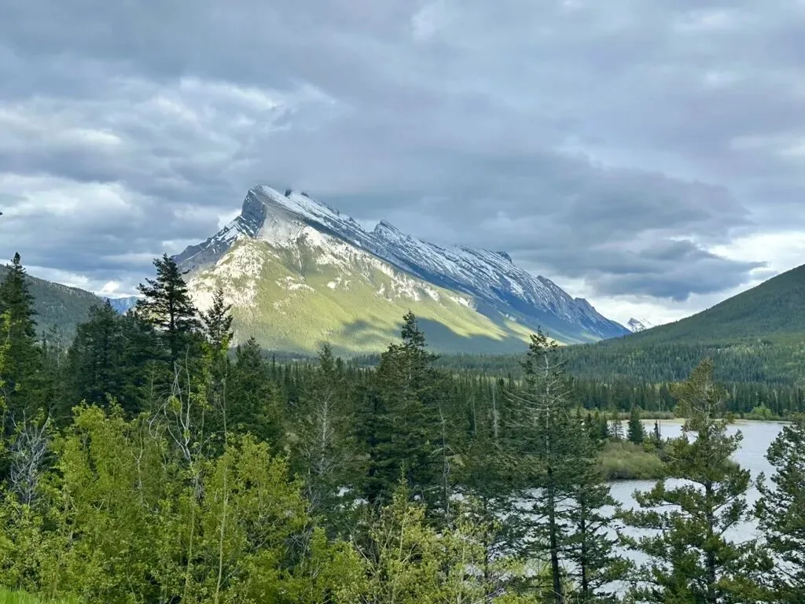

当然，班夫国家公园，还有梦莲湖的景色就在下篇游记介绍吧。

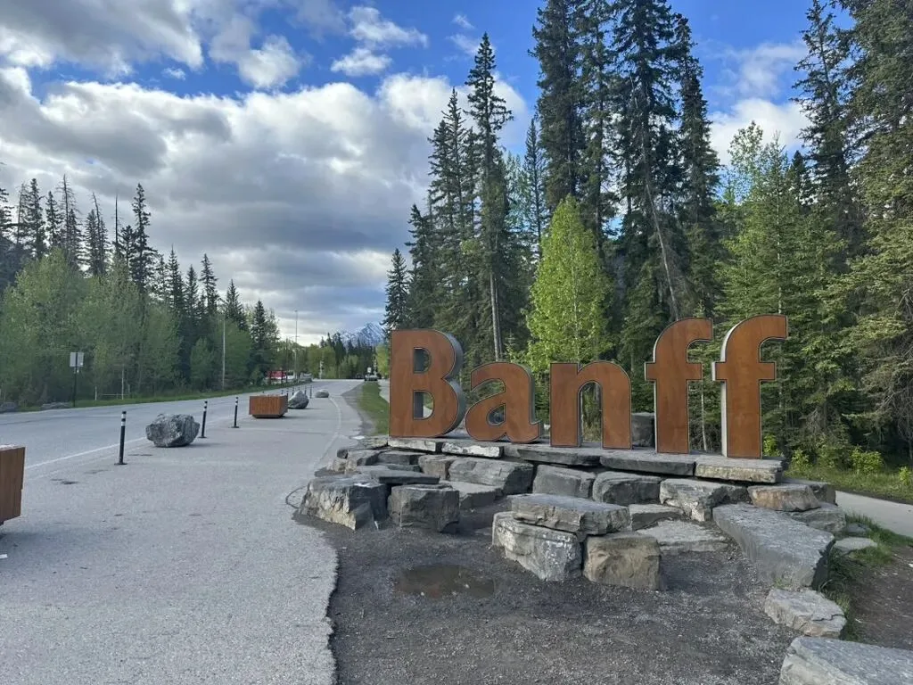

---

## 更多游记

- [青藏高原的美景与挑战](/trip/20231203-tibet-plateau/)
- [今年情人节怎么过？](https://mp.weixin.qq.com/s?__biz=MzU5ODAyNTM5Ng==&mid=2247484883&idx=1&sn=06319a4d8e1ea595f0450f71198b32d8&scene=21#wechat_redirect "今年情人节怎么过？")
- [2021 回忆](https://mp.weixin.qq.com/s?__biz=MzU5ODAyNTM5Ng==&mid=2247484870&idx=1&sn=18d773c3ee91a5a26fdb20f57a290ca0&scene=21#wechat_redirect "2021回忆")
- [七藏沟-红星海掠影](https://mp.weixin.qq.com/s?__biz=MzU5ODAyNTM5Ng==&mid=2247484868&idx=1&sn=2f8e05ae8c5190d003a05c8a175d24b4&scene=21#wechat_redirect "七藏沟-红星海掠影")
- [巍巍南太行](/trip/20210617-taihong/)
- [九寨沟航拍](https://mp.weixin.qq.com/s?__biz=MzU5ODAyNTM5Ng==&mid=2247484780&idx=1&sn=794a7b8d943c58538c0034fe26369252&scene=21#wechat_redirect "九寨沟航拍")
- [太行王莽岭](https://mp.weixin.qq.com/s?__biz=MzU5ODAyNTM5Ng==&mid=2247484636&idx=1&sn=e5ec2da3eb1e6a8f7ec14c6d48fe6bf1&scene=21#wechat_redirect "太行王莽岭")
- [踏破天山，走过伊犁。](https://mp.weixin.qq.com/s?__biz=MzU5ODAyNTM5Ng==&mid=2247484497&idx=1&sn=ca870ca0eb47a00d8cd5429202f213ea&scene=21#wechat_redirect "踏破天山，走过伊犁。")
- [Paradise Found — 乌孙古道 2020.10](/trip/20201001-wusun/)
- [乌孙古道徒步](https://mp.weixin.qq.com/s?__biz=MzU5ODAyNTM5Ng==&mid=2247484309&idx=1&sn=2c5d6f9da433165b8a3ca400d31c5698&scene=21#wechat_redirect "乌孙古道徒步")
- [西行漫记 3 河西走廊](/trip/20200722-westward-hexi/)
- [西行漫记番外 1 大洪水](/trip/20200714-westward-flood/)
- [西行漫记 2 关陇随笔](/trip/20200711-westward-guanlong/)
- [西行漫记 1 长安古意](/trip/20200708-westward-changan/)
- [西行漫记 —— 序章](/trip/20200216-westward-prologue/)
- [印象·青海](https://mp.weixin.qq.com/s?__biz=MzU5ODAyNTM5Ng==&mid=2247483976&idx=1&sn=3867b95b34f3df73956cade51c21a878&scene=21#wechat_redirect "印象·青海")
- [珠峰东坡游记](/trip/2018-gamagou/)

---

发布版本：[微信公众号](https://mp.weixin.qq.com/s/3oRGeGxcjAr9NuNoYOPRTg)
