周中休息两天，想找个地儿露营撒欢。因为带媳妇就懒得自己 DIY 了，想找个直接就能住进去的 Glamping 精致露营。于是研究了一下，发现了一个很不错的露营地 —— Milky Way 观星岭营地，分享给大家。

[嵌入媒体](https://mp.weixin.qq.com/mp/readtemplate?t=pages/video_player_tmpl&action=mpvideo&auto=0&vid=wxv_3534105512059338753)

在营地用 Vision Pro 体验《邂逅恐龙》，妙手偶得之…

---

选择理由

我在网上搜了一圈北京 Glamping 攻略，最后收敛到了几个选项：MilkyWay，松照，漾 Life，途野。Milky Way 观星岭这个名字一下 Get 到了我，很有意境。晚上能看到星空是一个非常有吸引力的亮点。

当然，这个营地最独特的点是 —— 山峦起伏，**长城环绕**。边上就是黄花城水长城，这算是独一无二的文化景观了。\

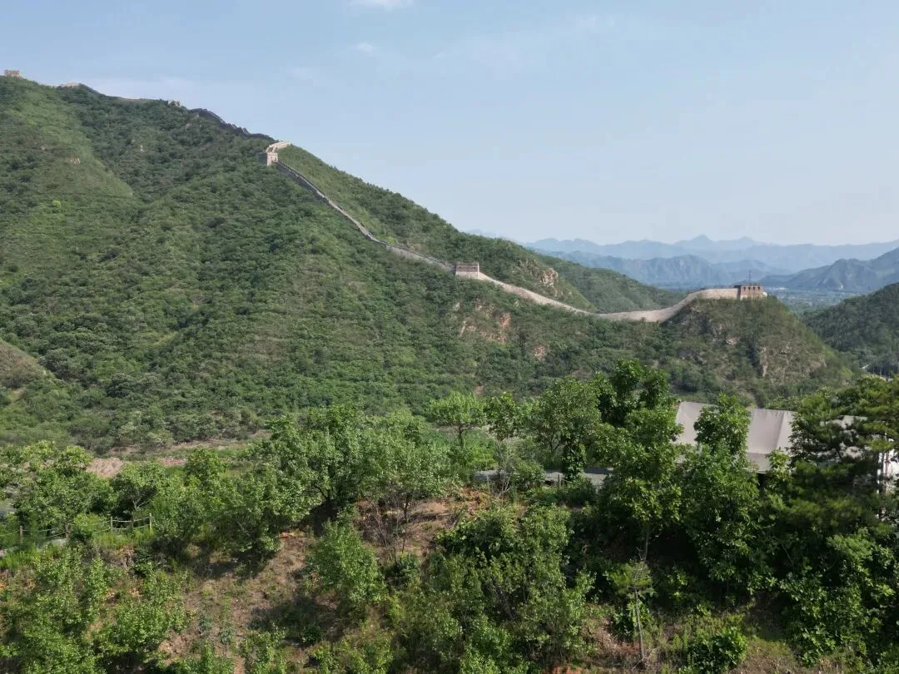

第三就是营地本身的设计与与基础设施。这个营地是山地梯田式的，看得出来是有精心设计的，树木遮挡私密性很好。

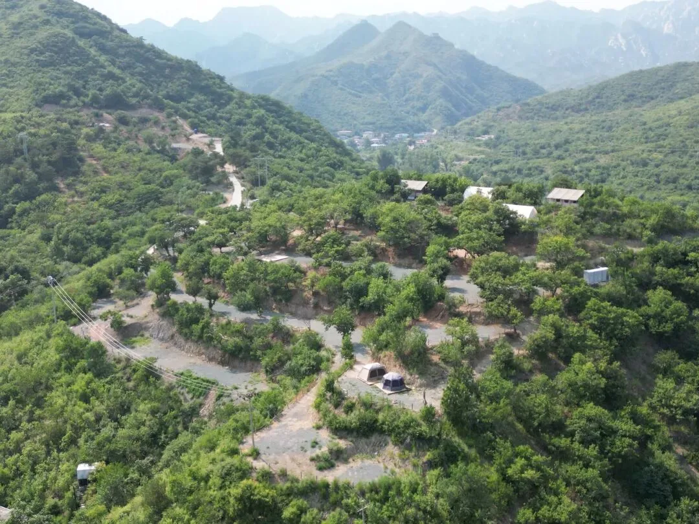

而且营地水火电网烧烤装备齐全，不像一些营地就是给你块大平地毛也没有。营地有卫生间，浴室，有咖啡屋，玩飞盘，荡秋千，扔沙包之类的娱乐设施。

实际体验

当然，实际露营的体验确实也非常满意。Milky Way 营地有个小程序可以直接预定，也可以在小程序里加老板微信直接聊。通常周末比较火爆，但是工作日人就会比较少，老板通常周末会过来。

Milky Way 营地在北京正北方向，怀柔区，高德地图直接搜就能找到，从市区过去七十公里，不堵车一个半小时，打车一两百块，车可以直接开进营地。

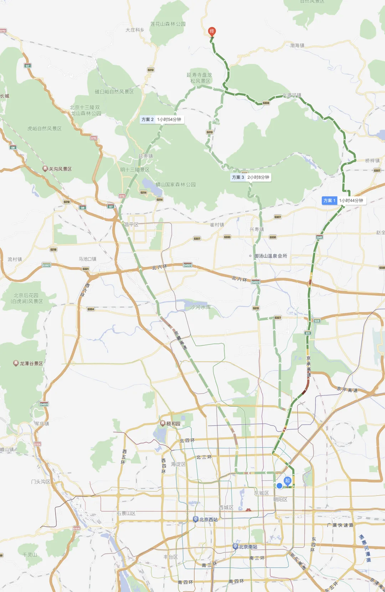

整个营地在一个公路包围的 U 型弯里，接近性非常好，所以也可以很方便地点外卖，也可以方便地去周围逛一逛。当然缺点是，白天偶尔有骑摩托车飙车的路过比较吵吵。

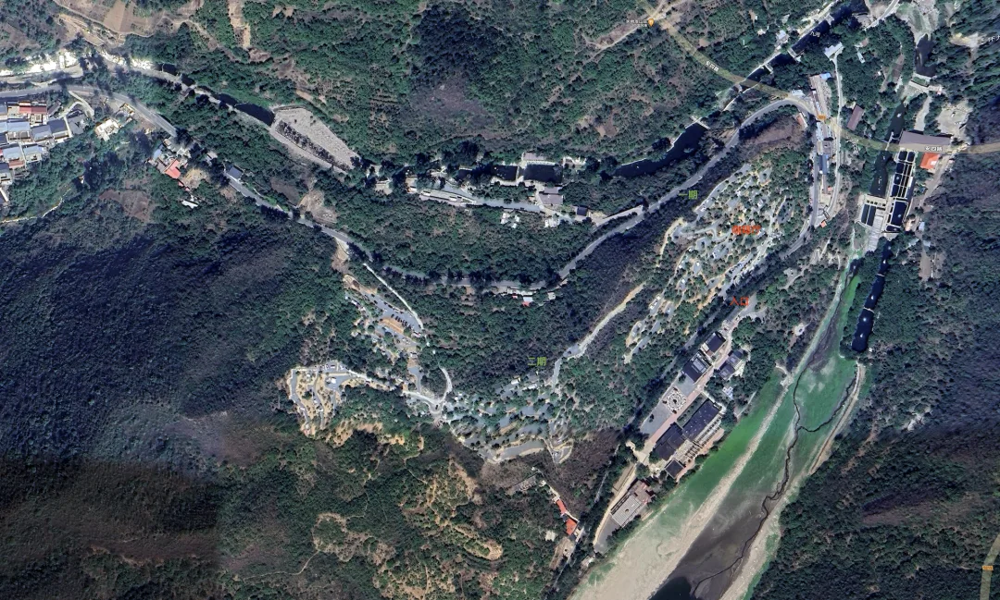

来自 ParadeDB 创始人与 DuckdbFDW 作者的感谢致意

营地分为一期和二期，一期有四个拎包入住的小帐篷，没有专用的卫生间。这种五六百一晚，看着不赖。

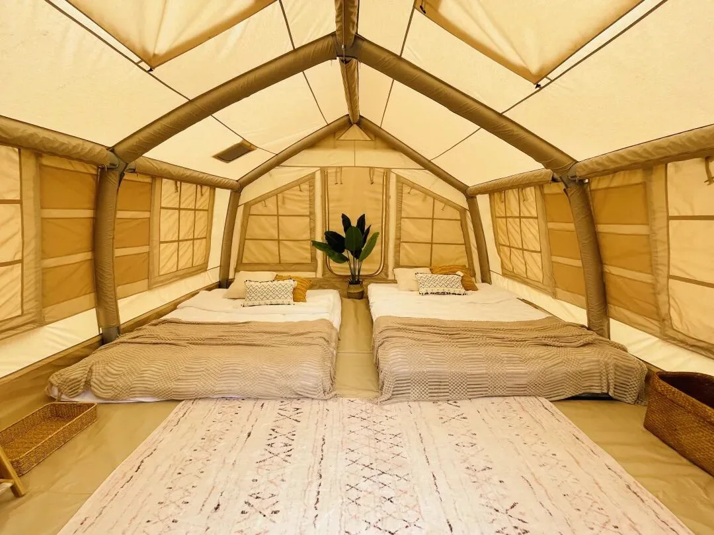

二期有四个特大帐篷 —— 帐篷里面有独立的卫浴。这个确实很方便，就跟酒店差不多了。工作日 ¥988，平日 ¥1588。里面有两张双人床，塞进四五个人不成问题。

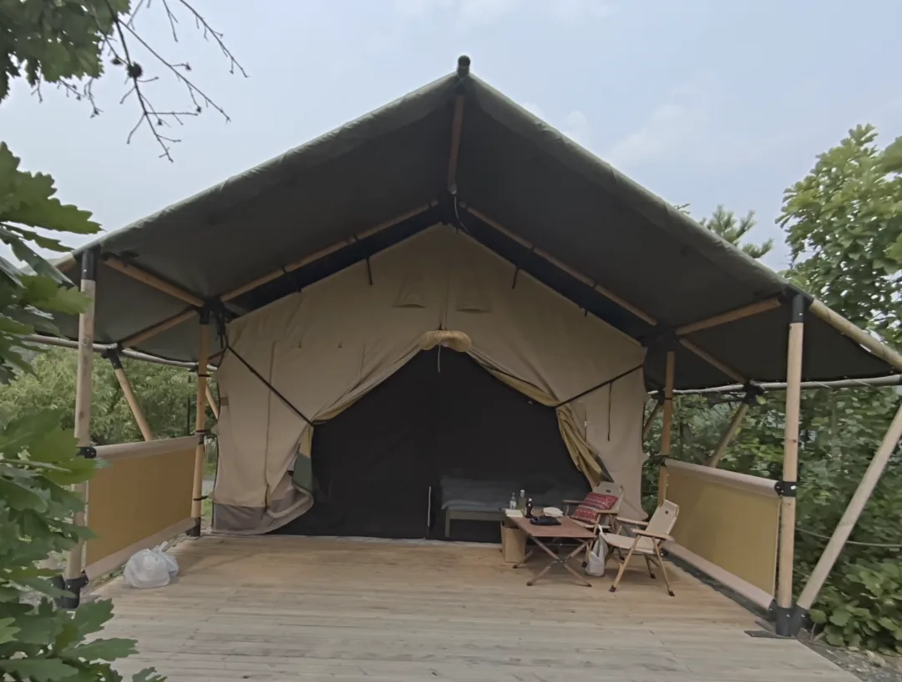

当然，你总是可以自己带帐篷来 DIY，那差不多就是两三百的样子。

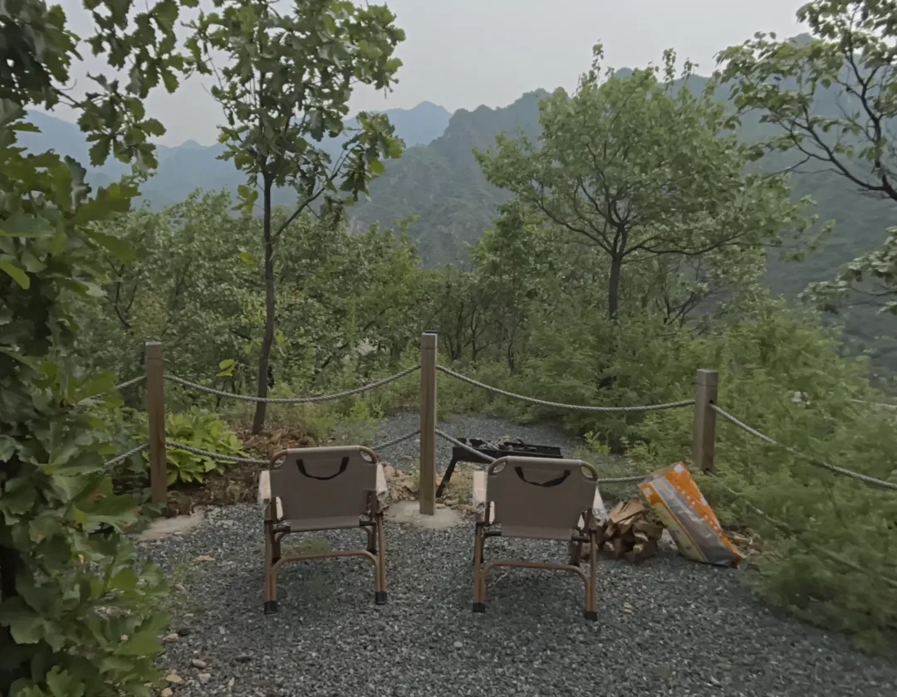

我们选了二期里面最大最好的一间，门口有一块平地，可以眺望远方的山与长城。也可以生个篝火，搞搞烧烤。

不过我们去的时候，正好赶上老板带着他的小伙伴们自己过来玩，所以就不烧烤了，而是独乐乐不如众乐乐，一起吃个饭。

老板杨哥是蛇牛，非常热情好客，亲自给我们露了一手来了一个铁锅炖。营地旁边的饭店老板也带来了一个自己的试验菜品 —— 鱼生三件套。

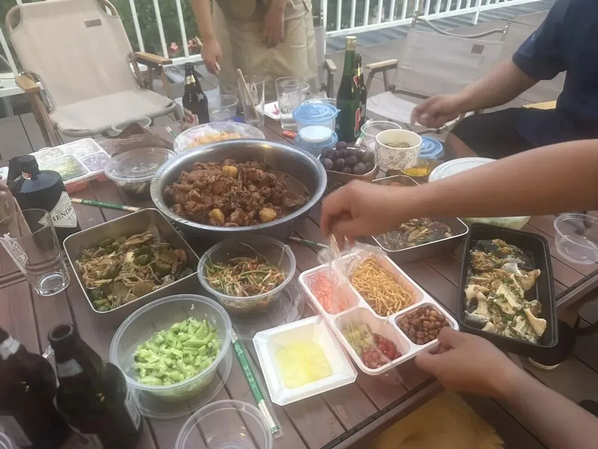

傍晚的山间非常舒服，我们和老板的朋友们一起玩游戏，掷沙包，扔飞盘。喝点小酒，来盆花毛一体。看着日落，准备开饭。

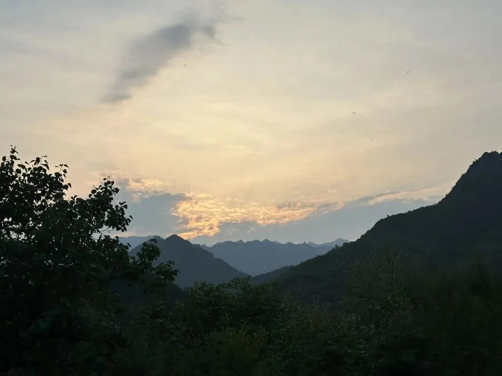

认识了新的朋友，晚上一起喝酒，玩的很开心，一直干到十一点，我就困得不行准备先撤了。

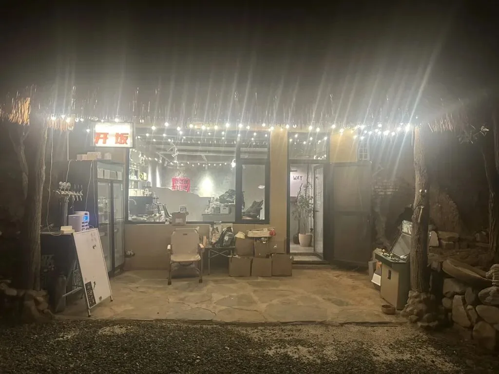

能看到星星，但手机就很难拍出来了

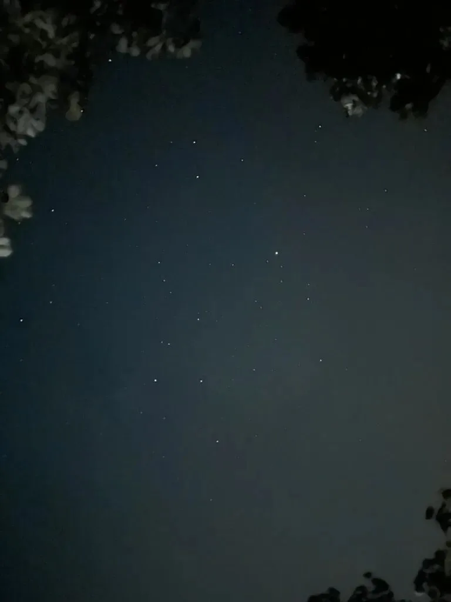

早上起来，清晨的气温和湿度都非常舒适

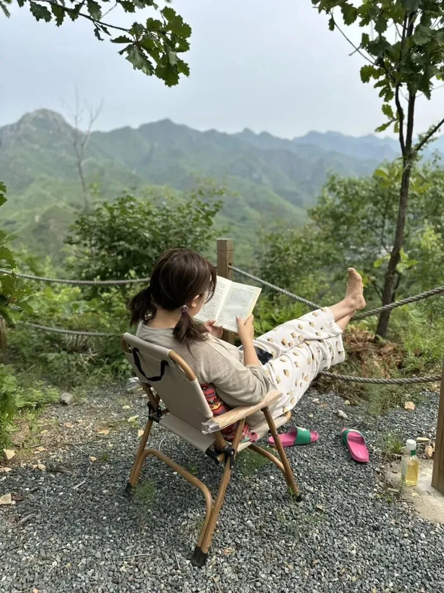

老板骑着三轮电驴，拉着我们去营地边上吃早餐。

这几只羊，看上去很好吃。

营地里有一只很聪明的狗，特别粘我  —— 营地保卫科科长大黄。晚上喝酒要回二期营地，还有小几百米山路，大黄会带着我一路过去。第二天走的时候，大黄还一路送了我们一公里。

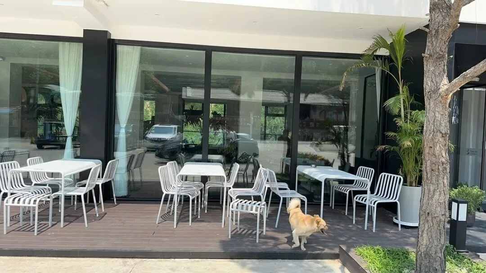

总的来说，这个营地确实还不错，以后休息消暑，除了去洗大澡，又有一个新去处了。推荐给大家

---

## 更多游记

- [班夫贾斯帕自驾游记 — 山峰戴雪，湖光入画](/trip/20240627-banff-jasper/)
- [青藏高原的美景与挑战](/trip/20231203-tibet-plateau/)
- [今年情人节怎么过？](https://mp.weixin.qq.com/s?__biz=MzU5ODAyNTM5Ng==&mid=2247484883&idx=1&sn=06319a4d8e1ea595f0450f71198b32d8&scene=21#wechat_redirect "今年情人节怎么过？")
- [2021 回忆](https://mp.weixin.qq.com/s?__biz=MzU5ODAyNTM5Ng==&mid=2247484870&idx=1&sn=18d773c3ee91a5a26fdb20f57a290ca0&scene=21#wechat_redirect "2021回忆")
- [七藏沟-红星海掠影](https://mp.weixin.qq.com/s?__biz=MzU5ODAyNTM5Ng==&mid=2247484868&idx=1&sn=2f8e05ae8c5190d003a05c8a175d24b4&scene=21#wechat_redirect "七藏沟-红星海掠影")
- [巍巍南太行](/trip/20210617-taihong/)
- [九寨沟航拍](https://mp.weixin.qq.com/s?__biz=MzU5ODAyNTM5Ng==&mid=2247484780&idx=1&sn=794a7b8d943c58538c0034fe26369252&scene=21#wechat_redirect "九寨沟航拍")
- [太行王莽岭](https://mp.weixin.qq.com/s?__biz=MzU5ODAyNTM5Ng==&mid=2247484636&idx=1&sn=e5ec2da3eb1e6a8f7ec14c6d48fe6bf1&scene=21#wechat_redirect "太行王莽岭")
- [踏破天山，走过伊犁。](https://mp.weixin.qq.com/s?__biz=MzU5ODAyNTM5Ng==&mid=2247484497&idx=1&sn=ca870ca0eb47a00d8cd5429202f213ea&scene=21#wechat_redirect "踏破天山，走过伊犁。")
- [Paradise Found — 乌孙古道 2020.10](/trip/20201001-wusun/)
- [乌孙古道徒步](https://mp.weixin.qq.com/s?__biz=MzU5ODAyNTM5Ng==&mid=2247484309&idx=1&sn=2c5d6f9da433165b8a3ca400d31c5698&scene=21#wechat_redirect "乌孙古道徒步")
- [西行漫记 3 河西走廊](/trip/20200722-westward-hexi/)
- [西行漫记番外 1 大洪水](/trip/20200714-westward-flood/)
- [西行漫记 2 关陇随笔](/trip/20200711-westward-guanlong/)
- [西行漫记 1 长安古意](/trip/20200708-westward-changan/)
- [西行漫记 —— 序章](/trip/20200216-westward-prologue/)
- [印象·青海](https://mp.weixin.qq.com/s?__biz=MzU5ODAyNTM5Ng==&mid=2247483976&idx=1&sn=3867b95b34f3df73956cade51c21a878&scene=21#wechat_redirect "印象·青海")
- [珠峰东坡游记](/trip/2018-gamagou/)

---

发布版本：[微信公众号](https://mp.weixin.qq.com/s/byDTJypghJ7mEWumpC0OOQ)
