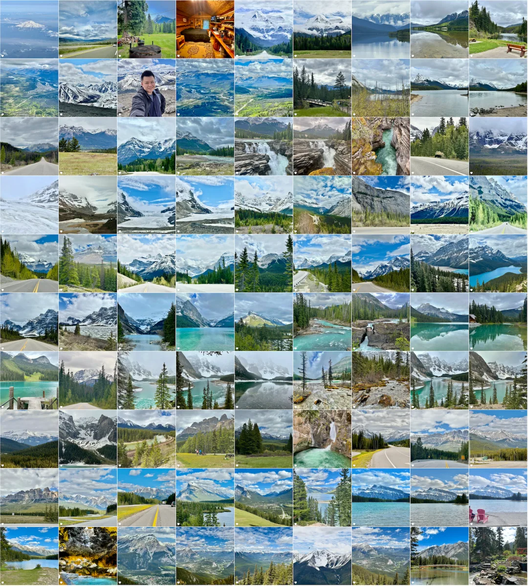
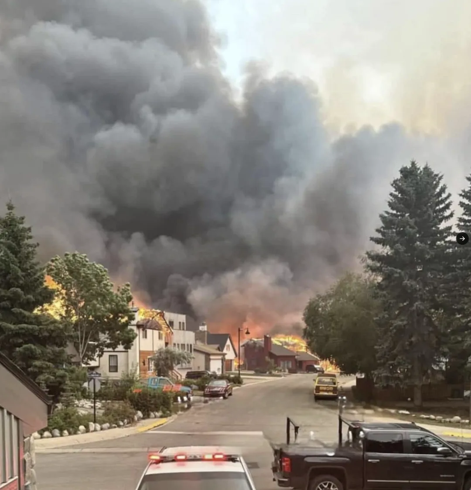
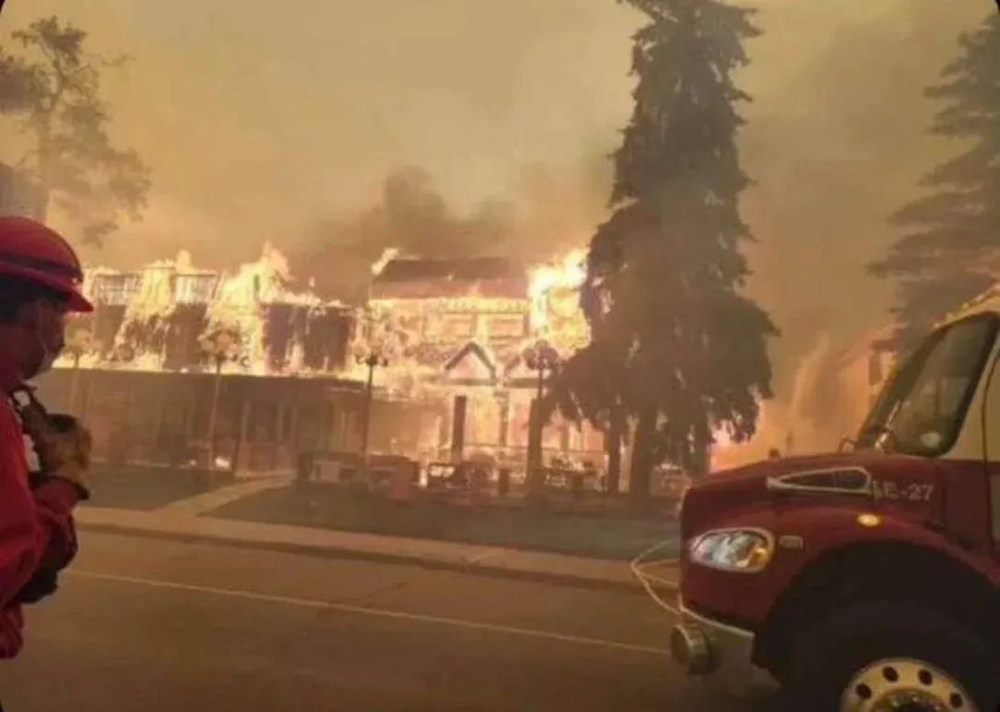
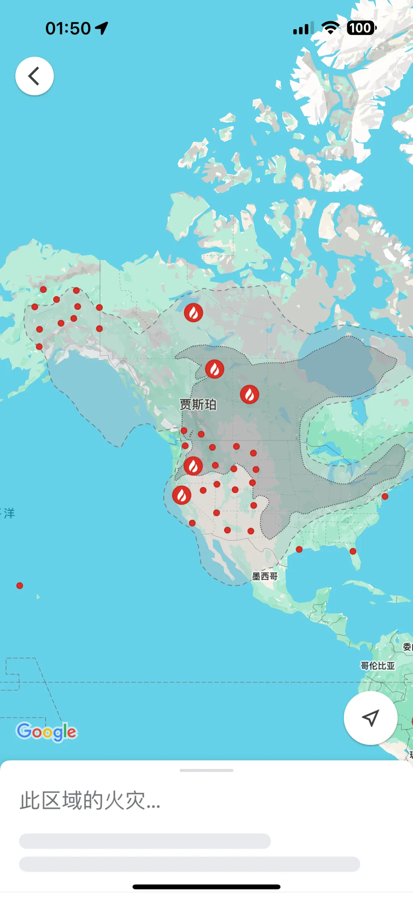
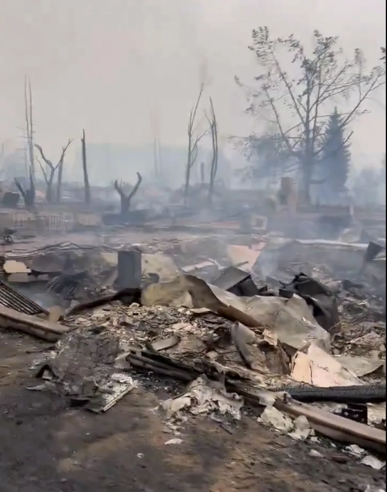

早上起来看到新闻，加拿大最美的小镇之一贾斯帕在一夜之间被山火烧干净了。上个月我才刚刚去贾斯帕国家公园玩了一周，我也才刚刚写完一篇游记的上半部分—— 《[贾斯帕自驾游记 — 山峰戴雪，湖光入画](/trip/20240627-banff-jasper/)》

结果你告诉我上个月我刚刚住过的民宿，逛过、歇过，留下了美好回忆的小镇，现在已经变成了一片废墟与灰烬？

那么多熟悉的街道，历历在目的景色都变成了尘埃？

昨天晚上看新闻还只是贾斯帕镇以南十二公里左右因为雷击出现山火，游客与镇民开始疏散。今天起来，整个镇子没了。这属实是有些震撼与无语凝噎。\

今天起来，整个镇子没了，山火和烟灰蔓延得到处都是：

早上起来，听说已经不剩什么了。

这着实让人感慨世事无常。旅游这种事，还是**花开堪折直须折**，你要总是等等以后再去，香格里拉，巴黎圣母院，贾斯帕小镇也许就在一把火中烧干净了。

前情回顾：《[贾斯帕自驾游记 — 山峰戴雪，湖光入画](/trip/20240627-banff-jasper/)》

---

发布版本：[微信公众号](https://mp.weixin.qq.com/s/Khw0T1H3efFLV9jqOrBMTw)
