早晨起来看到新闻，洛杉矶大火熊熊燃烧，看着让人心惊。宛如世界末日走入现实。

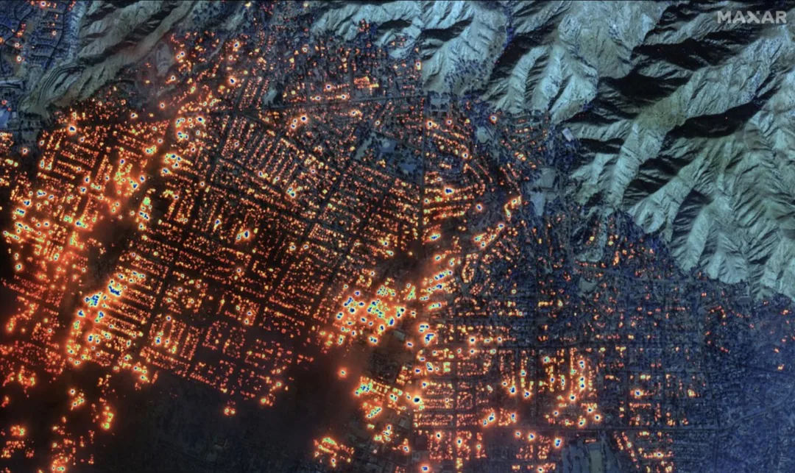

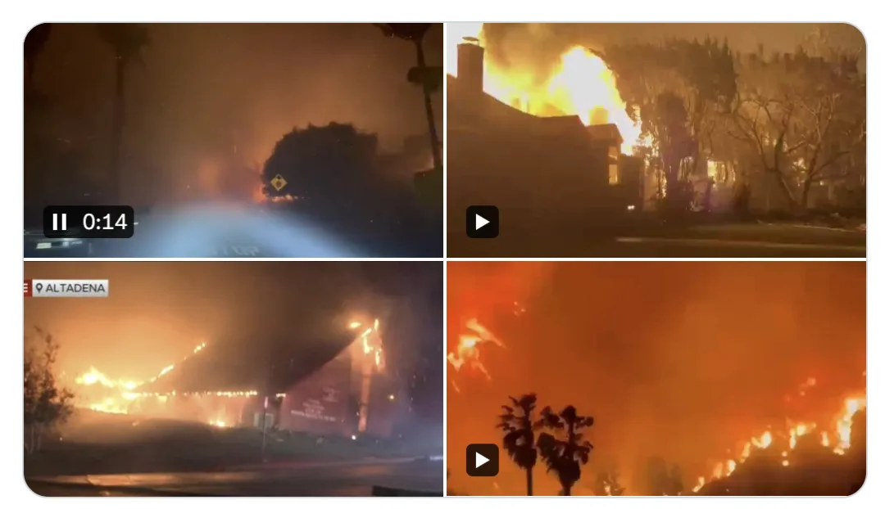

当然让人感觉最难受的一点是，这并非某个抽象遥远地方，而是我半年前才刚去过的地方。几年前在美西自驾，在这里留下过许多美好回忆：好莱坞，环球影城，比佛利山庄，圣莫妮卡海滩，格里菲斯天文台……

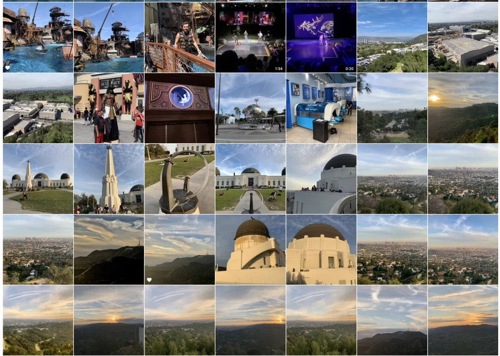

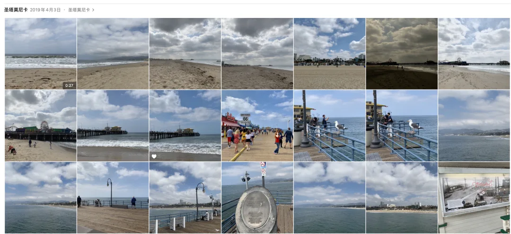

因为《GTA5》，这也许是唯一一我从没到过，却对无数地标如数家珍的城市，在火灾区域我还路过并歇脚过。现在一把大火，一地废墟，着实让人倍感嘘唏。

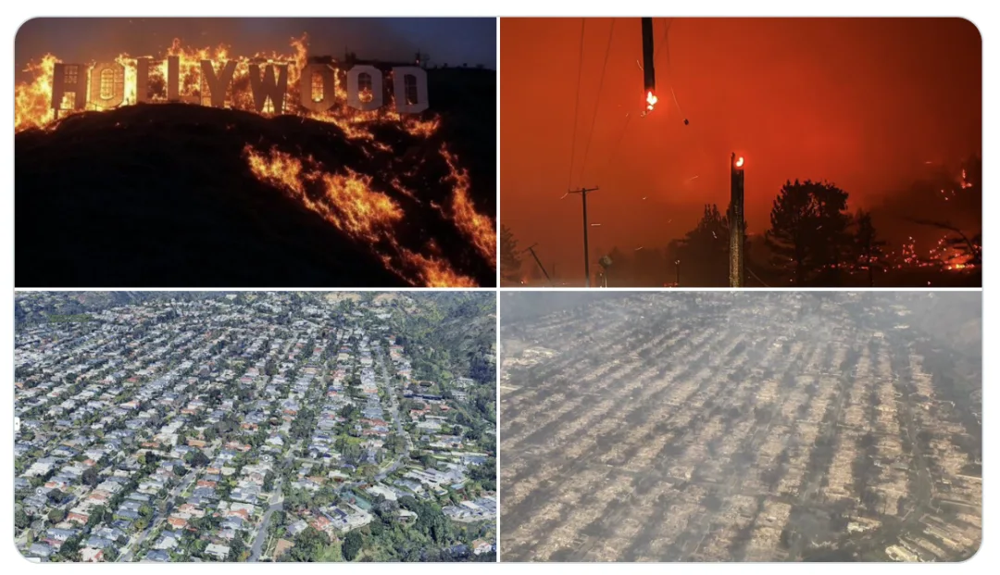

这场大火，天时地利人和都没了：气候干燥，极少的降水与低湿度，加上强风焚风吹向人口密集区，此乃天时；

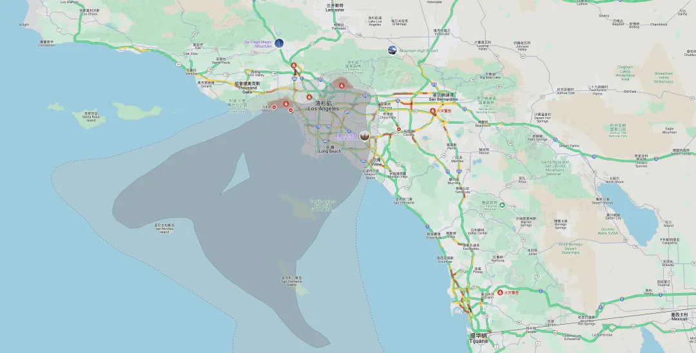

木质住房和森林树木交错，无数的可燃物，此乃地利；

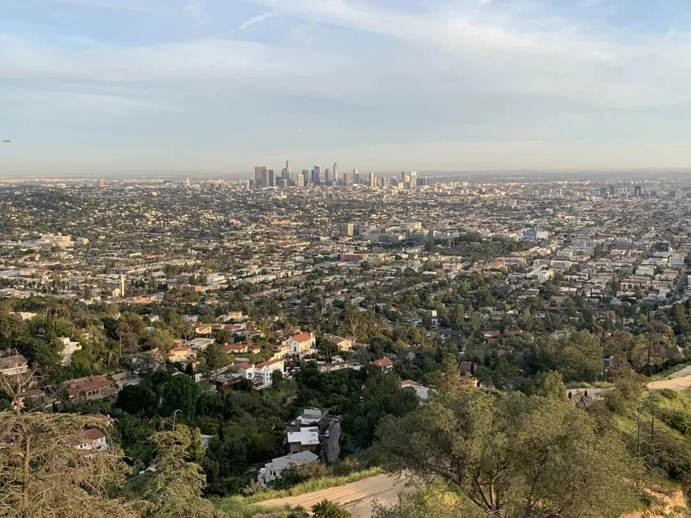

拉垮的消防体系，此乃人和。三者齐备，感觉是没法救，消防员也很难有什么办法。

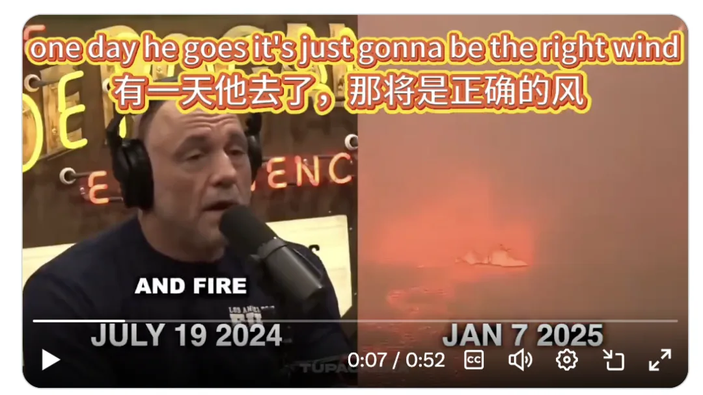

听说已经烧进市区，不知道最后怎么收场，会烧到什么程度了。

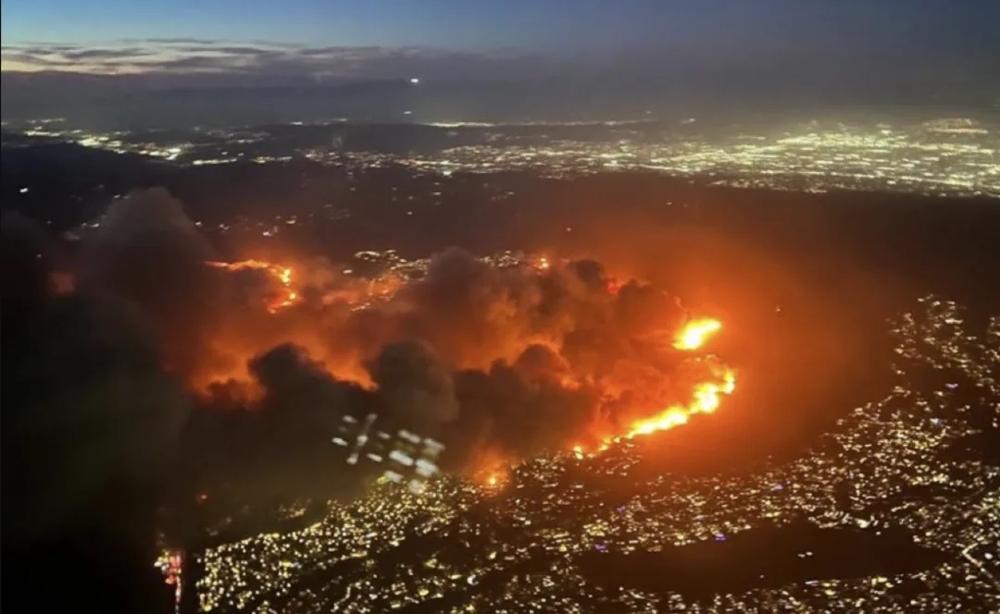

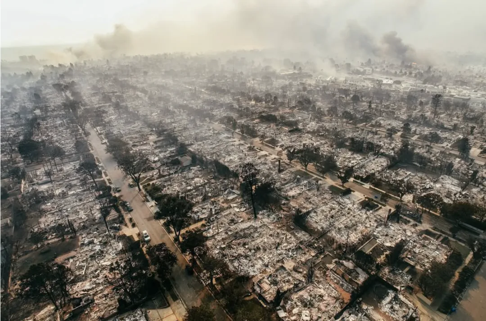

---

这不禁让我想起来去年七月份，《[加拿大最美小镇贾斯帕在一夜之间被山火烧干净了](/trip/20240726-jasper-fire/)》，也是在我刚刚自驾游完回来就发生了。

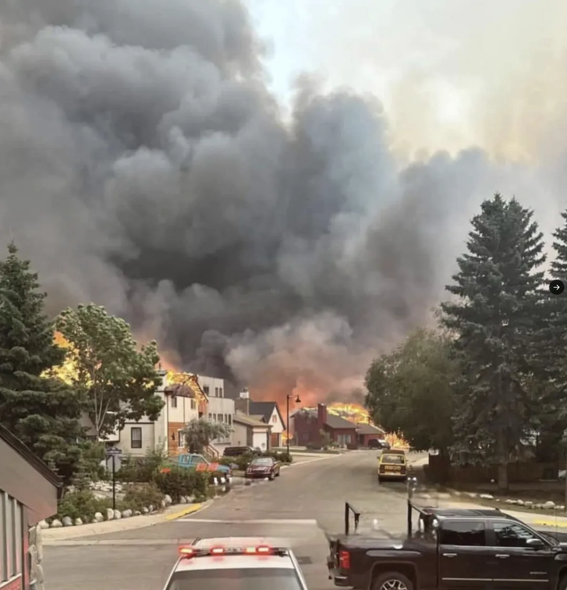

旅游这种事，还是**花开堪折直须折**，你要总是等等以后再去，香格里拉，巴黎圣母院，贾斯帕小镇，洛杉矶好莱坞也许就在一把火中烧干净了。

---

发布版本：[微信公众号](https://mp.weixin.qq.com/s/EQecpuG1jFsj9Z7BgEOs9g)
