从 1.24 到 2.7，我和家人朋友在泰国度过了两周难忘的度假体验。今天正式回家**开工了**。不过在开工前，简单写写在泰国的感受与体验。

在出发前和刚到泰国时，不少朋友网友都关心俺不要被 **噶腰子**了，我倍感温暖，不过这种担忧确实大可不必。实际上今年去泰国的老中不减反增了，目测还是因为免签的缘故。

## 主要行程

这次在泰国的行程主要是三站：普吉岛 - 苏梅岛 - 清迈。全程基本以花式酒店躺平为主，出了趟海（斯米兰岛），玩了玩枪（清迈），胡吃海喝了一遍。

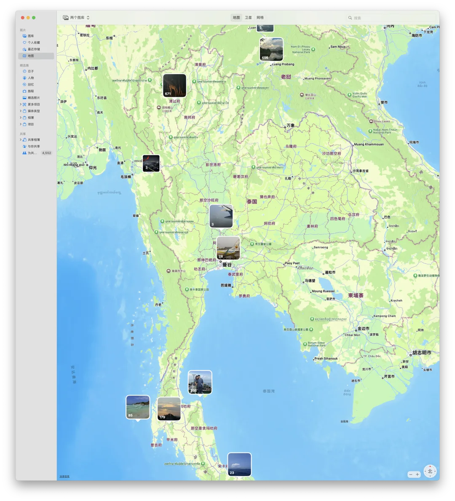

## 泰国危险吗？

作为老牌旅游国家，别去边境瞎晃悠，在经典旅游地点，我觉得根本没有什么危险。当地人都非常友善，老实说那些搞诈骗的基本都是福建台湾一带的，出门防好“老乡”，基本就没啥问题了。

## 泰国可以打枪

清迈大峡谷这个靶场很不错，打了霰弹枪，冲锋枪，步枪，手枪，基本过瘾了。平均每人千把块钱。不像国内靶场枪还给你用铁链子锁上，随便 biubiu。

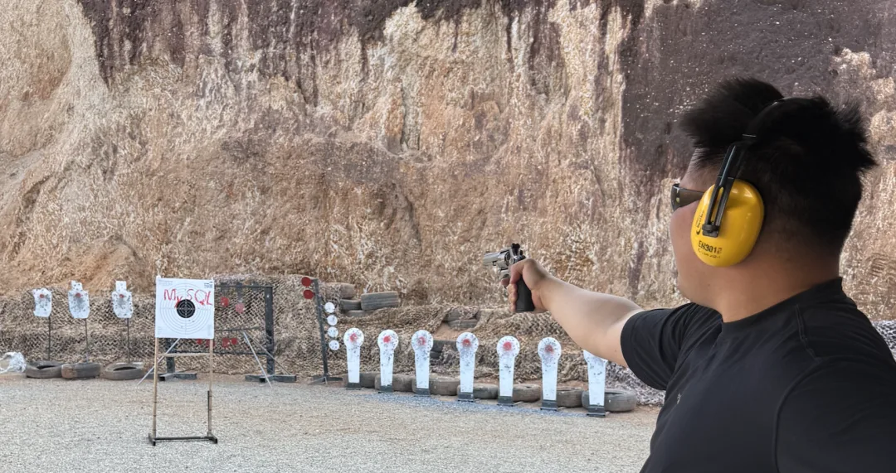

“打爆 MYSQL！”

## 泰国物价真便宜

在普吉和清迈吃了几家米其林，翻着花样吃撑人均也就两百块。泰国菜的味道非常赞！酒店 900 ¥ 的 SPA 很一般，路边 150 ¥ / 两小时的泰式按摩非常赞。

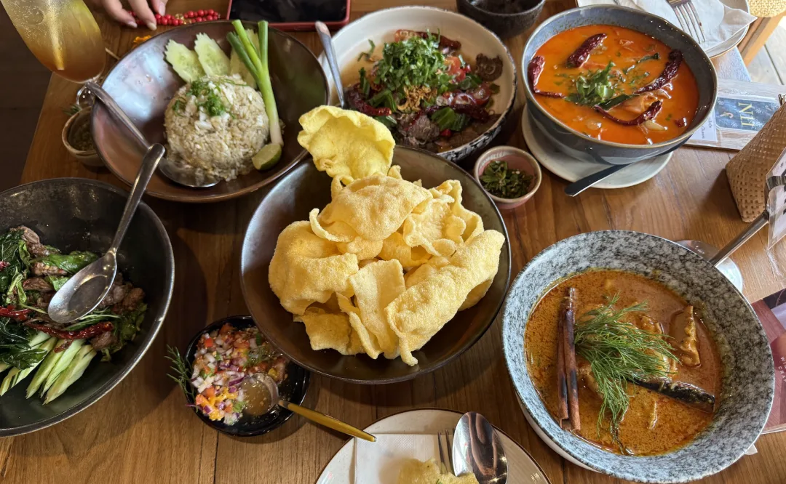

## 泰国素质蛮高

体现一个地方文明程度有一个很管用的指标：**厕所清洁程度**。老实说泰国绝大多数地方的厕所清洁程度都远远超过我的估计，比起很多地方那些旅游区饭店的厕所要好太多了 —— 不仅仅是大酒店，路边小饭馆的厕所也都非常卫生。当然，机场这种地方依然难逃一劫……

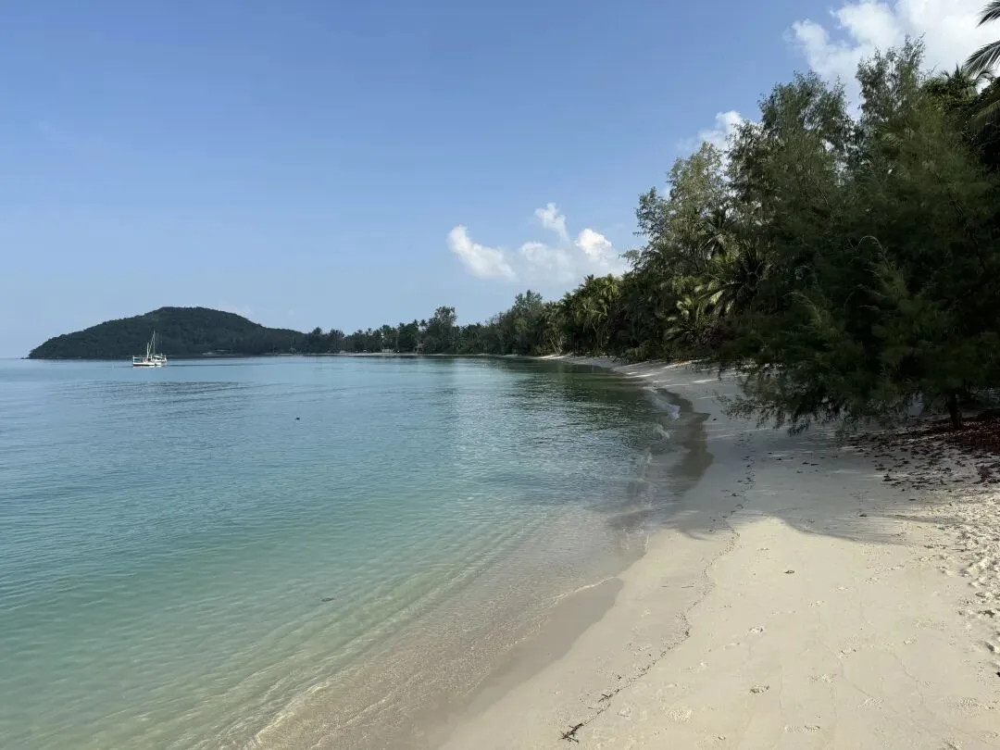

## 泰国开车快，但很礼貌

泰国车是右舵，和国内不一样。泰国的道路虽然写着限速，但反正没有拍照大家都开的飞快。限速 60 的路上开 160 的比比皆是。但出乎意料的是，泰国车虽然开的飞快，但驾驶风格相当文明，只要你打转向，别人都愿意给你让道。

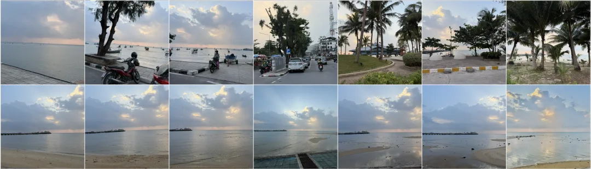

## 普吉岛：适合躺平

普吉岛住攀牙湾的 COMO POINT YAMU <https://www.comohotels.com/zh/thailand/como-point-yamu> 住了三晚。很舒适

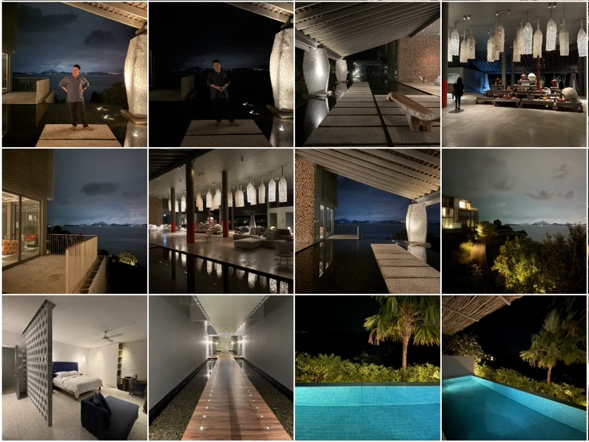

## 斯米兰很好，但人太多了

从普吉开车一个小时到码头，坐船跳岛斯米兰浮潜。坐船请做船头，坐船舱里躺平的朋友吐了一路，坐船头晃来晃去的俺们啥事没有。

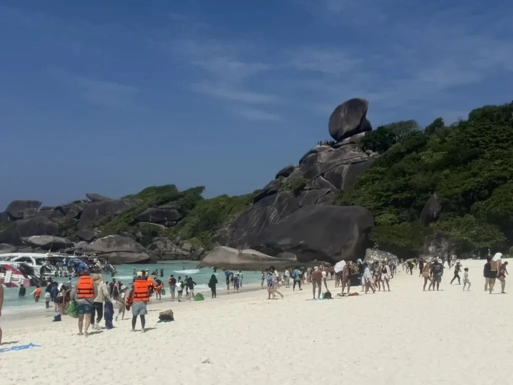

浮潜老实说比马尔代夫差不少意思，但运气不错，看到只大海龟。

[嵌入媒体](https://mp.weixin.qq.com/mp/readtemplate?t=pages/video_player_tmpl&action=mpvideo&auto=0&vid=wxv_3850435544328863745)

这岛不错，但人太多了，人一多就不好玩了。而且从岛上回来，整个人都黑了一圈。

## 苏梅岛：在此过年

普吉完事后去苏梅过年，在这儿弄了个山景海景大别墅，待了几天。每天在打王者，打 PS5，打台球，打扑克，打麻将，看电影，游泳泡水中循环度过。

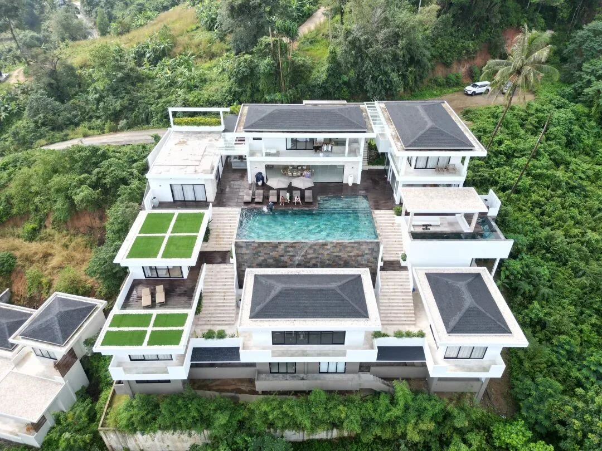

总共有五间卧室，塞进十个人不成问题，还有客厅，电影厅，娱乐厅，健身房，还配有司机，管家，大厨管三餐（还能兼职乐师），能俯瞰海景，景色一流。虽然每天 1 万¥不算便宜，但七个人一起住人均下来其实还好。

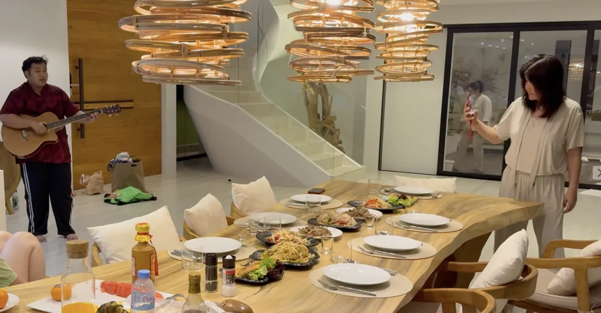

苏梅岛太棒了，等俺退休了，也想在这弄个这样的房子养老。

## 清迈的咖啡馆：很有格调

在清迈继续躺平，和朋友打麻将打牌打枪，逛商场夜间动物园，剩下的也就是逛逛咖啡厅了。清迈咖啡厅很多，而且弄的都非常精致。

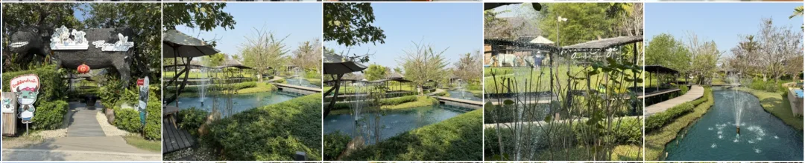

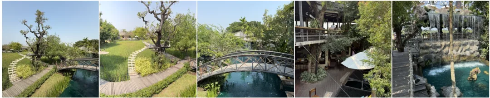

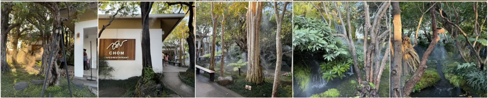

总的来说，是个有趣的地方。邓丽君《小城故事多》说的就是这里。总的来说，如果说苏梅普吉是“三亚”，那么清迈就算是海口，住着非常舒服。

## 翻车点

当然，在泰国旅游也踩过雷。首先是普吉飞 清迈的亚行托运行李给我摔开了，还好没丢东西，赔了 600 株。然后在曼谷定了个机场酒店踩雷了，跟图片差太远了，差评投诉了。曼谷整体观感一般，也堵车，感觉没清迈好。

别的嘛，我都想不到这两周还有啥其他不顺心的事了。

---

## 结语

总的来说，泰国是一个非常不错的旅游目的地，高品质的服务，低廉的价格，便捷的交通，自由的网络。到处都是世界各地的游客与数字游民。老实说我都心动了 —— 要不要来泰国当个数字游牧民或者来这里定居养老呢？

至于什么嘎腰子电诈拐卖的，我觉得那都是在吓唬自己，说到底，还是要眼见为实。而且就算真的有什么风险，应该做的也是认识风险并规避风险，而不是躲在家里哪也不敢去。起码这次来泰国，我觉得，嗯，真的是很不错的地方，以后度假要是纠结去什么地方，就来这里耍耍了。

---

发布版本：[微信公众号](https://mp.weixin.qq.com/s/AnEtJWPtN-IqoyjkG5tHlw)
