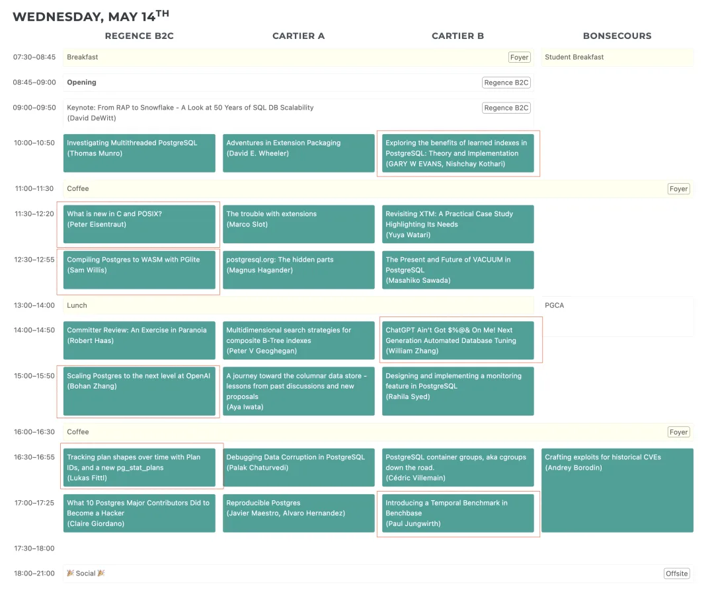
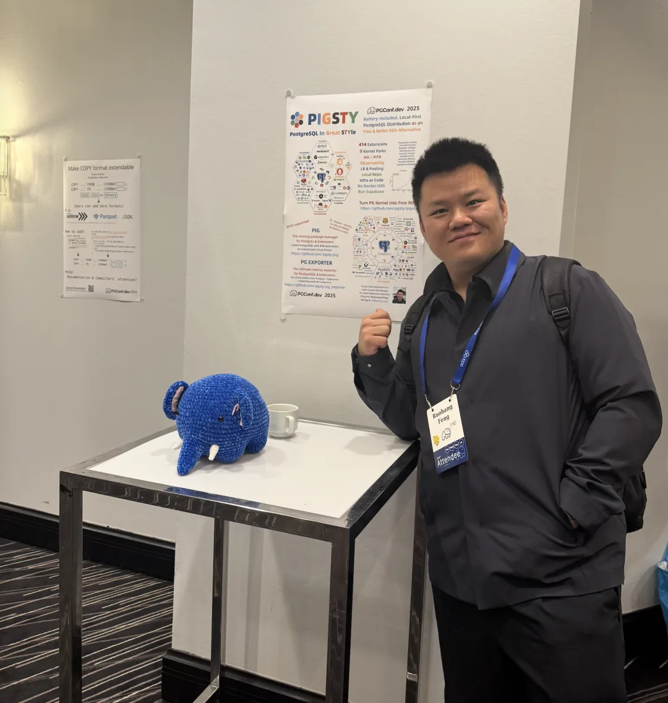
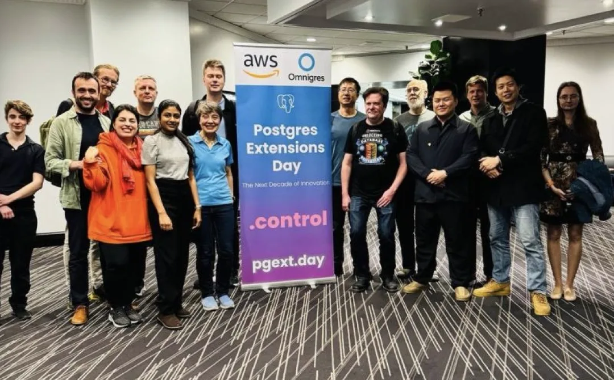

老冯这几天在蒙特利尔参加 PG 全球开发者大会，并在 PG 扩展日上进行了题为《PG 生态中缺失的扩展仓库与包管理器》的演讲。老实说，这两天每天忙的要死，回到酒店倒头就睡，实在是没啥功夫写文章了。

比如昨天那篇《[深度分析：迪奥数据泄露事件，云配置失当的锅？](/cloud/dior-leak/)》 其实是个不错的题材，但是老冯没什么时间加工，就偷懒儿直接把 GPT 输出丢上去了。评论区有读者朋友批评，AI 写的就不是那个味儿了。朋友们批评的对，老冯以后还是尽可能不偷懒了，哈哈，还是手写比较顺畅，看着也舒服。

关于扩展日的分享内容，我会在后面有空的时候以文章的时候发布出来，目前在 Youtub 上也有直播回放可以看：<https://www.youtube.com/live/cucQOOAahNY> （空降 4:50:20 即可），我在视频号也发了个自己手机录的版本，如下：

今天 5/14，PG 开发者大会的主议程第一天，今天的内容都很硬，Schedule 如下所示，不少内容我都比较期待，有几场精彩的内容重叠了，只能割爱一些有趣的演讲。要是等回放的话，那可就不知道要几个月后了。当然，参加大会最有趣的部分始终还是认识新朋友，以及交换小道消息，哈哈。

最近，《ITPUB》搞了个 IT 新媒体影响力年度评选，这都什么年代了竟然还是拉票，老冯确实也没啥功夫折腾这些。不过如果各位读者朋友有空，也欢迎帮老冯投一票哈（搜“冯”就是了）<https://zt.itpub.net/topic/peanit/> 你们的鼓舞是老冯持续创作的动力源泉，先在这里谢过各位了哈哈。

最后是一些在蒙特利尔拍的照片，不愧是法语区，欧洲范儿。

哈哈，好的各位朋友，老冯先走一步，参会去也～。

Pigsty 硬广上墙，哈哈，被贴到最显眼的位置去了。顺便一提，这个大象玩偶非常受欢迎，哈哈。

扩展日合影

---

发布版本：[微信公众号](https://mp.weixin.qq.com/s/NVQRbZsn_5C7tIdGEHw7jA)
