老冯正和媳妇在新疆自驾游，好久没写公众号了。刚从喀纳斯/阿勒泰出来，忍不住想要吐槽一下喀纳斯的杀猪盘。喀纳斯景色虽好，但这个季节就别去当大怨种送了，还不如去走新开的阿禾公路/阿可公路。

老冯这已经是第三次去喀纳斯了，第一次是 2016 年十一国庆徒步，第二次是 2019 年 7 月底徒步，第三次 2025 年 9 月 21 日（正好是老冯 32 生日）。这次来据说是赶上了喀纳斯景色最美的两周 —— 但老冯都已经看过了，实话说如果不是因为媳妇没去过，怕留遗憾，老冯是根本没有兴趣再去第三次的。

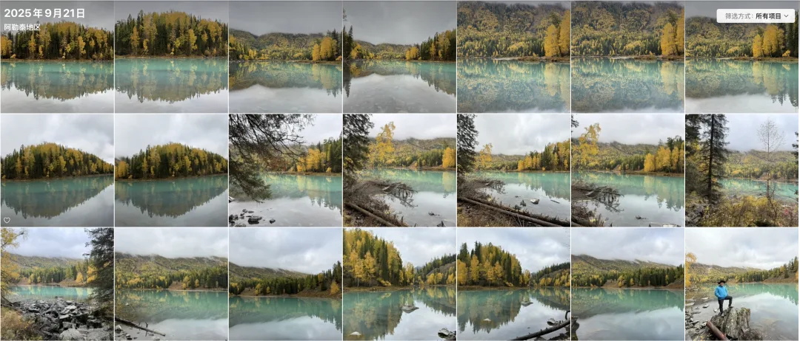

喀纳斯的秋景号称 “中国秋景之最”，最不最我不好说 —— 个人感觉九寨沟/稻城亚丁其实秋景更好看，但算进第一档肯定是没什么争议。不过景色虽然好，但喀纳斯景区的体验只能用 “💩” 来形容。属实是把好好的景色给霍霍糟蹋了。今天老冯就分享一下喀纳斯应该怎么玩，如果你九月底或者十一准备去，也许会有帮助。

## 杀猪天价酒店

我还记得 16 年第一次去喀纳斯禾木玩的时候，那一年商业化刚刚起步。我在禾木找了个普通标间也就两百块钱出头。第二次 19 年的时候我从喀纳斯徒步到禾木村，住小木屋就要差不多五百块了。这次我又开车到禾木，一搜里面的住宿，基本上都要两千块上下，还有四五千的，便宜也要一千。喀纳斯禾白哈巴也基本类似。

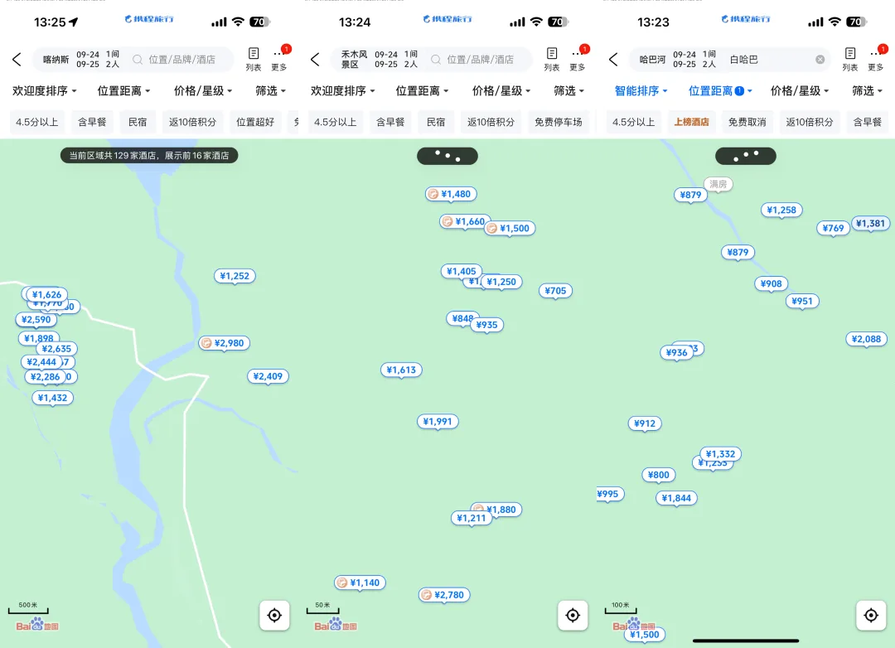

老冯觉得呢，这些酒店住宿属于纯粹的杀猪盘。几千块的酒店老冯不是没住过 [加拿大班夫国家公园的梦莲湖畔](/trip/20240627-banff-jasper/)，新加坡金沙酒店，住的时候还是略肉疼，但回忆起来都感觉非常满意 —— 提供了独特的体验。然而喀纳斯禾木白哈巴的这些小木屋吧，配置也就是两三百块的水准，地理位置离三湾/湖畔/观景台也挺远 —— 没啥景色，卖一两千块钱就纯属货不对版了。

老冯最近在[川西山顶上住的小木屋](/trip/20250906-west-sichuan/)（海螺沟，阿布的若丁山），在一座野山山顶，可以看贡嘎雪山，收费 1500，老冯觉得不便宜，但体验还不错 —— 而且人家也提供 100 块的自己扎营选项。我在加拿大国家公园里面，住的猎人小木屋，景色和配置我都觉得要吊打这些喀禾白的小木屋，也不过 66 加币，而已。包括川西藏寨的一个庄园一层楼，也才 400 块，就算是稻城亚丁/雨崩那能看雪山的民宿，也就是三百块钱的样子。与这些地方相比，喀纳斯的酒店住宿显得面目可憎，给人的感觉就是穷山恶水，逮住游客就要一锤子买卖吃干抹净。

当然喀纳斯景区官方的口径是：愿打愿挨，自愿的嘛，你嫌贵可以去住景区门口的贾登峪（也挺贵+烂）。但这里的问题其实是景区用圈地的方式把所有自驾车辆拒绝在外面（白哈巴可以开一段儿），所以没有房车/床车选项。第二禁止在景区内露营，而且最近连徒步都不让了，所以自己扎营扎帐篷也不可行。第三应该是搞了垄断，控制供应，把所有平价住宿都搞掉了 —— 比如这次我们住一个标价 1800¥ 的小木屋，跟老板私下协商 ¥800 住了，老板说不能私自降价，只能私下这样卖。

这里分享一个小技巧就是，别傻乎乎的携程上直接原价定当大冤种，当天直接私下跟老板协商可以聊到稍微实诚一点儿的价格（比如 1800 砍掉 1000）。当然，要是旺季定满现场没房了，也可别怪我…

## 山炮区间车

老冯对这些景区区间车是深恶痛绝 —— 我认为这是很典型的花钱买罪受，还是强迫你不得不买的那种。首先区间车是强制选项，直接含在门票里（70）。一破大巴车，开着 30 km/h 的龟速，从贾登峪到换乘中心要开 45 分钟（一进一出浪费一个半小时），然后你还要再坐景区的公交车去什么新村，老村，观鱼台，拿着行李包袱上上下下排长队，麻烦且折腾。

最让人诟病的就是这个摆渡车排队的问题，19 年我去的时候，在贾登峪门口排队等了一个多小时。这次早上我准备从新村到神仙湾看晨雾，6.6 公里的距离，需要我在村口等车去换乘中心，再排队半个多小时再坐车去神仙湾，开车 12 分钟到了，坐这个破摆渡车要花 70～80 分钟才行。而且早上明明都是去三湾的游客，但是连着七八辆车都满载直接过站不接客，而对面上行的空载车一辆接一辆，明显在管理调度是做的一塌糊涂的。

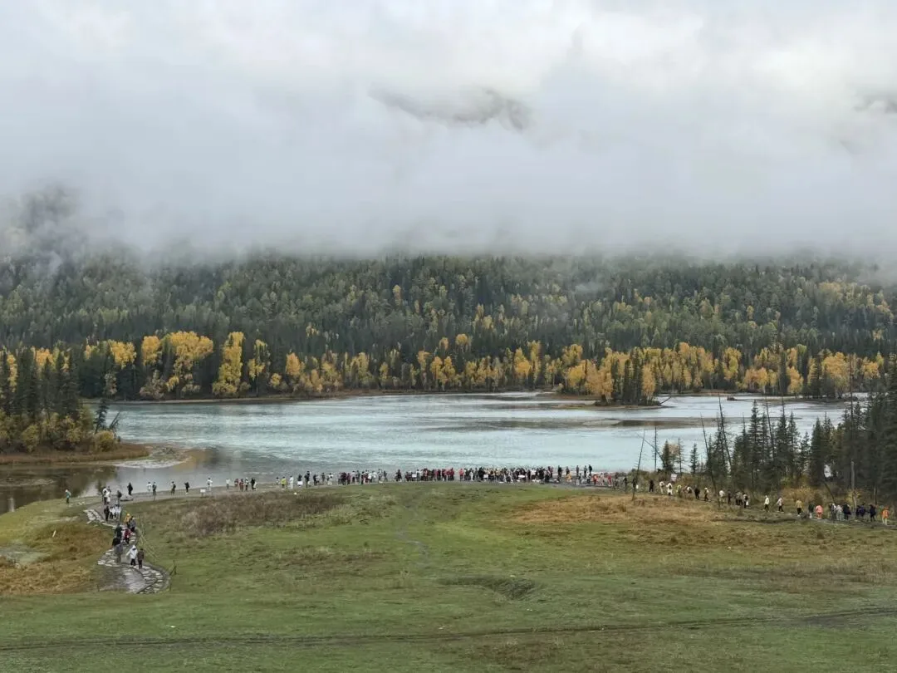

全是人的神仙湾

最滑稽的是，住在喀纳斯里不就是为了能早上舒舒服服起床，去三湾看个晨雾，但因为这山炮的区间车设计，其实还不如住在贾登峪门票站那里坐第一班车去三湾来的快 —— 这使得住在景区里纯属花钱给自己找不自在。另外，晚上我从湖边沿着游览栈道走到公路上，还有两公里到新村的站点，路上招呼那些空载跑的区间车，想坐一段儿，甚至都不停一下，冒着雨在黑夜里走了两公里才回到小木屋。没有一点人情味和服务体验。

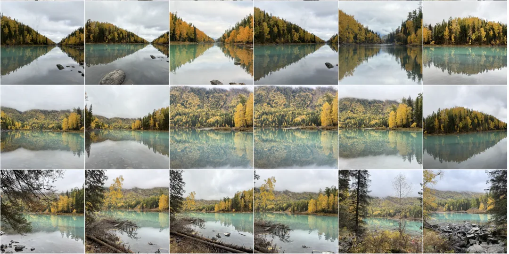

其实我自己觉得美国/加拿大那种国家公园的体验是最好的，入口收个门票，私家车可以直接开到每个景点边上，想去哪儿去哪儿。比如可可托海景区其实也是有这种服务的。但喀纳斯人家就是不让你私家车进，你有什么办法咧？我倒是看到不少外地牌照私家车，估计是有点关系搞进去的。

如果你想要类似的体验，可以去包村民的车，1500 ¥ 一天，与此同时，我租的坦克 300，只要 220 一天 …总的来说，我觉得区间车/摆渡车这种东西，就是景区用来收钱 + 恶心人的东西，非常影响旅游体验。

## 老冯的游玩建议

喀纳斯这个地方，如果想 “舒服” 的玩，大概要留下大几千块钱 —— 大几百的门票，景区里面包个车 1500 / 天左右，住宿 2000 / 天，喀纳斯/白哈巴 2 天，禾木一天，乱七八糟加起来应该大几千了。老冯的感觉是 —— 不值。

整个喀纳斯景区，核心就是三湾，以及湖畔/喀纳斯河口那一段。观鱼台什么的没什么意思，你用无人机飞上去看一下比自己花半天爬那个破山要好多了（我 16 年倒是爬过一次，上去没啥意思，后悔了）。

所以最佳的旅游策略就是：住在门口贾登峪，早上第一班景区看三湾，神仙湾下车拍个照，坐出景区方向的车一站路到月亮湾，然后徒步到卧龙湾。月亮湾到卧龙湾这段徒步景色是喀纳斯的精华，方向不能反否则爬坡很累。

月亮湾-卧龙湾玩完之后（大概一整个上午），我个人觉得这景区就差不多了，可以直接从贾登峪出去。

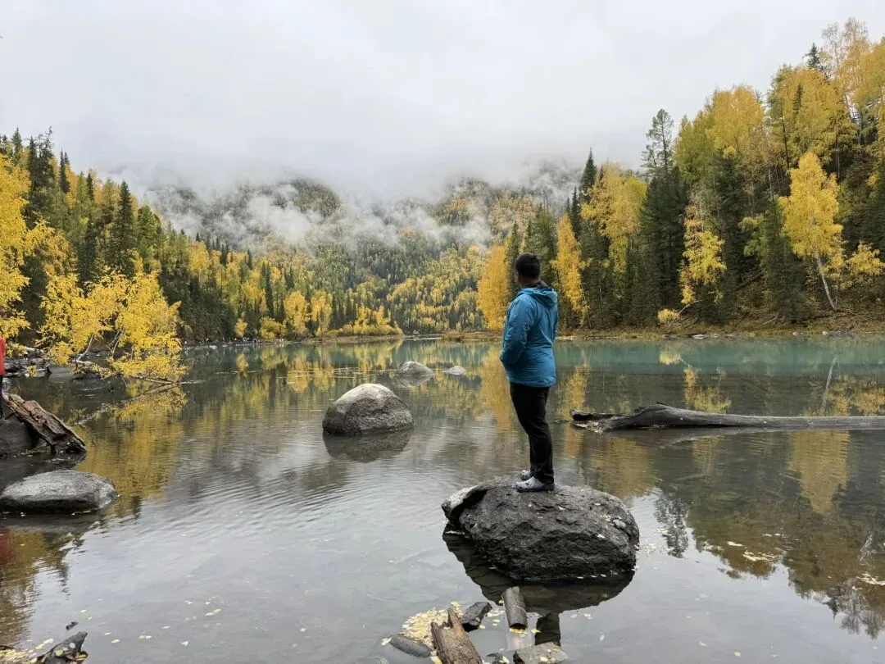

如果你觉得不值非要去湖边转一转，那么做上行车到景区换乘中心，你可以继续选择：1 坐去喀纳斯老村的公交，坐三站在湖边下车，然后沿着湖走一走，去喀纳斯河口看一看。2. 去“观鱼台”爬山俯瞰湖景

### 关于无人机

喀纳斯观鱼台老冯认为是智商税，其实湖本身也就那样，比九寨沟/西藏的几个湖/天堂湖啊差不少意思。山顶一个破亭子还要额外收 60 块车费，给你拉到半山腰再去爬一千阶台阶。老冯当年和四个小伙伴直接从野山上亭子的哈哈。

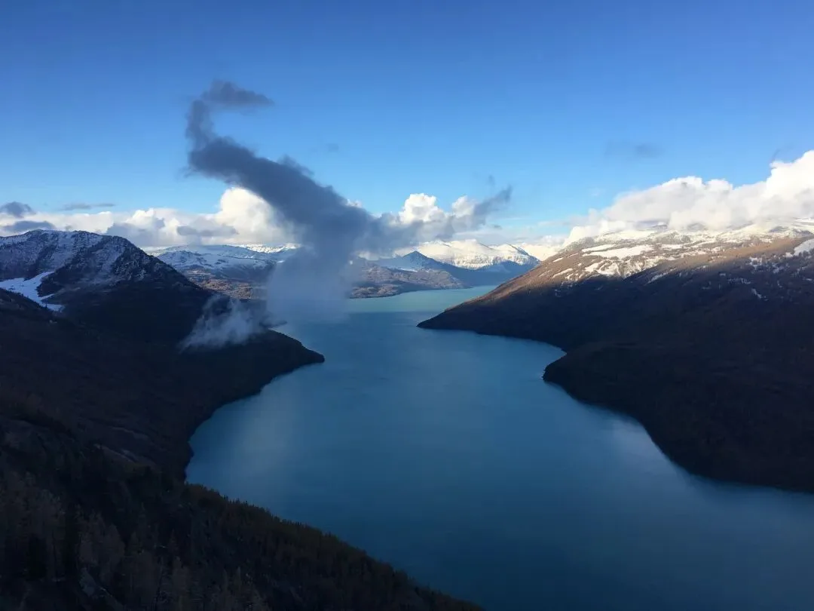

另外，老冯强烈建议带个无人机，比如 DJI Mini 5 Pro 这种。景区 “禁飞无人机”，就是想让你去花这个钱，但其实还不如无人机直接飞上去看一下的体验好 —— 对了，说是禁飞，其实到处都是飞的，你要是听了宣传说什么 “新疆全域禁飞无人机” 不带，那就傻了。新疆旅游，无人机是必带设备，能给你提供一个全新的视觉维度。

所以总结一下，喀纳斯适合 9 月 20 日～10 月初来，喀纳斯本身一日游合适，贾登峪住，第二天早上进当天出来，晚上是继续住贾登峪，还是去白哈巴/禾木都随意。

至于白哈巴/禾木这两个村子，老冯的感觉是现在商业化已经太严重了，完全失去了 16 年那会的隐世村庄的 Feel。花两千块去村里住小木屋，我自己的感觉是纯属杀猪。如果你没体验过，可以挑一个，白哈巴可能会稍微好一些，可以自驾开进去，但是需要办理边防证。至于禾木晨雾，要老冯说的话你在景区外面无人机飞进去看比自己傻不唧唧早上爬山好多了。

### 关于自驾

相比去喀纳斯/禾木/白哈巴景区去当大冤种，老冯觉得北疆阿勒泰的正确打开方式是自驾。今年新开的 “阿禾公路” —— 从阿勒泰到禾木村的公路，我认为会成为类似 “独库公路” 的新网红亮点，现在人还不多，飞到阿勒泰租个车，沿着阿禾公路开到禾木。不收钱，不要预约，但我看 App 里这个架势以后说不定要圈起来收钱。

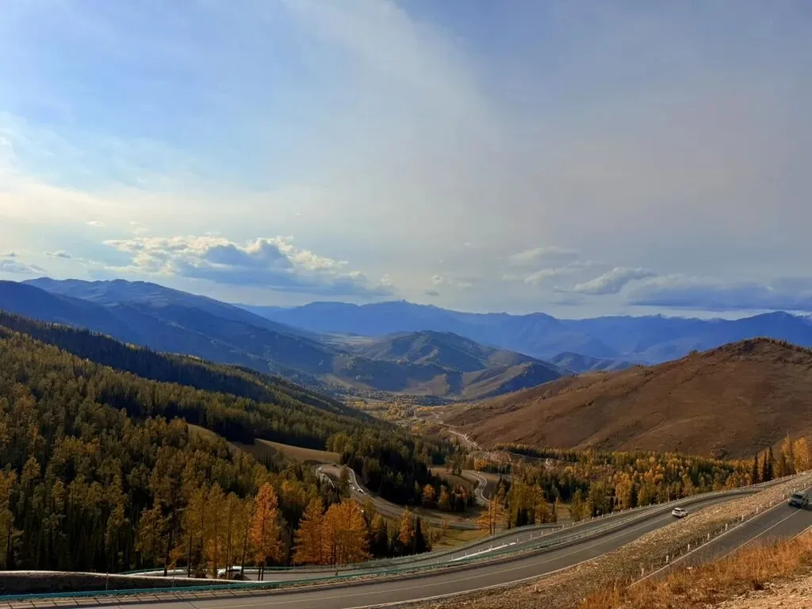

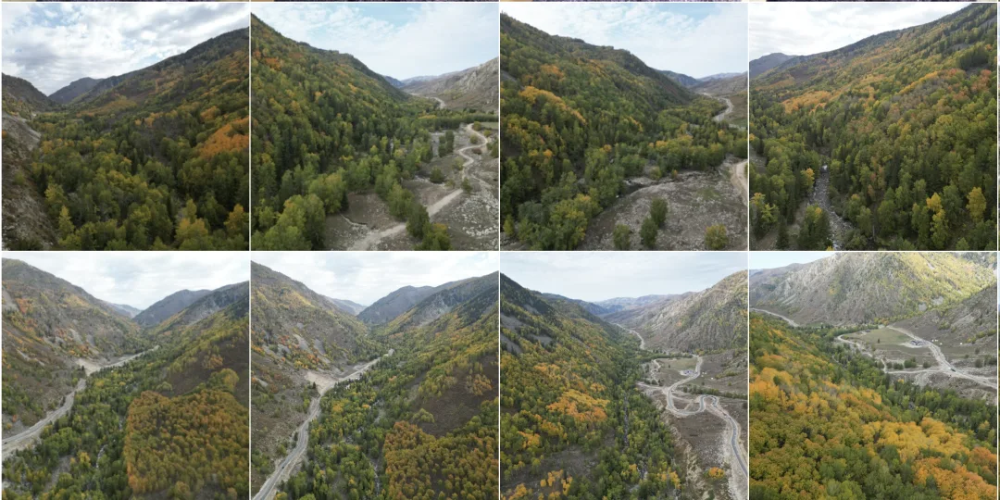

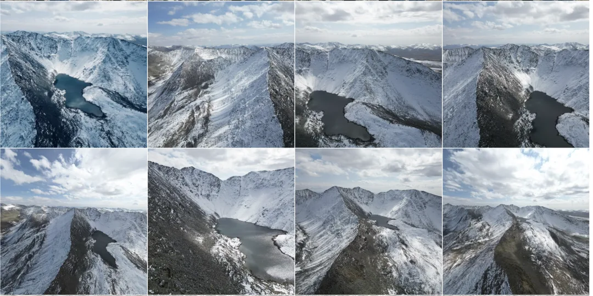

开到了禾木之后，你可以直接在村口住农家乐（小木屋也不便宜，八百多）或者床车/扎帐篷，早上无人机飞进去看晨雾，然后沿着禾木到贾登峪的这条公路自驾。这条公路的景色也非常的赞！最主要的是它属于景区外圈，不收钱，可以自由自驾。

这条公路你会路过 喀纳斯河，禾木河汇入布尔津河的三叉河口，这也是一个非常好看的地方，当年老冯第一次徒步，第一次睡帐篷就是在这个河口的对岸，徒步了整整一天。但自驾到附近只要走十分钟就能到这个位置。

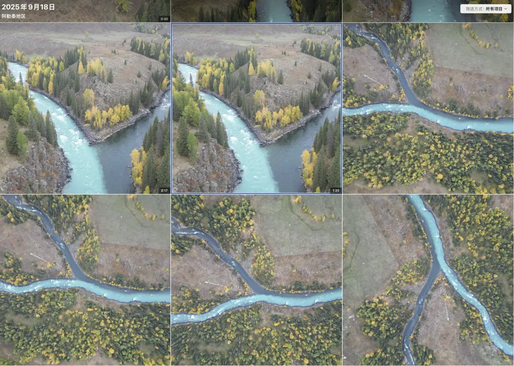

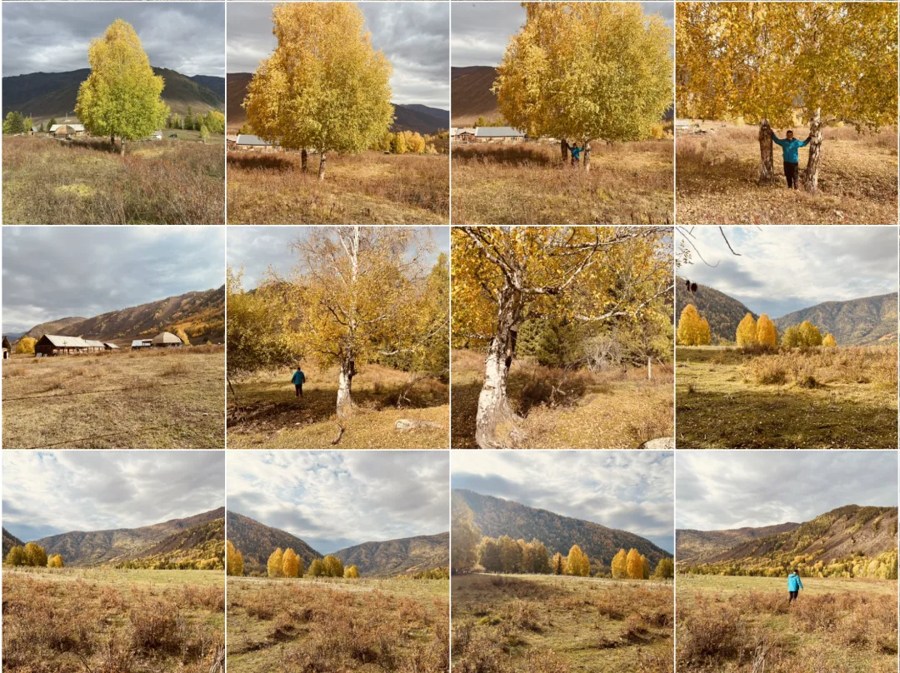

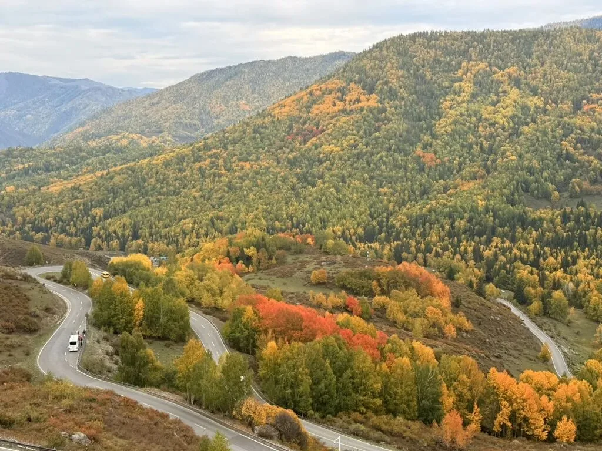

另外一条值得一题的公路是 331 阿可公路，也就是阿勒泰到可可托海的公路。这条路的景色风格与阿禾公路类似，但也有一些风格独特的体验。切记如果你要从阿勒泰到可可托海，记得走国道，不要走 G216 高速 —— 光秃秃的戈壁滩，毛都没有！

附近另外一个还不错的地方是乌伦古湖 —— 号称是离海最远的海，这里出乎意料的舒服，老冯在这里额外待了两天，扎了帐篷，看到了日落，银河，日出，还碰到了许多有趣的同行者。

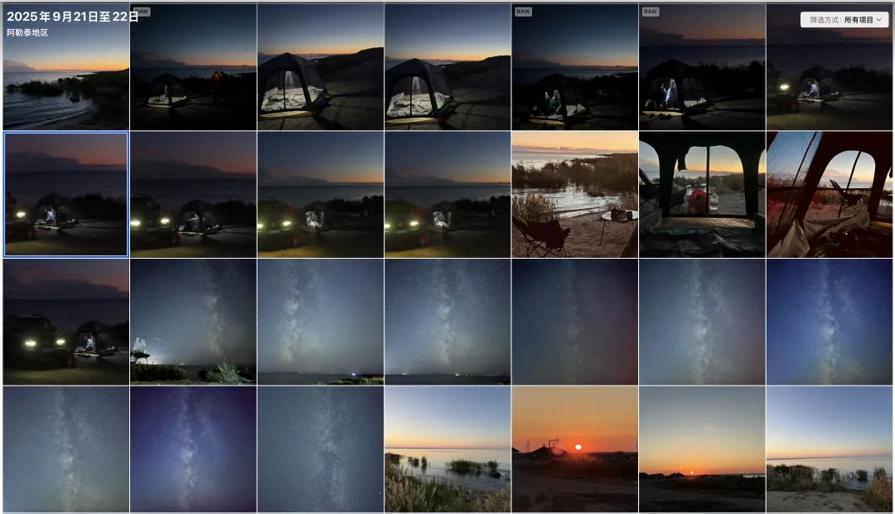

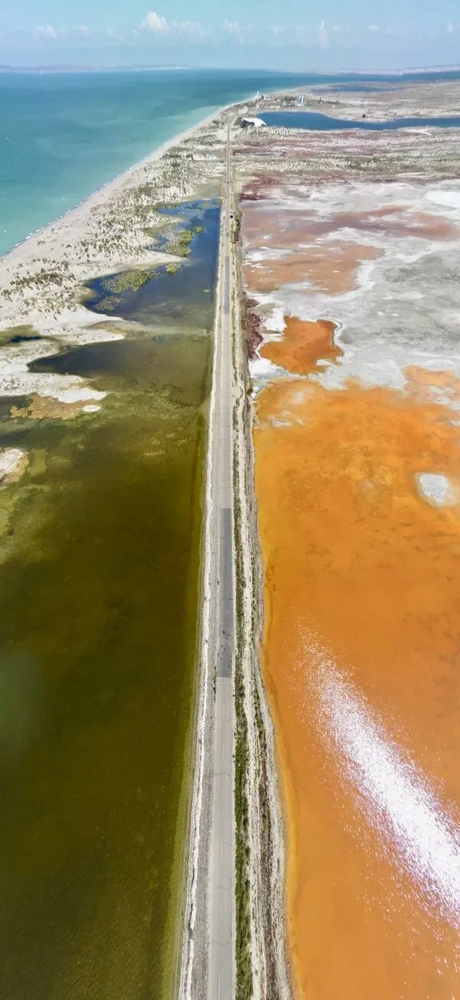

## 总结

北疆的秋色很美（九月底），但阿勒泰地区拉垮贪婪的景区运营，以及人山人海的游客非常影响这个体验。老冯建议自驾阿禾，阿可，铁禾 X852 公路，以及喀纳斯景区一日游当日出，来在不当大冤种的前提下，深度体验北疆秋色。

---

发布版本：[微信公众号](https://mp.weixin.qq.com/s/ABcq-2Pv19Qwo1zznFgTwQ)
