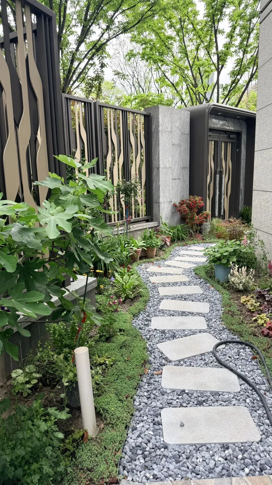

最近没怎么写公众号，因为人在加拿大，最近和老婆去班夫/贾斯帕国家公园玩了一周，间歇性偷懒发点之前《[赛博经藏](/ai/cyber-dharma/)》的存货。

今天终于回国了，飞了一整天，早上还在卡尔加里，晚上就落地上海了，真是哪儿都没有家舒服啊。悲催的是又要重新倒时差了，下回回来倒头就睡，然后大半夜又精神抖擞了。

这次和老婆去加拿大待了 23 天，5 月 12 号出发，蒙特利尔一周，温哥华一周，班夫贾斯帕一周，卡尔加里两天。办了很多事，也有很多事情堆积了下来。估计要开始忙一阵子了。

其实这段期间有不少有趣的主题都值得一写，但灵感就是这样，有时候出现的时候不写，错过再写就没感觉了。等手头积压的事情告一段落后，老冯会重新恢复日更。

放点这两天的照片视频吧。

## 班夫的熊

最刺激的是在 Banff 小镇边上的山路旁看到了野熊，还是那种最危险的带着三个幼崽的熊妈妈。我是在路边看到有三个人停车在拍照，下来凑热闹一看竟然是熊。相当悠闲，吃草挠痒爬树。

后来想想还是有点危险，这熊距离我们也就三四十米的样子，一个冲锋就倒眼前了。不过好在后面人越来越多，十几辆车停在那里，围观的人也越来越多，人多势众也就不怕了。

我把车门开着，确保熊万一冲过来，过来可以随时溜进车里，结果这个预案以一种我没想到的方式用上了：熊没冲过来，警察倒是冲过来开路赶人了。我一溜烟冲进车里溜走了。

## 明尼旺卡湖划船

Banff 镇边上有一个很有名的湖，不过当天风浪略大而且下雨，不让划独木舟，只有摩托艇。摩托艇就摩托艇吧，我还从来没开过呢。不过也很简单，弄两趟就会了。

## 优鹤翡翠湖泛舟

单纯摩托艇游湖感觉差点意思，所以我们又在优鹤的翡翠湖上划人力独木舟。一个小时绕着整个湖转了一圈，还是挺累的。

## 卡尔加里的精神状态

在卡尔加里逛了不少地方，唐人街，中华文化中心，Studio Bell，图书馆，但给我留下最深刻印象的，莫过于街上形势的 Pedal Pub，脚踏车酒吧。

不知道是什么样的精神状态才能发明出这么离谱的东西，简直是加拿大手工耿。看见笑的不行不行的。

## 哪儿都没有家里舒服

五月初刚租了新房子，结果一个月就住了几天，怪可惜的。走的时候上海还是凉风习习最舒服的状态，回来的时候就变成湿热六月天了。这次要好好休息几天。

随便聊聊，过几天有空聊聊 PGConf 和加拿大的见闻，以及这次旅游的感想。

---

发布版本：[微信公众号](https://mp.weixin.qq.com/s/tdRUPT8H0Ul_ZqbZLv85Bg)
